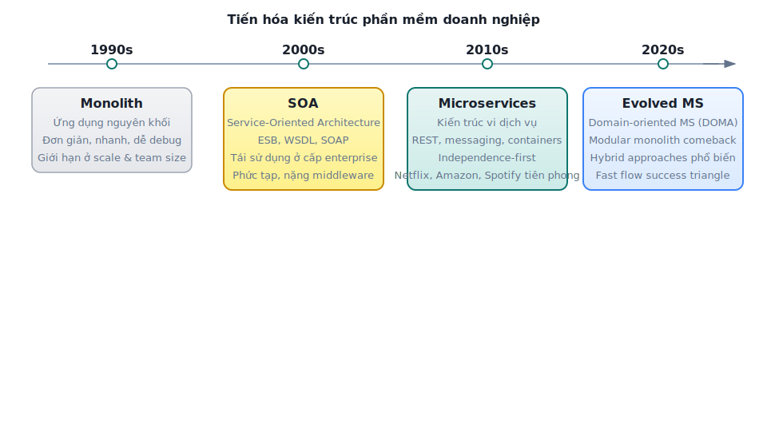
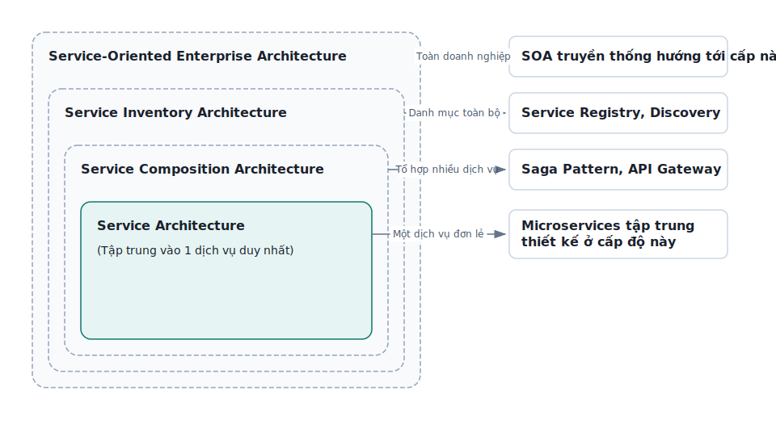
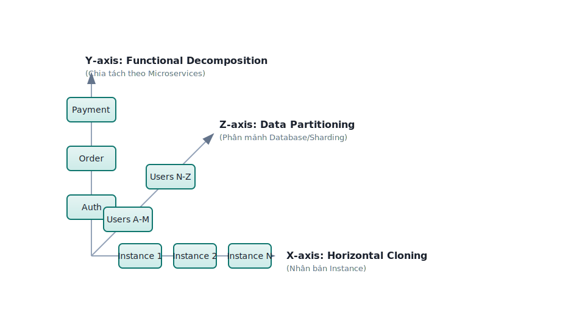
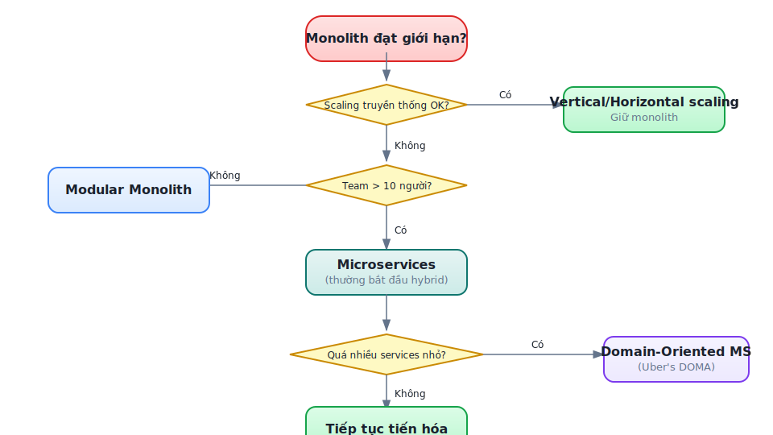
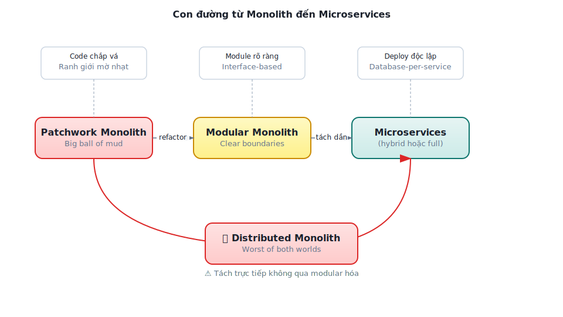
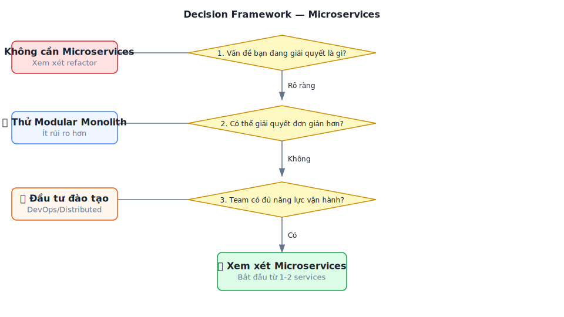
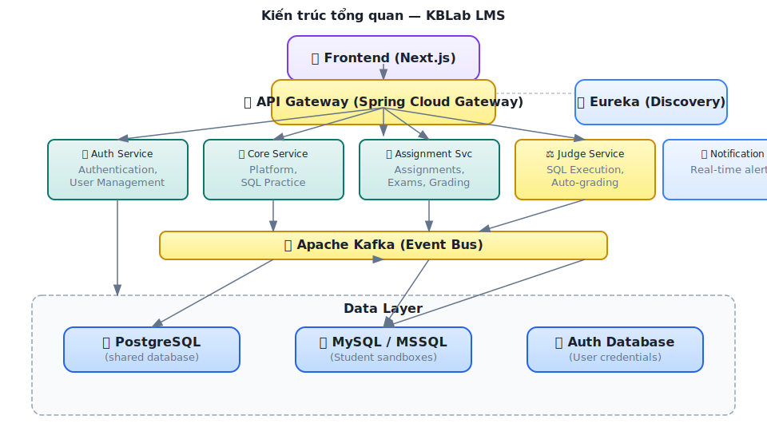

# Chương 1: Tổng quan SOA & Microservices

> *"Microservices are not the goal; sustainable fast flow of change is."*
> — Chris Richardson, *Microservices Patterns*, 2nd Edition

---

## Bạn sẽ học được gì

- Hiểu bối cảnh lịch sử dẫn đến kiến trúc hướng dịch vụ (SOA) và microservices
- Nắm được các nguyên lý cốt lõi của SOA và sự kế thừa trong microservices
- Phân biệt rõ SOA truyền thống, microservices, và modular monolith
- Tìm hiểu cách các công ty công nghệ lớn đã buộc phải chuyển đổi — và bài học rút ra
- Đánh giá khi nào nên — và khi nào *không* nên — áp dụng microservices
- Làm quen với case study của sách: KBLab — một hệ thống LMS cho trường đại học

---

## 1.1 Kiến trúc phần mềm theo thời gian

Lịch sử phát triển phần mềm doanh nghiệp là câu chuyện về những lần vượt qua giới hạn: mỗi khi một hệ thống đạt đến quy mô mà kiến trúc hiện tại không còn đáp ứng được, cộng đồng lại tìm ra cách tiếp cận mới. Nhìn lại hành trình này giúp chúng ta hiểu *tại sao* microservices tồn tại, thay vì chỉ biết *nó là gì*.

### Thời kỳ Monolith

Trong nhiều thập kỷ, hầu hết phần mềm được xây dựng theo kiến trúc **monolithic** (nguyên khối) — toàn bộ logic nghiệp vụ, giao diện người dùng, và truy cập dữ liệu nằm trong một ứng dụng duy nhất, triển khai như một đơn vị.

Kiến trúc monolith mang lại nhiều ưu điểm không thể phủ nhận. Một codebase duy nhất giúp phát triển đơn giản: mở IDE, chạy ứng dụng, debug với breakpoint — mọi thứ liền mạch. Deploy chỉ cần một artifact, một lệnh. Hiệu năng tốt vì gọi hàm cục bộ (in-process) luôn nhanh hơn gọi qua mạng nhiều bậc. Và quan trọng nhất, transactions trên database thống nhất đảm bảo data consistency một cách tự nhiên.

Tuy nhiên, khi hệ thống phát triển — thêm tính năng, thêm thành viên, thêm khách hàng — monolith bắt đầu bộc lộ những giới hạn nghiêm trọng. Thomas Erl gọi đây là kiến trúc dạng silo (*silo-based application architecture*) — một trạng thái mà mỗi ứng dụng trở thành "ốc đảo" với logic trùng lặp, khó tích hợp.

Các biểu hiện cụ thể:

**Bảng 1.1:** Các biểu hiện khi monolith đạt đến giới hạn

| Biểu hiện | Mô tả | Hệ quả |
| :----------- | :------- | :-------- |
| **Coordination bottleneck** | Mỗi thay đổi nhỏ đòi hỏi phối hợp nhiều team | Tốc độ phát triển giảm dần theo kích thước team |
| **Deployment coupling** | Một tính năng mới = deploy lại toàn bộ | Release cycles kéo dài, rủi ro cao |
| **Technology lock-in** | Toàn ứng dụng dùng chung stack | Không thể thử nghiệm công nghệ mới cho một phần |
| **Scaling inflexible** | Scale = nhân bản toàn bộ ứng dụng | Chi phí cao, lãng phí tài nguyên |
| **Cognitive overload** | Codebase quá lớn, ranh giới module mờ nhạt | Developer mới mất tuần/tháng để hiểu hệ thống |

Khi monolith đạt đến trạng thái mà không ai hiểu toàn bộ, mỗi thay đổi đều tiềm ẩn "side effect" không lường trước, và chu kỳ release kéo dài từ tuần sang tháng — đó chính là trạng thái mà Chris Richardson gọi là **"monolithic hell"**.

### Sự ra đời của SOA

Đầu thập niên 2000, ngành công nghiệp phần mềm nhận ra rằng vấn đề không nằm ở quy mô ứng dụng, mà ở *cách tổ chức* logic bên trong. *Service-Oriented Architecture* (SOA — kiến trúc hướng dịch vụ) ra đời với ý tưởng cốt lõi: **phân rã hệ thống thành các dịch vụ có thể tái sử dụng**, giao tiếp qua giao thức chuẩn.

SOA hướng tới ba mục tiêu lớn: tăng khả năng tái sử dụng logic nghiệp vụ trên toàn doanh nghiệp, giảm tổng lượng code trùng lặp giữa các hệ thống, và cải thiện khả năng tích hợp giữa các nền tảng khác nhau.

Tuy nhiên, SOA truyền thống thường đi kèm với Enterprise Service Bus (ESB) — một middleware trung tâm điều phối mọi giao tiếp. ESB nhanh chóng trở thành điểm nghẽn: phức tạp, nặng nề, và tạo ra một dạng coupling mới — *coupling vào middleware*. Đây là bài học mà microservices rút ra để thiết kế theo triết lý ngược: "smart endpoints, dumb pipes".

### Từ SOA đến Microservices

Khoảng năm 2014, James Lewis và Martin Fowler đăng bài viết "Microservices" trên martinfowler.com, phổ biến rộng rãi thuật ngữ **microservices** để mô tả một phong cách kiến trúc đã tiến hóa từ SOA nhưng với triết lý khác biệt (thuật ngữ này được sử dụng trước đó tại các workshop phần mềm từ ~2011). Microservices không phải SOA phiên bản nhỏ — đây là sự chuyển dịch căn bản từ **tái sử dụng** (reuse) sang **tính độc lập** (independence) như ưu tiên số một.

*Hình 1.1: Tiến hóa kiến trúc phần mềm doanh nghiệp từ thập niên 1990 đến 2020*

---

## 1.2 SOA là gì? Nguyên lý cốt lõi

Dù microservices đã trở thành xu hướng chính, việc hiểu SOA vẫn quan trọng vì hai lý do: thứ nhất, nhiều doanh nghiệp lớn vẫn vận hành hệ thống SOA; thứ hai, các nguyên lý hướng dịch vụ của SOA là **nền tảng** mà microservices kế thừa và phát triển.

### Bốn đặc trưng cốt lõi

Thomas Erl xác định SOA qua bốn đặc trưng không thể thiếu:

**Business-Driven** — Dịch vụ được thiết kế từ quy trình nghiệp vụ, không phải từ bảng cơ sở dữ liệu hay module kỹ thuật. Một dịch vụ "Xử lý Đơn hàng" phản ánh quy trình kinh doanh, không phải bảng `orders` trong database. Nguyên tắc này vẫn đúng 100% trong microservices — và trở thành nền tảng cho Domain-Driven Design (DDD) mà chúng ta sẽ khám phá trong Chương 2.

**Vendor-Neutral** — Dịch vụ giao tiếp qua giao thức chuẩn (HTTP, messaging), không phụ thuộc vào công nghệ cụ thể. Đây là điều kiện tiên quyết cho **technology diversity** — một trong những lợi thế lớn nhất của microservices.

**Enterprise-Centric** — SOA tư duy ở cấp toàn tổ chức: dịch vụ không phục vụ riêng một ứng dụng mà phục vụ toàn doanh nghiệp. Microservices thu hẹp phạm vi này vào từng *bounded context* — nhưng vẫn giữ tư duy dịch vụ vượt ra ngoài một team duy nhất.

**Composition-Centric** — Dịch vụ được thiết kế để tổ hợp (compose) thành workflow phức tạp. Trong microservices, điều này thể hiện qua *Saga pattern* và *API Gateway* — các chủ đề của Chương 6 và 8.

### Tám nguyên lý hướng dịch vụ

Erl đúc kết 8 nguyên lý nền tảng cho mọi dịch vụ. **Bảng 1.2** cho thấy microservices kế thừa và chuyển hóa chúng như thế nào:

**Bảng 1.2:** Tám nguyên lý hướng dịch vụ — SOA truyền thống vs Microservices

| # | Nguyên lý | Trong SOA truyền thống | Trong Microservices |
|:---:|:----------|:---------------------|:--------------------|
| 1 | **Standardized Contract** | WSDL, XML Schema | OpenAPI/Swagger, Protocol Buffers |
| 2 | **Loose Coupling** | ESB giảm coupling | **Ưu tiên số 1**: database-per-service, async messaging |
| 3 | **Abstraction** | Interface ẩn implementation | API là contract duy nhất, code là black box |
| 4 | **Reusability** | **Mục tiêu chính** — tái sử dụng ở cấp enterprise | Giảm ưu tiên — *independence* quan trọng hơn *reuse* |
| 5 | **Autonomy** | Hạn chế bởi shared infrastructure | **Mục tiêu chính** — own database, own lifecycle |
| 6 | **Statelessness** | Stateless design | RESTful by default, state externalized (Redis, DB) |
| 7 | **Discoverability** | UDDI registry | Service Discovery (Eureka, Consul, K8s DNS) |
| 8 | **Composability** | ESB orchestration | Saga, API Gateway, event choreography |

Điểm mấu chốt: microservices không phủ nhận SOA — mà **chọn lọc và đẩy mạnh** những nguyên lý phù hợp (Loose Coupling, Autonomy) và giảm nhẹ những nguyên lý gây coupling (Reusability ở cấp enterprise, centralized Discoverability).

### Bốn kiểu kiến trúc SOA

SOA tồn tại ở nhiều cấp độ, từ nhỏ đến lớn:

*Hình 1.2: Bốn kiểu kiến trúc SOA — từ dịch vụ đơn lẻ đến quy mô doanh nghiệp*

Hầu hết dự án microservices thực tế hoạt động ở tầng **Service Architecture** và **Service Composition Architecture**. Sự khác biệt đáng chú ý: SOA truyền thống cố gắng quản lý một "Service Inventory" thống nhất cho toàn doanh nghiệp — trong khi microservices chấp nhận sự phân tán và trao quyền cho từng team.

---

## 1.3 Microservices là gì? So sánh với SOA

### Định nghĩa và đặc trưng

Microservices là phong cách kiến trúc trong đó ứng dụng được cấu thành từ **tập hợp các dịch vụ nhỏ, tự trị**. Mỗi dịch vụ thỏa mãn bốn điều kiện:

1. **Chạy trong tiến trình riêng** — deploy và restart độc lập
2. **Sở hữu dữ liệu riêng** — database-per-service, không chia sẻ bảng
3. **Giao tiếp qua giao thức nhẹ** — HTTP/REST, gRPC, hoặc messaging (Kafka, RabbitMQ)
4. **Có thể deploy độc lập** — thay đổi service A không yêu cầu redeploy service B

Đặc biệt, điều kiện thứ tư (*independent deployability*) chính là thước đo quan trọng nhất. Nếu không thể deploy một service mà không phải deploy các service khác — đó chưa phải microservices thực sự.

### Scale Cube — Ba chiều mở rộng

Để hiểu microservices trong bối cảnh scalability, chúng ta sử dụng mô hình **Scale Cube** — chia mở rộng hệ thống theo ba chiều:

*Hình 1.3: Scale Cube — ba chiều mở rộng hệ thống*

- **Trục X** — Nhân bản: chạy nhiều instance giống nhau phía sau load balancer. Đơn giản nhất, giới hạn bởi database bottleneck
- **Trục Y** — Phân rã chức năng: tách ứng dụng thành các service theo domain. **Đây là microservices**
- **Trục Z** — Phân mảnh dữ liệu: chia data theo tiêu chí (region, user ID). Thường kết hợp với microservices

Scaling truyền thống (thêm server, tăng RAM) chỉ mở rộng trên trục X. Khi trục X đạt giới hạn — database trở thành bottleneck, deployment trở nên rủi ro — đó là lúc cần xem xét trục Y.

### So sánh SOA truyền thống vs Microservices

**Bảng 1.3:** So sánh SOA truyền thống và Microservices

| Khía cạnh | SOA truyền thống | Microservices |
| :----------- | :------------------ | :--------------- |
| **Phạm vi** | Toàn doanh nghiệp | Một ứng dụng hoặc bounded context |
| **Kích thước dịch vụ** | Lớn, tái sử dụng tối đa | Nhỏ, focused, single responsibility |
| **Giao tiếp** | ESB — middleware trung tâm | "Smart endpoints, dumb pipes" — REST/messaging |
| **Dữ liệu** | Thường shared database | Database-per-service |
| **Governance** | Centralized, formal | Decentralized, team-owned |
| **Triết lý thiết kế** | Reuse-first | Independence-first |
| **Deploy** | Thường cùng deploy | Independent deployment |
| **Team model** | Chuyên môn theo layer (DB team, UI team) | Cross-functional, own the service |

Cần lưu ý rằng SOA, microservices, và event-driven architecture (EDA) không phải các lựa chọn loại trừ nhau. Chúng là các lớp của một cách tiếp cận đang tiến hóa: SOA cung cấp nguyên lý nền tảng, microservices hiện thực hóa chúng ở mức granularity cao hơn, và EDA bổ sung khả năng giao tiếp bất đồng bộ cho các hệ thống phân tán phức tạp. Chúng ta sẽ khám phá EDA chi tiết trong Chương 5.

---

## 1.4 Microservices trong thực tế — Bài học từ các công ty công nghệ

Lý thuyết về microservices chỉ thực sự trở nên thuyết phục khi nhìn vào *tại sao* các tổ chức lớn buộc phải chuyển đổi. Không phải vì microservices "thời thượng" — mà vì họ đối mặt với **những giới hạn mà kiến trúc truyền thống và cách mở rộng theo trục X không thể vượt qua**.

### Netflix — Khi downtime là không thể chấp nhận

Năm 2008, Netflix gặp sự cố corruption database nghiêm trọng, gây gián đoạn dịch vụ. Sự cố này là chất xúc tác cho quyết định chuyển toàn bộ hạ tầng lên cloud (AWS) và tái cấu trúc sang microservices. Theo Netflix Technology Blog, quá trình migration hoàn thành đầu năm 2016, khi hệ thống vận hành hàng trăm microservices phục vụ hơn 100 triệu người dùng (con số tại thời điểm 2016).

Vấn đề cốt lõi không phải là code xấu — mà là **yêu cầu nghiêm ngặt về uptime và scale**. Với lượng người dùng tăng exponential, một monolith duy nhất trở thành single point of failure. Vertical scaling (nâng cấp server) đạt giới hạn vật lý và chi phí. Netflix cần hai thứ mà monolith không thể cung cấp: khả năng scale từng thành phần riêng biệt, và **fault isolation** — lỗi ở hệ thống recommendation không được phép ảnh hưởng đến streaming.

Netflix đóng góp ngược lại cho cộng đồng bằng các công cụ mã nguồn mở: **Eureka** (service discovery), **Zuul** (API gateway), **Hystrix** (circuit breaker) — nhiều trong số đó trở thành nền tảng của Spring Cloud mà chúng ta sẽ sử dụng trong case study.

### Amazon — API Mandate và "two-pizza teams"

Khoảng 2001–2002, Amazon đối mặt với tình trạng tightly coupled monolith — frontend và backend quấn chặt vào nhau đến mức *bất kỳ thay đổi nào, dù nhỏ, đều ảnh hưởng toàn hệ thống*. Theo câu chuyện nổi tiếng được Steve Yegge kể lại trong "Google Platforms Rant" (2011), Jeff Bezos ra **"API mandate"** — một chỉ thị nội bộ: tất cả team phải giao tiếp với nhau *chỉ* qua service interfaces, không có ngoại lệ.

> **📝 Lưu ý nguồn** — Câu chuyện API Mandate được biết đến rộng rãi nhưng nguồn gốc là secondhand (từ Steve Yegge, không phải tài liệu chính thức Amazon). Tuy nhiên, kết quả kiến trúc thực tế của Amazon — AWS, service-oriented internal platform — là minh chứng không thể phủ nhận.

### Uber — Thực tế của hybrid approach

Uber bắt đầu như một monolith Python đơn giản, phát triển chóng mặt, và khoảng 2014–2016 chuyển sang microservices. Tuy nhiên, câu chuyện Uber đáng chú ý ở phần *hậu chuyển đổi*: đến khoảng 2020, với hơn 2.000 microservices, họ nhận ra mình đang rơi vào *"microservice madness"* — quá nhiều service nhỏ tạo ra mạng lưới phụ thuộc phức tạp, khó debug và vận hành.

Uber phản ứng bằng cách giới thiệu **DOMA** (*Domain-Oriented Microservice Architecture*) — nhóm các microservices liên quan thành "domain" lớn hơn, giảm bề mặt tương tác. Kiến trúc cuối cùng của Uber là **hybrid** — không phải microservices thuần túy, cũng không quay về monolith.

### Bài học tổng hợp

*Hình 1.4: Cây quyết định chuyển đổi kiến trúc — từ monolith đến microservices*

Ba pattern chung nổi lên:

1. **Chuyển đổi vì bị buộc, không vì mong muốn.** Mỗi công ty trên đều chuyển sang microservices khi cách mở rộng truyền thống thất bại trước yêu cầu nghiêm ngặt — uptime 99.99%, hàng triệu requests/giây, hàng trăm developers cần deploy độc lập.

2. **Team structure thay đổi trước (hoặc cùng) kiến trúc.** Amazon chia two-pizza teams trước khi tách service. Netflix tạo "full cycle developers" — mỗi developer chịu trách nhiệm từ code đến production. Kiến trúc phần mềm phản ánh cấu trúc tổ chức (Conway's Law) — chúng ta sẽ phân tích sâu trong Chương 2.

3. **Hybrid là trạng thái phổ biến nhất.** Rất ít tổ chức đạt "pure microservices". Hầu hết — kể cả Netflix và Uber — vận hành ở trạng thái kết hợp, và đây hoàn toàn hợp lý.

> **📐 Nguyên tắc — Fast Flow**
>
> "The primary motivation for using the microservice architecture is to enable fast flow — the continuous delivery of a stream of small changes with rapid feedback on each one."
>
> *— Chris Richardson, Microservices Patterns, 2nd Ed.*

### Fast Flow Success Triangle — DevOps + Team Topologies + Architecture

Richardson trong phiên bản thứ hai (2025) giới thiệu một framework quan trọng: **Fast Flow Success Triangle** — mô tả ba yếu tố cần thiết để đạt được fast flow:

*Hình 1.5: Fast Flow Success Triangle — ba yếu tố cần thiết cho fast flow*

**DevOps** (Quy trình) — Không phải tên team hay job title, mà là tập hợp nguyên tắc và practices để deliver phần mềm nhanh và tin cậy. Hai nguyên tắc quan trọng nhất: (1) *giảm batch size* — commit và push thay đổi nhỏ, lý tưởng ít nhất 1 lần/ngày; (2) *giảm hand-offs giữa các team* — mỗi hand-off tạo ra delay và mất thông tin.

**Team Topologies** (Tổ chức) — Cấu trúc tổ chức theo bốn kiểu team (stream-aligned, platform, enabling, complicated subsystem) với ba kiểu tương tác (X-aaS, collaboration, facilitating). Stream-aligned teams làm phần lớn công việc, các team khác hỗ trợ. Chi tiết ở §2.1.

**Architecture** (Kiến trúc) — Mục đích của kiến trúc, ít nhất từ góc độ fast flow, là **enable** DevOps và Team Topologies. Richardson trong [2b, Ch.5] xác định ba **architecture qualities** cần thiết:

**Bảng 1.3b:** Fast Flow Architecture Qualities

| Quality | Định nghĩa | Ví dụ KBLab |
| :--------- | :----------- | :------------- |
| **Deployability** | Mỗi service deploy độc lập, pipeline riêng, không cần coordinate với service khác | Judge Service deploy mà Core Service không cần biết |
| **Testability** | Test service isolated, không cần spin up toàn bộ hệ thống | Test Judge logic mà không cần Gateway, Auth, Kafka |
| **Developability** | Team thay đổi code dễ dàng, minimal conflicts, clear ownership | Team A sở hữu Judge, Team B sở hữu Assignment — không block nhau |

Ba qualities này là *điều kiện cần* cho fast flow — thiếu bất kỳ quality nào sẽ tạo bottleneck. KBLab hiện tại vi phạm cả ba: shared library buộc rebuild tất cả (deployability ❌), shared database buộc integration test toàn bộ (testability ❌), và god classes 1000+ dòng tạo merge conflicts liên tục (developability ❌).

> **💡 Tip — Ba chân của tam giác**
>
> Thiếu bất kỳ chân nào, tam giác sụp đổ. DevOps tốt + Team tốt nhưng kiến trúc monolith coupling chặt → fast flow không thể đạt được. Ngược lại, microservices architecture tốt nhưng team vẫn tổ chức theo layer (DB team, UI team) → lợi ích bị triệt tiêu bởi coordination overhead.

### Đo lường Fast Flow — DORA Metrics

Làm sao biết mình đã đạt fast flow? Nghiên cứu của Forsgren, Humble và Kim trong *Accelerate* (2018) định nghĩa bốn chỉ số DORA (DevOps Research and Assessment):

**Bảng 1.4:** DORA Metrics — So sánh Elite vs Low Performers

| Metric | Elite Performers | Low Performers | Chênh lệch |
| :-------- | :----------------: | :--------------: | :-----------: |
| **Deployment Frequency** | Nhiều lần/ngày | 1 lần/1-6 tháng | 182× |
| **Lead Time** (commit → production) | < 1 giờ | 1-6 tháng | — |
| **Change Failure Rate** | < 5% | 40-60% | 8× tốt hơn |
| **Recovery Time** (MTTR) | < 1 giờ | 1 tuần - 1 tháng | — |

*Nguồn: State of DevOps 2024 report*

Điều đáng chú ý: **deploy thường xuyên hơn lại TIN CẬY hơn**. Elite performers deploy 182 lần nhiều hơn nhưng tỷ lệ lỗi thấp hơn 8 lần. Thay đổi nhỏ dễ test, dễ debug, dễ rollback — nguyên lý "move fast and *don't* break things."

> **🔍 Phân tích gap — DORA Metrics cho LMS**
>
> KBLab hiện tại:
> - **Deployment Frequency**: Manual, khi cần (không scheduled) → Low Performer
> - **Lead Time**: Chưa đo, nhưng thiếu CI/CD tự động → ước tính ngày-tuần
> - **Change Failure Rate**: Không tracking → unknown
> - **Recovery Time**: Manual restart → phút-giờ (acceptable cho academic)
>
> **Migration path**: Implement CI/CD pipeline (Chương 12) là bước đầu tiên để cải thiện DORA metrics. Mục tiêu: đạt Medium Performer (deploy hàng tuần, lead time < 1 tuần).

### Quality Attribute Scenarios — Chỉ định yêu cầu kiến trúc

DORA metrics đo lường kết quả cuối cùng, nhưng làm sao chỉ định kiến trúc phải hỗ trợ kết quả đó ngay từ khâu thiết kế? Richardson trong [2b, Ch.5] khuyên dùng **Quality Attribute Scenarios** — kỹ thuật do Software Engineering Institute (SEI) phát triển, cho phép viết "spec" cho các thuộc tính phi chức năng một cách đo lường được.

Thay vì nói chung chung "hệ thống phải dễ deploy", một scenario định nghĩa rõ ràng theo format:
**Source → Stimulus → Artifact → Environment → Response → Response Measure**

Ví dụ — deployability scenario cho LMS:
> **Source**: Developer (stream-aligned team)
> **Stimulus**: Commit code thay đổi logic chấm điểm SQL
> **Artifact**: Core Service
> **Environment**: Deployment pipeline
> **Response**: Pipeline tự động chạy CI, build, test, và deploy version mới lên production — không cần sự can thiệp của team khác
> **Response Measure**: Lead time < 40 phút

Ví dụ — scalability scenario cho LMS:
> **Source**: 200 sinh viên thi cùng lúc (contest mode)
> **Stimulus**: Spike 200 submissions trong 5 phút
> **Artifact**: Judge Service cluster
> **Response**: Tất cả submissions được xử lý mà không có request bị reject
> **Response Measure**: p99 latency < 10 giây, 0% message loss

Bằng cách viết ra các scenarios này, chúng ta có một dạng "unit test cho kiến trúc" — bất kỳ quyết định tách hay gộp service nào (Chương 2) đều phải đối chiếu lại: *"Quyết định này có giúp chúng ta đạt scenario hay không?"*

---

## 1.6 Modular Monolith — Lựa chọn hợp lệ

Trước khi nghĩ đến microservices, chúng ta cần dành thời gian nghiêm túc cho một lựa chọn thường bị bỏ qua: **Modular Monolith**. Đây không phải bước lùi — đây có thể là *bước đi thông minh nhất* tùy vào ngữ cảnh.

### Monolith không phải là xấu

Không phải mọi monolith đều giống nhau. Sự khác biệt nằm ở **tổ chức nội bộ**:

**Bảng 1.4b:** Patchwork Monolith vs Modular Monolith

| Loại | Đặc điểm | Triển vọng |
| :------ | :---------- | :----------- |
| **Patchwork Monolith** | Code chắp vá, mọi class phụ thuộc lẫn nhau, ranh giới mờ nhạt, "big ball of mud" | Cần refactor nghiêm túc — cả internal và external boundaries |
| **Modular Monolith** | Module rõ ràng, giao tiếp qua interface, mỗi module có thể có schema riêng trong cùng DB | Deploy cùng nhau nhưng phát triển tương đối độc lập, **có thể tách dần** khi cần |

> **📐 Nguyên tắc — Monolith ≠ Bad**
>
> Monolith phản ánh kiến trúc đóng gói, không phản ánh chất lượng. Một modular monolith được thiết kế tốt hoàn toàn là lựa chọn kiến trúc hợp lệ — đặc biệt khi chi phí vận hành microservices vượt quá lợi ích mà nó mang lại.

### Khi nào Modular Monolith phù hợp?

- **Team nhỏ (< 10 developers)** — Overhead vận hành microservices (CI/CD per service, monitoring, distributed debugging) có thể lớn hơn lợi ích
- **Domain chưa rõ ràng** — Chia service quá sớm khi chưa hiểu domain rõ ràng dẫn đến chia sai. Merge lại các service rất đau — đau hơn nhiều so với refactor module trong monolith
- **Startup/MVP phase** — Cần tốc độ phát triển, đưa sản phẩm ra thị trường nhanh
- **Không cần polyglot** — Nếu toàn team dùng cùng ngôn ngữ/framework, lợi ích technology diversity không tồn tại

### Con đường từ Monolith đến Microservices

*Hình 1.6: Con đường từ Patchwork Monolith đến Microservices*

Martin Fowler đề xuất chiến lược "**Monolith First**": bắt đầu với monolith, hiểu rõ domain qua vài iteration, rồi mới tách microservices nếu thực sự cần. Lịch sử cho thấy hầu hết hệ thống microservices thành công — Netflix, Amazon, Uber — đều **bắt đầu từ monolith**, không phải microservices ngay từ đầu.

Điều nguy hiểm nhất là cố tách một patchwork monolith trực tiếp thành microservices mà không trải qua bước modular hóa. Kết quả thường là **distributed monolith** — mang toàn bộ nhược điểm của cả monolith lẫn distributed system, không có ưu điểm nào.

---

## 1.7 Khi nào nên — và không nên — dùng Microservices

### Quyết định kiến trúc không chỉ là kỹ thuật

Điều quan trọng nhất cần nhấn mạnh trước khi đi vào chi tiết: **quyết định sử dụng microservices không phải thuần túy kỹ thuật**. Trong thực tế, các yếu tố phi kỹ thuật thường có ảnh hưởng lớn hơn cả yếu tố kỹ thuật:

- **Ngân sách** — Microservices đắt hơn để vận hành (infrastructure, monitoring, DevOps team)
- **Timeline** — Xây dựng microservices từ đầu chậm hơn monolith cho cùng feature set
- **Quy mô team** — Team < 5 người thường chịu overhead quá lớn
- **Kỹ năng hiện có** — Distributed systems đòi hỏi kinh nghiệm khác biệt
- **Văn hóa tổ chức** — Team silos + microservices = thảm họa

Ngay cả Netflix khi bắt đầu năm 2008, hay Uber năm 2014, kiến trúc hybrid ban đầu là phù hợp nhất cho bối cảnh lúc đó — không phải microservices thuần túy.

Trong cuốn sách này, chúng ta tập trung phân tích **khía cạnh kỹ thuật** — nhưng luôn ghi nhớ rằng đây chỉ là một chiều trong quyết định kiến trúc.

### Decision Framework

Ba câu hỏi cần trả lời trước khi chọn microservices:

*Hình 1.7: Decision Framework — ba câu hỏi trước khi chọn microservices*

### Phân tích lợi ích và chi phí

**Bảng 1.5:** Lợi ích của kiến trúc microservices

| Lợi ích | Giải thích |
| :--------- | :----------- |
| **Independent deployability** | Deploy một service mà không ảnh hưởng các service khác — giảm rủi ro, tăng tần suất release |
| **Team autonomy** | Mỗi team sở hữu toàn bộ lifecycle — from code to production |
| **Technology diversity** | Chọn công nghệ phù hợp nhất cho từng bài toán cụ thể |
| **Selective scalability** | Scale riêng những service cần tài nguyên — tiết kiệm chi phí |
| **Fault isolation** | Lỗi ở một service không crash toàn bộ hệ thống |

**Bảng 1.6:** Chi phí và thách thức của microservices

| Chi phí | Giải thích |
| :--------- | :----------- |
| **Complexity tax** | Distributed systems phức tạp fundamentally: network latency, partial failures, eventual consistency — những thứ không tồn tại trong monolith |
| **Operational overhead** | CI/CD pipeline, monitoring, logging, tracing, service discovery *cho mỗi service* |
| **Data consistency** | Không có transactions xuyên service → phải dùng Saga pattern, eventual consistency |
| **Debugging difficulty** | Một request đi qua 5 services → cần distributed tracing (Zipkin, Jaeger) |
| **Integration testing** | Test toàn hệ thống trở nên khó khăn hơn bậc nhiều so với monolith |

> **⚠️ Cảnh báo — Distributed Monolith**
>
> Nếu chia hệ thống thành nhiều "service" nhưng chúng vẫn phải deploy cùng nhau, chia sẻ database, và thay đổi đồng loạt — kết quả là một **distributed monolith**: mang toàn bộ nhược điểm của monolith *VÀ* distributed system, không có ưu điểm nào. Đây là kết quả phổ biến nhất khi tách service mà chưa modular hóa.

---

## 1.8 Case Study: Hệ thống KBLab LMS

### Bài toán nghiệp vụ

Xuyên suốt cuốn sách này, chúng ta sử dụng một case study thực tế: **KBLab** — nền tảng học tập trực tuyến (LMS) chuyên biệt cho các môn tin học thực hành, được phát triển và vận hành tại một trường đại học kỹ thuật.

**Vấn đề cần giải quyết.** Tại trường đại học, các môn học liên quan đến Cơ sở dữ liệu, Lập trình mạng và Quản trị hệ thống/DevOps là bắt buộc cho hàng nghìn sinh viên mỗi năm. Giảng viên không thể thực thi và kiểm tra hàng trăm bài SQL, bài lập trình mạng hoặc bài thực hành Kubernetes mỗi tuần bằng tay. Sinh viên cần phản hồi nhanh để sửa lỗi ngay; giảng viên cần môi trường thi công bằng; hệ thống cần cô lập dữ liệu và môi trường thực hành để bài làm của sinh viên này không ảnh hưởng sinh viên khác.

**Ba nhóm người dùng chính:**

| Nhóm | Vai trò | Quy mô |
| :--- | :--- | :--- |
| **Sinh viên** | Luyện tập SQL, tham gia thi, nộp bài tập, làm đồ án | Hàng nghìn / học kỳ |
| **Giảng viên** | Soạn đề, tổ chức thi/kiểm tra, chấm điểm, theo dõi tiến độ | Hàng chục |
| **Quản trị viên** | Quản lý tài khoản, cấu hình hệ thống, giám sát vận hành | Vài người |

**Bốn trụ cột nghiệp vụ** — mỗi trụ cột đặt ra yêu cầu kiến trúc khác nhau:

- **SQL Lab**: Sinh viên viết SQL trên trình soạn thảo web, submit, và nhận kết quả trong Practice Mode hoặc Contest Mode. Practice Mode ưu tiên latency thấp; Contest Mode ưu tiên throughput, fairness, message queue và WebSocket realtime.

- **Network Lab**: Sinh viên viết Java client kết nối đến judge server qua nhiều nhóm giao thức: TCP, UDP, RMI, SOAP, REST và gRPC. Đây là nơi KBLab minh họa rất rõ technology diversity: không phải mọi service đều là Spring Boot REST API.

- **Course Management**: Giảng viên tạo khóa học, bài tập cá nhân/nhóm, MCQ, điểm danh, grade scheme, đồ án tốt nghiệp và tích hợp GitHub Classroom. Yêu cầu chính: data integrity, workflow nhiều bước, cross-service query.

- **DevOps Lab**: Sinh viên thực hành Docker/Kubernetes trong lab environment cô lập, truy cập qua terminal web, được chấm bằng validator script. Phần này dùng Go, k3s và Sysbox ở mức hạ tầng khái quát — đủ để phân tích kiến trúc, không cần public chi tiết vận hành cụ thể.

**Ràng buộc thực tế** — đây là điều làm cho case study có giá trị giảng dạy:

- **Team nhỏ**: 2–3 developers, không có dedicated DevOps hay QA team
- **Hạ tầng hạn chế**: hạ tầng nhỏ, LMS chính chạy Docker Compose; DevOps Lab dùng k3s/Sysbox cho bài toán lab isolation, không public sơ đồ máy chủ/domain cụ thể
- **Phát triển nhanh dưới áp lực**: Hệ thống phải phục vụ sinh viên ngay, nhiều quyết định kiến trúc được chọn vì *nhanh*, không phải vì *đúng*
- **Hệ thống đang chạy production**: Mọi cải thiện phải incremental — không thể dừng hoạt động để refactor toàn bộ

Điểm quan trọng: KBLab hiện tại **không phải là best practice** — và đó chính là lý do nó có giá trị làm case study. Giống như hầu hết dự án thực tế, developer hiếm khi xây dựng hệ thống hoàn hảo từ đầu. Cuốn sách sẽ sử dụng KBLab như **bài toán migration thực tế**: ở mỗi chương, chúng ta phân tích hệ thống đang ở đâu, vấn đề kỹ thuật là gì, best practice yêu cầu gì, và đề xuất lộ trình cải thiện.

### Kiến trúc tổng quan

*Hình 1.8: Kiến trúc tổng quan hệ thống KBLab LMS*

### Các bài toán kỹ thuật chính

Mỗi chương sách sẽ quay lại KBLab ở góc nhìn khác nhau. **Bảng 1.7** ánh xạ các bài toán kỹ thuật — từ hiện trạng đến hướng migration:

**Bảng 1.7:** Ánh xạ bài toán kỹ thuật KBLab LMS theo chương

| Bài toán kỹ thuật | Hiện trạng | Vấn đề cần giải quyết | Chương |
|:------------------|:----------|:---------------------|:------:|
| **Domain decomposition** | 5 bounded contexts chính + supporting services | Shared library và shared DB vẫn tạo coupling | Ch.2 |
| **API design** | REST controllers + Network Lab đa giao thức | Naming/versioning chưa thống nhất; contract nhiều protocol | Ch.3 |
| **Sync communication** | OpenFeign, SQL Judge coordinator + `judge-*` workers, external integrations | Cần resilience + Anti-Corruption Layer rõ ràng | Ch.4 |
| **Async communication** | Kafka cho SQL Contest; DB queue cho DevOps Lab | Cần idempotency, retry, dead letter và workload-based choice | Ch.5 |
| **Distributed data** | **Shared database** giữa Core và Assignment | Vi phạm database-per-service, coupling cao | Ch.6, Ch.7 |
| **API Gateway** | Spring Cloud Gateway + Go reverse proxy cho lab routing | Path-based vs hostname-based gateway trade-off | Ch.8 |
| **Security** | JWT HS256, OAuth2, SSO cross-platform | Secret management, token storage, defense-in-depth | Ch.9 |
| **Migration strategy** | 10 năm tiến hóa, legacy QLĐT, GitHub Classroom | Strangler Fig, ACL, roadmap theo rủi ro | Ch.10 |
| **Observability** | Actuator/Prometheus một phần, correlation ID đang mở rộng | Cần centralized logs, tracing, metrics end-to-end | Ch.11 |
| **Deployment** | Docker Compose cho LMS chính; k3s/Sysbox cho DevOps Lab | CI/CD, rollback, resource isolation, không over-engineer | Ch.12 |

> **🔍 Phân tích gap — Shared database**
>
> KBLab sử dụng shared database giữa Core Service và Assignment Service — đây là **anti-pattern** theo nguyên tắc database-per-service [2a, Ch.2]. Hậu quả: thay đổi schema ảnh hưởng cả hai service, không thể scale/deploy độc lập, và hai team (nếu có) phải coordinate mọi migration. Lộ trình cải thiện: tách schema → API-based data access → database-per-service. Chi tiết sẽ phân tích tại Chương 6–7.

### Những quyết định chúng ta muốn làm lại — Cautionary Tale

Richardson trong phiên bản 2 [2b, Ch.2] dành nguyên một chương kể câu chuyện FTGO migration thất bại — cho thấy *những sai lầm* trước khi dạy pattern đúng. KBLab cũng có những bài học tương tự — năm quyết định mà team sẽ chọn khác nếu làm lại:

**Bảng 1.8:** Năm quyết định kiến trúc KBLab muốn làm lại

| # | Quyết định | Tại sao chọn lúc đó | Hậu quả thực tế | Anti-pattern tương ứng |
|:---:|:----------|:--------------------|:----------------|:---------------------|
| ① | **Shared database** giữa Core và Assignment | Nhanh hơn, không cần API giữa hai service | Thay đổi bảng `classroom` ở Core phá vỡ query ở Assignment; deploy cùng nhau bắt buộc | Richardson [2b]: *Data Services anti-pattern* |
| ② | **Shared library** chứa quá nhiều thứ (entity, security, SQL parser) | Tái sử dụng code, giảm duplication | Mỗi thay đổi nhỏ buộc tất cả service rebuild + redeploy → mất independent deployability | Richardson [2b]: *Lock-step deployment* |
| ③ | **JWT HS256** (symmetric key chia sẻ giữa services) | Đơn giản, setup 5 phút | Tất cả service biết secret key → bất kỳ service nào bị compromise đều có thể tạo JWT giả | Chi tiết tại Ch.9 |
| ④ | **Không có idempotency** cho submit endpoint | "Ai submit trùng đâu?" | Contest mode: client retry do mạng chập → duplicate submission → điểm sai | Chi tiết tại Ch.5, Ch.6 |
| ⑤ | **`docker logs` thay cho observability** | "Team nhỏ, đọc log trực tiếp nhanh hơn" | Contest mode: 200 submissions, Judge chậm, không biết bottleneck ở đâu → debug mất hàng giờ | Chi tiết tại Ch.11 |

Mỗi quyết định trên đều *hợp lý tại thời điểm đó* — team nhỏ, cần ship nhanh, ưu tiên feature hơn architecture. Nhưng khi hệ thống mở rộng (Contest Mode, Assignment, Thesis Management, Network Lab đa giao thức, DevOps Lab bằng Go), chi phí kỹ thuật (technical debt) tích lũy nhanh hơn tốc độ phát triển tính năng. Đây là bài học mà Richardson gọi là *"penny wise and pound foolish"* — tiết kiệm ở bước nhỏ, trả giá ở bước lớn.

> **📐 Nguyên tắc — Imperfect Systems Are the Best Teachers**
>
> Nếu hệ thống hoàn hảo từ đầu, không có gì để học. Giá trị sư phạm của KBLab nằm ở chỗ: mỗi anti-pattern là cơ hội để hiểu *tại sao* best practice tồn tại — không phải vì sách giáo khoa nói vậy, mà vì *hậu quả thực tế* khi không tuân theo.

---

> **⚠️ Sai lầm thường gặp**
>
> 1. **Áp dụng microservices vì "trending"** — Nhiều team chọn microservices vì thấy Netflix, Amazon dùng, mà không tự hỏi: "Vấn đề cụ thể nào của chúng ta mà microservices giải quyết?" Hậu quả: thêm complexity mà không có lợi ích. *Phòng tránh*: luôn bắt đầu từ vấn đề (Decision Framework §1.7), không từ giải pháp.
> 2. **Nhảy thẳng từ monolith sang microservices** — Tách patchwork monolith trực tiếp, bỏ qua bước modular hóa. Hậu quả: distributed monolith — tệ hơn cả hai thế giới. *Phòng tránh*: refactor ranh giới module rõ ràng *trước*, rồi mới tách service (§1.5).
> 3. **Tách service trước khi tổ chức team** — Chia 10 microservices nhưng vẫn 1 team duy nhất, deploy cùng nhau, review code chéo nhau. Hậu quả: overhead vận hành mà không có autonomy thực sự (Conway's Law). *Phòng tránh*: tổ chức team phù hợp *cùng lúc* hoặc *trước* khi tách service (chi tiết ở Ch.2).

---

> **🌐 Trực quan hóa tương tác (Interactive Demo)**
>
> Để hiểu rõ hơn về nội dung chương này, hãy mở file `code/interactive/monolith-vs-microservices.html` trong mã nguồn đi kèm sách bằng trình duyệt web để trải nghiệm minh họa động về **So sánh Monolith và Microservices**.

## Tổng kết

Chương này đã phác họa bức tranh toàn cảnh về sự tiến hóa kiến trúc phần mềm — từ monolith nguyên khối, qua SOA với tham vọng tái sử dụng ở cấp doanh nghiệp, đến microservices với triết lý đặt tính độc lập lên hàng đầu.

Chúng ta đã thấy rằng **mỗi bước tiến hóa đều giải quyết giới hạn của bước trước, nhưng đồng thời tạo ra thách thức mới**. SOA giải phóng khỏi silo nhưng tạo ra coupling vào middleware. Microservices trao quyền tự trị cho từng service nhưng đổi lại bằng complexity tax của distributed systems. Không có kiến trúc nào là "tốt nhất" — chỉ có kiến trúc phù hợp nhất cho ngữ cảnh.

Từ bài học của Netflix, Amazon, và Uber, chúng ta học được rằng **chuyển đổi sang microservices là phản ứng trước giới hạn thực tế, không phải theo đuổi xu hướng**. Và trạng thái hybrid — nơi hầu hết doanh nghiệp đang vận hành — là hoàn toàn hợp lý.

Modular monolith không phải bước lùi mà là **bước đệm thông minh**: hiểu rõ domain trước khi chia tách. Quyết định kiến trúc cũng không chỉ là kỹ thuật — ngân sách, team, timeline, và văn hóa tổ chức đều ảnh hưởng ngang bằng.

Cuối cùng, chúng ta đã giới thiệu case study KBLab — hệ thống LMS thực tế với bốn trụ cột (SQL Lab, Network Lab, Course Management, DevOps Lab), những ràng buộc rất quen thuộc với hầu hết dự án (team nhỏ, hạ tầng hạn chế, cần ship nhanh), và *năm quyết định kiến trúc team muốn làm lại* — bài học cautionary tale tương tự FTGO của Richardson. Ở Chương 2, chúng ta sẽ đi sâu vào **Domain-Driven Design** — phương pháp để xác định ranh giới dịch vụ, và bắt đầu phân tích domain của KBLab để tìm ra các bounded context tự nhiên.

---

## Đọc thêm

**Sách tham khảo chính:**
1. [1] Thomas Erl, *SOA: Analysis and Design for Services and Microservices*, 2nd Ed. — Ch.3–4: Service-Orientation Principles, Understanding SOA
2. [2a] Chris Richardson, *Microservices Patterns*, 1st Ed. — Ch.1: Escaping Monolithic Hell, Scale Cube
3. [2b] Chris Richardson, *Microservices Patterns*, 2nd Ed. — Ch.1: Fast Flow Success Triangle, DORA Metrics; Ch.5: Architectural Requirements for Fast Flow; Ch.6: Modular Monolith
4. [4b] Sam Newman, *Monolith to Microservices* — Ch.1: Just Enough Microservices, Should You Migrate?
5. [5] Hugo Rocha, *Practical Event-Driven Microservices Architecture* — Ch.1: SOA vs Microservices vs EDA

**Sách bổ trợ:**
6. Nicole Forsgren, Jez Humble, Gene Kim, *Accelerate* (2018) — DORA Metrics, nghiên cứu định lượng về software delivery performance
7. Gene Kim et al., *The DevOps Handbook*, 2nd Ed. (2021) — Three Ways of DevOps, deployment pipeline design

**Nguồn trực tuyến:**
- [W1] James Lewis & Martin Fowler, "Microservices" (2014) — martinfowler.com/articles/microservices.html
- [W2] Martin Fowler, "MonolithFirst" (2015) — martinfowler.com/bliki/MonolithFirst.html
- [W3] Netflix Technology Blog, "Completing the Netflix Cloud Migration" (2016)
- [W4] Uber Engineering, "Domain-Oriented Microservice Architecture" (2020)
- [W5] Steve Yegge, "Stevey's Google Platforms Rant" (2011) — nguồn câu chuyện Bezos API Mandate
- DORA, "State of DevOps Report 2024" — dora.dev/research

