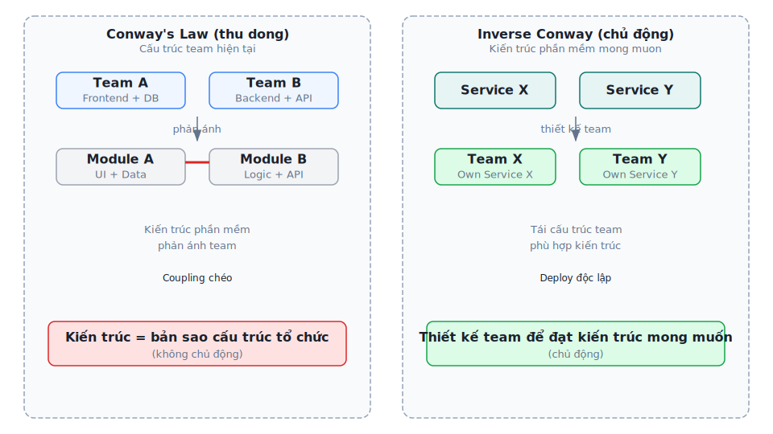
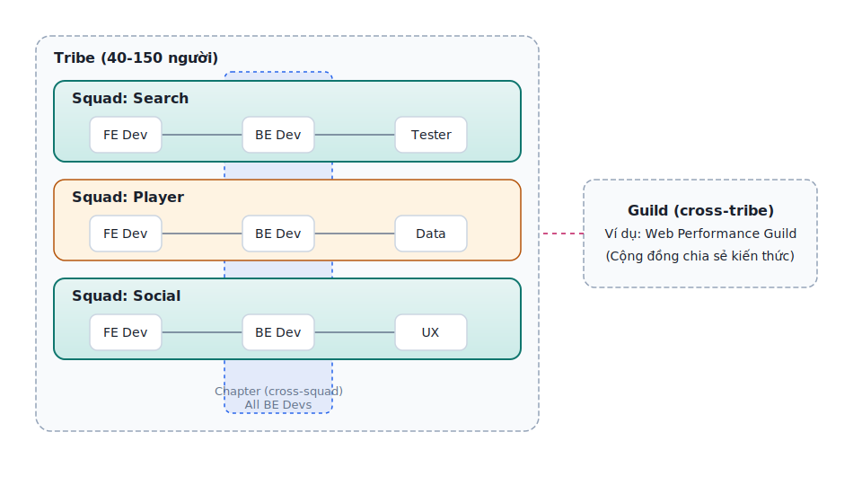
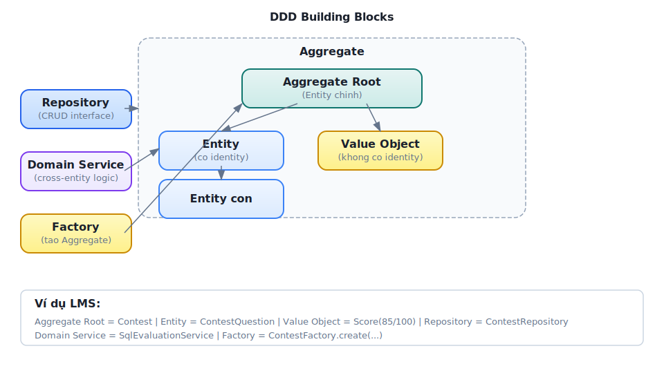
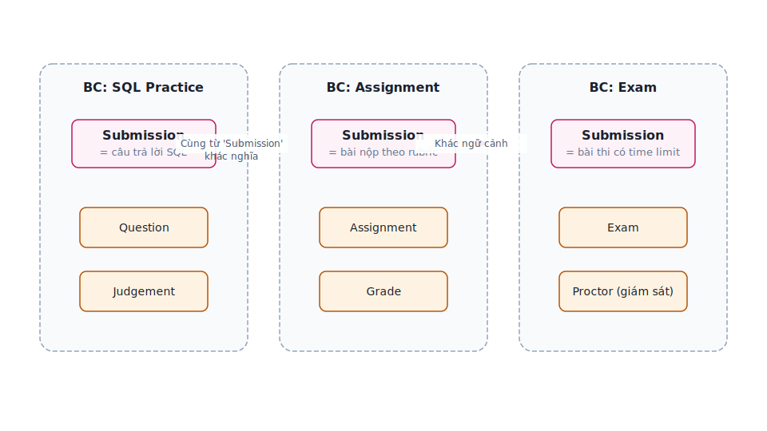
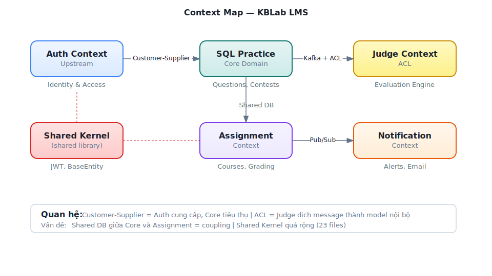
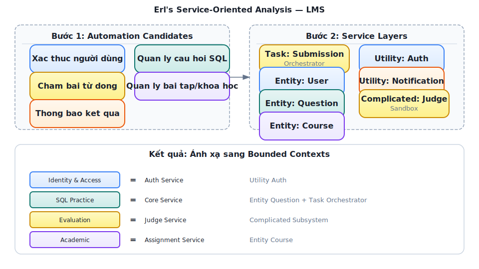
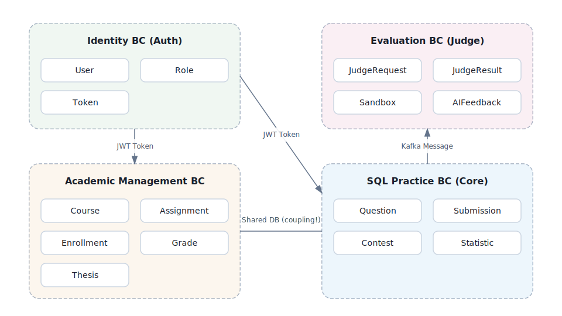
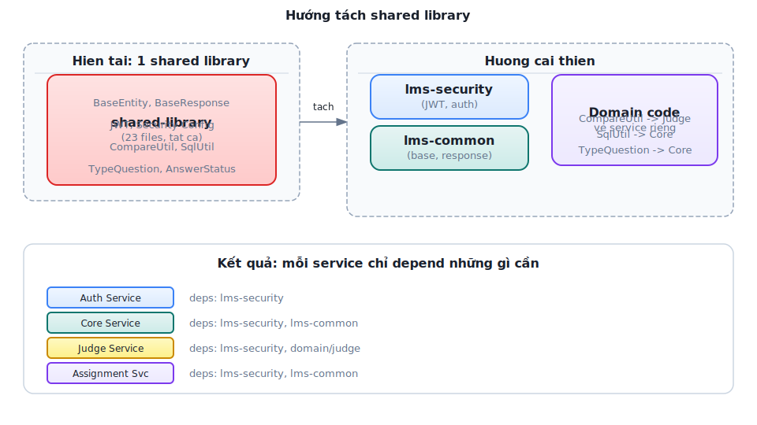

# Chương 2: Phân tích hướng Domain — DDD & Bounded Contexts

> *"Use the model as the backbone of a language. Commit the team to exercising that language relentlessly in all communication within the team and in the code."*
> — Eric Evans, *Domain-Driven Design*

---

## Bạn sẽ học được gì

- Hiểu Conway's Law và tác động của cấu trúc tổ chức lên kiến trúc phần mềm
- Nắm vững các khái niệm DDD cốt lõi: Entity, Value Object, Aggregate, Repository
- Áp dụng Strategic DDD: Bounded Context, Context Map, Ubiquitous Language
- Thực hành xác định ranh giới dịch vụ từ domain — kỹ năng quan trọng nhất khi thiết kế microservices
- So sánh hai phương pháp phân tách: DDD (heuristic-based) vs Erl Service-Oriented Analysis (step-by-step)
- Phân tích case study KBLab: 5 bounded contexts và quyết định Shared Kernel

---

## 2.1 Conway's Law — Tổ chức quyết định kiến trúc

Trước khi đi vào Domain-Driven Design, chúng ta cần hiểu một quy luật nền tảng ảnh hưởng đến mọi quyết định kiến trúc: **kiến trúc phần mềm phản ánh cấu trúc tổ chức phát triển nó**.

### Quy luật Conway

Năm 1968, Melvin Conway quan sát rằng:

> **📐 Nguyên tắc — Conway's Law**
>
> "Any organization that designs a system will produce a design whose structure is a copy of the organization's communication structure."
>
> *— Melvin Conway, 1968*

Nói cách khác: nếu tổ chức có 3 team, hệ thống sẽ có 3 service (hoặc 3 module lớn). Nếu 2 team giao tiếp nhiều, 2 service tương ứng sẽ coupling chặt. Đây không phải lý thuyết suông — nghiên cứu của MacCormack, Rusnak & Baldwin tại Harvard Business School (2008) đã cung cấp bằng chứng thực nghiệm hỗ trợ quy luật này trên các dự án mã nguồn mở.

Đối với developer và kiến trúc sư phần mềm, điều này có ý nghĩa thực tiễn rõ ràng: **không thể thiết kế microservices tốt nếu cấu trúc team không phù hợp**. Đây là lý do Amazon tái cấu trúc thành "two-pizza teams" *trước* khi tách monolith (đã thảo luận ở Chương 1).

### Inverse Conway Maneuver

Thay vì chấp nhận thụ động, nhiều tổ chức chủ động tận dụng Conway's Law theo hướng ngược lại: **thiết kế cấu trúc team để đạt được kiến trúc phần mềm mong muốn**. Chiến lược này gọi là *Inverse Conway Maneuver*.



*Hình 2.1: Conway's Law (thụ động) vs Inverse Conway Maneuver (chủ động)*

Một team sở hữu một hoặc vài service liên quan, chịu trách nhiệm toàn bộ lifecycle — từ code đến production. Đây là mô hình "you build it, you run it" mà Amazon và Netflix đã chứng minh hiệu quả.

### Team Topologies — Bốn kiểu team

Matthew Skelton và Manuel Pais đề xuất bốn kiểu team cơ bản cho tổ chức phần mềm hiện đại:

**Bảng 2.1:** Bốn kiểu team theo Team Topologies

| Kiểu team | Vai trò | Ví dụ trong KBLab |
| :----------- | :--------- | :----------------- |
| **Stream-aligned** | Phát triển theo luồng nghiệp vụ, sở hữu end-to-end | Team "Bài tập & Chấm thi", Team "Quản lý người dùng" |
| **Platform** | Cung cấp nền tảng nội bộ giúp stream-aligned teams phát triển nhanh hơn | Team DevOps (CI/CD, Docker, monitoring) |
| **Enabling** | Hỗ trợ các team khác nâng cao kỹ năng | Team kiến trúc (DDD coaching, code review) |
| **Complicated subsystem** | Sở hữu thành phần phức tạp đòi hỏi chuyên môn sâu | Team "SQL Judge" (sandbox isolation, multi-DBMS) |

Với KBLab — một dự án nhỏ (2–3 developers) — không thể áp dụng đầy đủ 4 kiểu team. Nhưng *tư duy* vẫn áp dụng: developer nào hiểu sâu domain nào sẽ tự nhiên sở hữu service tương ứng. Khi team mở rộng, cấu trúc này sẽ trở nên tường minh hơn.

### Industry Case Study: Spotify Squad Model

Spotify (2012) là case study nổi tiếng nhất về tổ chức team cho microservices. Henrik Kniberg và Anders Ivarsson mô tả mô hình gồm bốn cấp:



*Hình 2.2: Mô hình Squad/Tribe/Chapter/Guild của Spotify*

**Bảng 2.2:** Cấu trúc tổ chức Spotify — ý nghĩa cho microservices

| Cấu trúc | Mô tả | Ý nghĩa cho microservices |
| :----------- | :-------- | :-------------------------- |
| **Squad** (6-12 người) | Đơn vị tự trị, sở hữu features end-to-end | = Stream-aligned team = sở hữu 1+ microservices |
| **Tribe** (max 150 — Dunbar's number) | Nhóm squads cùng mission | Alignment mà không mất autonomy |
| **Chapter** | Nhóm người cùng competency xuyên squads | Chia sẻ best practices (ví dụ: all backend devs) |
| **Guild** | Cộng đồng quan tâm xuyên tribes | Knowledge sharing (ví dụ: Web Performance Guild) |

**Bài học cho hệ thống nhỏ**: Spotify có 2,000+ engineers khi áp dụng mô hình này — LMS chỉ có 2-3 (không cần squads/tribes). Nhưng nguyên tắc cốt lõi vẫn đúng: **mỗi service nên có owner rõ ràng**, và khi team mở rộng, tổ chức team theo bounded context (Ch.2) thay vì theo technical layer.

*Nguồn: Henrik Kniberg, Anders Ivarsson, "Scaling Agile @ Spotify," 2012. Kniberg cũng trình bày tại nhiều hội nghị (youtube.com). Lưu ý: Spotify đã evolve mô hình này đáng kể từ 2012 — mô hình gốc là điểm khởi đầu, không phải template cứng.*

> **🔍 Phân tích gap — Team nhỏ và Conway’s Law**
>
> Trong LMS, cùng một developer phát triển cả Auth Service và Core Service. Điều này dẫn đến ranh giới giữa các service không rõ ràng — ví dụ: `spring.application.name` trùng nhau giữa Core và Assignment (cả hai đều là `app`), shared database vẫn được duy trì vì tiện lợi. Richardson trong [2a] cho thấy việc định nghĩa rõ service ownership từ đầu giúp tránh coupling ngầm. **Migration path**: tách rõ naming, định nghĩa API contract giữa services, và chuẩn bị cho việc mở rộng team.

### Dark Energy & Dark Matter — 10 lực chi phối việc phân tách service

Richardson trong phiên bản thứ hai (2025) giới thiệu một framework phân tích trade-off cho việc service decomposition, mượn ẩn dụ từ vật lý thiên văn:

- **Dark Energy** — lực **đẩy** (repulsive): kéo các components ra xa nhau → nên tách thành service riêng
- **Dark Matter** — lực **hút** (attractive): kéo các components lại gần nhau → nên giữ cùng service

**Bảng 2.3:** Mười lực Dark Energy / Dark Matter

| Lực | Loại | Mô tả | Ví dụ KBLab |
| :----- | :------ | :------- | :----------- |
| **Simple interactions** | 🌑 Matter (hút) | Components tương tác phức tạp → giữ cùng service | `ContestQuestion` ↔ `Contest` luôn query chung → hợp lý ở cùng Core Service |
| **Efficient interactions** | 🌑 Matter (hút) | Cần latency thấp → in-process call nhanh hơn network | Submission → Score update cần nhanh → hiện cùng service |
| **Prefer ACID** | 🌑 Matter (hút) | Cần ACID transaction → cùng DB dễ hơn saga | Create contest + add questions = 1 transaction → cùng service |
| **Minimize runtime coupling** | 🌑 Matter (hút) | Giảm dependency lúc runtime → ít network calls | Judge Service xử lý độc lập (receive message → run → return) |
| **Simple components** | ⚡ Energy (đẩy) | Mỗi service nhỏ, dễ hiểu | Core Service (24 files) vs nếu gộp tất cả (~50+ files) |
| **Team autonomy** | ⚡ Energy (đẩy) | Team deploy độc lập, không coordination | Auth team vs Core team deploy riêng |
| **Fast deployment pipeline** | ⚡ Energy (đẩy) | Service nhỏ → build + test nhanh | Auth Service build 30s vs monolith build 5 phút |
| **Support multiple tech stacks** | ⚡ Energy (đẩy) | Service khác có thể dùng tech khác | Judge Service có thể viết bằng Go (performance) |
| **Independent scalability** | ⚡ Energy (đẩy) | Scale riêng từng service theo nhu cầu | Judge Service cần scale khi contest, Auth thì không |
| **Independent data ownership** | ⚡ Energy (đẩy) | Mỗi service own data riêng → encapsulation | Users ở Auth, Questions ở Core (lý tưởng) |

**Cách sử dụng**: Khi phân vân "có nên tách component X thành service riêng?", liệt kê các lực tác động. Nếu Dark Energy (đẩy) chiếm ưu thế → tách. Nếu Dark Matter (hút) mạnh hơn → giữ chung. Đây không phải công thức chính xác mà là **framework tư duy** giúp cấu trúc cuộc thảo luận.

> **🔍 Phân tích — Dark Energy/Matter cho quyết định tách Core & Assignment**
>
> KBLab hiện có Core Service và Assignment Service dùng chung database. Phân tích:
>
> - **Dark Matter (giữ chung)**: shared database (ACID dễ), `assignment_questions` reference `questions.id` (simple interactions), team rất nhỏ (2-3 người)
> - **Dark Energy (tách)**: domain logic khác biệt (bài tập vs cuộc thi), data ownership rõ ràng, potential for independent deployment
> 
> **Kết luận**: Dark Matter hiện mạnh hơn (do team nhỏ, shared DB). Khi team grow > 5 người, cân bằng sẽ shift → lúc đó tách DB và service hợp lý hơn. Đây chính là nguyên tắc *"Don't decompose prematurely"* (Richardson [2b, Ch.7]).

---

## 2.2 DDD cơ bản — Ngôn ngữ chung và các building blocks

Domain-Driven Design (DDD) là phương pháp thiết kế phần mềm đặt **domain** (miền nghiệp vụ) làm trung tâm. Eric Evans giới thiệu DDD năm 2003 trong cuốn sách cùng tên, và nó trở thành nền tảng cho việc phân tách microservices.

Đối với developer, DDD trả lời câu hỏi quan trọng nhất khi thiết kế microservices: **tách ở đâu?** Không phải tách theo layer kỹ thuật (UI team, DB team, API team) mà tách theo **ranh giới nghiệp vụ** — nơi mà sự thay đổi trong một domain không ảnh hưởng đến domain khác.

### Ubiquitous Language — Ngôn ngữ chung

Bước đầu tiên và quan trọng nhất trong DDD không phải vẽ diagram hay viết code — mà là **xây dựng ngôn ngữ chung** (*Ubiquitous Language*) giữa developer và domain expert.

Ubiquitous Language là tập hợp thuật ngữ mà *cả team* — developer, tester, product owner — sử dụng nhất quán trong mọi giao tiếp: email, meeting, code, tài liệu. Nếu domain expert nói "bài nộp" (*submission*), code phải có class `Submission`, database có bảng `submission`, API có endpoint `/submissions`. Không được có sự khác biệt.

Tại sao điều này quan trọng cho microservices? Vì khi hai team bắt đầu dùng cùng một thuật ngữ nhưng với **ý nghĩa khác nhau**, đó chính là tín hiệu rằng họ đang ở hai bounded context khác nhau — và service nên được tách.

### Các building blocks

DDD định nghĩa một bộ building blocks để mô hình hóa domain:



*Hình 2.3: Các building blocks trong DDD — Aggregate, Entity, Value Object, Repository*

**Entity** — Đối tượng có danh tính (*identity*) duy nhất xuyên suốt vòng đời. Hai entity có cùng thuộc tính nhưng khác ID vẫn là hai entity khác nhau. Ví dụ trong KBLab: `Student(id=1, name="Nguyen Van A")` và `Student(id=2, name="Nguyen Van A")` là hai sinh viên khác nhau dù trùng tên.

**Value Object** — Đối tượng được xác định bởi *giá trị*, không có identity riêng. Hai value object cùng giá trị là tương đương. Ví dụ: `Score(value=85, maxValue=100)` — không quan trọng "đây là điểm nào", chỉ quan trọng giá trị 85/100.

**Aggregate** — Cụm entity và value object được quản lý như một đơn vị nhất quán (*consistency boundary*). Mỗi aggregate có một **Aggregate Root** — entity duy nhất mà bên ngoài có thể tham chiếu. Trong LMS, `Contest` có thể là aggregate root bao gồm `ContestQuestion`, `ContestParticipant` — không ai truy cập `ContestQuestion` mà không đi qua `Contest`.

> **💡 Tip — Aggregate = Transaction boundary**
>
> Trong microservices, aggregate chính là đơn vị transaction. Một transaction chỉ nên thao tác trên **một aggregate** duy nhất. Nếu cần transaction trên nhiều aggregate, đó là tín hiệu cần Saga pattern (Chương 6) — không phải distributed transaction.

**Repository** — Interface cung cấp ảo tưởng về collection cho aggregate. Developer tương tác với repository thay vì database trực tiếp. Trong Spring Boot: `@Repository interface ContestRepository extends JpaRepository<Contest, UUID>`.

**Domain Service** — Logic nghiệp vụ không thuộc về một entity hay value object cụ thể nào. Ví dụ: `SqlEvaluationService` so sánh kết quả SQL của sinh viên với đáp án — logic này không thuộc về `Submission` hay `Question` riêng lẻ.

### DDD cho developer: nghĩ bằng domain, không bằng database

Sai lầm phổ biến nhất khi bắt đầu với DDD là **thiết kế entity từ bảng database**. DDD yêu cầu ngược lại: mô hình hóa domain trước, database sau.

**Bảng 2.3b:** Database-first vs Domain-first

| Cách tiếp cận | Bắt đầu từ | Kết quả |
| :--------------- | :----------- | :--------- |
| **Database-first** ❌ | Bảng, cột, foreign key | Entity = bảng, service = CRUD wrapper, ranh giới mờ nhạt |
| **Domain-first** ✅ | Quy trình nghiệp vụ, ngôn ngữ domain | Entity phản ánh business concepts, ranh giới tự nhiên |

Trong thực tế, nhiều dự án (kể cả LMS) bắt đầu database-first — và đó không phải là thảm họa. Nhưng khi cần tách microservices, bước đầu tiên phải là *nghĩ lại* mô hình từ góc nhìn domain.

---

## 2.3 Strategic DDD — Bounded Context & Context Map

Nếu tactical DDD (Entity, Aggregate) giúp mô hình hóa *bên trong* một service, thì strategic DDD giúp trả lời câu hỏi lớn hơn: **hệ thống cần bao nhiêu service, và ranh giới ở đâu?**

### Bounded Context — Ranh giới ngôn ngữ

**Bounded Context** là khái niệm quan trọng nhất trong DDD cho microservices. Một bounded context là phạm vi trong đó một mô hình domain cụ thể có hiệu lực — và **ngôn ngữ có ý nghĩa nhất quán**.

Ví dụ thực tế: trong KBLab, thuật ngữ "bài nộp" (*submission*) có ý nghĩa khác nhau tùy ngữ cảnh:

- Trong context **Thực hành SQL**: submission = câu trả lời SQL của sinh viên, cần chấm đúng/sai
- Trong context **Bài tập**: submission = file/nội dung nộp bài, cần chấm điểm theo rubric
- Trong context **Thi**: submission = bài thi với giới hạn thời gian, cần kiểm tra gian lận

Cùng một từ, ba ý nghĩa khác nhau → ba bounded context tiềm năng. Đây là heuristic mạnh mẽ nhất để xác định ranh giới: **khi cùng một thuật ngữ mang ý nghĩa khác nhau, chúng ta đang ở ranh giới giữa hai context**.



*Hình 2.4: Cùng thuật ngữ "Submission" mang ý nghĩa khác nhau trong ba bounded context*

### Context Map — Bản đồ quan hệ giữa các context

Khi đã xác định bounded contexts, bước tiếp theo là vẽ **Context Map** — sơ đồ quan hệ giữa chúng. Context Map không chỉ cho thấy context nào giao tiếp với nhau, mà còn cho thấy **kiểu quan hệ**.

Các kiểu quan hệ phổ biến:

**Bảng 2.4:** Các kiểu quan hệ giữa bounded contexts

| Quan hệ | Mô tả | Ví dụ trong KBLab |
| :--------- | :------- | :----------------- |
| **Shared Kernel** | Hai context chia sẻ một phần mô hình | Shared library (base entities, JWT, exceptions) |
| **Customer-Supplier** | Upstream context cung cấp, downstream tiêu thụ | Auth (upstream) → Core (downstream) |
| **Conformist** | Downstream chấp nhận hoàn toàn mô hình upstream | Core phải tuân theo model của Auth cho user data |
| **Anti-Corruption Layer** | Downstream dịch mô hình upstream thành mô hình riêng | Judge Service dịch Submission thành JudgeRequest nội bộ |
| **Open Host Service** | Context cung cấp API chuẩn cho nhiều consumer | Core API cung cấp question data cho Judge + Assignment |
| **Published Language** | Ngôn ngữ trao đổi được chuẩn hóa (JSON, Protobuf) | Kafka messages với schema chuẩn |



*Hình 2.5: Context Map của KBLab — quan hệ giữa các bounded contexts*

---

## 2.4 Xác định Bounded Context từ requirements

### Các heuristic thực tế

Làm thế nào để "tìm" bounded context trong một hệ thống? Không có công thức chính xác — đây là kỹ năng cần luyện tập. Tuy nhiên, có một số heuristic hữu ích:

**1. Heuristic ngôn ngữ** — Khi cùng một thuật ngữ mang ý nghĩa khác nhau cho các nhóm người khác nhau, đó là ranh giới context. Ngược lại, khi hai thuật ngữ khác nhau chỉ cùng một thứ (ví dụ: "ref-des" và "component instance" trong câu chuyện PCB của Eric Evans), chúng thuộc cùng context.

**2. Heuristic thay đổi** — Tự hỏi: "Khi requirement X thay đổi, code nào cần sửa?" Nếu thay đổi luôn ảnh hưởng đến cùng nhóm files, chúng thuộc cùng context. Nếu thay đổi lan sang nhóm khác, đó là tín hiệu coupling cần xem xét.

**3. Heuristic team** — Ai sẽ phát triển và bảo trì phần này? Nếu cùng team, chúng *có thể* cùng context. Nếu khác team, *cân nhắc* tách context (Conway's Law).

**4. Heuristic data** — Dữ liệu nào "thuộc về" nhau? Entity nào *luôn* được truy vấn cùng nhau? Đó là aggregate trong cùng context. Entity nào chỉ được tham chiếu qua ID? Đó có thể thuộc context khác.

### Event Storming — Phương pháp khám phá domain

**Event Storming** là workshop technique do Alberto Brandolini phát triển, giúp cả team cùng khám phá domain thông qua *domain events* — những sự kiện đã xảy ra trong hệ thống.



*Hình 2.6: Event Storming — luồng từ Command đến Domain Event*

Quy trình cơ bản:

1. **Liệt kê domain events** — post-it cam: "Submission Created", "SQL Executed", "Score Calculated"
2. **Tìm commands** — post-it xanh: "Submit Answer", "Start Exam", "Create Assignment"
3. **Nhóm events theo aggregate** — post-it vàng: events nào cùng xảy ra trên cùng entity?
4. **Vẽ ranh giới** — nhóm aggregates có liên quan chặt chẽ → bounded context

Kết quả Event Storming tự nhiên dẫn đến bounded contexts. Nhóm events/aggregates nào tương tác nhiều nội bộ nhưng ít tương tác với nhóm khác → đó là context.

### Phân rã hướng dịch vụ theo Erl — Cách tiếp cận step-by-step

DDD và Event Storming là phương pháp *khám phá* — bắt đầu từ ngôn ngữ domain, dần dần tìm ra ranh giới. Cách tiếp cận này mạnh nhưng đòi hỏi kinh nghiệm: developer mới thường khó biết "đủ chưa" hoặc "đúng chưa".

Thomas Erl trong *SOA: Analysis and Design for Services and Microservices* [1, Ch.8–10] đề xuất một phương pháp bổ trợ: **Service-Oriented Analysis** — quy trình *prescriptive*, gồm các bước cụ thể từ yêu cầu nghiệp vụ đến danh mục dịch vụ. Đây là cách tiếp cận dễ dạy và dễ học hơn cho sinh viên, vì mỗi bước có input và output rõ ràng.

**Năm bước phân rã dịch vụ theo Erl:**

**Bước 1: Xác định automation candidates** — Phân tích quy trình nghiệp vụ (business process) và xác định những bước nào *nên* được tự động hóa bằng phần mềm. Erl gọi đây là *service candidates* — chưa phải services, mà là ứng viên.

Ví dụ KBLab: quy trình "Sinh viên nộp bài SQL" có các bước: (1) xác thực người dùng, (2) nhận câu trả lời, (3) thực thi SQL trên sandbox, (4) so sánh kết quả, (5) ghi điểm, (6) thông báo. Mỗi bước là một automation candidate.

**Bước 2: Phân loại service layers** — Erl định nghĩa ba loại service:

**Bảng 2.7:** Ba loại service theo Erl

| Loại service | Vai trò | Ví dụ KBLab |
| :--- | :--- | :--- |
| **Task Service** | Điều phối quy trình nghiệp vụ (workflow), gọi các service khác | Submission orchestrator: nhận bài → gọi Judge → ghi điểm → thông báo |
| **Entity Service** | Quản lý dữ liệu nghiệp vụ (CRUD + business rules) | Question Service, User Service, Contest Service |
| **Utility Service** | Cung cấp chức năng kỹ thuật dùng chung | JWT validation, notification, logging |

Phân loại này giúp tránh sai lầm phổ biến: tạo service chỉ là CRUD wrapper (entity service không có business logic) hoặc nhồi tất cả vào một "god service" (thiếu task/utility decomposition).

**Bước 3: Tạo service inventory blueprint** — Vẽ bản đồ toàn bộ services dự kiến, mỗi service với operations chính. Tương tự Context Map trong DDD, nhưng focused hơn vào *capabilities* (khả năng) thay vì *language boundaries* (ranh giới ngôn ngữ).

**Bước 4: Xác định service boundaries + composition** — Kiểm tra từng service candidate: nó có thể hoạt động **độc lập** không? Nếu service A *luôn* cần gọi service B trước khi xử lý bất kỳ request nào → cân nhắc gộp. Nếu service A có thể hoạt động ngay cả khi B down → ranh giới tốt.

**Bước 5: Verify qua 8 nguyên lý SOA** — Mỗi service phải thỏa mãn 8 nguyên lý hướng dịch vụ đã thảo luận ở Bảng 1.2 (Chương 1): Standardized Contract, Loose Coupling, Abstraction, Reusability, Autonomy, Statelessness, Discoverability, Composability. Đây là "checklist kiểm tra chất lượng" cho service design.

#### Áp dụng Erl cho KBLab

Áp dụng 5 bước trên cho KBLab:



*Hình 2.6b: Áp dụng Erl's Service-Oriented Analysis cho KBLab — từ automation candidates đến service layers*

Kết quả: 5 nhóm dịch vụ — gần như trùng khớp với 5 bounded contexts từ phân tích DDD (§2.5): Identity & Access ≈ Utility Auth, SQL Practice ≈ Entity Question + Task Orchestrator, Network Practice ≈ Complicated Protocol Subsystem, Academic ≈ Entity Course, DevOps Practice ≈ Task Service + Infrastructure Automation.

#### So sánh: Erl vs DDD

**Bảng 2.8:** Hai phương pháp phân tách service — Erl Service-Oriented Analysis vs DDD

| Tiêu chí | Erl Service-Oriented Analysis | DDD Bounded Context |
| :--- | :--- | :--- |
| **Điểm bắt đầu** | Quy trình nghiệp vụ (business process) | Ngôn ngữ domain (Ubiquitous Language) |
| **Phong cách** | Prescriptive — 5 bước rõ ràng, input/output mỗi bước | Explorative — heuristics, Event Storming workshop |
| **Tiêu chí tách** | Service layers (task/entity/utility) + 8 nguyên lý SOA | Ranh giới ngôn ngữ + aggregate consistency |
| **Output** | Service inventory blueprint | Context Map + Bounded Context diagram |
| **Thế mạnh** | Systematic, dễ dạy, phù hợp team mới | Sâu về domain, phát hiện ranh giới ẩn |
| **Hạn chế** | Có thể tạo ranh giới quá kỹ thuật (thiếu domain insight) | Cần kinh nghiệm, kết quả phụ thuộc người phân tích |
| **Phù hợp khi** | Team ít kinh nghiệm DDD, cần quy trình chuẩn | Team hiểu domain sâu, cần phát hiện complexity ẩn |

> **📐 Nguyên tắc — Hai phương pháp bổ trợ, không thay thế**
>
> Erl cho bạn *quy trình* (process) — đặc biệt hữu ích khi bạn chưa biết bắt đầu từ đâu. DDD cho bạn *insight* — phát hiện những ranh giới mà quy trình cơ học bỏ sót. Trong thực tế: dùng Erl để tạo bản phác thảo ban đầu (service inventory), sau đó dùng DDD (Event Storming, ngôn ngữ chung) để *tinh chỉnh* ranh giới. Richardson's Assemblage Process (§2.7) kết hợp cả hai hướng.

---

## 2.5 Case Study: Bounded Contexts trong KBLab

### Phân tích domain

KBLab phục vụ các hoạt động giảng dạy, thực hành, đánh giá và vận hành lab thực hành. Từ góc nhìn DDD, chúng ta xác định 5 bounded contexts chính. Các service hỗ trợ như Gateway, Registry và Notification vẫn quan trọng, nhưng chúng là supporting/infrastructure services hơn là domain context độc lập.



*Hình 2.7: Năm bounded contexts chính trong KBLab*

### Năm bounded contexts

**1. Identity & Access** (`Auth Service`)

Domain rõ ràng nhất — quản lý danh tính người dùng, xác thực, phân quyền. Entities: `User`, `Role`, `Token`. Đây là context upstream — mọi context khác đều phụ thuộc vào kết quả authentication.

Trong KBLab, context này được tách thành service riêng sớm nhất (`kblab-auth`), vì ranh giới rất rõ: thay đổi cơ chế xác thực (tài khoản nội bộ, Google/Microsoft OAuth2, email verification, SSO từ hệ thống đào tạo) không ảnh hưởng logic bài tập hay chấm thi.

**2. SQL Practice** (`kblab-app` + `kblab-judge` — *Core Domain*)

Đây là **core domain** ban đầu — phần tạo ra giá trị chính cho hệ thống SQL judge. Entities: `Question`, `Submission`, `Contest`, `UserContest`, `Statistic`. Toàn bộ quy trình từ "sinh viên xem câu hỏi → viết SQL → nộp bài → nhận kết quả" nằm trong context này.

Đây là context lớn nhất và phức tạp nhất. Bên trong nó có kiến trúc chấm SQL gồm một service điều phối `judge` và nhiều processor `judge-*` theo DBMS (`judge-mysql`, `judge-sqlserver`, ...). Đây mới là nơi cần phân tích kỹ về routing, resilience, idempotency và ownership giữa coordinator với worker; không nên nhầm với Network Practice.

**3. Network Practice** (`kblab-judge-network`)

Domain chuyên biệt cho bài thực hành lập trình mạng Java: TCP, UDP, RMI, SOAP, REST và gRPC. Khác với SQL Practice, sinh viên viết client trên IDE cá nhân và kết nối trực tiếp đến judge server. Context này minh họa ranh giới domain đến từ **protocol semantics**, không chỉ từ entity/database.

Network Practice được thiết kế khá độc lập với các services còn lại: nó phục vụ mục tiêu đánh giá giao tiếp qua mạng, có protocol contract riêng và không cần chia sẻ pipeline chấm SQL. Trong sách, context này chủ yếu minh họa **technology diversity** và boundary theo protocol, không phải một "gap" kiến trúc cần sửa như SQL Judge.

**4. Academic Management** (`Assignment Service`)

Quản lý khóa học, bài tập dạng rubric, đăng ký môn, điểm số, điểm danh, MCQ daily, syllabus/CLO, GitHub Classroom và đồ án tốt nghiệp. Entities: `Course`, `Assignment`, `Enrollment`, `Grade`, `AttendanceSession`, `Thesis`.

Context này tách ra từ Core Service — nhưng *vẫn chia sẻ database* (`app_db`). Đây là trade-off quan trọng mà chúng ta sẽ phân tích trong phần tiếp theo.

**5. DevOps Practice** (`dol-api`, `dol-infra`, `dol-web`)

Domain mới phục vụ bài thực hành Docker/Kubernetes: tạo lab environment cô lập, terminal web, validator script và progress tracking. Context này dùng Go, k3s và Sysbox, khác stack với LMS chính. Đây là ví dụ tốt cho polyglot microservices: dùng công nghệ khác khi domain và hạ tầng yêu cầu, nhưng vẫn chia sẻ identity qua JWT của KBLab.

### Từ bounded context đến service

**Bảng 2.9:** Ánh xạ bounded context → service trong KBLab

| Bounded Context | Service | Lý do tách |
| :---------------- | :--------- | :----------- |
| Identity & Access | `kblab-auth` | Ranh giới rõ ràng, thay đổi auth ≠ thay đổi logic học tập |
| SQL Practice | `kblab-app`, `kblab-judge`, sandbox DB services | Core domain, cần sandbox isolation và chấm tự động |
| Network Practice | `kblab-judge-network` | Protocol đa dạng, state/routing khác REST API thông thường |
| Academic Management | `kblab-assignment` | Domain học vụ, grade scheme, attendance, thesis |
| DevOps Practice | `dol-api`, `dol-infra`, `dol-web` | Domain lab infrastructure, Go/k3s/Sysbox, validator script |

> **💡 Tip — Một bounded context ≠ một service**
>
> Bounded context là ranh giới logic. Một context có thể được implement bởi nhiều service (như SQL Practice = Core + Judge + sandbox DB services). Ngược lại, một repo cũng có thể sinh nhiều binary phục vụ cùng context (như DevOps Practice = API + router + grader trong một codebase Go) — miễn là ranh giới domain rõ ràng.

---

## 2.6 Shared Kernel Pattern — Chia sẻ hay không chia sẻ?

### Vấn đề thực tế

Trong KBLab, tồn tại một **shared library** chứa 23 Java files: base entities, DTOs, JWT utilities, exception handling, validation utilities. Nhiều service Java phụ thuộc vào library này.

Đây là pattern **Shared Kernel** trong DDD: hai hoặc nhiều bounded contexts đồng ý chia sẻ một phần mô hình chung. Shared Kernel giảm duplication nhưng tạo coupling — mọi thay đổi trong shared library đều *có thể* ảnh hưởng tất cả service.

```
shared-library/
├── common/         BaseMapper, BaseRequest, BaseResponse, BaseService
├── config/         AuditConfig, CorsConfig, TimeZoneConfig
├── enumerate/      AnswerStatus, ErrorCode, TypeQuestion
├── exception/      GlobalExceptionHandler
├── securityConfig/ JwtConfig, UserDetailCustom
└── utils/          CompareUtil, JwtUtil, SqlUtil, TableDependencyResolver
```

### Phân tích: cái gì nên shared, cái gì không?

**Bảng 2.10:** Phân tích shared library — cái gì nên shared, cái gì không

| Loại | Ví dụ | Nên shared? | Lý do |
| :------ | :------- | :------------- | :------- |
| **Cross-cutting concerns** | JWT validation, exception handling, CORS config | ✅ Có | Nhất quán hành vi xuyên service, ít thay đổi |
| **Base abstractions** | BaseEntity, BaseMapper, BaseResponse | ⚠️ Cân nhắc | Tiện nhưng tạo coupling vào convention |
| **Domain-specific logic** | `CompareUtil` (SQL comparison), `SqlUtil` | ❌ Không | Chỉ Judge context cần — không phải shared concern |
| **Domain enums** | `TypeQuestion`, `AnswerStatus` | ❌ Không | Thuộc về SQL Practice context, không universal |

### Hướng cải thiện

Nếu team phát triển lớn hơn và cần giảm coupling, shared library có thể được tách thành:

1. **`kblab-security`** — JWT, auth config (mọi service cần)
2. **`kblab-common`** — Base entities, response format (convention)
3. **Domain-specific code** → chuyển vào service tương ứng (Judge, Core)



*Hình 2.8: Hướng tách shared library — từ monolithic sang modular*

> **📐 Nguyên tắc — Shared Kernel Trade-off**
>
> Shared Kernel là *thỏa thuận có chủ đích*, không phải sự tiện lợi. Mỗi file trong shared library phải trả lời: "Nếu thay đổi file này, tất cả service *phải* thay đổi cùng nhau — và điều đó *hợp lý*." Nếu câu trả lời là không, file đó không nên nằm trong shared kernel.

> **🔍 Phân tích gap — Shared Kernel cần tách**
>
> Với 23 files trong shared library, KBLab đang gây coupling không cần thiết: domain-specific code như `CompareUtil` (so sánh SQL) nằm chung với cross-cutting concerns như JWT. Richardson trong [2a] khuyến nghị chỉ share những gì thực sự cross-cutting (event definitions, API contracts). **Migration path**: (1) tách domain code về service riêng, (2) giữ shared chỉ security + base response, (3) đưa domain enums (`TypeQuestion`, `AnswerStatus`) về context sở hữu.

---

> **⚠️ Sai lầm thường gặp**
>
> 1. **Thiết kế entity từ bảng database** — Nhìn ERD rồi tạo 1 entity = 1 bảng, 1 service = 1 nhóm bảng. Hậu quả: ranh giới service không phản ánh domain mà phản ánh schema — khi nghiệp vụ thay đổi, phải refactor cả service lẫn database. *Phòng tránh*: bắt đầu từ domain process (Event Storming §2.4), không từ schema.
> 2. **Chia quá nhỏ (nano-services)** — Tách mỗi entity thành 1 service riêng (UserService, RoleService, TokenService) khi chúng luôn thay đổi cùng nhau. Hậu quả: mỗi request cần gọi 3-4 services, latency tăng, debugging trở thành cơn ác mộng. *Phòng tránh*: tách theo bounded context, không theo entity. Nếu hai entity luôn thay đổi cùng nhau, chúng thuộc cùng service.
> 3. **Dùng Shared Kernel vì tiện, không vì thiết kế** — Cho tất cả code "chung" vào shared library mà không phân biệt cross-cutting concern và domain logic. Hậu quả: mỗi thay đổi shared lib ảnh hưởng tất cả services, deploy coupling ngầm. *Phòng tránh*: mỗi file trong shared kernel phải trả lời "tất cả service *phải* thay đổi cùng khi file này thay đổi?" (§2.6).

---

## 2.7 Assemblage Process — Quy trình thiết kế service architecture

Làm thế nào để tổng hợp tất cả các kỹ thuật trên — Bounded Context, Context Map, Dark Energy/Matter — thành một quy trình thiết kế mang tính thực hành? Richardson trong [2b, Ch.20] trình bày **Assemblage Process**: quy trình step-by-step để đi từ yêu cầu nghiệp vụ đến kiến trúc microservices cụ thể.

1. **Định nghĩa System Operations** — Liệt kê các thao tác chính mà hệ thống phải hỗ trợ (ví dụ: `submitAnswer()`, `createContest()`, `gradeSubmission()`).
2. **Xác định Subdomains** — Dùng Bounded Contexts (§2.3) để phân vùng nghiệp vụ: Identity, SQL Practice, Network Practice, Academic Management, DevOps Practice.
3. **Gán Operations → Subdomains** — Quyết định logic nghiệp vụ của mỗi operation thuộc subdomain nào.
4. **Áp dụng Dark Energy & Dark Matter** — Với mỗi cặp subdomains, phân tích 10 lực đã thảo luận ở §2.5: lực đẩy (Dark Energy) khuyến khích tách thành service độc lập; lực hút (Dark Matter) giữ các phần chặt chẽ lại cùng nhau.
5. **Thiết kế IPC** — Chọn mô hình giao tiếp giữa các service: đồng bộ REST/gRPC (Ch.4) hay bất đồng bộ Kafka (Ch.5).
6. **Lặp lại** — Quy trình không chạy một lần. Khi kiến thức domain sâu hơn, ranh giới service cần được đánh giá lại.

Assemblage process biến quá trình thiết kế kiến trúc — vốn mang tính nghệ thuật và chủ quan — thành chuỗi các quyết định kỹ thuật có thể giải thích được. Thay vì nói "tách Judge Service vì nó cảm thấy đúng", chúng ta có thể lập luận: *"Judge Service được tách vì Dark Energy force #1 (simple components) và #3 (fast deployment pipeline) vượt trội so với Dark Matter force #2 (efficient interaction) trong context này."*

---


> **🌐 Trực quan hóa tương tác (Interactive Demo)**
>
> Để hiểu rõ hơn về nội dung chương này, hãy mở file `code/interactive/context-map.html` trong mã nguồn đi kèm sách bằng trình duyệt web để trải nghiệm minh họa động về **Bản đồ Bounded Context (Context Map)**.

## Tổng kết

Chương này đã trang bị cho chúng ta bộ công cụ tư duy để phân tích và phân tách hệ thống — từ quy luật vĩ mô (Conway's Law) đến kỹ thuật vi mô (Entity, Aggregate, Repository), và quy trình tổng hợp (Assemblage Process).

Conway's Law nhắc nhở rằng kiến trúc phần mềm không tồn tại trong chân không — nó phản ánh và bị ràng buộc bởi cấu trúc tổ chức. Inverse Conway Maneuver cho phép chúng ta chủ động thiết kế team để đạt kiến trúc mong muốn.

Chúng ta có hai phương pháp bổ trợ để xác định ranh giới service. **DDD** cung cấp ngôn ngữ và heuristics — Bounded Context, Context Map, Event Storming — phù hợp khi team hiểu domain sâu. **Erl's Service-Oriented Analysis** cung cấp quy trình step-by-step — từ automation candidates đến service layers — phù hợp khi team cần một framework có cấu trúc. Cả hai đều dẫn đến kết quả tương tự (như minh họa với KBLab: 5 service groups chính), nhưng từ góc nhìn khác nhau. Dark Energy/Dark Matter forces lượng hóa các yếu tố ảnh hưởng đến quyết định tách/gộp, và Assemblage Process (§2.7) tổng hợp tất cả thành quy trình thiết kế có hệ thống.

Phân tích KBLab cho thấy 5 bounded contexts rõ ràng, mỗi context tương ứng với một nhóm service hoặc binary. Shared Kernel — dù tiện lợi cho team nhỏ — cần được quản lý có chủ đích, phân biệt rõ giữa cross-cutting concerns (nên share) và domain logic (không nên share).

Ở Chương 3, chúng ta sẽ đi sâu vào **thiết kế API**: khi đã xác định được ranh giới service, câu hỏi tiếp theo là *các service giao tiếp với nhau như thế nào?* REST API design, contract-first approach, schema evolution, và documentation sẽ là trọng tâm.

---

## Đọc thêm

**Sách tham khảo chính:**

1. [1] Thomas Erl, *SOA: Analysis and Design for Services and Microservices*, 2nd Ed. — Ch.8–10: Service-Oriented Analysis, Service Layers (task/entity/utility), Service Inventory Blueprint
2. [6] Eric Evans, *Domain-Driven Design* — Ch.1–5: Knowledge Crunching, Ubiquitous Language, Building Blocks; Ch.14: Bounded Context, Context Map
3. [2a] Chris Richardson, *Microservices Patterns*, 1st Ed. — Ch.2: Decomposition Strategies
4. [2b] Chris Richardson, *Microservices Patterns*, 2nd Ed. — Ch.4: Loose Coupling, Dark Energy/Dark Matter Forces; Ch.7: Microservice Architecture; Ch.20: Assemblage Process
5. [4a] Sam Newman, *Building Microservices* — Ch.3: How to Model Services; Ch.10: Conway's Law
6. [4b] Sam Newman, *Monolith to Microservices* — Ch.2: Planning a Migration, Decomposition by Domain
7. [5] Hugo Rocha, *Practical Event-Driven MS Architecture* — Ch.3: Service Boundaries, DDD/Bounded Context

**Sách bổ trợ:**

8. [9] Vaughn Vernon, *Implementing Domain-Driven Design* — Ch.2: Strategic Design with Bounded Contexts
9. [8] Matthew Skelton & Manuel Pais, *Team Topologies* — Four Team Types, Cognitive Load, Conway's Law
10. [10] Alberto Brandolini, *Introducing EventStorming* — Domain discovery workshops

**Nguồn trực tuyến:**

- MacCormack, Rusnak & Baldwin, *"Exploring the Duality between Product and Organizational Architectures"* (2008) — Harvard Business School Working Paper

