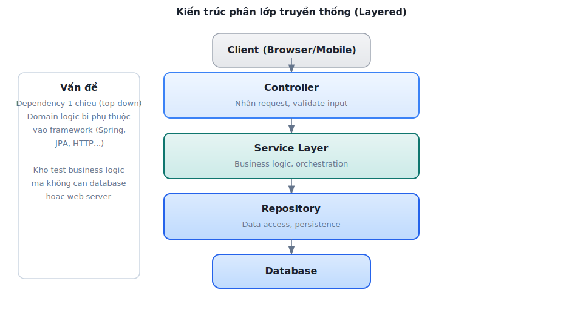
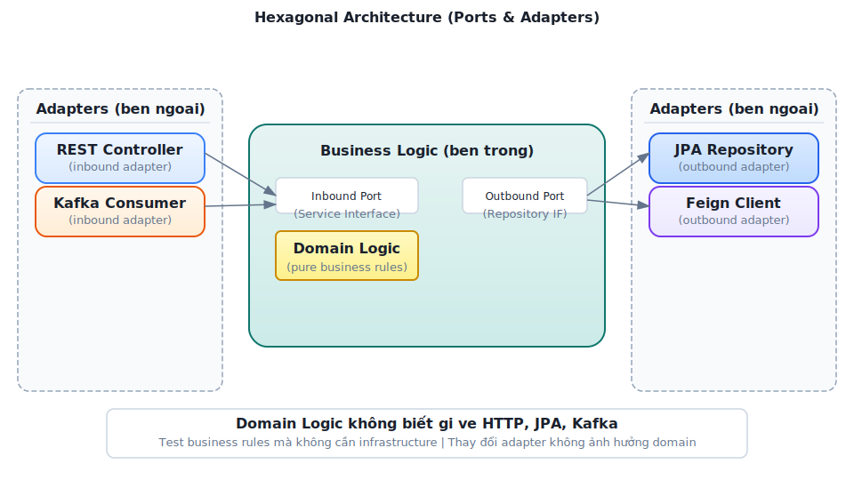

# Chương 3: Thiết kế Dịch vụ & API

> *"A well-designed API is a conversation between the provider and the consumer — clear, consistent, and forgiving."*
> — Adapted from REST API design best practices [1]

---

## Bạn sẽ học được gì

- Nắm vững nguyên tắc thiết kế REST API cho microservices
- Hiểu các chiến lược API versioning và schema evolution
- Sử dụng OpenAPI/Swagger để tạo documentation tự động
- Áp dụng DTO pattern để tách biệt internal model và external contract
- Phân tích bài học thực tế từ API design trong hệ thống LMS

---

## 3.1 REST API Design — Nguyên tắc cho Microservices

### Tại sao API design quan trọng hơn trong microservices?

Trong monolith, giao tiếp giữa các module là gọi hàm nội bộ (in-process call) — nếu interface thay đổi, compiler sẽ báo lỗi ngay. Trong microservices, giao tiếp qua network (HTTP, gRPC, messaging) — và **không có compiler nào bắt lỗi khi API thay đổi**. Một breaking change trong API có thể crash service khác mà không ai biết cho đến khi production gặp sự cố.

Do đó, API trong microservices cần được thiết kế **cẩn thận hơn**, **ổn định hơn**, và **có chiến lược evolution rõ ràng** — đây không phải optional, mà là điều kiện tiên quyết.

### Richardson Maturity Model

Leonard Richardson đề xuất mô hình 4 cấp độ trưởng thành cho REST API [2a, Ch.3]:



*Hình 3.1: Richardson Maturity Model — bốn cấp độ trưởng thành của REST API*

Hầu hết microservices thực tế (bao gồm LMS) hoạt động ở **Level 2** — sử dụng đúng resources và HTTP verbs.

**Level 3 (HATEOAS) — Khi nào cần?** HATEOAS (*Hypermedia as the Engine of Application State*) yêu cầu response chứa links điều hướng — client không cần biết trước URL structure, chỉ follow links từ response. Ví dụ: `GET /questions/123` trả về `{..., "_links": {"submissions": "/questions/123/submissions", "edit": "/questions/123"}}`. Ưu điểm: API self-documenting, client không depend vào URL structure. Nhược điểm: tăng payload size, phức tạp response format, hầu hết frontend frameworks (React, Angular) không leverage HATEOAS. Trong thực tế, HATEOAS hiếm khi được áp dụng cho internal APIs [4a, Ch.4] — phù hợp hơn cho public APIs khi provider không kiểm soát consumer (GitHub API là ví dụ tiêu biểu).

### Nguyên tắc thiết kế REST API

**1. Resource-oriented URLs** — URL đại diện cho resource (danh từ), không phải hành động (động từ):

```
✅ GET  /questions/{id}          → Lấy câu hỏi
✅ POST /questions               → Tạo câu hỏi mới
✅ GET  /contests/{id}/questions  → Câu hỏi trong cuộc thi

❌ GET  /getQuestion?id=123      → Dùng verb, query string
❌ POST /createQuestion           → URL chứa action
```

**2. HTTP methods đúng ngữ nghĩa:**

**Bảng 3.1:** HTTP methods và ngữ nghĩa

| Method | Ý nghĩa | Idempotent? | Ví dụ |
| :-------- | :--------- | :------------ | :------- |
| `GET` | Đọc resource | ✅ Có | `GET /questions/123` |
| `POST` | Tạo resource mới | ❌ Không | `POST /submissions` |
| `PUT` | Cập nhật toàn bộ | ✅ Có | `PUT /questions/123` |
| `PATCH` | Cập nhật một phần | ❌ Không | `PATCH /users/123` |
| `DELETE` | Xóa resource | ✅ Có | `DELETE /questions/123` |

**3. Response codes có ý nghĩa:**

**Bảng 3.2:** HTTP response codes thường dùng trong microservices

| Code | Khi nào dùng | Ví dụ |
| :------ | :------------- | :------- |
| `200 OK` | Request thành công | `GET /questions/123` trả về question |
| `201 Created` | Tạo resource mới thành công | `POST /questions` trả về question vừa tạo |
| `204 No Content` | Thành công nhưng không có body | `DELETE /questions/123` |
| `400 Bad Request` | Input không hợp lệ | Thiếu field bắt buộc |
| `401 Unauthorized` | Chưa xác thực | Token hết hạn |
| `403 Forbidden` | Không có quyền | Student truy cập admin API |
| `404 Not Found` | Resource không tồn tại | `GET /questions/99999` |
| `409 Conflict` | Conflict trạng thái | Submission đã được chấm |
| `500 Internal Server Error` | Lỗi server | Database connection failed |

**4. Plural nouns, consistent naming** — Luôn dùng số nhiều cho collection: `/questions`, không phải `/question`. Chọn một convention (kebab-case, camelCase, snake_case) và giữ nhất quán xuyên suốt.

**5. Pagination, filtering, sorting** — Mọi endpoint trả về collection phải hỗ trợ phân trang. Có hai chiến lược chính:

**Bảng 3.3:** Hai chiến lược pagination

| Chiến lược | Request | Ưu điểm | Nhược điểm |
| :----------- | :--------- | :--------- | :------------ |
| **Offset-based** | `?page=2&size=20` | Đơn giản, jump to page | Performance giảm ở page lớn (DB phải skip N rows), kết quả không ổn định nếu data thêm/xóa giữa chừng |
| **Cursor-based** | `?after=abc123&limit=20` | Performance ổn định (O(1) với index), kết quả nhất quán | Không jump to page, phức tạp hơn |

LMS sử dụng **offset-based** (Spring Data `Pageable`) — hợp lý cho danh sách câu hỏi (~1000 records). Với datasets lớn (submissions history, audit logs), cursor-based pagination hiệu quả hơn khi `page > 100`.

Response pagination nên bao gồm metadata để client biết có thêm data không:

**Listing 3.1:** Response pagination với metadata

```
GET /questions?page=0&size=20&sort=createdAt,desc&difficulty=HARD

// Response envelope
{
  "data": [...],
  "pagination": {
    "page": 0,
    "size": 20,
    "totalElements": 157,
    "totalPages": 8,
    "hasNext": true
  }
}
```

**6. Standardized Error Response** — Error responses cần format nhất quán để client xử lý programmatically. Lấy cảm hứng từ RFC 7807 (Problem Details for HTTP APIs), một error response nên bao gồm:

**Bảng 3.4:** Các fields trong standardized error response (RFC 7807-inspired)

| Field | Mô tả | Bắt buộc? |
| :------- | :------- | :---------- |
| `status` | HTTP status code | ✅ |
| `error` | Mã lỗi machine-readable | ✅ |
| `message` | Mô tả human-readable | ✅ |
| `timestamp` | Thời điểm lỗi xảy ra | ⚠️ Nên có |
| `path` | Request path gây lỗi | ⚠️ Nên có |
| `details` | Chi tiết bổ sung (validation errors) | Optional |

**Listing 3.2:** Standardized error response (RFC 7807-inspired)

```
// ✅ Standardized error response (RFC 7807-inspired)
{
  "status": 400,
  "error": "VALIDATION_FAILED",
  "message": "Input validation failed",
  "timestamp": "2026-03-20T10:30:00Z",
  "path": "/api/questions",
  "details": [
    {"field": "title", "message": "must not be blank"},
    {"field": "difficulty", "message": "must be EASY, MEDIUM, or HARD"}
  ]
}
```

Mọi service trong hệ thống nên trả error cùng format — client chỉ cần viết **một** error handler. Trong Spring Boot, `@ControllerAdvice` + `GlobalExceptionHandler` giải quyết: mọi exception được catch tại một điểm duy nhất và biến thành response format chuẩn (xem thêm §3.5).

**7. Idempotency** — Một số operations cần đảm bảo **idempotent**: gọi nhiều lần cho cùng kết quả. GET, PUT, DELETE tự nhiên idempotent. POST thì không — nếu client gọi `POST /submissions` hai lần (do network retry), có thể tạo hai submissions.

Giải pháp: **Idempotency Key** — client gửi kèm header `Idempotency-Key: <UUID>`. Server kiểm tra key đã xử lý chưa: nếu rồi, trả kết quả cũ; nếu chưa, xử lý và lưu key. Stripe, PayPal đều dùng pattern này cho payment API — critical khi liên quan đến tài chính hoặc business operations quan trọng.

**Bảng 3.5:** Idempotency theo HTTP method

| Method | Idempotent? | Giải pháp nếu không |
| :-------- | :------------ | :--------------------- |
| `GET` | ✅ Tự nhiên | — |
| `PUT` | ✅ Tự nhiên | — |
| `DELETE` | ✅ Tự nhiên | — |
| `POST` | ❌ Không | `Idempotency-Key` header |
| `PATCH` | ⚠️ Tùy | Depends on implementation |

> **📐 Nguyên tắc — Contract-First vs Code-First**
>
> Có hai cách tiếp cận thiết kế API: **Contract-first** (viết OpenAPI spec trước, generate code sau) và **Code-first** (viết code trước, generate spec sau). Contract-first tốt hơn cho API public hoặc cross-team. Code-first nhanh hơn cho API internal trong team nhỏ. LMS sử dụng code-first (Spring Boot annotations → auto-generated docs) — hợp lý cho team 2–3 devs [1, Ch.7].

---

## 3.2 API Versioning & Schema Evolution

### Tại sao cần versioning?

Trong monolith, thay đổi internal API chỉ cần refactor code + chạy lại tests. Trong microservices, service A thay đổi response format → service B (consumer) *có thể* crash nếu không xử lý. Đây là bài toán **schema evolution** — và API versioning là giải pháp [7, Ch.4].

### Ba chiến lược versioning

**Bảng 3.6:** Ba chiến lược API versioning

| Chiến lược | Cách dùng | Ưu điểm | Nhược điểm |
| :----------- | :---------- | :--------- | :----------- |
| **URL path** | `/api/v1/questions`, `/api/v2/questions` | Đơn giản, rõ ràng | Nhiều URL, routing phức tạp |
| **Query parameter** | `/questions?version=2` | Ít thay đổi URL | Dễ bỏ sót |
| **Header** | `Accept: application/vnd.lms.v2+json` | Clean URL | Khó debug, ít trực quan |

Theo Sam Newman, **URL path versioning** phổ biến nhất vì đơn giản và developer-friendly [4a, Ch.4]. Đây cũng là cách mà hầu hết API public lớn (GitHub, Stripe, Twitter) sử dụng.

Ngoài ba chiến lược trên, còn có **Content-Type versioning** (`Accept: application/vnd.lms.question.v2+json`) — phổ biến ở GitHub API: cho phép version từng resource riêng lẻ thay vì toàn bộ API. Tuy nhiên, phức tạp hơn cho cả provider và consumer.

**Bảng 3.6b:** Decision criteria — chọn versioning strategy nào?

| Tiêu chí | URL path | Query param | Header | Content-Type |
| :---------- | :---------- | :------------- | :-------- | :------------- |
| **Dễ implement** | ⭐⭐⭐ | ⭐⭐⭐ | ⭐⭐ | ⭐ |
| **Cache-friendly** | ✅ (url khác nhau) | ⚠️ (cần Vary) | ❌ (cần Vary header) | ❌ |
| **API Gateway routing** | ✅ Dễ (path-based) | ⚠️ Trung bình | ⚠️ Trung bình | ❌ Khó |
| **Granularity** | Toàn bộ API | Toàn bộ API | Toàn bộ API | Per resource |
| **Dùng bởi** | Stripe, Twitter | Ít phổ biến | Azure | GitHub |

#### Versioning Policy — Nguyên tắc vận hành

Chọn strategy chưa đủ — cần **policy** rõ ràng cho cách version API:

1. **Khi nào bump version?** — Chỉ khi có **breaking change** (xóa field, đổi type, đổi behavior). Thêm field optional → KHÔNG cần version mới (backward compatible)
2. **Deprecation timeline** — Thông báo deprecation trước ít nhất **1 release cycle**: response header `Deprecation: true`, `Sunset: 2026-06-01`
3. **Chạy song song** — Version cũ và mới chạy đồng thời trong giai đoạn transition. Dùng Gateway routing để chuyển dần traffic (Strangler Fig pattern — xem Ch.10)

> **💡 Tip — LMS Versioning Policy đề xuất**
>
> Với LMS (internal API, team nhỏ), chiến lược đơn giản nhất: (1) **URL path versioning** (`/api/v1/questions`), (2) giữ **backward compatibility** bằng cách chỉ thêm fields, không xóa, (3) khi breaking change bắt buộc → tạo `/api/v2/` → chạy song song 1 semester → sunset v1. Phức tạp hơn không cần thiết cho hệ thống giáo dục nội bộ.

### Schema Evolution — Thay đổi mà không breaking

Martin Kleppmann phân tích hai chiều compatibility [7, Ch.4]:

- **Backward compatible**: code mới đọc được data cũ (thêm field optional → OK)
- **Forward compatible**: code cũ đọc được data mới (bỏ qua field không biết → OK)

Quy tắc vàng khi thay đổi API:



*Hình 3.2: Quy tắc schema evolution — thay đổi nào là breaking change*

> **🔍 Phân tích gap — LMS thiếu API versioning**
>
> Hệ thống LMS không sử dụng API versioning — tất cả endpoints nằm tại `/api/*` không có version prefix. Đây là **thiếu sót cần khắc phục**: khi hệ thống thêm mobile app hoặc third-party integration, mỗi thay đổi API sẽ là breaking change cho consumer không kịp cập nhật. Stripe API — một trong những API được thiết kế tốt nhất — sử dụng date-based versioning (`2024-12-18`), cho phép consumer pin vào một version cụ thể. **Migration path**: thêm `/api/v1/` prefix cho tất cả route hiện tại, cấu hình gateway routing, và document versioning policy.

---

## 3.3 OpenAPI & API Documentation

### Tại sao documentation quan trọng?

Chris Richardson nhấn mạnh rằng trong microservices, API documentation không phải "nice-to-have" mà là **hợp đồng** (*contract*) giữa provider và consumer [2a, Ch.3]. Nếu documentation sai hoặc thiếu, developer phải đọc source code để hiểu API — điều này phá vỡ nguyên lý *Service Abstraction* [1].

### OpenAPI Specification (Swagger)

**OpenAPI** (trước đây gọi là Swagger) là chuẩn mô tả REST API dưới dạng YAML/JSON. Từ spec này, có thể tự động generate:
- Documentation UI (Swagger UI, ReDoc)
- Client SDK (Java, TypeScript, Python)
- Server stubs
- Tests

Trong Spring Boot (như LMS), sử dụng **SpringDoc OpenAPI** để tự động tạo spec từ code:

**Listing 3.3:** Spring Boot controller với OpenAPI annotations

```java
// Annotations trên controller → auto-generate OpenAPI spec
@RestController
@RequestMapping("/api/questions")
@Tag(name = "Questions", description = "Quản lý câu hỏi SQL")
public class QuestionController {
    
    @GetMapping("/{id}")
    @Operation(summary = "Lấy chi tiết câu hỏi theo ID")
    @ApiResponse(responseCode = "200", description = "Thành công")
    @ApiResponse(responseCode = "404", description = "Không tìm thấy")
    public QuestionResponse getById(@PathVariable UUID id) {
        // ...
    }
}
```

Kết quả: truy cập `/swagger-ui.html` → có UI tương tác để test API trực tiếp.



*Hình 3.3: Pipeline từ code annotations đến Swagger UI và client SDK*

> **💡 Tip — Documentation-as-Code**
>
> Coi API documentation như code: version control, review, automate. Nếu documentation nằm ngoài code (wiki, Confluence), nó sẽ nhanh chóng lỗi thời. SpringDoc/OpenAPI giải quyết vấn đề này bằng cách generate docs trực tiếp từ code.

---

## 3.4 DTO Pattern — Tách Internal Model và External Contract

### Vấn đề: Entity ≠ API Response

Sai lầm phổ biến trong microservices (và monolith) là trả entity trực tiếp qua API:

**Listing 3.4:** Anti-pattern — trả entity trực tiếp qua API

```java
// ❌ Trả entity trực tiếp — expose internal structure
@GetMapping("/questions/{id}")
public Question getById(@PathVariable UUID id) {
    return questionRepository.findById(id).orElseThrow();
}
```

Vấn đề:
- **Coupling**: thay đổi database schema = thay đổi API response
- **Security**: có thể expose field nhạy cảm (password hash, internal IDs)
- **Performance**: entity có thể chứa quan hệ lazy-loaded → N+1 queries hoặc serialization errors

### DTO (Data Transfer Object)

**DTO pattern** tạo lớp đệm giữa internal model và external contract [2a]:



*Hình 3.4: DTO pattern — tách internal model và external contract*

**Listing 3.5:** Request DTO, Response DTO và Mapper

```java
// ✅ Request DTO — chỉ chứa field client cần gửi
public record CreateQuestionRequest(
    String title,
    String description,
    String solution,
    String difficulty
) {}

// ✅ Response DTO — chỉ chứa field client cần nhận
public record QuestionResponse(
    UUID id,
    String title,
    String difficulty,
    int submitCount,
    double acceptRate,
    LocalDateTime createdAt
) {}

// Mapper chuyển đổi Entity ↔ DTO
@Mapper(componentModel = "spring")
public interface QuestionMapper {
    QuestionResponse toResponse(Question entity);
    Question toEntity(CreateQuestionRequest request);
}
```

### Lợi ích thực tế

**Bảng 3.7:** Lợi ích của DTO pattern

| Lợi ích | Giải thích |
| :--------- | :----------- |
| **Decoupling** | Thay đổi entity (thêm cột) không tự động thay đổi API |
| **Security** | Không vô tình expose password, internal fields |
| **Performance** | Chỉ trả field cần thiết, không lazy-load cả graph |
| **Versioning** | Có thể tạo `QuestionResponseV2` mà không sửa entity |
| **Validation** | `@Valid` trên DTO, không trên entity |

Trong hệ thống LMS, pattern này được áp dụng qua `dto/request/` và `dto/response/` packages, với MapStruct (`BaseMapper`) để tự động chuyển đổi. Các base classes `BaseRequest` và `BaseResponse` trong shared library cung cấp format phản hồi chuẩn (`status`, `message`, `data` wrapper).

### Hexagonal Architecture — Service như hệ thống cổng và adapter

DTO pattern ở trên là một phần của kiến trúc rộng hơn mà Richardson mô tả chi tiết trong [2b, Ch.3 & Ch.13]: **Hexagonal Architecture** (còn gọi là Ports & Adapters, do Alistair Cockburn đề xuất). Đây là kiến trúc được đề xuất cho mỗi service trong microservices:



*Hình 3.6b: Hexagonal Architecture cho Core Service trong LMS*

**Nguyên tắc cốt lõi**: Business logic **không phụ thuộc** vào adapters — ngược lại, adapters phụ thuộc vào business logic. Điều này có nghĩa:
- Đổi từ REST sang gRPC? → chỉ thay inbound adapter, business logic không đổi
- Đổi từ MySQL sang PostgreSQL? → chỉ thay outbound adapter  
- Test business logic? → mock outbound ports, gọi inbound ports trực tiếp

| Thành phần | Trong LMS | Vai trò |
| :----------- | :----------- | :--------- |
| **Inbound Adapter** | `@RestController`, `@KafkaListener` | Nhận request từ bên ngoài |
| **Inbound Port** | Service interface (ví dụ: `QuestionService`) | API của business logic |
| **Business Logic** | Domain entities, service implementations | Xử lý nghiệp vụ |
| **Outbound Port** | Repository interface (`JpaRepository`) | Cách business logic gọi external |
| **Outbound Adapter** | JPA impl, Feign client, Kafka producer | Kết nối bên ngoài |

> **💡 Tip — Iceberg Principle trong API Design**
>
> Hexagonal Architecture là hiện thực hóa của **Iceberg Principle** (Richardson [2b, Ch.4]): Inbound Ports (API) là phần nổi — nhỏ, ổn định. Business Logic + Outbound Adapters là phần chìm — lớn, tự do thay đổi. DTO pattern là cơ chế đảm bảo entity (phần chìm) không bị expose qua API (phần nổi).

---

## 3.5 Case Study: API Design trong hệ thống LMS — Bài học từ thực tế

### Hiện trạng

Phân tích source code LMS cho thấy một số quyết định API design thực tế — một số tốt, một số là *anti-pattern* do phát triển hữu cơ (organic growth):

**Điểm mạnh:**
- DTO pattern được áp dụng nhất quán (request/response separation)
- Swagger/OpenAPI tích hợp sẵn
- JSON response format chuẩn (`BaseResponse<T>` wrapper)

**Điểm cần cải thiện** (từ `source-registry.md` §3.1):

**Bảng 3.8:** Phân tích API design trong LMS — các điểm cần cải thiện

| # | Vấn đề | Hiện trạng | Cách cải thiện |
| :---: | :-------- | :----------- | :--------------- |
| 1 | **Inconsistent naming** | Mix `/question` (singular) với `/users` (plural), `/submit-history` (kebab) | Chuẩn hóa: tất cả plural + kebab-case |
| 2 | **Không có API versioning** | Tất cả endpoint tại `/api/*` | Thêm `/api/v1/*` prefix |
| 3 | **Error response không nhất quán** | `ServerResponse.description` vs `JwtUtil.message` | Chuẩn hóa error format qua `GlobalExceptionHandler` |
| 4 | **Hard delete only** | Xóa vĩnh viễn, không soft-delete | Thêm soft-delete cho audit trail |
| 5 | **Duplicate service** | `SqlExecutorService` trùng code giữa Core và Judge | Extract interface hoặc shared service |

### Bài học rút ra

Những inconsistencies này không phải "lỗi" — chúng là kết quả tự nhiên khi hệ thống phát triển nhanh với team nhỏ, qua nhiều iteration. Bài học quan trọng:

1. **Naming convention nên được thống nhất sớm** — chi phí sửa sau này tăng theo số lượng consumer. Khi API chỉ có 1 consumer (frontend), đổi tên dễ. Khi có 3+ consumers (mobile, third-party, internal services), đổi tên = breaking change.

2. **Error format chuẩn hóa từ đầu** — `GlobalExceptionHandler` với `@ControllerAdvice` giải quyết 90% vấn đề. Trong LMS, handler tồn tại nhưng Gateway xử lý JWT errors riêng (vì được phát triển độc lập) → hai format khác nhau.

3. **API versioning chỉ cần khi có multiple consumers** — với team sở hữu cả provider và consumer, implicit versioning (deploy cùng nhau) là đủ. Đừng over-engineer.

> **📐 Nguyên tắc — Tolerant Reader**
>
> Martin Fowler đề xuất pattern "Tolerant Reader": consumer nên bỏ qua fields không biết và chỉ đọc fields cần thiết. Điều này cho phép provider thêm fields mới mà không breaking consumers — **backward compatibility tự nhiên** [W2].

---

### GraphQL — Khi REST không đủ linh hoạt

REST là chuẩn phổ biến nhất cho microservices APIs, nhưng không phải lựa chọn duy nhất. **GraphQL** (Facebook, 2012; open-sourced 2015) giải quyết một số hạn chế của REST bằng cách cho phép client **chọn chính xác data cần lấy**.

#### Vấn đề mà GraphQL giải quyết

Với REST, mỗi endpoint trả về *fixed structure*. Client lấy nhiều hơn hoặc ít hơn data cần thiết:

**Bảng 3.9:** Over-fetching và Under-fetching trong REST — GraphQL giải quyết

| Vấn đề REST | Ví dụ LMS | GraphQL giải quyết |
| :------------ | :---------- | :------------------- |
| **Over-fetching** | `GET /questions/1` trả về 20 fields, mobile chỉ cần `title` + `difficulty` | Client chỉ request fields cần: `{ question(id:1) { title difficulty } }` |
| **Under-fetching** | Dashboard cần question + submissions + user → 3 API calls | 1 GraphQL query lấy tất cả: `{ question { title submissions { score } user { name } } }` |
| **Multiple round trips** | Mobile: gọi 3 endpoints → 3 network requests → latency | 1 request, 1 response — critical cho mobile networks |

#### REST vs GraphQL — So sánh

**Bảng 3.10:** REST vs GraphQL — so sánh chi tiết

| Tiêu chí | REST | GraphQL |
| :---------- | :------ | :--------- |
| **Endpoint** | Nhiều endpoints (`/questions`, `/submissions`, `/users`) | Một endpoint (`/graphql`) |
| **Data shape** | Server quyết định structure trả về | Client quyết định fields cần lấy |
| **Versioning** | URL versioning (`/v1/`, `/v2/`) hoặc headers | Schema evolution — thêm fields mới, deprecate fields cũ |
| **Caching** | HTTP caching tự nhiên (GET, ETag, Cache-Control) | Phức tạp hơn (POST requests, cần Apollo Cache hoặc tương tự) |
| **Tooling** | Swagger/OpenAPI — mature, ubiquitous | GraphQL Playground, Apollo DevTools — powerful nhưng hệ sinh thái nhỏ hơn |
| **Learning curve** | Thấp (HTTP verbs, status codes) | Trung bình (schema language, resolvers, N+1 problem) |
| **Error handling** | HTTP status codes (400, 404, 500) | Luôn trả về `200 OK` + errors array — mất semantic clarity |

#### N+1 Problem — Thách thức chính của GraphQL

```
# Query: lấy tất cả questions và submissions cho mỗi question
{ questions { title submissions { score } } }

# Server thực thi:
# 1. SELECT * FROM questions (N questions)
# 2. Với MỖI question: SELECT * FROM submissions WHERE question_id = ?
# → N+1 queries! (1 cho questions + N cho submissions)
```

**Giải pháp**: DataLoader pattern — batch N queries thành 1: `SELECT * FROM submissions WHERE question_id IN (1, 2, ..., N)`. Facebook open-sourced DataLoader library cho mục đích này. Nhưng đây là responsibility *server-side* mà REST không gặp (vì server kiểm soát query structure).

#### Schema-First Approach

GraphQL yêu cầu **schema definition** trước khi implementation — tương tự contract-first cho REST (OpenAPI spec trước code):

**Listing 3.6:** GraphQL schema definition cho LMS

```graphql
type Question {
  id: ID!
  title: String!
  difficulty: Difficulty!
  submissions: [Submission!]!
  createdBy: User!
}

type Query {
  question(id: ID!): Question
  questions(difficulty: Difficulty, limit: Int = 20): [Question!]!
}

enum Difficulty { EASY MEDIUM HARD }
```

Schema này vừa là documentation, vừa là contract, vừa là type system — GraphQL introspection cho phép tools tự động generate client code và documentation.

#### Khi nào chọn REST, khi nào chọn GraphQL?

**Bảng 3.11:** Khi nào chọn REST, khi nào chọn GraphQL

| Scenario | Khuyến nghị | Lý do |
| :---------- | :----------- | :------- |
| **Service-to-service** (backend) | REST hoặc gRPC | Simple, cacheable, teams kiểm soát cả hai phía |
| **BFF cho mobile** | GraphQL | Mobile cần flexible queries, giảm round trips |
| **Public API** | REST | HTTP standards, caching, documentation ecosystem |
| **Dashboard aggregation** | GraphQL | 1 query thay vì 5-10 REST calls |
| **CRUD đơn giản** | REST | GraphQL overhead không justify |
| **Real-time** (subscriptions) | GraphQL + WebSocket | Native support cho subscriptions |

**LMS hiện tại**: REST hoàn toàn phù hợp — service-to-service calls đơn giản, team nhỏ kiểm soát cả provider và consumer. GraphQL sẽ có giá trị nếu LMS thêm: (1) **mobile app** — cần flexible queries cho different screen sizes, (2) **teacher dashboard** — cần aggregate data từ nhiều services trong 1 request, (3) **third-party API** — consumers bên ngoài cần kiểm soát data họ nhận.

> **📐 Nguyên tắc — GraphQL ≠ Thay thế REST**
>
> GraphQL và REST giải quyết vấn đề khác nhau. REST tối ưu cho service-to-service communication (simple, cacheable, standard). GraphQL tối ưu cho client-facing APIs (flexible, single endpoint, typed). Nhiều hệ thống dùng cả hai: REST giữa services, GraphQL cho BFF layer. Richardson trong [2b, Ch.8] thảo luận GraphQL như một API Gateway pattern choice.

---

> **⚠️ Sai lầm thường gặp**
>
> 1. **Trả entity trực tiếp qua API** — Không dùng DTO, expose toàn bộ internal structure (password hash, internal IDs, lazy-loaded relations). Hậu quả: thay đổi schema = breaking change cho mọi consumer, rủi ro bảo mật. *Phòng tránh*: luôn dùng DTO pattern (§3.4) — tách internal model khỏi external contract.
> 2. **Không thống nhất naming convention từ đầu** — Mix `/question` (singular) với `/users` (plural), mix kebab-case với camelCase. Hậu quả: khi có 3+ consumers (mobile, third-party, internal), sửa naming = breaking change hàng loạt. *Phòng tránh*: chọn convention (plural + kebab-case) và enforce từ PR đầu tiên.
> 3. **Bỏ qua error format chuẩn** — Mỗi service trả lỗi theo format riêng, mỗi developer viết error handling riêng. Hậu quả: consumer phải handle N format khác nhau, debugging khó khăn. *Phòng tránh*: dùng `GlobalExceptionHandler` với `@ControllerAdvice` và error response format thống nhất cho toàn hệ thống (§3.5).

---


> **🌐 Trực quan hóa tương tác (Interactive Demo)**
>
> Để hiểu rõ hơn về nội dung chương này, hãy mở file `code/interactive/rest-api-explorer.html` trong mã nguồn đi kèm sách bằng trình duyệt web để trải nghiệm minh họa động về **Thiết kế REST API**.

## Tổng kết

Chương này đã trình bày nền tảng thiết kế API cho microservices — từ nguyên tắc REST (resources, HTTP verbs, status codes) đến các vấn đề thực tế mà developer thường gặp.

API versioning và schema evolution là bài toán không thể tránh khỏi khi hệ thống phát triển. Ba chiến lược versioning (URL path, query param, header) mỗi cách có trade-off riêng — URL path phổ biến nhất vì developer-friendly. Quy tắc backward compatibility giúp thay đổi API mà không crash consumer.

OpenAPI/Swagger biến documentation thành code — tự động, luôn cập nhật, và có thể test trực tiếp. DTO pattern tách biệt internal model và external contract — điều kiện cần để API evolution không gắn chặt vào database schema.

Phân tích LMS cho thấy: API design "đủ tốt" hoàn toàn khả thi cho team nhỏ, nhưng cần ý thức chuẩn hóa sớm (naming, error format) để tránh technical debt tích lũy.

Ở Chương 4, chúng ta sẽ đi vào **giao tiếp đồng bộ** giữa các service: OpenFeign, error handling, resilience patterns — khi API đã được thiết kế, câu hỏi là *service gọi service khác như thế nào, và xử lý lỗi ra sao?*

---

## Đọc thêm

**Sách tham khảo chính:**
1. [1] Thomas Erl, *SOA: Analysis and Design for Services and Microservices*, 2nd Ed. — Ch.7: Service API Design, Service Contract
2. [2a] Chris Richardson, *Microservices Patterns*, 1st Ed. — Ch.3: Interprocess Communication, REST API Design
3. [2b] Chris Richardson, *Microservices Patterns*, 2nd Ed. — Ch.3: Architecture Fundamentals, Hexagonal Architecture; Ch.13: Service Design with Ports & Adapters
4. [4a] Sam Newman, *Building Microservices* — Ch.4: Integration, REST best practices
5. [7] Martin Kleppmann, *Designing Data-Intensive Applications* — Ch.4: Encoding and Evolution, Schema Evolution

**Nguồn trực tuyến:**
- [W2] Martin Fowler, "TolerantReader" — martinfowler.com/bliki/TolerantReader.html
- Leonard Richardson, "Richardson Maturity Model" — martinfowler.com/articles/richardsonMaturityModel.html
- OpenAPI Specification 3.1 — spec.openapis.org
