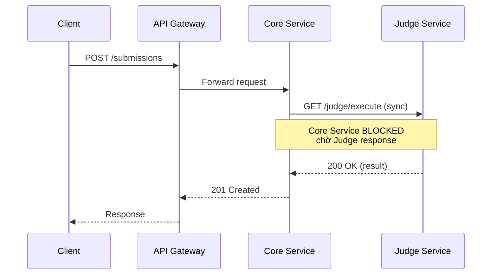
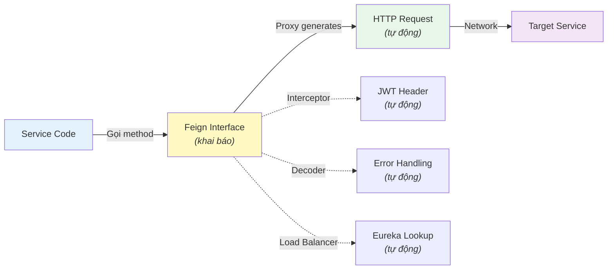
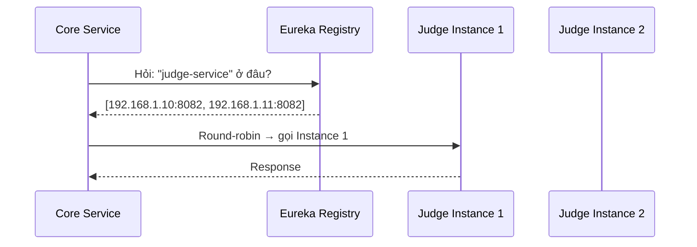
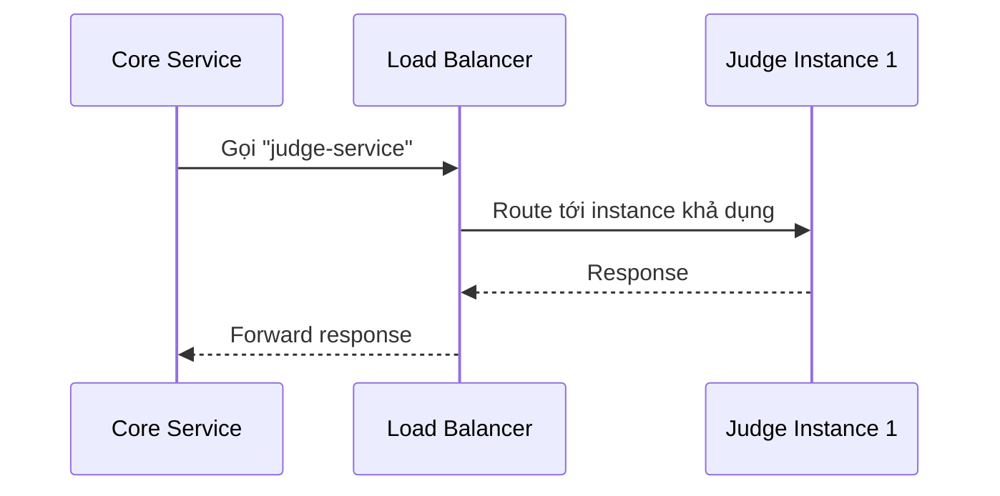
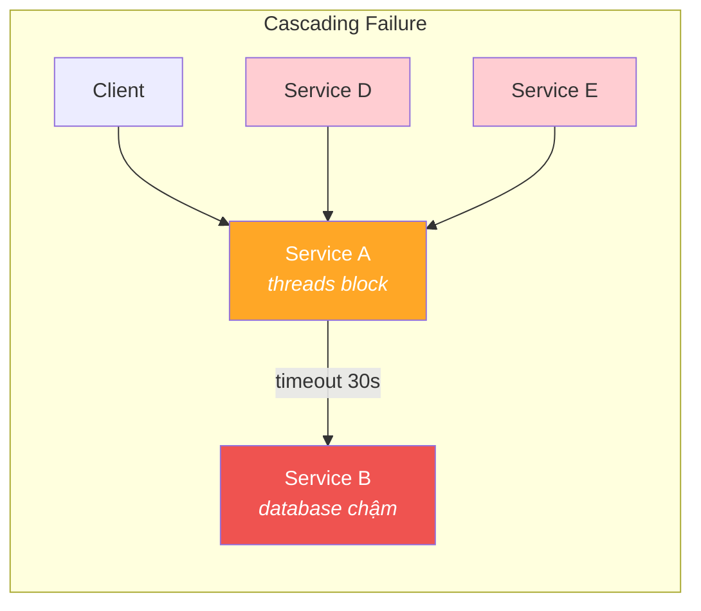
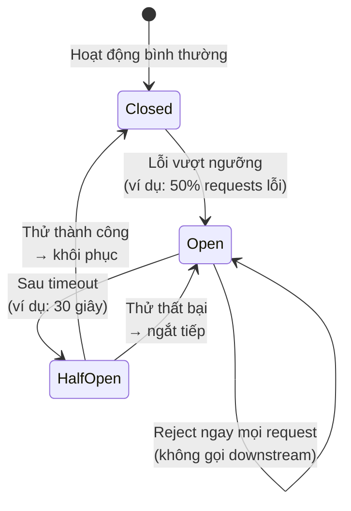
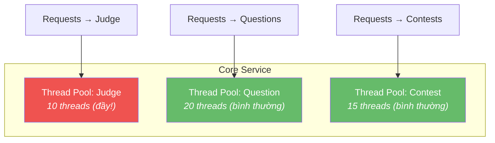
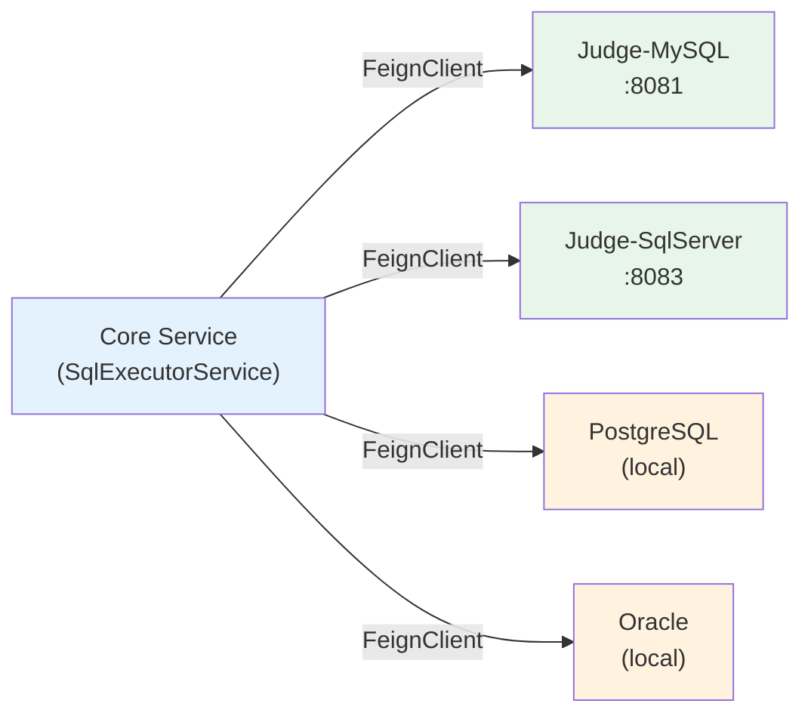
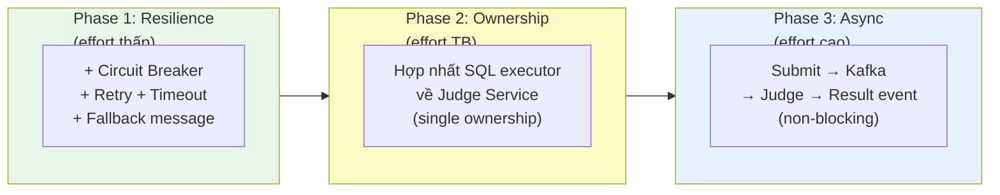

# Chương 4: Giao tiếp Đồng bộ — REST, gRPC & Resilience

> *"Microservices favor smart endpoints and dumb pipes. The communication infrastructure should be simple; intelligence belongs in the services."*
> — Sam Newman, *Building Microservices* [4a]

---

## Bạn sẽ học được gì

- Hiểu các kiểu tương tác (interaction styles) trong microservices
- So sánh REST và gRPC — khi nào dùng cái nào
- Sử dụng OpenFeign để gọi service-to-service một cách declarative
- Nắm vững Service Discovery và Load Balancing với Eureka
- Áp dụng các resilience patterns: Circuit Breaker, Retry, Timeout, Bulkhead
- Phân tích bài toán dispatch SQL đến 4 DBMS trong LMS

---

## 4.1 Giao tiếp đồng bộ — Khi nào nên, khi nào tránh?

### Request-Response: mô hình quen thuộc

Giao tiếp đồng bộ (*synchronous communication*) là mô hình quen thuộc nhất với hầu hết developer: service A gửi request đến service B, **chờ** response, rồi xử lý tiếp. HTTP/REST là protocol phổ biến nhất cho mô hình này.



### Ưu và nhược điểm

| | Ưu điểm | Nhược điểm |
|---|---------|-----------|
| **Đơn giản** | Model request-response quen thuộc, dễ debug | Caller bị **block** cho đến khi nhận response |
| **Nhất quán** | Biết ngay kết quả (thành công/thất bại) | **Temporal coupling**: cả hai service phải online cùng lúc |
| **Tooling** | HTTP tooling phong phú (Postman, curl, browser) | **Cascading failures**: service B down → A cũng down |
| **Tracing** | Request ID dễ trace qua chuỗi calls | **Latency accumulation**: A→B→C = tổng latency |

Richardson phân tích rõ trong [2a, Ch.3]: giao tiếp đồng bộ tạo **temporal coupling** (cả hai service phải sẵn sàng cùng lúc) và **runtime dependency** (service gọi không thể hoạt động nếu service được gọi down). Đây là lý do microservices thường ưu tiên async cho các flow không cần response ngay lập tức.

### Khi nào dùng sync?

Giao tiếp đồng bộ phù hợp khi:
- **Cần response ngay** — query data (GET), validation, authentication
- **Flow đơn giản** — chuỗi call ngắn (A→B), không phải chuỗi dài (A→B→C→D)
- **Read-heavy operations** — lấy thông tin, không phải thay đổi trạng thái phức tạp

Không phù hợp khi:
- **Long-running operations** — chấm bài SQL mất 5–30 giây
- **Fire-and-forget** — gửi notification, log event  
- **Cross-service transactions** — cần saga pattern (Chương 6)

> **💡 Tip — Quy tắc ngón tay cái**
>
> Nếu caller *phải biết* kết quả để xử lý tiếp → sync. Nếu caller chỉ cần *trigger* hành động và không cần kết quả ngay → async (Chương 5). Richardson trong [2a, Ch.3] minh họa rõ: gọi sync để *validate* (cần kết quả ngay), nhưng gửi async để *process* (không cần chờ). Trong LMS, query Judge health dùng sync, nhưng submit bài chấm dùng async (Kafka) — hai nhu cầu khác nhau.

### Interaction Styles — Phân loại kiểu tương tác

Richardson phân loại interaction styles theo hai chiều [2a, Ch.3]:

| | **One-to-one** | **One-to-many** |
|---|---|---|
| **Synchronous** | Request/Response | — |
| **Asynchronous** | Async request/response, One-way notification | Publish/Subscribe, Publish/Async responses |

Hầu hết service dùng kết hợp nhiều kiểu. Ví dụ: LMS Core Service dùng *request/response* (Feign) để query Judge, *publish/subscribe* (Kafka) để gửi submissions, và *one-way notification* (WebSocket) để push kết quả.

### REST vs gRPC — Hai lựa chọn cho sync

REST (HTTP/JSON) là lựa chọn phổ biến nhất, nhưng không phải duy nhất. **gRPC** — framework RPC mã nguồn mở của Google — là lựa chọn phổ biến thứ hai cho giao tiếp đồng bộ giữa microservices [2a, Ch.3].

| Tiêu chí | REST (HTTP/JSON) | gRPC (HTTP/2 + Protobuf) |
|----------|-----------------|------------------------|
| **Format** | JSON (text, human-readable) | Protocol Buffers (binary, compact) |
| **Performance** | Chậm hơn (text parsing) | Nhanh hơn 2-10x (binary + HTTP/2 multiplexing) |
| **Contract** | OpenAPI spec (optional) | `.proto` file (bắt buộc) |
| **Code gen** | Optional (OpenAPI generators) | Built-in (protoc generates client/server) |
| **Browser support** | Native | Cần gRPC-Web proxy |
| **Streaming** | Không native (phải dùng SSE/WebSocket) | Bi-directional streaming native |
| **Debugging** | Dễ (curl, Postman, browser) | Khó (cần gRPC tools) |

**Khi nào dùng gRPC thay REST?**
- **Internal service-to-service**: performance quan trọng, không cần browser → gRPC
- **Public API / Frontend**: cần browser support, human debugging → REST
- **Streaming**: cần real-time bi-directional → gRPC (hoặc WebSocket)
- **Polyglot**: team dùng nhiều ngôn ngữ → gRPC (code gen đa ngôn ngữ)

> **🔍 Phân tích gap — LMS chỉ dùng REST**
>
> Hệ thống LMS chỉ sử dụng REST/JSON cho mọi giao tiếp. Với flow chấm bài SQL — nơi Judge Service nhận request và trả kết quả nhanh — gRPC có thể giảm latency đáng kể nhờ binary encoding và HTTP/2 multiplexing. Tuy nhiên, migration sang gRPC đòi hỏi thay đổi cả client và server, nên đây là **cải thiện performance**, không phải **migration bắt buộc**. Ưu tiên thấp hơn so với thêm resilience patterns.

---

## 4.2 OpenFeign — Declarative REST Client

### Vấn đề: gọi service khác không đơn giản như gọi hàm

Trong monolith, gọi module khác là một dòng code: `judgeService.execute(request)`. Trong microservices, cùng logic đó trở thành: xây dựng HTTP request, serialize payload, gắn headers (JWT token), gửi qua network, xử lý response codes, deserialize result, handle timeout/error.

### OpenFeign: gọi REST như gọi hàm

**OpenFeign** (Spring Cloud OpenFeign) cho phép khai báo API call như một Java interface — framework tự động generate implementation:

```java
// ❌ Manual REST call — verbose, boilerplate
RestTemplate restTemplate = new RestTemplate();
HttpHeaders headers = new HttpHeaders();
headers.setBearerAuth(jwtToken);
HttpEntity<JudgeRequest> entity = new HttpEntity<>(request, headers);
ResponseEntity<JudgeResult> response = restTemplate.exchange(url, HttpMethod.POST, entity, JudgeResult.class);

// ✅ Declarative Feign client — clean, type-safe
@FeignClient(name = "judge-mysql", url = "${feign.judge-mysql.url}")
public interface MysqlClient {
    @PostMapping("/api/execute")
    JudgeResult execute(@RequestBody JudgeRequest request);   // Gọi như hàm bình thường!
}
```

### Cách hoạt động



Feign tự động xử lý: serialization/deserialization (JSON ↔ Java), header injection (JWT token qua `RequestInterceptor`), service discovery (Eureka lookup thay vì URL hardcoded), và error decoding (response code → exception).

---

## 4.3 Service Discovery & Load Balancing

### Vấn đề: URL cứng trong distributed system

Trong monolith, gọi module khác là gọi hàm — không cần biết "module ở đâu". Trong microservices, mỗi service là một process riêng, chạy trên host:port khác nhau. Câu hỏi: **service A tìm service B ở đâu?**

Cách đơn giản nhất: hardcode URL trong config. Nhưng khi service scale (3 instances của Judge Service), URL nào? Khi service di chuyển (deploy lên container mới), IP thay đổi — ai cập nhật?

### Service Discovery patterns

Có hai pattern chính [2a, Ch.3]:

**Client-side discovery** — Client (service gọi) tự query service registry để tìm danh sách instances, rồi tự load balance:



**Server-side discovery** — Load balancer (hoặc API Gateway) đứng giữa, client chỉ cần biết URL của load balancer:



### Netflix Eureka trong LMS

Hệ thống LMS sử dụng **Netflix Eureka** — client-side discovery pattern:

| Thành phần | Vai trò | Port |
|-----------|---------|------|
| `eureka-registry` | Service registry server | 9000 |
| Mỗi service | Eureka client (tự đăng ký) | — |
| Spring Cloud LoadBalancer | Client-side load balancing | — |

Khi microservice khởi động, nó đăng ký tại Eureka server với tên (`spring.application.name`) và địa chỉ. Gateway và các service khác query Eureka để tìm instances. Trong config Gateway: `uri: lb://core-service` nghĩa là tra cứu Eureka tìm tất cả instances có tên `core-service`, rồi load balance giữa chúng.

> **🔍 Phân tích gap — Service naming không nhất quán**
>
> Trong LMS, `core-service` và `assignment-service` đều dùng `spring.application.name = "app"` — vi phạm nguyên tắc unique service identity [2a]. Khi Eureka nhận hai services cùng tên, nó coi chúng là instances của *cùng một service* → routing sai. Đây là hậu quả của việc Assignment tách ra từ Core nhưng không đổi service name. **Migration path**: đổi thành `lms-core` và `lms-assignment`, cập nhật Eureka config và Gateway routes.

---

## 4.4 Resilience Patterns — Sống sót trong Distributed System

### Tại sao cần resilience?

Trong monolith, nếu database chậm, *toàn bộ* ứng dụng chậm — nhưng ít nhất lỗi rõ ràng. Trong microservices, khi service B chậm, service A *vẫn chạy* nhưng threads bị block chờ B → requests đến A cũng bị chậm → service C gọi A cũng bị chậm → **cascading failure** lan khắp hệ thống [5, Ch.7].

Hugo Rocha trong [5] nhấn mạnh: trong distributed system, *lỗi không phải ngoại lệ — lỗi là trạng thái bình thường*. Network sẽ timeout, services sẽ crash, databases sẽ chậm. Câu hỏi không phải "nếu lỗi xảy ra" mà là "khi lỗi xảy ra".



### Bốn resilience patterns cốt lõi

| Pattern | Nguyên lý | Tương tự | Ví dụ LMS |
|---------|-----------|----------|-----------|
| **Timeout** | Đặt giới hạn thời gian chờ. Không bao giờ chờ vô hạn | Hẹn giờ nấu ăn — không chờ vô hạn | Feign call timeout 3s cho Judge |
| **Retry** | Tự động thử lại khi gặp lỗi tạm thời | Gọi điện lại khi tín hiệu kém | Retry 3 lần với exponential backoff |
| **Circuit Breaker** | Ngắt mạch khi service downstream liên tục lỗi | Cầu dao điện — ngắt khi quá tải | Judge down → trả fallback message |
| **Bulkhead** | Cách ly resources theo service/function | Khoang tàu thủy — 1 khoang ngập, tàu không chìm | Thread pool riêng cho Judge vs Question |

#### Circuit Breaker — Chi tiết state machine



Khi circuit ở trạng thái **Open**, mọi request được reject *ngay lập tức* — không gửi tới service downstream. Điều này bảo vệ cả caller (không block threads) và callee (không bị overwhelm khi đang recovery).

#### Bulkhead — Cách ly resources



Tên "Bulkhead" lấy từ thiết kế tàu thủy: khoang tàu bị nước tràn vào, các khoang khác vẫn khô — tàu không chìm. Michael Nygard giới thiệu pattern này trong *Release It!* (2007) [5, Ch.7].

#### Lưu ý quan trọng cho Retry

**Chỉ retry idempotent operations** (GET, PUT, DELETE). Retry POST có thể tạo duplicate data. Richardson trong [2a, Ch.3] nhấn mạnh: retry token (idempotency key) là bắt buộc khi retry non-idempotent operations.

#### Kết hợp các patterns

Trong thực tế, các patterns thường kết hợp theo thứ tự:

```
Request → Timeout (3s) → Retry (3 lần, backoff) → Circuit Breaker → Bulkhead → Actual Call
```

Spring Cloud Circuit Breaker + Resilience4j là stack phổ biến nhất cho Java microservices. Chỉ cần thêm dependency và annotation — không cần viết logic retry/circuit breaker thủ công.

> **📐 Nguyên tắc — Design for Failure**
>
> "In distributed systems, failure is not an exception — it's a normal state. Design every inter-service call assuming it will fail. Timeout, Retry, Circuit Breaker, Bulkhead — these are not optional, they are prerequisites."
>
> *— Tổng hợp từ Hugo Rocha [5, Ch.7] và Michael Nygard, Release It!*

---

## 4.5 Case Study: SqlExecutorService — Dispatch SQL đến 4 DBMS

### Bài toán

Hệ thống LMS hỗ trợ sinh viên thực hành SQL trên 4 loại database: MySQL, SQL Server, PostgreSQL, Oracle. Mỗi DBMS chạy trong sandbox container riêng biệt. Khi sinh viên nộp bài, hệ thống cần:
1. Xác định DBMS nào (dựa vào câu hỏi)
2. Gửi SQL đến đúng sandbox service
3. So sánh kết quả với đáp án (SHA-256 hash)
4. Trả về kết quả

### Hiện trạng: Strategy Pattern + OpenFeign

LMS implement bài toán này bằng **Strategy Pattern** kết hợp OpenFeign:



Core Service chứa `SqlExecutorService` — nhận database type (dưới dạng UUID) và route request đến đúng sandbox qua Feign client. Logic dispatch đơn giản: `if-else` theo database type ID.

### Phân tích các vấn đề

| # | Vấn đề | Mô tả | Best Practice |
|---|--------|-------|---------------|
| 1 | **Code duplication** | `SqlExecutorService` tồn tại ở cả Core và Judge với logic gần giống nhau | Extract interface, single ownership [2a] |
| 2 | **Magic UUIDs** | Database type xác định bằng hardcoded UUIDs (`"11111111-..."` = MySQL) | Enum hoặc configuration-driven |
| 3 | **Không có resilience** | Không Circuit Breaker, không Retry, không Timeout config | Resilience4j stack |
| 4 | **Không có fallback** | Nếu MySQL sandbox down → lỗi trả về user ngay, không graceful degradation | Fallback message hoặc queue retry |
| 5 | **Mixed execution** | PostgreSQL/Oracle chạy local, MySQL/MSSQL gọi remote → inconsistent model | Tất cả qua Feign hoặc tất cả local |

### Đề xuất migration



- **Phase 1 — Thêm resilience** (ưu tiên cao, effort thấp): Thêm `@CircuitBreaker`, `@Retry`, `@TimeLimiter` cho Feign calls. Khi Judge sandbox down → trả fallback: "Sandbox đang bận, bài sẽ được chấm khi sẵn sàng"
- **Phase 2 — Hợp nhất SqlExecutorService** (effort trung bình): Chuyển toàn bộ execution logic sang Judge Service (single ownership). Core Service chỉ gửi request, không biết database type nào xử lý
- **Phase 3 — Chuyển sang async** (effort cao, giá trị lớn): Submit → Kafka → Judge → Result event → Core cập nhật. User không chờ đồng bộ — nhận notification khi có kết quả. Đây chính là pattern mà LMS đã bắt đầu implement (Chương 5)

> **📐 Nguyên tắc — Sync → Async là hành trình phổ biến**
>
> Nhiều hệ thống bắt đầu với sync (đơn giản, dễ debug) rồi chuyển sang async khi cần scale. Richardson trong [2a] minh họa hành trình này: bắt đầu với REST calls giữa services, sau đó chuyển sang Saga khi cần distributed transaction. LMS đang ở giữa hành trình: một số flow đã async (Kafka cho submission), một số vẫn sync (Feign cho query). Chương 5 sẽ tiếp tục phần async.

---

> **⚠️ Sai lầm thường gặp**
>
> 1. **Không đặt timeout cho inter-service calls** — Mặc định nhiều HTTP client chờ vô hạn (hoặc 30-60 giây). Hậu quả: khi service downstream chậm, threads caller bị block → cascading failure lan khắp hệ thống. *Phòng tránh*: luôn cấu hình timeout rõ ràng (Netflix chuẩn: 1-3 giây cho internal calls).
> 2. **Tin tưởng rằng network luôn reliable** — Viết code như thể mọi HTTP call đều thành công. Hậu quả: lỗi đầu tiên ở production mới phát hiện không có retry, không fallback. *Phòng tránh*: áp dụng resilience patterns từ đầu (Circuit Breaker + Retry + Timeout) — ngay cả khi chưa cần scale (§4.4).
> 3. **Retry mà không kiểm tra idempotency** — Retry POST requests tạo duplicate data (hai submissions cho cùng một lần nộp). Hậu quả: dữ liệu sai, user bị tính điểm trùng. *Phòng tránh*: chỉ retry idempotent operations (GET, PUT, DELETE), hoặc dùng idempotency key cho POST.

---

## Tổng kết

Giao tiếp đồng bộ là mô hình đơn giản nhất nhưng tiềm ẩn rủi ro lớn nhất trong distributed system. Temporal coupling, cascading failures, và latency accumulation là ba vấn đề cốt lõi mà developer phải đối mặt.

OpenFeign đơn giản hóa service-to-service calls thành Java interface declarations, loại bỏ boilerplate HTTP code. Service Discovery (Eureka) giải quyết bài toán "tìm service ở đâu" — một vấn đề không tồn tại trong monolith nhưng quan trọng sống còn trong microservices.

Resilience patterns — Timeout, Retry, Circuit Breaker, Bulkhead — không phải optional. Chúng là điều kiện tiên quyết để hệ thống microservices hoạt động ổn định trong production. Phân tích LMS cho thấy thiếu resilience patterns là gap nghiêm trọng nhất trong giao tiếp đồng bộ.

Ở Chương 5, chúng ta sẽ khám phá **giao tiếp bất đồng bộ** — giải pháp cho những giới hạn của sync: Apache Kafka, event-driven architecture, và cách LMS sử dụng messaging cho submission pipeline.

---

## Đọc thêm

**Sách tham khảo chính:**
1. [2a] Chris Richardson, *Microservices Patterns*, 1st Ed. — Ch.3: Interprocess Communication, Service Discovery
2. [4a] Sam Newman, *Building Microservices* — Ch.4: Integration, Smart Endpoints and Dumb Pipes
3. [5] Hugo Rocha, *Practical Event-Driven MS Architecture* — Ch.7: Resilience & Reliability

**Sách bổ trợ:**
4. [2b] Chris Richardson, *Microservices Patterns*, 2nd Ed. — Ch.3: Communication Patterns
5. Michael Nygard, *Release It!*, 2nd Ed. (2018) — Circuit Breaker, Bulkhead, Timeout patterns

**Nguồn trực tuyến:**
- [W3] Netflix Technology Blog — "Making the Netflix API More Resilient" (2011)
- Resilience4j documentation — resilience4j.readme.io
- Spring Cloud OpenFeign reference — docs.spring.io
