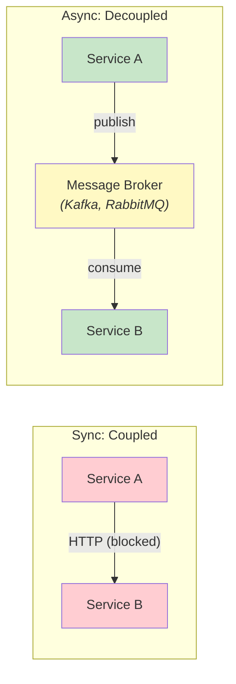
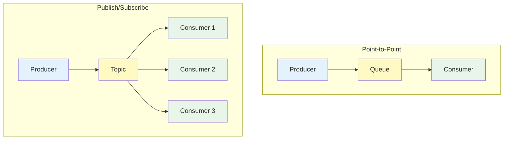
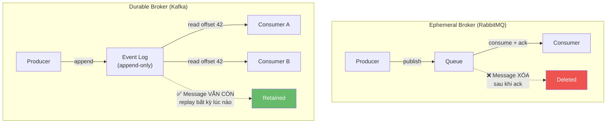
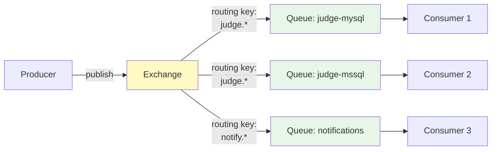
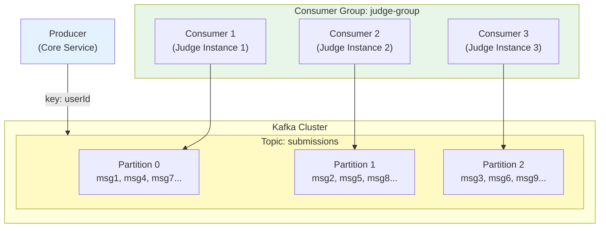
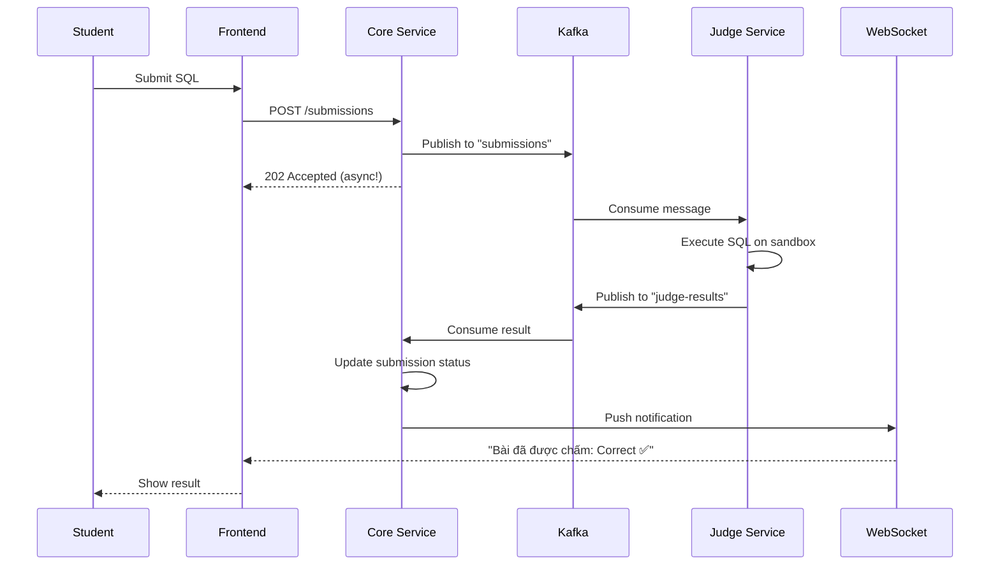
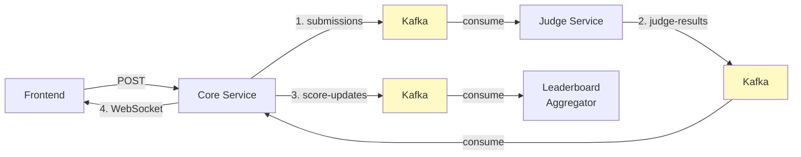

# Chương 5: Giao tiếp Bất đồng bộ — Kafka, Events & Messaging

> *"Event streams become the heart of data sharing throughout the company. Data no longer sits solely on a database accessible only through synchronous interfaces."*
> — Hugo Rocha, *Practical Event-Driven Microservices Architecture* [5]

---

## Bạn sẽ học được gì

- Hiểu tại sao async messaging giải quyết các giới hạn của giao tiếp đồng bộ
- Phân biệt hai loại message broker: durable (Kafka) vs ephemeral (RabbitMQ)
- Nắm vững kiến trúc Apache Kafka: topics, partitions, consumer groups
- Hiểu kiến trúc RabbitMQ: exchanges, queues, bindings
- Thiết kế event schema: 4 loại message (Command, Event, Document, Query)
- So sánh delivery guarantees: at-most-once, at-least-once, exactly-once
- Sử dụng WebSocket cho real-time notifications
- Phân tích Kafka pipeline trong hệ thống LMS

---

## 5.1 Tại sao cần Async? — Giới hạn của giao tiếp đồng bộ

### Vấn đề mà sync không giải quyết được

Chương 4 đã phân tích ba vấn đề cốt lõi của giao tiếp đồng bộ: temporal coupling, cascading failures, và latency accumulation. Giao tiếp bất đồng bộ (*asynchronous messaging*) giải quyết cả ba bằng cách **tách rời** (*decouple*) producer và consumer qua một trung gian — message broker.



| Vấn đề Sync | Giải pháp Async |
|-------------|----------------|
| **Temporal coupling** — cả hai service phải online | Producer gửi message xong tiếp tục, consumer xử lý khi sẵn sàng |
| **Cascading failure** — B down → A down | A vẫn gửi được vào broker, B xử lý khi recovery |
| **Latency** — A chờ B xử lý xong | A không chờ, user nhận kết quả qua notification/polling |

Richardson trong [2a, Ch.3] phân tích: async messaging cải thiện **availability** vì services không phụ thuộc lẫn nhau tại runtime. Tuy nhiên, đổi lại bằng **complexity** — eventual consistency, message ordering, duplicate handling — đây là chi phí không thể tránh.

### Messaging patterns

Có ba messaging patterns cơ bản [2a, Ch.3]:

**1. Point-to-point (Queue)** — Một message, một consumer. Phù hợp cho command: "hãy chấm bài này".

**2. Publish/Subscribe (Topic)** — Một message, nhiều consumers. Phù hợp cho event: "bài đã được chấm xong".

**3. Request/Async Response** — Gửi request qua messaging, nhận response qua message khác (có correlation ID). Kết hợp lợi ích của cả hai.



> **💡 Tip — Command vs Event**
>
> Phân biệt rõ **command** (yêu cầu hành động: "ChấmBài", "GửiEmail") và **event** (thông báo sự kiện đã xảy ra: "BàiĐãĐượcChấm", "ĐiểmĐãCậpNhật"). Commands thường point-to-point, events thường pub/sub. Sự phân biệt này ảnh hưởng đến thiết kế schema và error handling [5, Ch.8].

---

## 5.2 Message Broker — Hai trường phái thiết kế

### Durable vs Ephemeral Brokers

Rocha trong [5, §3.1.3] phân loại message brokers thành hai trường phái cơ bản dựa trên vòng đời của message:

**Ephemeral (tạm thời)** — Message bị xóa sau khi consumer acknowledge. Đại diện: **RabbitMQ**, ActiveMQ, Amazon SQS.

**Durable (bền vững)** — Message được lưu trữ trên disk và vẫn available sau khi consume. Đại diện: **Apache Kafka**, Apache Pulsar, Amazon Kinesis.



Sự khác biệt này **không chỉ là kỹ thuật** — nó ảnh hưởng đến cách thiết kế hệ thống. Durable brokers cho phép replay, event sourcing, và multiple consumers đọc cùng data. Ephemeral brokers tập trung vào smart routing, priority queues, và point-to-point communication.

### RabbitMQ — Smart Routing & Flexible Messaging

RabbitMQ dựa trên **AMQP** (Advanced Message Queuing Protocol), với kiến trúc phong phú hơn Kafka về routing:



| Concept RabbitMQ | Mô tả |
|-----------------|--------|
| **Exchange** | Nhận message và route đến queues theo rules |
| **Queue** | Lưu message chờ consumer (FIFO) |
| **Binding** | Rule kết nối exchange → queue (routing key, headers) |
| **Ack/Nack** | Consumer xác nhận đã xử lý (ack) hoặc từ chối (nack → requeue/dead letter) |
| **Exchange types** | Direct, Fanout, Topic, Headers — mỗi loại routing logic khác nhau |

RabbitMQ mạnh ở **smart routing**: một message có thể đến đúng queue dựa trên routing key, header matching, hoặc fanout tới tất cả queues. Kafka thì routing đơn giản (topic-based, key-based partitioning).

### So sánh toàn diện

| Tiêu chí | Apache Kafka | RabbitMQ |
|----------|-------------|----------|
| **Loại** | Durable — event log | Ephemeral — message queue |
| **Model** | Append-only log, consumers theo dõi offset | Queue FIFO, message xóa sau ack |
| **Throughput** | Rất cao (millions msg/sec) | Trung bình (tens of thousands/sec) |
| **Ordering** | Đảm bảo trong partition | Đảm bảo trong queue |
| **Replay** | ✅ Replay từ offset bất kỳ | ❌ Không thể replay |
| **Routing** | Đơn giản (topic + partition key) | Linh hoạt (4 loại exchange + routing keys) |
| **Priority** | ❌ Không hỗ trợ | ✅ Priority queues |
| **Delayed messages** | ❌ Không native | ✅ Delayed message exchange |
| **Protocol** | Custom binary protocol | AMQP, STOMP, MQTT |
| **Use case** | Event sourcing, stream processing, audit log, CDC | Task queues, delayed jobs, complex routing, RPC-over-messaging |

> **📐 Bài học thực tế — RabbitMQ trong production high-throughput**
>
> Rocha chia sẻ kinh nghiệm từ một e-commerce platform lớn [5, §3.1.3]: team đã dùng RabbitMQ nhiều năm trong production high-throughput. Vấn đề: khi message load peaks tích tụ, **toàn bộ cluster bị ảnh hưởng** — các service không liên quan cũng bị chậm. Nhìn lại, use case của họ (event streaming, high throughput) phù hợp với durable broker hơn. Bài học: **chọn broker phải dựa trên use case**, không phải quen thuộc.

### Khi nào dùng gì?

| Nhu cầu | Chọn |
|---------|------|
| Event sourcing, audit trail, replay | **Kafka** |
| High throughput (100K+ msg/sec) | **Kafka** |
| Stream processing (KStreams, ksqlDB) | **Kafka** |
| Task/job queues, background workers | **RabbitMQ** |
| Complex routing (headers, topic patterns) | **RabbitMQ** |
| Priority queues, delayed messages | **RabbitMQ** |
| Cả hai | Kafka cho event backbone + RabbitMQ cho task queues |

LMS chọn Kafka vì cần **replay** (chấm lại bài khi Judge đổi logic) và **high throughput** (contest với 500+ submissions/phút) [5, Ch.3].

---

## 5.3 Apache Kafka — Kiến trúc chi tiết



**Concepts cốt lõi:**

| Concept | Mô tả | Ví dụ LMS |
|---------|-------|-----------|
| **Topic** | Luồng message theo category | `submissions`, `judge-results`, `notifications` |
| **Partition** | Chia topic thành segments song song | 3 partitions cho `submissions` |
| **Consumer Group** | Nhóm consumers chia nhau partitions | `judge-group` — 3 Judge instances |
| **Offset** | Vị trí đọc của consumer trong partition | Consumer 1 đã đọc đến offset 42 |
| **Retention** | Thời gian giữ message | 7 ngày (default) hoặc vĩnh viễn |

**Partition key** quyết định message vào partition nào. Messages cùng key → cùng partition → **đảm bảo thứ tự**. Trong LMS, partition key = `userId` đảm bảo mọi submission của cùng sinh viên được xử lý theo thứ tự.

Kleppmann trong [7, Ch.11] giải thích: Kafka kết hợp ưu điểm của database (durable storage, replay) với ưu điểm của messaging (real-time, decoupling) — đây là mô hình **log-based messaging** khác biệt cơ bản với queue-based messaging.

---

## 5.4 Producer/Consumer Pattern trong LMS

### Kafka Producer

Trong LMS, submissions được gửi qua Kafka khi sinh viên nộp bài:

```java
// Producer: Core Service gửi submission vào Kafka
@Service
public class SubmitProducer extends BaseProducerService<SubmitMessage> {
    
    private static final String TOPIC = "submissions";
    
    public void sendSubmission(Submission submission) {
        SubmitMessage message = SubmitMessage.builder()
            .submissionId(submission.getId())
            .questionId(submission.getQuestionId())
            .userId(submission.getUserId())
            .sqlContent(submission.getSqlContent())
            .databaseType(submission.getDatabaseType())
            .build();
        
        // key = userId → đảm bảo ordering per user
        kafkaTemplate.send(TOPIC, submission.getUserId().toString(), message);
    }
}
```

### Kafka Consumer

Judge Service consume submissions và trả kết quả:

```java
// Consumer: Judge Service nhận và xử lý
@KafkaListener(
    topics = "submissions",
    groupId = "judge-group",
    containerFactory = "kafkaListenerContainerFactory"
)
public void processSubmission(SubmitMessage message) {
    JudgeResult result = sqlExecutorService.execute(message);
    
    // Gửi kết quả ngược lại qua topic khác
    resultProducer.send("judge-results", message.getSubmissionId(), result);
}
```

### Flow hoàn chỉnh



Lưu ý: response là **202 Accepted** (không phải 200 OK) — nghĩa là "request đã nhận, đang xử lý". User nhận kết quả qua WebSocket notification, không phải HTTP response.

> **🔍 Phân tích gap — Thiếu error handling trong Kafka pipeline**
>
> LMS hiện không xử lý message failures: nếu Judge Service crash giữa chừng, message bị mất (auto-commit offset trước khi xử lý xong). **Best practice** theo [2a, Ch.3]: dùng manual offset commit + dead letter topic cho messages thất bại. **Migration path**: (1) chuyển sang manual commit, (2) thêm `@RetryableTopic` với dead letter queue, (3) implement monitoring cho consumer lag.

---

## 5.5 Delivery Guarantees & Idempotency

### Ba cấp độ đảm bảo

Đây là một trong những khái niệm quan trọng nhất trong messaging — và cũng dễ bị hiểu sai nhất [7, Ch.11]:

| Guarantee | Mô tả | Hậu quả |
|-----------|-------|---------|
| **At-most-once** | Message được gửi tối đa 1 lần. Có thể mất. | Nhanh nhưng unreliable |
| **At-least-once** | Message được gửi ít nhất 1 lần. Có thể trùng. | Reliable nhưng cần idempotency |
| **Exactly-once** | Message được xử lý đúng 1 lần. | Lý tưởng nhưng rất khó/đắt |

Kleppmann trong [7, Ch.11] phân tích: **exactly-once semantics** trong thực tế là *effectively-once* — đạt được bằng cách kết hợp at-least-once delivery + idempotent processing. Kafka transactions (since 0.11) hỗ trợ exactly-once **trong Kafka** nhưng không across systems (Kafka → DB).

### Idempotency — Thiết kế to chịu được duplicate

Khi dùng at-least-once (phổ biến nhất), consumer *có thể* nhận cùng message nhiều lần. Code phải **idempotent** — xử lý nhiều lần cho cùng kết quả [5, Ch.8]:

```java
// ❌ Không idempotent — chấm trùng = điểm sai
@KafkaListener(topics = "submissions")
public void process(SubmitMessage msg) {
    JudgeResult result = judge(msg);
    submissionRepository.updateScore(msg.getSubmissionId(), result.getScore());
    // Nếu message trùng → score bị cộng dồn hoặc ghi đè không đúng state
}

// ✅ Idempotent — check trước khi xử lý
@KafkaListener(topics = "submissions")
public void process(SubmitMessage msg) {
    if (submissionRepository.isAlreadyJudged(msg.getSubmissionId())) {
        log.info("Submission {} already judged, skipping", msg.getSubmissionId());
        return; // Skip duplicate
    }
    JudgeResult result = judge(msg);
    submissionRepository.updateScore(msg.getSubmissionId(), result.getScore());
}
```

Rocha trong [5, Ch.8] nhấn mạnh quy tắc: **event consumption phải associative, commutative, và idempotent** — xử lý nhiều lần, theo thứ tự khác nhau, vẫn cho cùng kết quả.

---

## 5.6 Event Schema Design

### Cấu trúc một event

Rocha đề xuất mỗi event nên có ba phần [5, Ch.8]:

```json
{
  "metadata": {
    "eventId": "e7d3f2a1-...",
    "eventType": "SubmissionJudged",
    "version": "1.0",
    "timestamp": "2025-03-10T14:30:00Z",
    "source": "judge-service",
    "correlationId": "req-abc-123"
  },
  "payload": {
    "submissionId": "sub-456",
    "questionId": "q-789",
    "userId": "user-001",
    "result": "CORRECT",
    "executionTimeMs": 245
  }
}
```

| Phần | Mục đích | Fields quan trọng |
|------|---------|-------------------|
| **metadata** | Tracing, deduplication, versioning | `eventId` (cho idempotency), `correlationId` (cho tracing), `version` |
| **payload** | Business data | Domain-specific data |

### Bốn loại message

Rocha phân loại message thành 4 loại, mỗi loại có mục đích và naming convention riêng [5, §3.1.4]:

| Loại | Mô tả | Naming | Ví dụ LMS | Delivery |
|------|-------|--------|-----------|----------|
| **Command** | Yêu cầu thực hiện hành động — *có thể bị từ chối* | Verb imperative | `JudgeSubmission`, `SendNotification` | Point-to-point |
| **Event** | Thông báo sự kiện đã xảy ra — *sự thật, không thể reject* | Past participle | `SubmissionJudged`, `ContestStarted` | Pub/sub |
| **Document** | Snapshot toàn bộ entity khi thay đổi — *full state, không chỉ delta* | Noun | `SubmissionDocument`, `UserDocument` | Pub/sub |
| **Query** | Yêu cầu thông tin, không thay đổi state | Noun + request | Thường qua HTTP, không qua broker | Sync |

### Schema evolution

Tương tự API versioning (Ch.3), event schema cũng cần evolution strategy [7, Ch.4]:

- **Thêm field optional** → backward compatible ✅
- **Bỏ field** → breaking ❌ (consumer cũ vẫn expect)
- **Đổi field type** → breaking ❌

Best practice: sử dụng **Schema Registry** (Confluent Schema Registry, AWS Glue) để quản lý compatibility tự động. Mỗi schema change được validate trước khi publish.

> **🔍 Phân tích gap — LMS thiếu event schema chuẩn**
>
> Messages trong LMS là plain Java objects (POJOs) serialize bằng JSON — không có metadata (eventId, timestamp, correlationId), không có schema registry, không có version. Khi Judge Service đổi format message, Core Service crash nếu chưa update. **Migration path**: (1) thêm metadata wrapper cho tất cả Kafka messages, (2) sử dụng `eventId` cho idempotency checks, (3) cân nhắc Avro + Schema Registry khi team mở rộng.

---

## 5.7 WebSocket — Real-time Notifications

### Bài toán

Sau khi Judge Service chấm xong, kết quả cần đến tay sinh viên. Có ba cách:

| Cách | Mô tả | Nhược điểm |
|------|-------|-----------|
| **Polling** | Client hỏi server mỗi X giây | Lãng phí bandwidth, delay |
| **Long polling** | Client giữ connection, server trả khi có data | Phức tạp, scaling khó |
| **WebSocket** | Full-duplex connection, server push real-time | Cần maintain connection state |

LMS sử dụng **STOMP over SockJS** — WebSocket protocol dựa trên Spring WebSocket:

```java
// Server-side: push kết quả chấm bài
@Service
public class NotificationService {
    private final SimpMessagingTemplate messagingTemplate;
    
    public void notifyJudgeResult(UUID userId, JudgeResult result) {
        messagingTemplate.convertAndSendToUser(
            userId.toString(),
            "/queue/notifications",
            new JudgeNotification(result)
        );
    }
}
```

```javascript
// Client-side: subscribe nhận kết quả
const stompClient = new StompJs.Client({
    brokerURL: 'ws://localhost:8080/ws'
});

stompClient.onConnect = () => {
    stompClient.subscribe('/user/queue/notifications', (message) => {
        const result = JSON.parse(message.body);
        showNotification(`Kết quả: ${result.status} ✅`);
    });
};
```

WebSocket phù hợp cho **notification cuối pipeline** (kết quả chấm bài, cập nhật leaderboard trong contest) nhưng không thay thế Kafka cho **inter-service messaging** — hai vai trò khác nhau.

---

## 5.8 Case Study: Kafka Pipeline trong Contest Mode

### Bài toán Contest

Trong Contest mode, 100+ sinh viên đồng thời nộp bài trong thời gian giới hạn (60–120 phút). Yêu cầu:
- High throughput: xử lý hàng trăm submissions/phút
- Fair ordering: submission nộp trước được chấm trước (per user)
- Real-time feedback: sinh viên thấy kết quả ngay
- Leaderboard update: bảng xếp hạng cập nhật liên tục

### Kiến trúc 4-topic pipeline



| Topic | Producer | Consumer | Message | Key |
|-------|----------|----------|---------|-----|
| `submissions` | Core Service | Judge Service | SQL + metadata | `userId` |
| `judge-results` | Judge Service | Core Service | Result + timing | `submissionId` |
| `score-updates` | Core Service | Leaderboard Aggregator | Score change | `contestId` |
| (WebSocket) | Core Service | Frontend | Notification | `userId` |

### Phân tích các vấn đề

| # | Vấn đề | Hiện trạng | Best Practice [2a] |
|---|--------|-----------|--------------------------|
| 1 | **Auto-commit offset** | Commit trước khi xử lý xong → message loss | Manual commit sau khi xử lý thành công |
| 2 | **Không có DLT** | Failed messages bị retry vô hạn hoặc mất | Dead Letter Topic cho messages lỗi |
| 3 | **Không idempotent** | Duplicate có thể tạo kết quả sai | Check `submissionId` trước khi judge |
| 4 | **Thiếu monitoring** | Không biết consumer lag | Kafka consumer lag metrics + alerting |
| 5 | **Single partition** | Tất cả submissions vào 1 partition → bottleneck | Tăng partitions, key = `userId` |

### Đề xuất migration

**Phase 1 — Reliability** (ưu tiên cao):
- Manual offset commit + `@RetryableTopic` (3 retries) + Dead Letter Topic
- Idempotency check bằng `submissionId`

**Phase 2 — Observability** (ưu tiên cao):
- Kafka consumer lag monitoring (Kafka Exporter + Prometheus)
- `correlationId` xuyên suốt pipeline (submission → judge → result → notification)

**Phase 3 — Performance** (khi cần scale):
- Tăng partitions cho `submissions` topic (từ 1 → 3+)
- Thêm Judge instances vào consumer group

---

## Tổng kết

Giao tiếp bất đồng bộ giải quyết ba giới hạn cốt lõi của sync: temporal coupling, cascading failures, và latency. Hai trường phái message broker — durable (Kafka) và ephemeral (RabbitMQ) — phục vụ use case khác nhau, và nhiều hệ thống dùng cả hai.

Kafka với mô hình event log (durable, replayable, high-throughput) trở thành nền tảng phổ biến nhất cho event-driven architecture. RabbitMQ với smart routing và flexible messaging phù hợp cho task queues, delayed jobs, và complex routing patterns. Partitions, consumer groups, và exchange types cho phép mỗi broker scale theo cách riêng.

Delivery guarantees (at-most/at-least/exactly-once) và idempotency là hai khái niệm không thể tách rời. Thiết kế event schema chuẩn — với metadata, versioning, và correlation — là đầu tư cần thiết cho hệ thống dễ debug và dễ evolve.

Phân tích LMS cho thấy pipeline Kafka hoạt động nhưng thiếu nhiều best practice quan trọng: error handling, idempotency, monitoring. Đây là technical debt phổ biến khi team nhỏ ưu tiên tính năng trước reliability.

Ở Chương 6, chúng ta sẽ đối mặt với bài toán khó nhất của distributed systems: **distributed transactions**. Khi data nằm ở nhiều service khác nhau, làm thế nào để đảm bảo consistency? Saga pattern sẽ là câu trả lời.

---

## Đọc thêm

**Sách tham khảo chính:**
1. [5] Hugo Rocha, *Practical Event-Driven MS Architecture* — Ch.1: Why EDA; Ch.3: Kafka; Ch.8: Event Schema Design
2. [2a] Chris Richardson, *Microservices Patterns*, 1st Ed. — Ch.3: Async Messaging, Transactional Outbox
3. [7] Martin Kleppmann, *Designing Data-Intensive Applications* — Ch.11: Stream Processing, Event Logs

**Sách bổ trợ:**
4. [3] Mitra & Nadareishvili, *Microservices: Up and Running* — Ch.4: Event-Driven Communication

**Nguồn trực tuyến:**
- Apache Kafka documentation — kafka.apache.org/documentation
- Confluent Schema Registry — docs.confluent.io/platform/current/schema-registry
- Spring Kafka reference — docs.spring.io/spring-kafka
