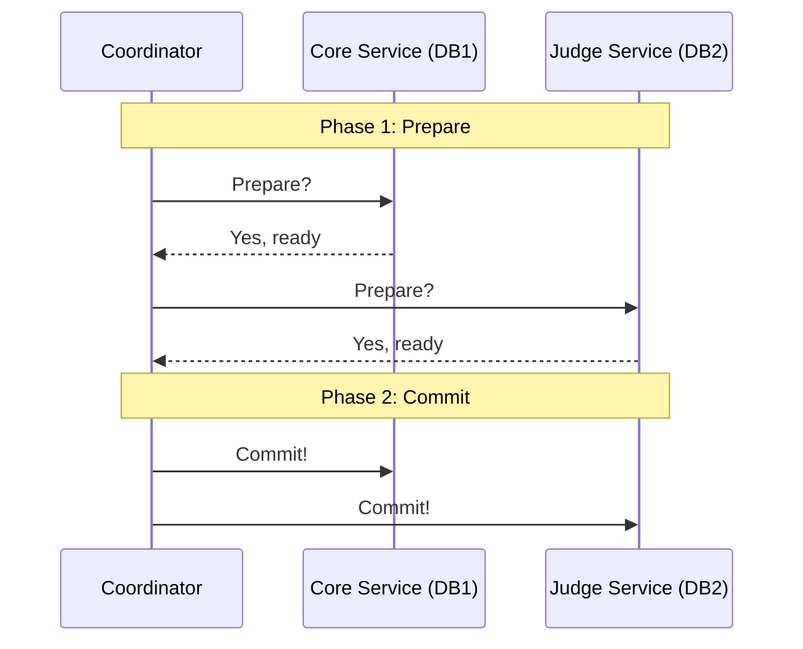
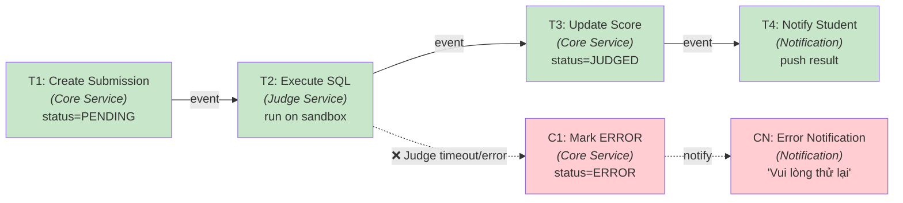
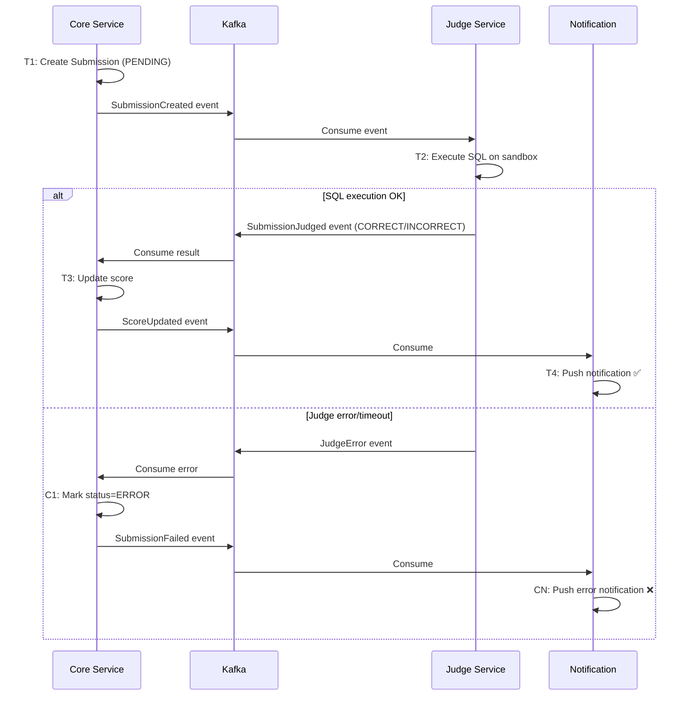
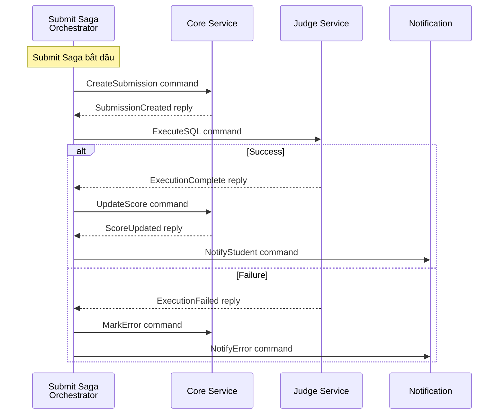
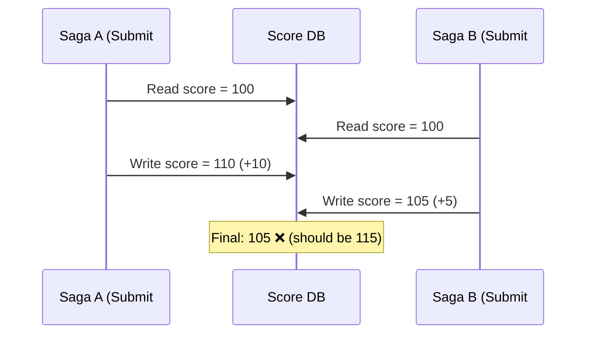
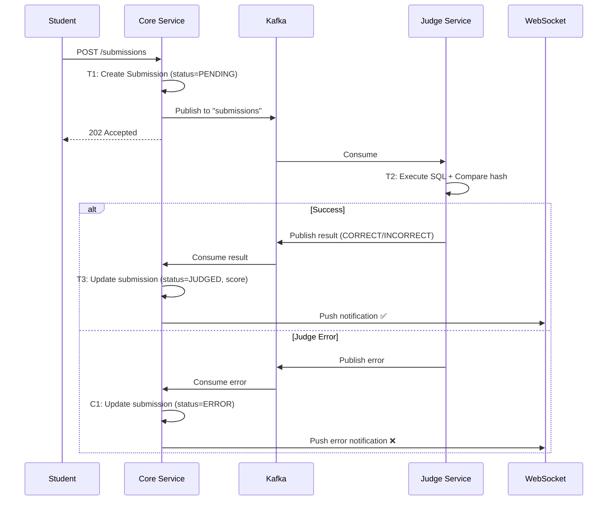

# Chương 6: Giao dịch Phân tán — Saga Pattern

> *"A saga is a sequence of local transactions. Each local transaction updates the database and publishes a message or event to trigger the next local transaction in the saga."*
> — Chris Richardson, *Microservices Patterns* [2a]

---

## Bạn sẽ học được gì

- Hiểu tại sao distributed transactions (2PC) không phù hợp với microservices
- Nắm vững Saga pattern: định nghĩa, cấu trúc, và compensating transactions
- So sánh hai coordination mechanisms: Choreography vs Orchestration
- Áp dụng countermeasures để xử lý thiếu isolation giữa sagas
- Hiểu eventual consistency và cách quản lý từ góc nhìn business
- Phân tích submit flow trong LMS — implicit saga và migration path

---

## 6.1 Vấn đề: Distributed Transactions

### Khi một transaction span nhiều services

Trong monolith LMS, khi sinh viên nộp bài SQL, toàn bộ flow nằm trong một database transaction:

**Listing 6.1:** Monolith transaction — ACID đảm bảo tất cả thành công hoặc rollback

```sql
BEGIN TRANSACTION;
  INSERT INTO submissions (id, user_id, sql_content) VALUES (...);
  INSERT INTO judge_queue (submission_id, status) VALUES (..., 'PENDING');
  UPDATE user_stats SET total_submissions = total_submissions + 1 WHERE user_id = ...;
COMMIT;
-- Tất cả thành công hoặc tất cả rollback — ACID đảm bảo
```

Khi LMS chuyển sang microservices, data nằm ở nhiều service/database khác nhau: Core Service quản lý submissions (database A), Judge Service quản lý execution (database B), Notification Service quản lý alerts. Không có "shared transaction" giữa chúng — database A không biết database B có commit thành công hay không.

### Tại sao 2PC không phù hợp?

**Two-Phase Commit (2PC)** là cơ chế truyền thống để distributed transactions [7, Ch.9]:



*Hình 6.1: Two-Phase Commit — Coordinator điều phối prepare và commit*

Richardson trong [2a, Ch.4] liệt kê lý do 2PC (XA transactions) không phù hợp cho microservices:

**Bảng 6.1:** Tại sao 2PC không phù hợp với microservices

| Vấn đề | Mô tả | Ảnh hưởng đến LMS |
|--------|-------|-------------------|
| **Synchronous blocking** | Tất cả participants bị lock cho đến khi commit | Judge Service xử lý SQL 5-30s → Core Service lock toàn bộ thời gian đó |
| **Single point of failure** | Coordinator crash → tất cả participants stuck | Nếu coordinator down khi Judge đang chạy → submission stuck |
| **Reduced availability** | Tất cả services phải online cùng lúc | Judge MySQL down → không submit được bất kỳ DBMS nào |
| **NoSQL incompatible** | Nhiều database không hỗ trợ XA | Kafka (backbone messaging của LMS) không hỗ trợ XA |
| **Performance** | Lock giữ lâu → contention cao | 500+ submissions/phút trong contest mode → bottleneck nghiêm trọng |

Kleppmann trong [7, Ch.9] bổ sung: 2PC là "blocking protocol" — nếu coordinator crash sau phase 1, participants phải chờ vô hạn. Trong production với contest mode real-time, đây là rủi ro không chấp nhận được.

> **💡 Tip — Tư duy compensation thay vì locking**
>
> Nghĩ về quy trình nộp bài thực tế: sinh viên nộp SQL → hệ thống nhận bài → Judge chấm → trả kết quả. Nếu Judge gặp lỗi, chúng ta không "undo" việc nhận bài — ta *cập nhật trạng thái* thành ERROR và thông báo sinh viên thử lại. Đây chính là tư duy compensation — hành động nghiệp vụ ngược thay vì database rollback. Richardson ghi nhận: "Not even Starbucks uses two-phase commit" [2a, Ch.4].

---

## 6.2 Saga Pattern — Chuỗi Local Transactions + Compensation

### Định nghĩa

Saga là chuỗi **local transactions**, mỗi transaction cập nhật database của một service và publish event/message để trigger transaction tiếp theo. Nếu một transaction thất bại, saga thực hiện **compensating transactions** để undo các thay đổi trước đó [2a, Ch.4].

### LMS Submit Saga

Áp dụng cho flow nộp bài SQL trong LMS:



*Hình 6.2: LMS Submit Saga — chuỗi local transactions và compensating transactions*

Richardson trong [2a, Ch.4] minh họa saga pattern với 4 participants và credit card authorization làm pivot transaction. Trong LMS, saga đơn giản hơn (2-3 participants) nhưng phức tạp ở chỗ Judge execution là **long-running** (5-30 giây) — thách thức đặc thù của bài toán chấm bài tự động.

### Ba loại transactions trong saga

Richardson phân loại mỗi step trong saga thành ba loại [2a, Ch.4]. Áp dụng cho LMS Submit Saga:

**Bảng 6.2:** Ba loại transactions trong saga — áp dụng cho LMS Submit Saga

| Loại | Mô tả | Có compensation? | Ví dụ trong LMS |
|------|-------|-------------------|-----------------|
| **Compensatable** | Có thể bị undo bởi compensating transaction | ✅ Có | T1: Create Submission (→ C1: Mark ERROR) |
| **Pivot** | Điểm quyết định go/no-go — sau đây saga *cam kết* hoàn thành | ❌ Không cần | T2: Execute SQL (pass/fail) |
| **Retriable** | Bước sau pivot — *phải* thành công (retry cho đến khi xong) | ❌ Không cần | T3: Update Score, T4: Notify Student |

Cấu trúc saga luôn là: **Compensatable → Pivot → Retriable**. Sau khi T2 (Execute SQL) thành công, saga *cam kết hoàn thành* — T3 và T4 sẽ được retry nếu thất bại, không cần compensation.

---

## 6.3 Choreography vs Orchestration

### Choreography — Phi tập trung, event-driven

Trong choreography, **không có coordinator**. Mỗi service lắng nghe events và tự quyết định hành động tiếp theo [5, §4.2]. Đây là cách LMS hiện đang hoạt động:



*Hình 6.3: Choreography — các service tự phối hợp qua events*

**Bảng 6.3:** Ưu và nhược điểm của Choreography

| Ưu điểm | Nhược điểm |
|---------|-----------|
| **Đơn giản**: không cần thêm service orchestrator | **Khó theo dõi**: logic phân tán, không ai biết "saga ở bước nào" |
| **Loosely coupled**: services không biết nhau, chỉ biết events | **Cyclic dependencies**: rủi ro event loops (A → B → A) |
| **Dễ thêm participants**: subscribe event mới là xong | **Testing khó**: test flow đầy đủ cần tất cả services chạy |

### Orchestration — Tập trung, commanding

Trong orchestration, **saga orchestrator** điều phối toàn bộ flow, gửi commands và nhận replies [2a, Ch.4]. Nếu LMS dùng orchestration cho Submit Saga:



*Hình 6.4: Orchestration — saga orchestrator điều phối toàn bộ flow*

**Bảng 6.4:** Ưu và nhược điểm của Orchestration

| Ưu điểm | Nhược điểm |
|---------|-----------|
| **Dễ hiểu**: logic tập trung, biết saga đang ở bước nào | **Centralization risk**: orchestrator là component thêm cần maintain |
| **Không cyclic**: dependencies luôn orchestrator → service | **Thêm complexity**: cần build orchestrator service |
| **Dễ test**: mock orchestrator, test từng step riêng lẻ | **Smart orchestrator risk**: logic business có thể "leak" vào orchestrator |

### Khi nào dùng gì?

Rocha trong [5, §4.4] đề xuất kết hợp cả hai — và đây là cách tiếp cận thực tế nhất:

**Bảng 6.5:** Choreography vs Orchestration — khi nào dùng gì

| Scenario | Recommendation | LMS context |
|----------|---------------|-------------|
| Saga đơn giản (2-3 steps) | **Choreography** | Submit flow hiện tại (3 steps) |
| Saga phức tạp (4+ steps, branching) | **Orchestration** | Nếu thêm plagiarism check + rubric grading |
| Cross-bounded context | **Choreography** giữa contexts | Core ↔ Judge (khác bounded context) |
| Team chưa quen EDA | **Orchestration** — dễ debug hơn | Phù hợp nếu team mở rộng |

> **📐 Nguyên tắc — LMS nên giữ choreography hay chuyển orchestration?**
>
> Với submit flow hiện tại (3 steps, 2 services), **choreography là đủ** — thêm orchestrator sẽ over-engineering. Tuy nhiên, nếu tương lai submit flow mở rộng (thêm plagiarism detection service, thêm grading rubric service, thêm analytics service), orchestration trở nên cần thiết. Đây là quyết định kiến trúc mở — ghi nhận để revisit khi requirements thay đổi.

---

## 6.4 Compensating Transactions & Isolation

### Thiết kế compensation trong LMS

Compensation không phải "undo" — nó là **hành động nghiệp vụ ngược** [2a, Ch.4]. Trong ngữ cảnh LMS:

**Bảng 6.6:** Thiết kế compensation trong LMS

| Forward Transaction | Compensation | Lưu ý |
|-------------------|-------------|-------|
| T1: Create Submission (PENDING) | C1: Mark ERROR | Không DELETE submission — đổi status |
| T2: Execute SQL | (Pivot — không cần compensation) | Judge tự cleanup sandbox |
| T3: Update Score | C3: Revert Score | Trừ lại score nếu đã cộng |
| T4: Send Notification | C4: Send Correction Notification | Không thể "un-send" — gửi correction |

**Nguyên tắc**: compensation phải **idempotent** — gọi nhiều lần cho cùng kết quả. Trong LMS: gọi `markError(submissionId)` nhiều lần chỉ set status=ERROR một lần — không side effect.

### Vấn đề isolation — Anomalies

Saga không có isolation (chữ I trong ACID). Trong database truyền thống, transactions chạy đồng thời nhưng cách ly bởi isolation levels (READ COMMITTED, SERIALIZABLE). Saga không có cơ chế tương đương — kết quả trung gian của saga *có thể nhìn thấy* bởi sagas khác. Richardson trong [2a, Ch.4] gọi đây là **lack of isolation** — vấn đề nghiêm trọng nhất của Saga pattern.

Ba anomalies chính:

**1. Lost Updates** — Saga A ghi đè kết quả mà Saga B đã viết, mà không biết Saga B đã thay đổi data.



*Hình 6.5: Lost Updates anomaly — hai saga ghi đè kết quả của nhau*

Ví dụ LMS: hai submissions của cùng user — submission A (score +10) và B (score +5) xử lý đồng thời. Cả hai đọc score=100, A set 110, B set 105. Score đúng phải là 115 nhưng chỉ là 105 — update của A bị mất.

**2. Dirty Reads** — Saga A đọc data mà Saga B đã ghi nhưng chưa hoàn thành (có thể sẽ rollback).

Ví dụ LMS: Saga B bắt đầu judging submission → update score tạm. Leaderboard (Saga A) đọc score mới. Saga B gặp lỗi → compensate, revert score. Nhưng leaderboard đã hiển thị score sai → user confused.

**3. Non-repeatable/Fuzzy Reads** — Data thay đổi giữa hai lần read trong cùng saga.

Ví dụ LMS: Contest ranking thay đổi giữa lúc user mở bảng xếp hạng và lúc submit — user thấy mình đứng hạng 3, nhưng khi kết quả trả về, rankings đã thay đổi vì saga khác hoàn thành.

> **📐 Nguyên tắc — ACD thay vì ACID**
>
> Richardson trong [2a, Ch.4] chỉ ra: Sagas chỉ đảm bảo **ACD** (Atomicity, Consistency, Durability) — *không có Isolation*. Atomicity đạt được nhờ compensating transactions (rollback logic). Consistency bảo toàn bởi business rules trong mỗi local transaction. Durability do mỗi database đảm bảo. Nhưng Isolation phải được xử lý riêng — bằng **countermeasures**.

### Countermeasures

Richardson đề xuất các countermeasures [2a, Ch.4], áp dụng cho LMS:

**1. Semantic Lock** — Đặt cờ "đang xử lý" trên record, ngăn saga khác đọc/ghi data chưa final:

**Listing 6.2:** Semantic Lock — đặt cờ "JUDGING" ngăn thao tác trên data chưa final

```java
// Khi saga bắt đầu — không cho phép re-submit cùng câu hỏi
submission.setStatus(SubmissionStatus.JUDGING); // semantic lock
submissionRepository.save(submission);

// Service khác kiểm tra trước khi đọc score
if (submission.getStatus() == SubmissionStatus.JUDGING) {
    // Score chưa final — hiện "Đang chấm..." trên leaderboard
}

// Khi saga hoàn thành — release lock
submission.setStatus(SubmissionStatus.JUDGED);  // release
submissionRepository.save(submission);
```

**2. Commutative Updates** — Thiết kế updates không phụ thuộc thứ tự — giải quyết **lost updates**:

**Listing 6.3:** Commutative Updates — delta thay vì absolute value

```java
// ❌ Không commutative: set absolute value — thứ tự quan trọng
user.setTotalScore(150);

// ✅ Commutative: delta update — thứ tự không quan trọng
user.incrementScore(+10);  // submission A correct
user.incrementScore(+5);   // submission B correct
// Kết quả giống nhau dù A trước B hay B trước A
```

**3. Pessimistic View** — Sắp xếp saga steps để giảm dirty reads: đặt retriable steps (update score, send notification) *sau* pivot transaction (execute SQL). LMS đã tự nhiên tuân thủ — score chỉ update sau khi Judge xong.

**4. Re-read Value** — Đọc lại data trước khi quyết định (tương tự optimistic locking) — giải quyết **non-repeatable reads**:

**Listing 6.4:** Re-read Value — kiểm tra lại trước khi quyết định

```java
// Trước khi update score, kiểm tra submission chưa bị cancel
Submission fresh = submissionRepository.findById(submissionId);
if (fresh.getStatus() == SubmissionStatus.CANCELLED) {
    return; // User đã cancel — không update score
}
```

**5. Version File** — Ghi lại thứ tự operations, reorder nếu cần. Ví dụ: nếu Saga A và B đều update score, Version File ghi `[A:+10, B:+5]` — xử lý tuần tự thay vì đồng thời. Trong LMS, Kafka topic `score-updates` tự nhiên là Version File: messages xử lý theo thứ tự partition.

### Tổng hợp: Anomaly → Countermeasure

**Bảng 6.7:** Anomaly → Countermeasure — áp dụng cho LMS

| Anomaly | Countermeasure phù hợp | Áp dụng LMS |
|---------|----------------------|-------------|
| **Lost updates** | Commutative updates, Version File | `incrementScore(+delta)` thay vì `setScore(value)` |
| **Dirty reads** | Semantic lock, Pessimistic view | `JUDGING` status flag ngăn đọc score chưa final |
| **Non-repeatable reads** | Re-read value | Check `status != CANCELLED` trước khi commit |

---

## 6.5 Eventual Consistency — Chấp nhận và quản lý

### Từ ACID đến BASE

Microservices chuyển từ ACID sang **BASE** [7, Ch.9]:

**Bảng 6.8:** ACID (Monolith) vs BASE (Microservices)

| | ACID (Monolith LMS) | BASE (Microservices LMS) |
|---|----------------|---------------------|
| **A** | Atomic — submit + judge + score = all or nothing | **B**asically **A**vailable — system luôn nhận submission |
| **C** | Consistent — score luôn đúng tại mọi thời điểm | **S**oft state — score có thể tạm thời chưa cập nhật |
| **I** | Isolated — hai submissions không thấy nhau | **E**ventual consistency — leaderboard *cuối cùng* sẽ đúng |
| **D** | Durable — committed = persistent | (Same) |

### Consistency window trong LMS

> **📐 Nguyên tắc — Consistency Window**
>
> Rocha trong [5, Ch.5] định nghĩa **consistency window**: khoảng thời gian từ khi event xảy ra đến khi tất cả services phản ánh trạng thái mới nhất. Mục tiêu: giữ consistency window **đủ nhỏ** để user không nhận thấy.

Trong LMS: sau khi sinh viên nộp bài, có consistency window 1–30 giây trước khi kết quả xuất hiện (tùy complexity của SQL). Trong thời gian đó:
- `submission.status = JUDGING` (semantic lock)
- Leaderboard hiện score cũ (chưa cập nhật)
- UI hiện "Đang chấm..." — user chấp nhận được

### Strategies cho UI và business

**Bảng 6.9:** Strategies cho UI khi chấp nhận eventual consistency

| Strategy | Mô tả | Cách LMS implement |
|----------|-------|---------------------|
| **Optimistic UI** | Hiện trạng thái "sẽ thành công" trước khi xong | "Bài đã gửi thành công" (dù chưa chấm xong) |
| **Push notification** | Cập nhật UI khi có kết quả | WebSocket push: "Kết quả: Correct ✅" |
| **Compensation notification** | Thông báo nếu phải rollback | "Bài không chấm được, vui lòng thử lại" |
| **Progress indicator** | Hiện trạng thái từng bước | "Đang chấm..." → "Đang so sánh kết quả..." → "Hoàn thành" |

---

## 6.6 Case Study: Submit Flow trong LMS — Implicit Saga

### Hiện trạng: Implicit Saga (Choreography)

Hệ thống LMS hiện tại có một implicit saga — choreography qua Kafka events, nhưng KHÔNG được định nghĩa rõ ràng như saga:



*Hình 6.6: Implicit Saga trong LMS — choreography qua Kafka events*

Richardson trong [2a, Ch.4] mô tả saga pattern với explicit orchestrator, state machine rõ ràng, và compensation cho từng step. LMS flow đơn giản hơn (3 steps) nhưng thiếu các safety mechanisms cần thiết: không có explicit saga definition, không có compensation, không có timeout.

### Phân tích các vấn đề

**Bảng 6.10:** Phân tích vấn đề Submit Flow trong LMS

| # | Vấn đề | Hiện trạng LMS | Best Practice [2a, Ch.4] |
|---|--------|---------------|--------------------------|
| 1 | **Implicit saga** | Flow phân tán trong code, không có saga definition | Explicit saga class với state machine |
| 2 | **Không compensation** | Judge crash → submission PENDING vĩnh viễn | Timeout-based compensation: PENDING > 5 min → ERROR |
| 3 | **Không semantic lock** | User có thể submit lại khi đang judging | Status JUDGING block re-submission cùng câu hỏi |
| 4 | **Không saga tracking** | Không biết saga ở bước nào | Status tracking: PENDING → JUDGING → JUDGED/ERROR/TIMEOUT |
| 5 | **Không timeout** | Judge không response → PENDING mãi | Scheduled job check + timeout compensation |

### Đề xuất migration

**Phase 1 — Semantic Lock + Timeout** (ưu tiên cao, effort thấp):
**Listing 6.5:** Semantic Lock + Timeout compensation cho submissions

```java
// Khi nhận submission — semantic lock
submission.setStatus(SubmissionStatus.JUDGING);
submission.setJudgeStartedAt(Instant.now());
submissionRepository.save(submission);

// Scheduled job kiểm tra timeout
@Scheduled(fixedRate = 60000)
public void checkSubmissionTimeouts() {
    List<Submission> stuck = submissionRepository
        .findByStatusAndJudgeStartedAtBefore(
            SubmissionStatus.JUDGING,
            Instant.now().minus(5, ChronoUnit.MINUTES)
        );
    stuck.forEach(s -> {
        s.setStatus(SubmissionStatus.TIMEOUT);  // compensation
        notificationService.notify(s.getUserId(),
            "Judge timeout — bài sẽ được chấm lại tự động");
        // Re-publish to Kafka for retry
        submitProducer.sendSubmission(s);
    });
}
```

**Phase 2 — Explicit Saga Definition** (effort trung bình):
- Định nghĩa `SubmitSaga` class với state machine: PENDING → JUDGING → JUDGED / ERROR / TIMEOUT
- Mỗi transition kèm compensation action rõ ràng
- Log saga state changes cho auditing và debugging

**Phase 3 — Saga Orchestrator** (effort cao, khi cần scale):
- Cân nhắc khi submit flow mở rộng (thêm plagiarism check, grading rubric)
- Hiện tại choreography vẫn đủ — flow chỉ 2-3 steps
- Threshold: khi flow > 4 steps hoặc có complex branching → chuyển sang orchestration

---

> **⚠️ Sai lầm thường gặp**
>
> 1. **Cố dùng distributed transaction (2PC) trong microservices** — Quen với ACID từ monolith, cố tìm cách giữ transaction xuyên service. Hậu quả: blocking, single point of failure, giảm availability — mất hết lợi ích microservices. *Phòng tránh*: chấp nhận eventual consistency, dùng Saga pattern (§6.2).
> 2. **Không định nghĩa compensation** — Chỉ nghĩ đến happy path, bỏ qua "nếu step 3 thất bại thì step 1 và 2 undo thế nào?" Hậu quả: data inconsistent, records stuck ở trạng thái trung gian mãi mãi. *Phòng tránh*: mỗi compensatable transaction phải có compensating action rõ ràng trước khi implementation (§6.4).
> 3. **Không có timeout cho saga** — Saga bắt đầu nhưng không ai kiểm tra "bao lâu rồi chưa xong?" Hậu quả: submissions stuck ở PENDING vĩnh viễn, user không biết bài có được chấm hay không. *Phòng tránh*: scheduled job kiểm tra timeout + compensation tự động (§6.6).
> 4. **Không dùng semantic lock** — Cho phép thao tác trên data đang trong saga (ví dụ: user re-submit khi bài đang JUDGING). Hậu quả: race conditions, dirty reads, kết quả sai. *Phòng tránh*: set status = JUDGING ngay khi saga bắt đầu, block operations trên record cho đến khi saga hoàn thành (§6.4).

---

## Tổng kết

Distributed transactions là bài toán khó nhất khi chuyển từ monolith sang microservices. Two-Phase Commit — giải pháp truyền thống — không phù hợp vì blocking, single point of failure, và giảm availability.

Saga pattern giải quyết bằng cách thay một ACID transaction bằng chuỗi local transactions + compensating transactions. Ba loại transactions (compensatable, pivot, retriable) tạo cấu trúc rõ ràng cho mỗi saga. Choreography (phi tập trung) phù hợp cho sagas đơn giản, orchestration (tập trung) cho sagas phức tạp.

Thiếu isolation là thách thức lớn nhất. Semantic lock, commutative updates, pessimistic view, và re-read value là bốn countermeasures giảm thiểu anomalies — tất cả đều áp dụng được cho LMS.

Eventual consistency là trade-off có chủ đích cho availability và scalability. Trong LMS, consistency window 1-30 giây là chấp nhận được — sinh viên quen với việc chờ kết quả chấm bài. Quản lý consistency window bằng semantic lock và real-time notification là đủ cho use case hiện tại.

Phân tích LMS cho thấy hệ thống đang dùng implicit saga (choreography) mà không có compensation, semantic lock, hay timeout handling. Submission có thể stuck ở trạng thái PENDING vĩnh viễn — đây là technical debt nghiêm trọng cần migration ưu tiên.

Ở Chương 7, chúng ta sẽ giải quyết bài toán **data management** — database-per-service, CQRS, Event Sourcing — và phân tích sâu hơn vấn đề shared database trong LMS.

---

## Đọc thêm

**Sách tham khảo chính:**
1. [2a] Chris Richardson, *Microservices Patterns*, 1st Ed. — Ch.4: Managing Transactions with Sagas
2. [5] Hugo Rocha, *Practical Event-Driven MS Architecture* — Ch.4: Sagas (Choreography, Orchestration); Ch.5: Eventual Consistency
3. [7] Martin Kleppmann, *Designing Data-Intensive Applications* — Ch.7: Transactions; Ch.9: Consistency and Consensus

**Nguồn trực tuyến:**
- Gregor Hohpe, "Starbucks Does Not Use Two-Phase Commit" (2004) — enterpriseintegrationpatterns.com
- Caitie McCaffrey, "Applying the Saga Pattern" (Strange Loop 2015) — youtube.com
- Eventuate Tram Sagas framework — eventuate.io
