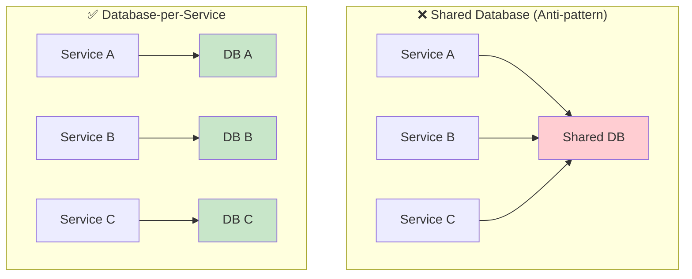
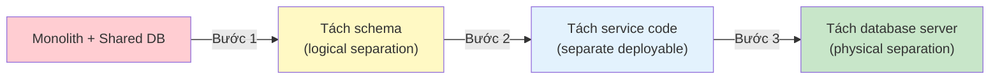
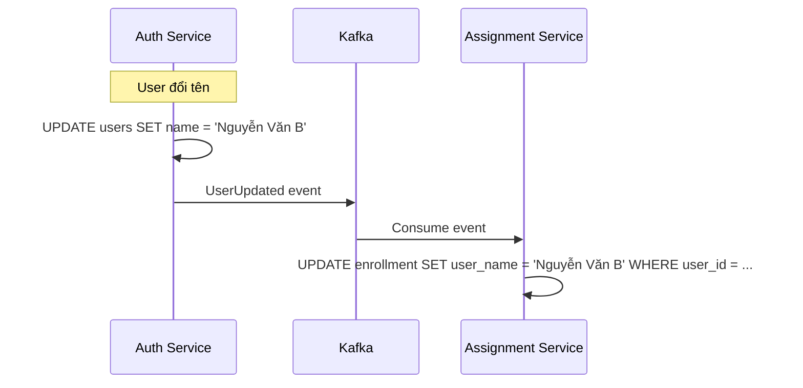
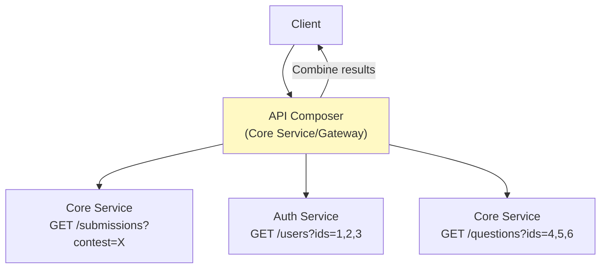
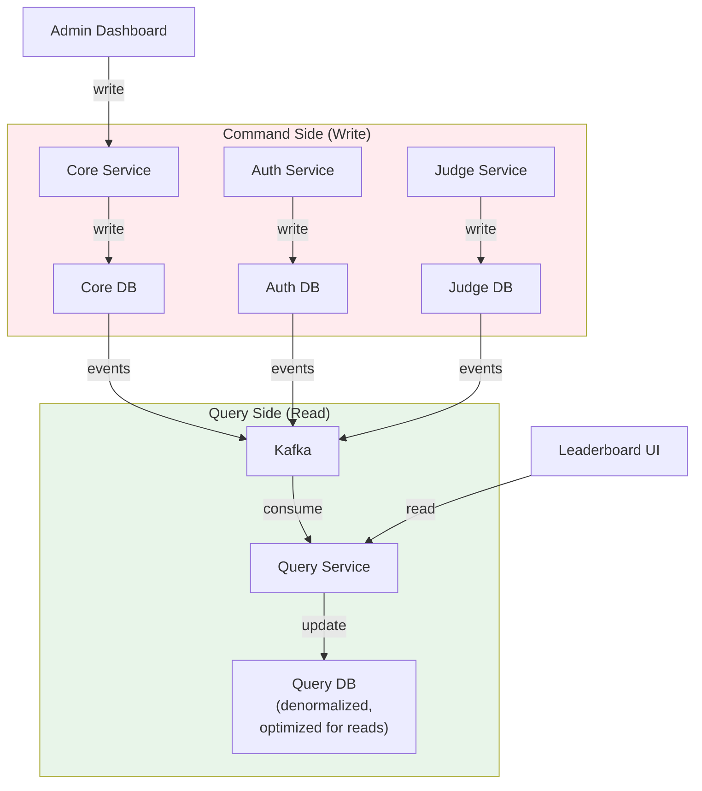
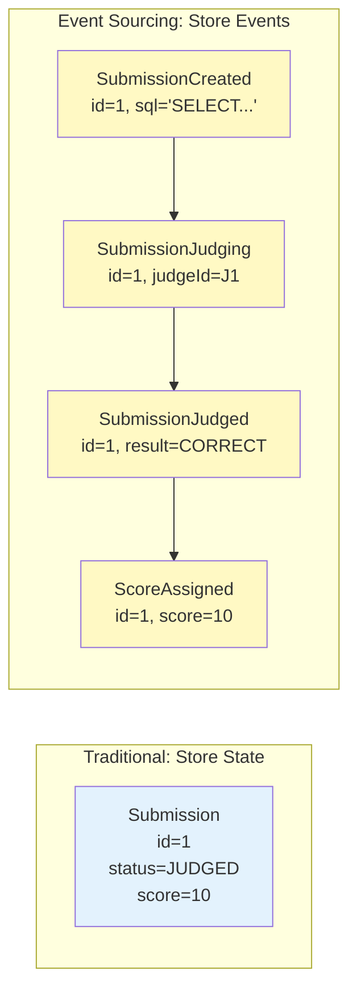
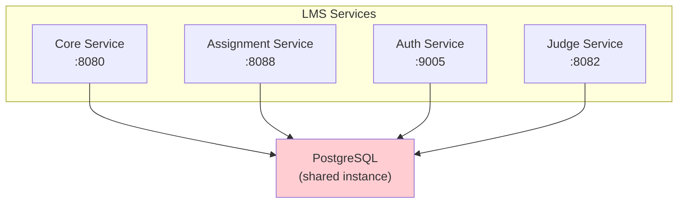

# Chương 7: Quản lý Dữ liệu trong Microservices

> *"Duplication is far better than coupling. Each service should own its data and make independent decisions about what to store."*
> — Sam Newman, *Monolith to Microservices* [4b]

---

## Bạn sẽ học được gì

- Hiểu nguyên tắc Database-per-Service và data ownership
- Nắm vững các chiến lược tách database từ monolith
- Phân tích trade-off giữa data duplication và coupling
- Hiểu CQRS (Command Query Responsibility Segregation) và khi nào nên áp dụng
- Nắm overview Event Sourcing — ưu/nhược và khi nào cần
- Phân tích vấn đề shared database trong LMS và đề xuất migration

---

## 7.1 Database-per-Service — Nguyên tắc Data Ownership

### Từ Shared Database đến Data Ownership

Trong monolith, tất cả modules truy cập chung một database. Khi chuyển sang microservices, một trong những quyết định quan trọng nhất là: **mỗi service sở hữu database riêng** [4a, Ch.5].



### Tại sao cần tách?

Newman trong [4a, Ch.5] phân tích 5 lý do chính:

| Lý do | Mô tả | Ảnh hưởng nếu không tách |
|-------|-------|--------------------------|
| **Loose coupling** | Services không phụ thuộc vào schema nội bộ của nhau | Thay đổi schema một service → break service khác |
| **Independent deployment** | Deploy service A không cần quan tâm service B | Schema migration chung → coordinate deploy tất cả services |
| **Technology freedom** | Mỗi service chọn DB phù hợp (SQL, NoSQL, graph) | Tất cả bị ép dùng cùng technology |
| **Scalability** | Scale database theo nhu cầu riêng | Scale shared DB cho toàn bộ — tốn kém |
| **Fault isolation** | DB Service A down ≠ Service B down | Shared DB down → toàn bộ system down |

### Quy tắc data ownership

> **📐 Nguyên tắc — Data Ownership Rule**
>
> Mỗi piece of data phải có **đúng một service** sở hữu nó. Service khác muốn đọc → gọi API hoặc subscribe event. Service khác muốn thay đổi → gửi command đến service sở hữu. **KHÔNG** truy cập trực tiếp database của service khác [4a, Ch.5].

Trong LMS context:

| Data | Service sở hữu | Ai cần đọc? |
|------|----------------|-------------|
| Question, TestCase | Core Service | Judge Service (để chấm), Frontend |
| Submission, Score | Core Service | Judge Service (kết quả), Notification, Frontend |
| Course, Assignment | Assignment Service | Core Service (link bài tập), Frontend |
| User, Authentication | Auth Service | Tất cả services (JWT validation) |
| Judge Result, Execution Log | Judge Service | Core Service (cập nhật score) |

> **🔍 Phân tích gap — LMS dùng Shared Database**
>
> LMS hiện tại vi phạm nguyên tắc data ownership: tất cả backend services (Core, Assignment, Auth, Judge) đều kết nối vào **cùng một PostgreSQL instance**. Hệ quả: (1) Core Service có thể đọc trực tiếp bảng `users` của Auth mà không qua API, (2) Assignment Service dùng chung schema với Core — thay đổi bảng `questions` có thể break Assignment, (3) không thể scale database riêng cho Judge (high-load khi contest). **Migration path**: xem §7.2.

---

## 7.2 Chiến lược tách Database từ Monolith

### Khi nào nên tách?

Newman trong [4a, Ch.5] khuyến nghị: **tách schema trước, tách service sau**. Quy trình:



**Bước 1: Logical separation** — Mỗi service chỉ truy cập tables thuộc về mình. Tạo separate schemas trong cùng DB. Tìm và loại bỏ cross-schema joins.

**Bước 2: Code separation** — Tách repository layer: Service A chỉ có repository cho tables của A. Cross-service data access phải qua API.

**Bước 3: Physical separation** — Mỗi service có database server riêng. Đây là bước tốn kém nhất nhưng mang lại fault isolation thực sự.

### Xử lý shared tables

Khi tách database, ba tình huống thường gặp:

**1. Table thuộc rõ ràng một service** — Dễ: chuyển table về schema của service đó.

**2. Table được nhiều services tham chiếu (foreign key)** — Thay FK bằng service-level ID:
```java
// ❌ Trước: Foreign key trực tiếp
@Entity
public class Submission {
    @ManyToOne
    @JoinColumn(name = "user_id")
    private User user;  // FK → users table (thuộc Auth Service)
}

// ✅ Sau: Store ID, query qua API khi cần
@Entity
public class Submission {
    @Column(name = "user_id")
    private UUID userId;  // Chỉ lưu ID, không FK
    
    // Khi cần user info → gọi Auth Service API
}
```

**3. Table được nhiều services ghi** — Phức tạp nhất. Cần xác định service nào *sở hữu* data, services khác gửi command.

### Áp dụng cho LMS

| Bước | Hành động | Effort | Priority |
|------|----------|--------|----------|
| 1 | Tạo separate PostgreSQL schemas: `core`, `assignment`, `auth`, `judge` | Trung bình | Cao |
| 2 | Loại bỏ cross-schema JOINs — thay bằng Feign calls (đã có sẵn một phần) | Cao | Cao |
| 3 | Tách thành separate PostgreSQL instances (hoặc separate databases) | Cao | Thấp (khi cần scale) |

> **💡 Tip — Bắt đầu từ schema rõ ràng nhất**
>
> Newman khuyến nghị [4a, Ch.5]: bắt đầu tách từ service có *ranh giới rõ ràng nhất*. Trong LMS, **Auth Service** là ứng viên lý tưởng — tables `users`, `roles`, `tokens` không overlap với business logic. Tiếp theo là Judge Service — execution logs và sandbox data hoàn toàn isolate.

---

## 7.3 Data Duplication vs Coupling

### Khi nào chấp nhận duplicate data?

Khi mỗi service có database riêng, câu hỏi xuất hiện ngay: "Assignment Service cần tên sinh viên để hiện trong danh sách enrollment — lấy từ đâu?"

Hai cách tiếp cận:

**Cách 1: Call API** — Assignment gọi Auth Service API mỗi khi cần userName.
```
GET /api/users/{userId} → { "name": "Nguyễn Văn A", ... }
```
- ✅ Không duplicate data
- ❌ Runtime dependency: Auth down → Assignment không hiện được tên
- ❌ Latency: N+1 queries nếu danh sách có 100 sinh viên

**Cách 2: Duplicate data** — Assignment lưu copy của userName trong bảng `enrollment`.
```sql
-- Assignment Service database
CREATE TABLE enrollment (
    id UUID PRIMARY KEY,
    user_id UUID NOT NULL,
    user_name VARCHAR(255),  -- duplicated from Auth
    course_id UUID NOT NULL,
    enrolled_at TIMESTAMP
);
```
- ✅ Không phụ thuộc Auth Service tại runtime
- ✅ Nhanh — query local
- ❌ Data có thể stale (user đổi tên nhưng enrollment chưa cập nhật)

### Giải pháp: Event-driven data synchronization

Kết hợp cả hai bằng **domain events** [5, Ch.3]:



| Strategy | Khi nào dùng | Trade-off |
|----------|-------------|-----------|
| **Call API** | Data thay đổi liên tục + luôn cần latest | Runtime coupling, latency |
| **Duplicate + Events** | Data ít thay đổi + OK với eventual consistency | Storage, sync logic |
| **Cache + TTL** | Data ít thay đổi + short staleness OK | Cache invalidation complexity |

> **📐 Nguyên tắc — Duplication > Coupling**
>
> Newman trong [4b] nhấn mạnh: "Duplication is far better than coupling." Duplicate data là trade-off có chủ đích — chấp nhận eventual consistency để đổi lấy loose coupling và availability. Trong LMS, userName và courseTitle là ứng viên lý tưởng cho duplication — thay đổi hiếm, staleness 10 giây không ảnh hưởng business.

---

## 7.4 Cross-service Queries — API Composition

### Bài toán

Trước đây trong monolith, một query đơn giản:
```sql
-- Hiện danh sách "submission + user info + question title"
SELECT s.*, u.name, q.title
FROM submissions s
JOIN users u ON s.user_id = u.id
JOIN questions q ON s.question_id = q.id
WHERE s.contest_id = ?
```

Khi tách database-per-service: `submissions` (Core), `users` (Auth), `questions` (Core) — query JOIN cross-service không thể chạy.

### Pattern: API Composition

Richardson trong [2a, Ch.7] đề xuất **API Composition** — một service (hoặc API Gateway) gọi nhiều services rồi kết hợp kết quả:



```java
// API Composition trong Core Service
@Service
public class ContestLeaderboardService {
    private final SubmissionRepository submissionRepo;
    private final AuthServiceClient authClient;
    
    public List<LeaderboardEntry> getLeaderboard(UUID contestId) {
        List<Submission> submissions = submissionRepo.findByContestId(contestId);
        
        // Batch fetch user info (avoid N+1)
        Set<UUID> userIds = submissions.stream()
            .map(Submission::getUserId).collect(Collectors.toSet());
        Map<UUID, UserInfo> users = authClient.getUsersByIds(userIds);
        
        return submissions.stream()
            .map(s -> LeaderboardEntry.builder()
                .userName(users.get(s.getUserId()).getName())
                .score(s.getScore())
                .submittedAt(s.getCreatedAt())
                .build())
            .sorted(Comparator.comparing(LeaderboardEntry::getScore).reversed())
            .toList();
    }
}
```

### LMS hiện tại: interfaceProjection + Feign

LMS đang dùng `interfaceProjection/` — Spring JPA projections kết hợp Feign calls:

```java
// Projection interface — chỉ lấy fields cần thiết
public interface SubmissionProjection {
    UUID getId();
    UUID getUserId();
    String getSqlContent();
    Integer getScore();
    LocalDateTime getCreatedAt();
}
```

Đây là approach hợp lý cho reads đơn giản, nhưng gặp vấn đề khi query phức tạp (filtering, sorting cross-service fields, pagination).

| Vấn đề | Hiện trạng | Cải thiện |
|--------|-----------|----------|
| **N+1 queries** | Core gọi Auth cho từng userId | Batch fetch: `GET /users?ids=1,2,3` |
| **Cross-service sort** | Không sort được theo userName (Auth) | Duplicate userName trong Core hoặc sort client-side |
| **Cross-service filter** | Không filter "submissions by course" (Assignment) | Duplicate courseId hoặc API composition |
| **Pagination** | Pagination trên kết quả merged | Phức tạp — cân nhắc CQRS (§7.5) |

---

## 7.5 CQRS — Command Query Responsibility Segregation

### Vấn đề mà CQRS giải quyết

API Composition (§7.4) hoạt động cho queries đơn giản. Nhưng khi LMS cần:
- Leaderboard real-time với ranking, total score, submission count — aggregation cross-service
- Search submissions theo userName, questionTitle, courseName — filter cross-service
- Dashboard với statistics from nhiều services

Mỗi query phải gọi 3-4 services, combine results, rồi sort/filter/paginate — **chậm và phức tạp**.

### CQRS Pattern

Richardson trong [2a, Ch.7] đề xuất **CQRS**: tách hệ thống thành hai phía:



**Command side**: mỗi service ghi vào DB riêng — normalized, optimized for writes.

**Query side**: một read model riêng — denormalized, chứa data đã được "join" sẵn, optimized for reads.

### Khi nào cần CQRS?

| Scenario | CQRS cần thiết? | Giải pháp đơn giản hơn |
|----------|-----------------|----------------------|
| Query đơn giản, ít cross-service | ❌ Chưa cần | API Composition |
| Query phức tạp, nhiều cross-service | ✅ Cần | CQRS read model |
| Write-heavy, read-light | ❌ Chưa cần | Standard CRUD |
| Read-heavy, write-light | ✅ Có lợi | CQRS read model |
| Cần aggregation real-time | ✅ Rất cần | CQRS + stream processing |

### Áp dụng cho LMS: Leaderboard Read Model

Ví dụ cụ thể: Contest Leaderboard — cần data từ Core (submissions, scores), Auth (userNames), và Assignment (courseInfo):

```java
// Query DB: Denormalized leaderboard table
@Entity
@Table(name = "leaderboard_view")
public class LeaderboardView {
    @Id
    private UUID contestId;
    private UUID userId;
    private String userName;        // from Auth (duplicated)
    private int totalScore;         // aggregated from submissions
    private int submissionCount;
    private LocalDateTime lastSubmittedAt;
    
    // Pre-computed, query-ready — no JOINs needed
}
```

```java
// Consumer: cập nhật leaderboard khi có submission mới
@KafkaListener(topics = "score-updates")
public void updateLeaderboard(ScoreUpdateEvent event) {
    LeaderboardView entry = leaderboardRepo
        .findByContestIdAndUserId(event.getContestId(), event.getUserId())
        .orElse(new LeaderboardView(event.getContestId(), event.getUserId()));
    
    entry.setTotalScore(entry.getTotalScore() + event.getScoreDelta());
    entry.setSubmissionCount(entry.getSubmissionCount() + 1);
    entry.setLastSubmittedAt(event.getTimestamp());
    entry.setUserName(event.getUserName());  // from event payload
    
    leaderboardRepo.save(entry);
}
```

> **🔍 Phân tích gap — LMS chưa cần CQRS toàn diện**
>
> LMS hiện tại chưa có query phức tạp đủ để justify CQRS pattern đầy đủ. Tuy nhiên, **Contest Leaderboard** là use case lý tưởng để bắt đầu: (1) read-heavy (100+ người xem liên tục), (2) data từ nhiều sources, (3) cần real-time. **Migration path**: implement denormalized `leaderboard_view` table, update qua Kafka events — đây là CQRS cục bộ, không cần infrastructure mới.

---

## 7.6 Event Sourcing — Overview

### Event Sourcing là gì?

Thay vì lưu **trạng thái hiện tại** (current state) của entity, Event Sourcing lưu **tất cả events** đã xảy ra và replay chúng để reconstruct state [2a, Ch.6]:



Current state được reconstruct bằng cách replay events:
```
SubmissionCreated → status=PENDING
SubmissionJudging → status=JUDGING
SubmissionJudged  → status=JUDGED, result=CORRECT
ScoreAssigned     → score=10
```

### Ưu và nhược

| | Ưu điểm | Nhược điểm |
|---|---------|-----------|
| 1 | **Audit trail hoàn chỉnh**: mọi thay đổi đều có record | **Learning curve**: cách nghĩ hoàn toàn khác |
| 2 | **Replay & debug**: reconstruct state tại bất kỳ thời điểm nào | **Event store complexity**: cần event store riêng |
| 3 | **Temporal queries**: "submission ở trạng thái gì lúc 14:30?" | **Eventually consistent**: CQRS thường đi kèm |
| 4 | **Reliable event publishing**: events *là* data, không cần gửi riêng | **Schema evolution khó**: events là immutable |
| 5 | **Collaboration**: nhiều events có thể trigger từ cùng action | **Storage**: event log lớn dần theo thời gian |

### Khi nào nên dùng?

Richardson trong [2a, Ch.6] nhấn mạnh: Event Sourcing không phải "mặc định" — nó phù hợp khi:

| Cần | Ví dụ | Event Sourcing? |
|-----|-------|----------------|
| **Audit trail** bắt buộc | Financial transactions, compliance | ✅ Rất phù hợp |
| **Temporal queries** | "Giá sản phẩm lúc user đặt hàng là bao nhiêu?" | ✅ Phù hợp |
| **Debug production issues** | "Tại sao submission này bị sai score?" | ✅ Helpful |
| **Simple CRUD** | User profile, settings | ❌ Over-engineering |
| **High-performance reads** | Dashboard, search | ❌ CQRS đủ |

### LMS và Event Sourcing

> **📐 Nguyên tắc — LMS chưa cần Event Sourcing toàn diện**
>
> Xem xét submission flow trong LMS: việc lưu trữ events (SubmissionCreated → Judging → Judged → ScoreAssigned) mang lại audit trail giá trị — đặc biệt trong context thi cử, khi cần truy vết "tại sao submission X bị điểm 0?" hay "ai đã submit lúc mấy giờ?". Tuy nhiên, implement event sourcing infrastructure (event store, snapshots, projection) cho toàn bộ system là quá sớm. **Khuyến nghị**: bắt đầu với **event logging** (ghi events vào bảng riêng) mà không rebuild state từ events — được lợi ích audit trail mà không phải chịu complexity.

---

## 7.7 Case Study: Shared Database trong LMS — Phân tích và Migration

### Hiện trạng



| Service | Tables chính | Vấn đề ownership |
|---------|-------------|-------------------|
| Core | `questions`, `submissions`, `contests`, `user_stats` | `user_stats` nên thuộc Auth? |
| Assignment | `courses`, `assignments`, `enrollment`, `grades` | `enrollment` cần userId từ Auth |
| Auth | `users`, `roles`, `tokens` | `users` bị Core đọc trực tiếp |
| Judge | `execution_logs` (nếu có) | Hiện dùng Kafka, ít lưu DB |

### Vấn đề cụ thể phát hiện

| # | Vấn đề | Hệ quả | Severity |
|---|--------|--------|----------|
| 1 | **Shared PostgreSQL instance** | Tất cả services down nếu DB down | 🔴 Cao |
| 2 | **Cross-service JOINs** | Core JOIN bảng `users` để hiện tên trong submissions | 🟡 Trung bình |
| 3 | **Shared schema** | ALTER TABLE ảnh hưởng tất cả services | 🔴 Cao |
| 4 | **Coupling qua FK** | `submissions.user_id` FK đến `users` — xóa user impossible | 🟡 Trung bình |
| 5 | **Không thể scale riêng** | Contest mode cần scale Judge DB nhưng không thể tách | 🟡 Trung bình |

### Migration roadmap

**Phase 1 — Logical Separation** (effort thấp, impact cao):
```sql
-- Tạo separate schemas trong cùng PostgreSQL instance
CREATE SCHEMA core_service;
CREATE SCHEMA assignment_service;
CREATE SCHEMA auth_service;
CREATE SCHEMA judge_service;

-- Move tables về schema tương ứng
ALTER TABLE questions SET SCHEMA core_service;
ALTER TABLE submissions SET SCHEMA core_service;
ALTER TABLE users SET SCHEMA auth_service;
ALTER TABLE courses SET SCHEMA assignment_service;
```

**Phase 2 — Remove Cross-schema Dependencies** (effort trung bình):
```java
// Trước: JOIN trực tiếp
@Query("SELECT s.*, u.name FROM submissions s JOIN users u ON ...")
List<SubmissionWithUser> findWithUserInfo(); // ❌ cross-schema

// Sau: API call
public List<SubmissionDTO> findWithUserInfo() {
    List<Submission> submissions = submissionRepo.findAll();
    Set<UUID> userIds = submissions.stream()
        .map(Submission::getUserId).collect(toSet());
    Map<UUID, String> userNames = authClient.getUserNames(userIds); // ✅ API
    
    return submissions.stream()
        .map(s -> new SubmissionDTO(s, userNames.get(s.getUserId())))
        .toList();
}
```

**Phase 3 — Physical Separation** (effort cao, khi cần scale):
- Tách PostgreSQL instances riêng cho Auth, Core, Assignment
- Judge Service có thể dùng DB riêng hoặc chỉ dùng Kafka (stateless)
- Connection strings thay đổi, cần update config cho từng service

**Phase 4 — Selective CQRS** (khi cần complex queries):
- Implement `leaderboard_view` denormalized table cho Contest Leaderboard
- Cập nhật qua Kafka events (submission judged → update view)
- Không cần CQRS infrastructure toàn diện — chỉ cần 1-2 read models

---

## Tổng kết

Database-per-Service là nguyên tắc cốt lõi khi chuyển sang microservices. Mỗi service sở hữu data riêng, truy cập data service khác qua API hoặc events — không bao giờ trực tiếp qua database.

Tách database từ monolith là quá trình 3 bước: logical separation (schemas) → code separation (repositories) → physical separation (instances). Bắt đầu từ service có ranh giới rõ ràng nhất, không cần "big bang".

Data duplication là trade-off có chủ đích — chấp nhận eventual consistency để giảm runtime coupling. Event-driven synchronization (qua Kafka) giữ cho duplicated data eventually consistent.

API Composition giải quyết cross-service queries đơn giản. CQRS — tách read model và write model — cần thiết khi queries phức tạp, read-heavy, hoặc cần aggregation real-time. Event Sourcing lưu trữ events thay vì state — mang lại audit trail và temporal queries nhưng đi kèm complexity đáng kể.

Phân tích LMS cho thấy hệ thống đang dùng shared database — một trong những anti-patterns phổ biến nhất của microservices. Migration roadmap 4 phases (logical → cross-schema removal → physical → selective CQRS) cho phép cải thiện dần mà không cần "big bang" rewrite.

Ở Chương 8, chúng ta sẽ chuyển sang tầng hạ tầng: **API Gateway** — single entry point cho tất cả clients, xử lý routing, authentication, rate limiting.

---

## Đọc thêm

**Sách tham khảo chính:**
1. [4a] Sam Newman, *Building Microservices*, 1st Ed. — Ch.5: Splitting the Monolith
2. [4b] Sam Newman, *Monolith to Microservices* — Database decomposition patterns
3. [2a] Chris Richardson, *Microservices Patterns*, 1st Ed. — Ch.6: Event Sourcing; Ch.7: CQRS, API Composition
4. [7] Martin Kleppmann, *Designing Data-Intensive Applications* — Ch.5-6: Replication, Partitioning; Ch.11: Stream Processing

**Nguồn trực tuyến:**
- Martin Fowler, "CQRS" — martinfowler.com/bliki/CQRS.html
- Microsoft, "CQRS Pattern" — learn.microsoft.com/en-us/azure/architecture/patterns/cqrs
- Greg Young, "CQRS, Task Based UIs, Event Sourcing aaah!" — cqrs.files.wordpress.com
