# Chương 7: Quản lý Dữ liệu trong Microservices

> *"Duplication is far better than coupling. Each service should own its data and make independent decisions about what to store."*
> — Sam Newman, *Monolith to Microservices* [4b]

---

## Bạn sẽ học được gì

- Hiểu nguyên tắc **database-per-service** và tại sao data ownership là nền tảng của microservices
- Nắm được các chiến lược tách database từ monolith — từ shared database đến database-per-service
- Phân biệt khi nào data duplication là chấp nhận được và khi nào nó là vấn đề
- Hiểu CQRS (Command Query Responsibility Segregation) và khi nào nó cần thiết
- Nắm tổng quan Event Sourcing — ưu/nhược điểm và khi nào nên áp dụng
- Phân tích bài toán cross-service queries trong hệ thống LMS

---

## 7.1 Database-per-Service — Nguyên tắc Data Ownership

### Vấn đề: shared database phá vỡ service independence

Trong monolith, toàn bộ ứng dụng truy cập một database duy nhất — đơn giản, nhất quán, và transactions ACID hoạt động tự nhiên. Khi chuyển sang microservices, nhiều team giữ nguyên shared database vì "tiện" — mọi service vẫn đọc/ghi cùng bảng. Thoạt nhìn, đây có vẻ là giải pháp tốt: không cần thay đổi data layer, không cần xử lý eventual consistency.

Tuy nhiên, bài toán data trong distributed systems bị ràng buộc bởi một giới hạn lý thuyết quan trọng — **CAP Theorem** (Consistency, Availability, Partition tolerance): trong hệ thống phân tán, khi network partition xảy ra, hệ thống chỉ có thể chọn *hoặc* consistency *hoặc* availability, không thể có cả hai [7, Ch.9]. Newman trong [4a, Ch.11] giải thích: đây là lý do tại sao microservices buộc phải chấp nhận eventual consistency — và tại sao thiết kế data management cần cân nhắc kỹ trade-offs giữa consistency và availability cho *từng use case cụ thể*.

Shared database **phá vỡ nguyên lý cốt lõi nhất** của microservices: independent deployability. Newman trong [4b, Ch.4] phân tích ba hậu quả nghiêm trọng:

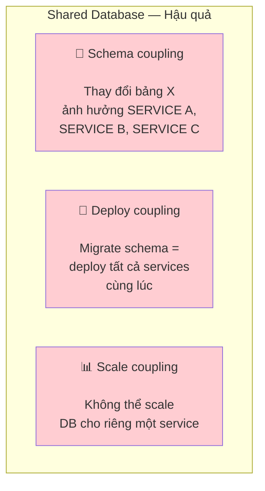

*Hình 7.1: Ba hậu quả của shared database trong microservices*

**1. Schema coupling** — Khi hai service đọc cùng bảng `users`, thay đổi schema (đổi tên cột, thêm constraint) ảnh hưởng cả hai. Mỗi database migration trở thành cross-team coordination exercise — chính xác vấn đề mà microservices muốn loại bỏ.

**2. Deploy coupling** — Database migration phải deploy cùng với tất cả services sử dụng bảng đó. Nếu Service A cần thêm cột vào `users`, Service B phải update code để handle cột mới *trước khi* migration chạy — dù Service B không cần cột đó.

**3. Scale coupling** — Không thể chọn database technology phù hợp nhất cho từng service. Service yêu cầu full-text search (Elasticsearch) và service yêu cầu ACID transactions (PostgreSQL) bị buộc dùng chung — hoặc phải dùng giải pháp hybrid phức tạp.

### Database-per-service pattern

Nguyên tắc **database-per-service** yêu cầu: mỗi service sở hữu dữ liệu riêng, và **dữ liệu đó chỉ có thể truy cập qua API** của service sở hữu — không bao giờ truy cập trực tiếp vào database của service khác [2a, Ch.2].

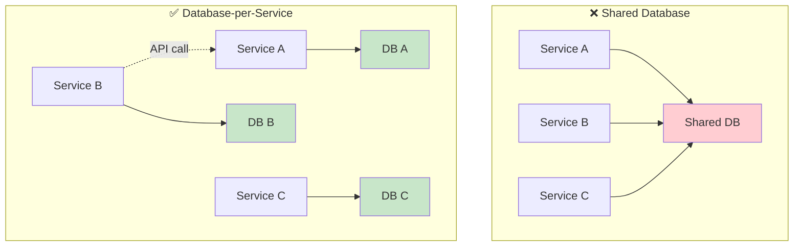

*Hình 7.2: Shared Database (đọc/ghi chung) vs Database-per-Service (data qua API)*

"Database riêng" không nhất thiết là database server riêng. Có ba cấp độ tách:

**Bảng 7.1:** Ba cấp độ tách database

| Cấp độ | Mô tả | Isolation | Chi phí |
|--------|-------|-----------|---------|
| **Separate schema** | Cùng DB server, khác schema/namespace | Thấp (vẫn có thể cross-schema query) | Thấp |
| **Separate database** | Cùng DB server, khác database | Trung bình | Thấp |
| **Separate server** | Khác DB server hoàn toàn | Cao (polyglot possible) | Cao |

Cấp độ nào phù hợp tùy thuộc vào yêu cầu isolation. Với LMS hiện tại, **separate schema** là bước đầu tiên hợp lý — chi phí thấp nhưng ngăn được schema coupling ngầm.

> **📐 Nguyên tắc — Data Should Be Owned, Not Shared**
>
> "If a service wants to access data held by another service, it should go and ask that service for the data it needs. And the service exposing the data should decide what to expose and what to hide."
>
> *— Sam Newman, Monolith to Microservices [4b]*

> **🔍 Phân tích gap — LMS shared database**
>
> Hệ thống LMS sử dụng **shared database** (`app_db`) giữa Core Service và Assignment Service — cả hai service đọc/ghi cùng PostgreSQL instance, có khả năng truy cập chéo bảng. Đây là hậu quả trực tiếp của việc Assignment được tách ra từ Core (cả hai ban đầu là một monolith `app`). Hậu quả: thay đổi schema cho Assignment có thể ảnh hưởng Core, và ngược lại — phá vỡ independent deployability.
>
> **Migration path**: (1) xác định bảng nào thuộc về Core, bảng nào thuộc Assignment (dựa vào bounded context analysis từ Ch.2), (2) tạo separate schema trong cùng PostgreSQL, (3) thay thế cross-table queries bằng API calls qua Feign, (4) dài hạn: tách database server khi cần polyglot hoặc independent scaling.

### Industry Case Study: Uber — Domain-Oriented Microservice Architecture (DOMA)

Uber (2020) công bố bài học từ việc quản lý **4,000+ microservices** — trong đó data ownership là thách thức lớn nhất. Adam Gluck mô tả cách Uber chuyển từ "microservices spaghetti" sang **DOMA** (Domain-Oriented Microservice Architecture):

**Bảng 7.2:** Uber — hành trình từ microservices spaghetti đến DOMA

| Giai đoạn | Vấn đề | Giải pháp |
|-----------|--------|-----------|
| **2012-2016** — Monolith → microservices | Services tăng nhanh, không ai hiểu dependency graph | Mỗi team tạo service riêng, thiếu chuẩn |
| **2016-2018** — Microservices spaghetti | 4,000+ services, mỗi service truy cập data của service khác trực tiếp | Data coupling giữa services phá vỡ autonomy |
| **2018-2020** — DOMA | Nhóm services thành **domains** (tương tự bounded context), mỗi domain có *gateway service* duy nhất expose data cho bên ngoài | Giảm coupling: services bên ngoài domain chỉ giao tiếp qua domain gateway |

**Bài học cho từ Uber**: (1) Database-per-service là cần thiết nhưng *chưa đủ* — cần thêm *domain-level data encapsulation*. (2) Khi hệ thống lớn, nhóm services thành domains giúp giảm exponential dependency growth. (3) Data duplication giữa domains là chấp nhận được — domain gateway kiểm soát data nào expose.

*Nguồn: Adam Gluck, "Introducing Domain-Oriented Microservice Architecture," Uber Engineering Blog, July 2020 (eng.uber.com/microservice-architecture/). Xem thêm: Uber Technology Day 2019 talks.*

---

### CAP Theorem — Hiểu đúng giới hạn

CAP Theorem được đề cập ngắn gọn ở trên, nhưng hiểu *đúng* CAP rất quan trọng khi thiết kế data management. Kleppmann trong [7, Ch.9] phân tích kỹ: CAP không phải "chọn 2 trong 3" như thường hiểu sai — mà là: **khi network partition xảy ra** (và nó *sẽ* xảy ra trong distributed systems), bạn phải chọn giữa consistency và availability.

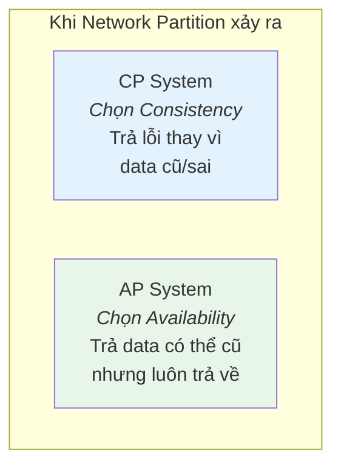

*Hình 7.3: CAP Theorem — CP (chọn consistency) vs AP (chọn availability) khi partition*

**CP Systems** (Consistency when Partitioned): khi partition xảy ra, system từ chối request thay vì trả data không nhất quán. Ví dụ: PostgreSQL cluster đặt consistency lên trên — node không đồng bộ sẽ trả lỗi.

**AP Systems** (Availability when Partitioned): khi partition xảy ra, system vẫn trả response nhưng data có thể stale. Ví dụ: Cassandra, DynamoDB cho phép đọc/ghi ở bất kỳ node nào — data *eventually* consistent.

**Bảng 7.3:** CP vs AP cho từng service trong LMS

| Service | Data | Nên CP hay AP? | Lý do |
|---------|------|---------------|-------|
| **Submission** (tạo, chấm) | Transactional | **CP** | Score phải chính xác, sai = tranh cãi. Chấp nhận lỗi "service unavailable" hơn là sai score |
| **Leaderboard** | Derived/read | **AP** | Eventual consistency OK — user chấp nhận ranking "chậm vài giây" hơn là "service unavailable" |
| **User profile** | Reference | **AP** | Tên sinh viên thay đổi rất hiếm, stale data vài phút không vấn đề |
| **Contest timer** | Real-time | **CP** | Thời gian thi phải chính xác — sai = ảnh hưởng công bằng |

> **📐 Nguyên tắc — Per-Service CAP Decision**
>
> Không phải toàn bộ hệ thống "là CP" hay "là AP". Mỗi service, thậm chí mỗi *use case*, chọn trade-off riêng. Kleppmann trong [7, Ch.9] gọi đây là "real-world application of CAP": phân tích *từng data flow* — data nào cần strong consistency (ACID), data nào chấp nhận eventual consistency (BASE).

### Caching Strategies — Giảm load và latency

Khi database đã tách, cross-service queries chậm hơn (network call). **Caching** là phương pháp hiệu quả nhất để giảm latency — nhưng cần chiến lược đúng để tránh stale data.

Ba patterns chính (Newman [4a, Ch.11]):

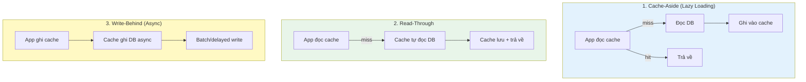

*Hình 7.4: Ba caching patterns — Cache-Aside, Read-Through, Write-Behind*

**Bảng 7.4:** So sánh ba caching patterns

| Pattern | Ưu điểm | Nhược điểm | Áp dụng LMS |
|---------|---------|------------|-------------|
| **Cache-Aside** | Đơn giản, app kiểm soát | Cache miss = 2 calls (cache + DB) | Question list, user profiles |
| **Read-Through** | Transparent cho app | Cache layer phức tạp hơn | — |
| **Write-Behind** | Write nhanh (async) | Risk mất data nếu cache crash | Leaderboard score updates |

**Cache Invalidation** — "There are only two hard things in Computer Science: cache invalidation and naming things." (Phil Karlton). Chiến lược:

**Bảng 7.5:** Chiến lược cache invalidation

| Chiến lược | Mô tả | Khi nào dùng |
|-----------|-------|-------------|
| **TTL (Time-to-Live)** | Cache hết hạn sau N giây | Reference data ít thay đổi (question list: TTL 5 phút) |
| **Event-driven invalidation** | Service publish event → cache bị xóa | Data thay đổi thường xuyên (score update → invalidate leaderboard cache) |
| **Versioned keys** | Cache key chứa version: `questions:v3` | Khi cần invalidate toàn bộ sau schema change |

Trong LMS, Redis phù hợp nhất cho caching: đã có trong stack (dùng cho rate limiting ở Gateway — Ch.8), hỗ trợ TTL tự động, pub/sub cho invalidation events.

---

## 7.2 Chiến lược tách Database từ Monolith

### Vấn đề: tách service dễ, tách data khó

Nhiều team tách microservices ở tầng application (deploy riêng, repo riêng) nhưng vẫn **trỏ vào cùng database**. Newman trong [4b] gọi đây là "half-baked migration" — nửa vời. Service đã "tách" nhưng data vẫn coupled — lợi ích independent deployability gần như bằng 0.

Tách database là **bước khó nhất** trong hành trình từ monolith sang microservices. Kleppmann trong [7, Ch.5–6] phân tích: khi data nằm ở nhiều nơi, mọi vấn đề của distributed systems xuất hiện — replication lag, partition tolerance, consistency trade-offs. Đây là chi phí không thể tránh.

### Năm chiến lược tách database

Newman đề xuất năm chiến lược, sắp xếp từ ít rủi ro đến nhiều rủi ro [4b, Ch.4]:

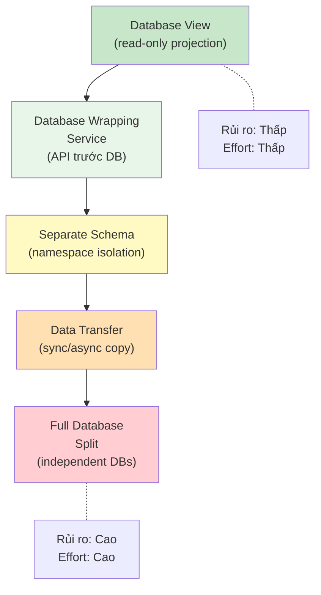

*Hình 7.5: Năm chiến lược tách database — từ ít rủi ro đến nhiều rủi ro*

**1. Database View** — Tạo view read-only cho service mới, ẩn schema gốc. Ưu điểm: không thay đổi data, service cũ không bị ảnh hưởng. Nhược điểm: chỉ read-only, vẫn coupled vào schema.

**2. Database Wrapping Service** — Đặt một API đơn giản phía trước database, mọi access đi qua API này. Ưu điểm: bắt đầu tách coupling mà không di chuyển data. Nhược điểm: thêm một service cần maintain.

**3. Separate Schema** — Tách bảng vào schema/namespace riêng trong cùng database. Ưu điểm: isolation rõ ràng, không cần infra mới. Nhược điểm: cùng DB server → vẫn shared resources.

**4. Data Transfer** — Copy data sang database mới, giữ sync bằng events hoặc CDC (Change Data Capture). Ưu điểm: service mới có data riêng. Nhược điểm: cần cơ chế sync, eventual consistency.

**5. Full Database Split** — Mỗi service có database server hoàn toàn riêng. Ưu điểm: isolation tối đa, polyglot possible. Nhược điểm: effort lớn, phải xử lý mọi cross-service data access.

### Áp dụng cho LMS

Với bối cảnh LMS (team nhỏ, cùng PostgreSQL), chiến lược phù hợp nhất là **incremental**:

**Bảng 7.6:** Migration path tách database cho LMS

| Phase | Chiến lược | Mô tả | Effort |
|-------|-----------|-------|--------|
| 1 | **Separate Schema** | Tách `app_db` thành schema `core` và schema `assignment` | Thấp |
| 2 | **API Wrapping** | Thay cross-schema queries bằng Feign calls | Trung bình |
| 3 | **Full Split** (nếu cần) | Tách PostgreSQL server khi cần independent scaling | Cao |

> **💡 Tip — Khi nào đủ?**
>
> Không phải hệ thống nào cũng cần đến Phase 3. Với LMS, Phase 1 (separate schema) đã ngăn được schema coupling ngầm. Phase 2 (API wrapping) cần khi team mở rộng và cần deploy độc lập thực sự. Phase 3 chỉ cần khi có yêu cầu scale khác nhau hoặc polyglot persistence.
>
> *Chi tiết migration roadmap thực tế, Outbox Pattern (reliable messaging khi tách DB), và thứ tự triển khai → xem Ch.10.*

---

## 7.3 Data Duplication vs Coupling — Khi nào chấp nhận duplicate?

### Vấn đề: cần data từ service khác

Sau khi tách database, vấn đề tiếp theo lập tức xuất hiện: **service A cần data mà service B sở hữu**. Ví dụ trong LMS: Assignment Service cần hiển thị tên sinh viên — nhưng `users` thuộc về Auth Service. Gọi Auth API mỗi lần cần tên? Lưu copy tên sinh viên tại Assignment?

Mitra trong [3, Ch.5] phân tích ba giải pháp, mỗi cách có trade-off riêng:

### Ba chiến lược truy cập data xuyên service

**1. API Call (Runtime dependency)**

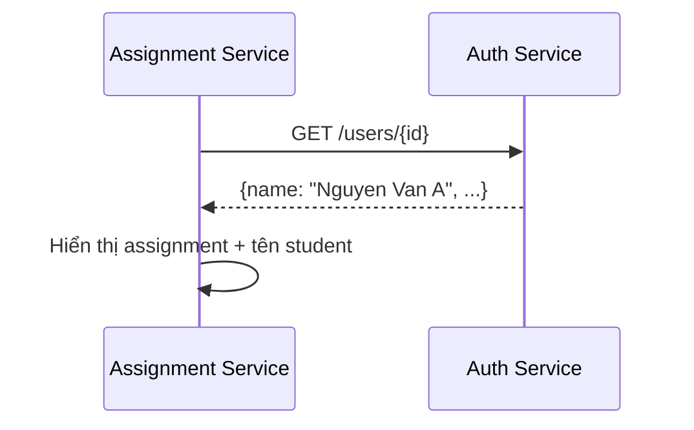

*Hình 7.7: Truy cập dữ liệu xuyên service bằng API Call*

**Bảng 7.7:** Ưu và nhược điểm của API Call pattern

| Ưu điểm | Nhược điểm |
|---------|------------|
| Data luôn mới nhất | Temporal coupling: Auth down → Assignment không hiển thị được tên |
| Không duplicate | Latency tăng: mỗi request = thêm 1 network call |
| Đơn giản | N+1 problem: hiển thị 50 students = 50 API calls |

**2. Data Duplication (Local copy)**

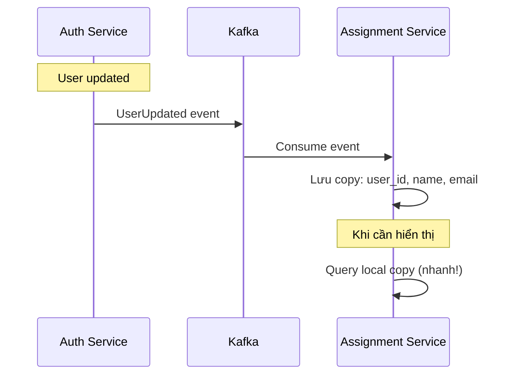

*Hình 7.8: Truy cập dữ liệu xuyên service bằng Data Duplication qua Event Pipeline*

**Bảng 7.8:** Ưu và nhược điểm của Data Duplication pattern

| Ưu điểm | Nhược điểm |
|---------|------------|
| Không runtime dependency | Data có thể stale (eventual consistency) |
| Query nhanh (local) | Cần event pipeline để sync |
| Dùng được khi Auth down | Storage tăng (duplicate data) |

**3. API Composition / Data Aggregation**

Dùng khi cần join data từ nhiều services. Một service (hoặc API Gateway) gọi nhiều services rồi tổng hợp. Richardson trong [2a, Ch.7] gọi đây là **API Composition pattern**:

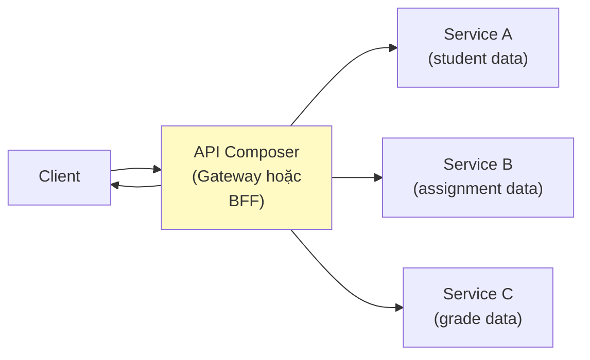

*Hình 7.9: API Composition pattern — Gateway hoặc BFF gọi nhiều services và tổng hợp*

Ví dụ: hiển thị bảng xếp hạng contest cần data từ Core (submissions) và Auth (user names). API Composer gọi cả hai services, sau đó **in-memory join** — batch fetch user IDs để tránh N+1 problem, rồi `stream().map()` kết hợp thành `LeaderboardEntry`.


### Khi nào chấp nhận duplication?

Newman trong [4b] đưa ra nguyên tắc rõ ràng: **"Duplication is far better than coupling."** Tuy nhiên, đây không phải giấy phép duplicate mọi thứ. Quy tắc:

**Bảng 7.9:** Khi nào chấp nhận data duplication

| Data | Nên duplicate? | Lý do |
|------|---------------|-------|
| **Reference data** (tên user, tên khóa học) | ✅ Có | Ít thay đổi, cần hiển thị ở nhiều nơi |
| **Transactional data** (điểm số, trạng thái submission) | ❌ Không | Thay đổi liên tục, cần single source of truth |
| **Configuration** (loại database, danh mục) | ✅ Có | Gần như static, cache tốt |
| **Audit data** (lịch sử thay đổi) | ⚠️ Tùy | Duplicate cho reporting OK, nhưng master ở source |

> **📐 Nguyên tắc — Single Source of Truth**
>
> Duplication is acceptable *only when* there is a clear **single source of truth**. Service A owns the data, Service B holds a copy. When data changes, the change flows from A → B (via events), never B → A. Nếu không rõ "ai sở hữu data này?", đó là tín hiệu bounded context chưa rõ ràng — quay lại Ch.2.

> **🔍 Phân tích gap — Cross-service queries trong LMS**
>
> Hệ thống LMS hiện dùng **Feign calls** để query dữ liệu xuyên service — ví dụ: Assignment Service gọi Core Service để lấy danh sách câu hỏi. Đây là API call pattern (chiến lược 1). Với quy mô hiện tại (vài trăm students, request thấp), cách này chấp nhận được. Tuy nhiên, trong contest mode (100+ students, liên tục query), mỗi page load có thể trigger 5-10 Feign calls → latency tăng đáng kể.
>
> **Migration path**: (1) identify data nào Assignment cần *hiển thị* từ Core (chủ yếu reference data: tên câu hỏi, tên cuộc thi), (2) duplicate reference data qua Kafka events (UserUpdated, QuestionUpdated), (3) giữ Feign calls cho transactional queries (kiểm tra điểm real-time).

---

## 7.4 CQRS — Command Query Responsibility Segregation

### Từ CQS đến CQRS

Trước khi nói về CQRS, cần hiểu nguồn gốc. Bertrand Meyer đề xuất **CQS** (Command Query Separation) như một nguyên tắc thiết kế *ở cấp độ method*: mỗi method hoặc trả về dữ liệu (query, không thay đổi state) hoặc thay đổi state (command, không trả về dữ liệu) — nhưng không làm cả hai. Rocha trong [5, §4.5.1] phân biệt rõ: **CQS là nguyên tắc ở cấp single-service/single-class**, còn **CQRS mở rộng nguyên tắc này lên cấp kiến trúc hệ thống** — tách hẳn *model* (thậm chí *database*) cho read và write. CQRS không bắt buộc phải có CQS, nhưng tinh thần tương tự: tách biệt trách nhiệm đọc và ghi.

### Vấn đề: cùng model cho read và write không đủ

Trong monolith, cùng một entity `Submission` phục vụ cả hai mục đích:
- **Write**: nộp bài (INSERT), cập nhật kết quả (UPDATE)
- **Read**: hiển thị lịch sử (SELECT nhiều cột, JOIN nhiều bảng, pagination, filtering)

Yêu cầu read và write khác nhau cơ bản. Write cần **consistency**, validation, business rules. Read cần **performance**, denormalized data, flexible queries. Khi hệ thống phức tạp, một model duy nhất phải thỏa hiệp cả hai — và thường không tối ưu cho bên nào [2a, Ch.7].

Richardson trong [2a, Ch.7] mô tả vấn đề này đặc biệt nghiêm trọng khi cần **cross-service queries**: hiển thị bảng xếp hạng contest (data từ Core + Judge + Auth) bằng một query duy nhất — *không thể* khi data nằm ở nhiều databases.

### CQRS pattern

**CQRS** (Command Query Responsibility Segregation) tách model thành hai phần riêng biệt [2a, Ch.7]:

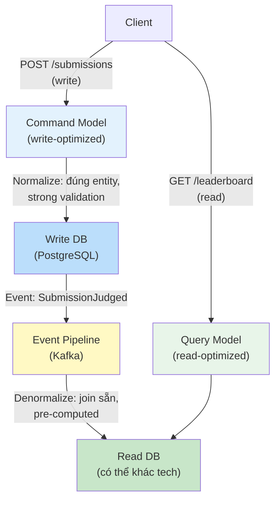

*Hình 7.10: CQRS pattern — tách command model (write) và query model (read)*

**Command side** (write):
- Normalized data model (đúng 3NF)
- Strong validation, business rules
- Database: PostgreSQL (ACID transactions)

**Query side** (read):
- Denormalized, pre-joined views
- Tối ưu cho specific query patterns
- Database: có thể khác technology (Elasticsearch cho search, Redis cho leaderboard, PostgreSQL materialized view cho reports)

### Khi nào cần CQRS?

CQRS thêm complexity đáng kể — **đừng dùng khi không cần** [5, §4.5]:

**Bảng 7.10:** Khi nào cần CQRS

| Scenario | Cần CQRS? | Lý do |
|----------|-----------|-------|
| Read/write ratio cân bằng, cùng model | ❌ Không | CRUD đơn giản là đủ |
| Read phức tạp (cross-service join) | ✅ Có | Query model denormalized giải quyết join |
| Read volume >> Write volume | ✅ Có | Scale read model độc lập |
| UI cần real-time views (leaderboard) | ✅ Có | Pre-computed views nhanh hơn |
| Team nhỏ, MVP phase | ❌ Không | Complexity tax quá cao cho lợi ích |

### Ví dụ: Leaderboard trong Contest Mode

Trong LMS, bảng xếp hạng contest cần join data từ nhiều nguồn:

Bảng xếp hạng cần data từ nhiều services (Auth, Core) — SQL JOIN truyền thống không thể khi database đã tách.

Với CQRS, leaderboard có **read model riêng**: write side publish `ScoreUpdatedEvent` mỗi khi submission được chấm, read side consume event và cập nhật `LeaderboardEntry` denormalized (đã chứa sẵn `userName`, `totalScore`). Query leaderboard chỉ cần `findByContestIdOrderByTotalScoreDesc()` — đơn giản, nhanh, không cần JOIN.

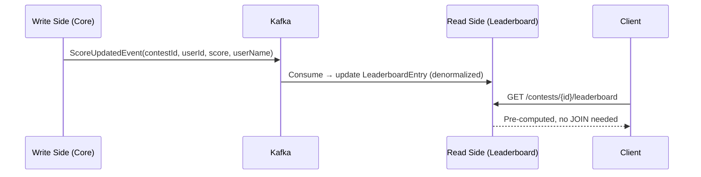

*Hình 7.11: CQRS cho Leaderboard — write side publish events, read side denormalized*

> **📐 Nguyên tắc — CQRS ≠ Event Sourcing**
>
> CQRS và Event Sourcing thường được nhắc đến cùng nhau, nhưng chúng là **hai pattern độc lập**. CQRS tách read/write model — có thể dùng mà không cần Event Sourcing. Event Sourcing lưu events thay vì state — có thể dùng mà không cần CQRS. Kết hợp cả hai rất mạnh nhưng cũng *rất phức tạp*. Richardson trong [2a, Ch.6] khuyến nghị: bắt đầu với CQRS đơn giản trước, thêm Event Sourcing *khi có nhu cầu cụ thể* (audit trail, temporal queries).

---

## 7.5 Event Sourcing — Lưu Events thay vì State

### Vấn đề: mất lịch sử khi chỉ lưu state

Với database truyền thống, chúng ta lưu **trạng thái hiện tại** (*current state*): `submission.status = JUDGED, score = 85`. Mọi thay đổi trước đó bị ghi đè — không biết submission đã qua những trạng thái nào, ai thay đổi, khi nào.

Trong nhiều domain (tài chính, audit, legal), lịch sử thay đổi có giá trị ngang bằng hoặc hơn trạng thái hiện tại. Ngay cả trong LMS: "sinh viên nộp bài 3 lần, lần đầu sai, lần 2 đúng một phần, lần 3 đúng hoàn toàn" — thông tin này giá trị cho phân tích học tập, nhưng nếu chỉ lưu `status = CORRECT`, lịch sử bị mất.

### Event Sourcing pattern

**Event Sourcing** thay đổi cách lưu trữ: thay vì lưu state, lưu **chuỗi events** (sự kiện) đã xảy ra. State hiện tại được **derive** bằng cách replay tất cả events [2a, Ch.6]:

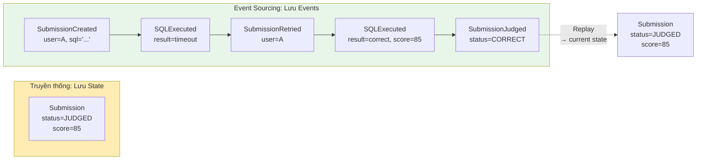

*Hình 7.12: Event Sourcing — lưu chuỗi events thay vì chỉ state hiện tại*

Kleppmann trong [7, Ch.11] giải thích: Event Sourcing coi event log là **nguồn sự thật** (*source of truth*), còn state views (database tables, materialized views) là **derived data** — có thể rebuild bất kỳ lúc nào bằng cách replay events.

**Bảng 7.11:** Ưu và nhược điểm của Event Sourcing

| Ưu điểm | Nhược điểm |
|---------|------------|
| **Full audit trail** — mọi thay đổi đều được ghi | **Complexity** — rebuild state cần replay, performance concern |
| **Temporal queries** — "state tại thời điểm T?" | **Event schema evolution** — events cũ format khác events mới |
| **Debug dễ hơn** — replay events để reproduce bugs | **Eventual consistency** — state views luôn "chậm hơn" events |
| **Replay** — rebuild state, tạo views mới | **Storage** — event store tăng vô hạn, cần snapshots |
| **Kết hợp CQRS** — events tự nhiên feed vào read models | **Learning curve** — tư duy khác hoàn toàn so với CRUD |

### Snapshot Pattern — Giải quyết Performance của Event Replay

Khi số lượng events tăng (1 submission có 5 events, 100,000 submissions = 500,000 events), replay toàn bộ để lấy state hiện tại trở nên **chậm không chấp nhận được**. **Snapshot pattern** giải quyết:

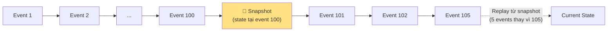

*Hình 7.12: Snapshot pattern — replay từ snapshot thay vì từ đầu*

**Bảng 7.12:** Chiến lược snapshot

| Chiến lược snapshot | Khi nào tạo | Trade-off |
|-------------------|------------|-----------|
| **Mỗi N events** | Sau mỗi 100 events | Đơn giản, predictable |
| **Time-based** | Mỗi 1 giờ | Phù hợp khi event rate đều |
| **On-demand** | Khi read request cần state | Lazy — chỉ tạo khi cần |

### Projection Rebuilds — Tạo lại Views từ Events

Một trong những lợi ích mạnh nhất của Event Sourcing: **tạo views mới mà không cần migration**. Ví dụ trong LMS:

1. Tháng 1: chỉ cần bảng `submissions` (score per question)
2. Tháng 6: cần thêm bảng `learning_progress` (trend score theo thời gian per student)
3. Với CRUD: cần database migration + backfill data (khó/không thể nếu data bị ghi đè)
4. Với Event Sourcing: **replay toàn bộ events** qua projection mới → `learning_progress` tự động được tạo với full history

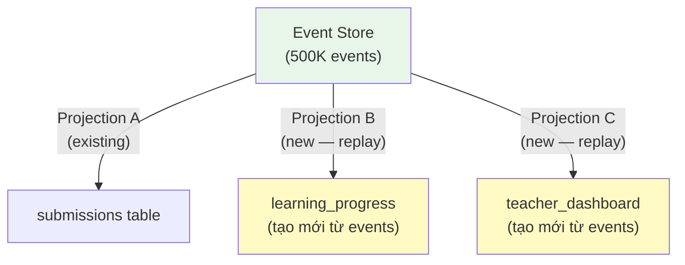

*Hình 7.13: Projection Rebuilds — tạo views mới từ events mà không cần migration*

**Bảng 7.13:** Event Store — các công cụ phổ biến

| Event Store | Mô tả | Phù hợp khi |
|------------|-------|-------------|
| **EventStoreDB** | Database chuyên dụng cho Event Sourcing (by Greg Young) | Cần full ES features: subscriptions, projections, temporal queries |
| **Axon Framework** | Java framework cho CQRS + ES, tích hợp Spring | Team Java/Spring, cần opinionated framework |
| **Kafka** (with caveats) | Message broker với infinite retention | Đã dùng Kafka, chỉ cần event streaming (không cần query by aggregate) |
| **PostgreSQL + custom** | Relational DB với events table | Team nhỏ, muốn đơn giản, dùng DB đã quen |

> **💡 Tip — Kafka ≈ Event Store?**
>
> Kafka với retention vĩnh viễn (infinite retention) có thể hoạt động như event store. LMS đã dùng Kafka cho submission pipeline (Ch.5). Về lý thuyết, messages trên topic `submissions` và `judge-results` *chính là* chuỗi events. Tuy nhiên, Kafka được thiết kế là message broker, không phải event store chuyên dụng — querying events theo entity ID khó hơn so với EventStoreDB hoặc Axon. Kleppmann trong [7, Ch.11] phân tích: Kafka phù hợp cho **event streaming** (*process events real-time*), còn Event Sourcing cần **event store** (*query events by aggregate*). Hai use cases liên quan nhưng khác nhau.

### Event Schema Evolution — Versioning Events

Events, giống API (Ch.3), cần **schema evolution** khi business thay đổi. Nhưng khác API: events đã lưu *không thể sửa* — event store là append-only. Hai chiến lược:

**1. Upcasting** — Khi load events cũ, transform sang format mới trước khi apply:

**Listing 7.1:** Upcasting — transform events cũ sang format mới

```
// Event v1 (2024): { type: "SubmissionCreated", userId: "123", sql: "SELECT ..." }
// Event v2 (2025): { type: "SubmissionCreated", userId: "123", sql: "SELECT ...", language: "SQL" }
// Upcaster: nếu event thiếu "language" → set default "SQL"
```

**2. Weak schema** — Events chứa extra fields mà consumer bỏ qua nếu không hiểu (Tolerant Reader — Ch.3). Thêm fields mới → events cũ vẫn valid.

> **📐 Nguyên tắc — Events là Facts, không phải Commands**
>
> Events mô tả *điều đã xảy ra* (past tense: `SubmissionJudged`), không phải *yêu cầu* (`JudgeSubmission`). Events immutable — không bao giờ sửa/xóa event đã lưu. Nếu cần "undo", thêm event mới: `SubmissionResultCorrected`. Richardson trong [2a, Ch.6] nhấn mạnh: đây là *business decision*, không phải *technical decision* — domain experts nên đặt tên events.

### Khi nào dùng Event Sourcing?

**Bảng 7.14:** Khi nào dùng Event Sourcing

| Scenario | Phù hợp? | Lý do |
|----------|----------|-------|
| **Audit requirements** (tài chính, compliance) | ✅ Rất phù hợp | Cần lịch sử đầy đủ, không thể xóa |
| **Temporal analysis** (phân tích xu hướng) | ✅ Phù hợp | Query "trạng thái tại thời điểm X" tự nhiên |
| **CRUD đơn giản** (quản lý users, settings) | ❌ Không | Overhead quá lớn cho lợi ích nhỏ |
| **Domain phức tạp** (đơn hàng, booking) | ✅ Phù hợp | Business events map trực tiếp vào domain events |
| **LMS submission tracking** | ⚠️ Tùy | Có giá trị cho learning analytics, nhưng hiện tại team nhỏ → không ưu tiên |

---

## 7.6 Case Study: Quản lý dữ liệu trong hệ thống LMS

### Hiện trạng

Phân tích source code LMS cho thấy kiến trúc dữ liệu hiện tại:

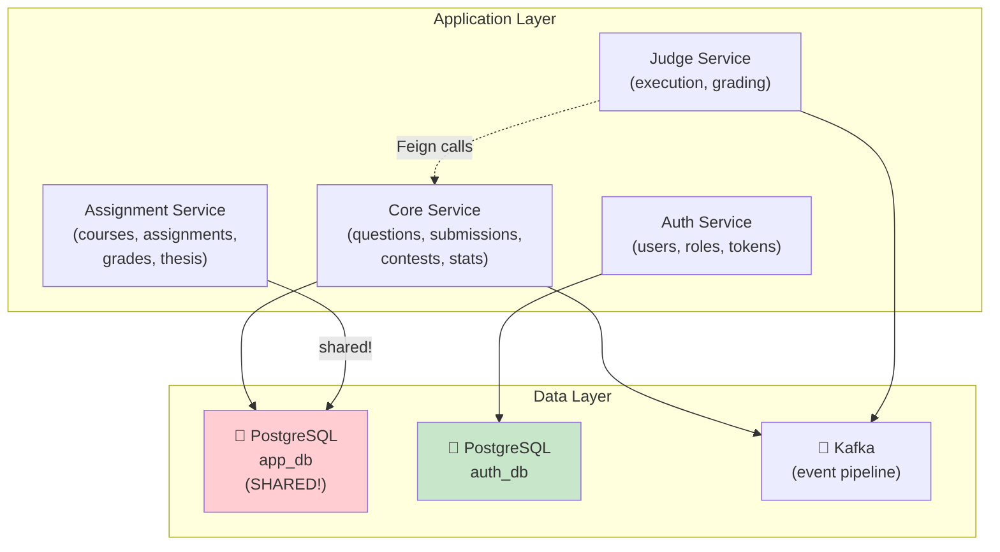

*Hình 7.14: Kiến trúc dữ liệu hiện tại của LMS — shared database là gap chính*

**Quan sát chính:**

1. **Auth Service** — đã tách database riêng (`auth_db`) → ✅ đúng database-per-service
2. **Core + Assignment** — chia sẻ `app_db` → ❌ vi phạm database-per-service
3. **Judge Service** — không có database riêng, dữ liệu transient → ✅ stateless (OK)
4. **Cross-service data** — dùng Feign calls → ⚠️ runtime dependency

### Phân tích cross-service query patterns

LMS sử dụng hai pattern để truy vấn dữ liệu xuyên service: (1) **Interface Projections** (Spring Data JPA) — query trả về lightweight projection thay vì full entity, giảm data transfer, (2) **Feign calls** — gọi API service khác khi cần data ngoài boundary.

### Từ hiện trạng đến best practice

**Bảng 7.15:** Tổng hợp vấn đề data management trong LMS và chiến lược migration

| # | Vấn đề | Hiện trạng LMS | Chiến lược migration |
|---|--------|---------------|---------------------|
| 1 | **Shared database** | Core + Assignment cùng `app_db` | Separate schema → Full split |
| 2 | **Cross-service joins** | Cross-table query trực tiếp | Thay bằng Feign hoặc event-based copy |
| 3 | **Leaderboard query** | SQL JOIN trực tiếp | CQRS — pre-computed read model |
| 4 | **Submission history** | CRUD (chỉ lưu current state) | Event Sourcing (cho analytics) |
| 5 | **User reference data** | Feign call mỗi khi cần | Local copy via events |

### Đề xuất migration path

**Phase 1 — Schema Separation** (ưu tiên cao, effort thấp):
Tách `app_db` thành schema `core_schema` và `assignment_schema`. Mỗi service chỉ có quyền truy cập schema riêng.

**Phase 2 — API-based Data Access** (effort trung bình):
Thay cross-schema queries bằng Feign calls — Assignment gọi Core API `GET /api/questions/batch` thay vì query trực tiếp `core_schema.questions`.

**Phase 3 — Event-based Data Duplication** (effort trung bình):
Core publish `QuestionUpdated` events khi câu hỏi thay đổi. Assignment consume và lưu local copy (chỉ reference data: title, difficulty). Giảm runtime dependency cho read operations.

**Phase 4 — CQRS cho Leaderboard** (effort cao, giá trị lớn cho contest mode):
Tách leaderboard thành read model riêng. Kafka events (`ScoreUpdated`) feed vào denormalized leaderboard table. Query trả kết quả trong <10ms thay vì complex JOIN.

---

> **⚠️ Sai lầm thường gặp**
>
> 1. **Chia database quá sớm** — Tách database trước khi hiểu rõ data access patterns. Hậu quả: phát hiện hai service cần JOIN data liên tục, phải build event pipeline phức tạp cho thứ trước đây chỉ cần SQL JOIN. *Phòng tránh*: bắt đầu với separate schema (cùng DB server), theo dõi cross-schema queries 2-4 tuần, rồi mới quyết định tách hoàn toàn.
> 2. **Dùng CQRS cho mọi thứ** — Áp dụng CQRS/Event Sourcing cho CRUD đơn giản (quản lý users, settings). Hậu quả: complexity tăng 3-5x, team mất thời gian maintain event pipeline cho data thay đổi 1 lần/tuần. *Phòng tránh*: CQRS chỉ khi read pattern phức tạp (cross-service join, high read volume, real-time views). CRUD là đủ cho 80% use cases.
> 3. **Duplicate data nhưng không xác định source of truth** — Copy data giữa services mà không rõ "ai sở hữu data này?" Hậu quả: hai services cùng sửa data → conflict, không biết bản nào đúng. *Phòng tránh*: mỗi data entity chỉ có **duy nhất một service sở hữu** — các bản copy khác là read-only replicas, chỉ update qua events từ owner.
> 4. **Quên xử lý replication lag** — Sau khi write vào service A, ngay lập tức read từ read model (service B) và thấy data cũ. Hậu quả: user nộp bài thành công nhưng leaderboard chưa cập nhật → confusion. *Phòng tránh*: UI pattern "optimistic update" — hiển thị kết quả dự kiến ngay, cập nhật khi event đến (đã thảo luận trong Ch.6 §6.5).

---

## Tổng kết

Quản lý dữ liệu là bài toán phức tạp nhất khi chuyển từ monolith sang microservices — phức tạp hơn cả việc tách application code. Database-per-service không chỉ là nguyên tắc kỹ thuật mà là **điều kiện tiên quyết** cho independent deployability — mục tiêu cốt lõi của microservices. CAP Theorem nhắc nhở: trong hệ thống phân tán, consistency và availability luôn phải đánh đổi khi có network partition — mọi quyết định data management đều mang theo trade-off này.

Năm chiến lược tách database (view → wrapping service → separate schema → data transfer → full split) cho phép migration **incremental** — không cần "big bang". Với team nhỏ như LMS, bắt đầu từ separate schema là bước đi thực tế nhất.

Data duplication không phải anti-pattern — đây là **trade-off có chủ đích** để giảm runtime coupling. Nguyên tắc: mỗi data chỉ có một source of truth, các bản copy là read-only replicas fed bằng events. Newman đã nói rõ: "Duplication is far better than coupling."

CQRS (mở rộng từ nguyên tắc CQS của Meyer) tách read model và write model — giải quyết bài toán cross-service queries và high-volume reads. Event Sourcing bổ sung bằng cách lưu lịch sử đầy đủ thay vì chỉ state hiện tại. Cả hai đều mạnh mẽ nhưng phức tạp — chỉ áp dụng khi có nhu cầu cụ thể, không phải mặc định.

Một bài toán liên quan chặt chẽ là **distributed transactions** — khi một business operation cần thay đổi data ở nhiều services. Saga pattern (đã thảo luận chi tiết ở Ch.6) là giải pháp: chuỗi local transactions + compensating actions thay vì distributed ACID transaction. Saga và data management bổ trợ nhau: database-per-service tạo ra nhu cầu Saga, còn CQRS/Event Sourcing cung cấp event pipeline mà Saga sử dụng.

Phân tích LMS cho thấy gap nghiêm trọng nhất là shared database giữa Core và Assignment — vi phạm database-per-service và gây deploy coupling. Migration path rõ ràng: separate schema → API wrapping → event-based duplication → CQRS cho leaderboard. Mỗi phase độc lập, có thể dừng ở bất kỳ phase nào khi "đủ tốt" cho ngữ cảnh.

Ở Chương 8, chúng ta sẽ chuyển sang **API Gateway** — single entry point cho hệ thống microservices: routing, authentication, rate limiting, và cách LMS sử dụng Spring Cloud Gateway.

---

## Đọc thêm

**Sách tham khảo chính:**
1. [4b] Sam Newman, *Monolith to Microservices* — Ch.4: Decomposing the Database, Database-per-service patterns
2. [2a] Chris Richardson, *Microservices Patterns*, 1st Ed. — Ch.6: Event Sourcing; Ch.7: Implementing Queries (API Composition, CQRS)
3. [7] Martin Kleppmann, *Designing Data-Intensive Applications* — Ch.5: Replication; Ch.6: Partitioning; Ch.7,9: Transactions & CAP; Ch.11: Stream Processing, Event Sourcing

**Sách bổ trợ:**
4. [3] Ronnie Mitra, *Microservices: Up and Running* — Ch.5: Data Delegate Pattern, Event Sourcing in practice
5. [5] Hugo Rocha, *Practical Event-Driven MS Architecture* — §4.5: CQS vs CQRS, Command Sourcing; Ch.5: CAP in real world, eventual consistency
6. [6] Eric Evans, *Domain-Driven Design* — Aggregate design → data ownership per bounded context

**Chương liên quan:**
- **Ch.6: Saga Pattern** — Distributed transactions, orchestration vs choreography, compensating actions. Saga giải quyết bài toán "thay đổi data ở nhiều services trong một business transaction" — complement trực tiếp cho database-per-service.

**Nguồn trực tuyến:**
- Martin Fowler, "CQRS" — martinfowler.com/bliki/CQRS.html
- Greg Young, "CQRS Documents" — cqrs.files.wordpress.com
- Confluent, "Event Sourcing with Kafka" — developer.confluent.io
