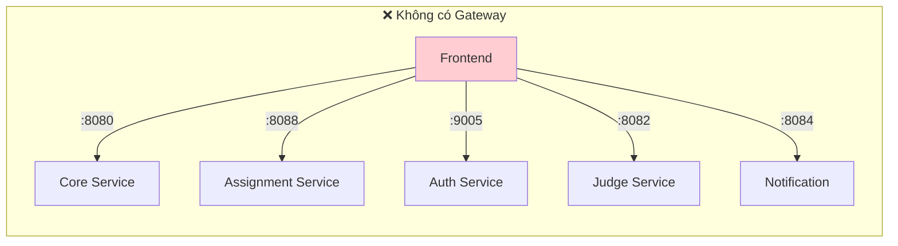
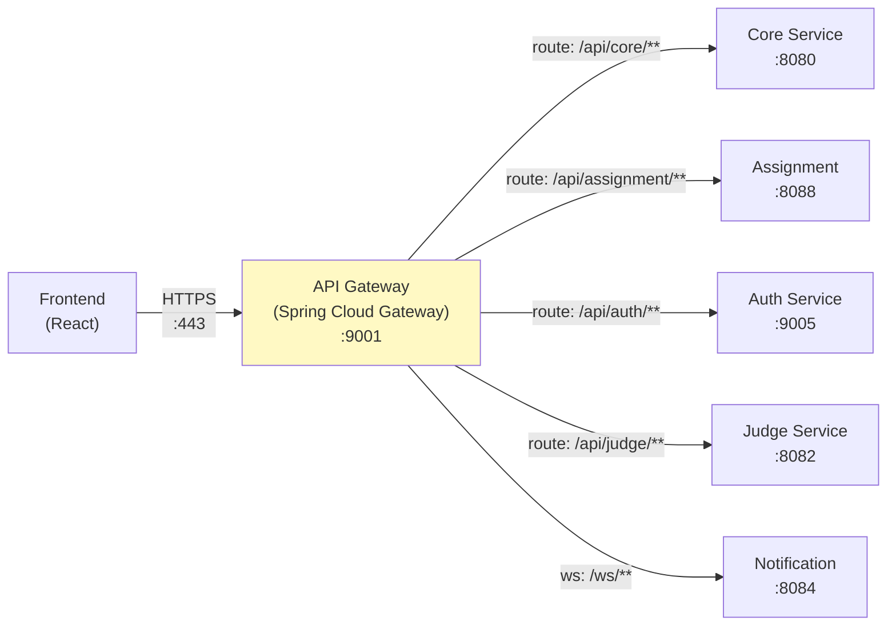
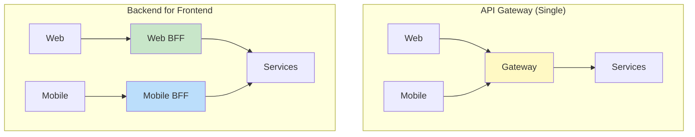
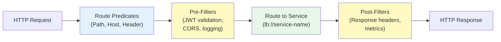
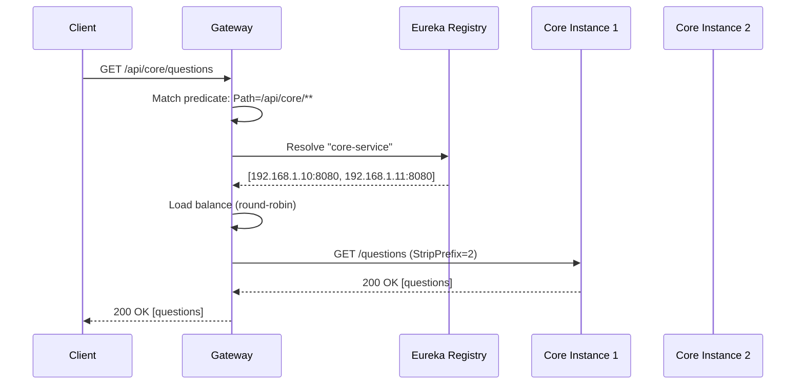
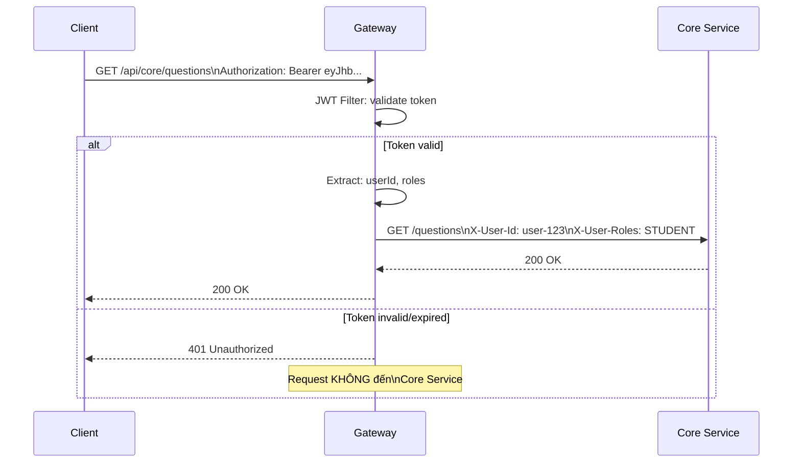
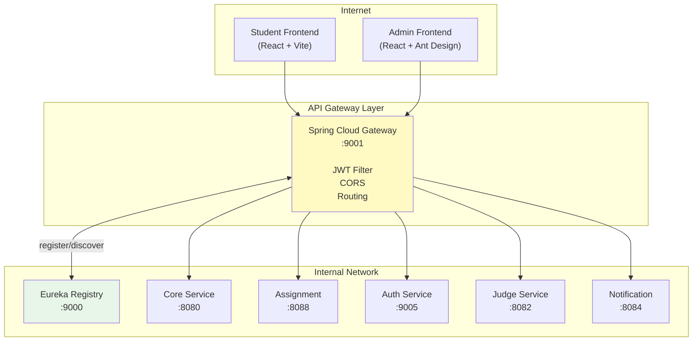

# Chương 8: API Gateway

> *"The API Gateway is the single entry point for all clients. It handles cross-cutting concerns so that individual services don't have to."*
> — Chris Richardson, *Microservices Patterns* [2a]

---

## Bạn sẽ học được gì

- Hiểu tại sao microservices cần API Gateway và các vấn đề nó giải quyết
- Nắm vững API Gateway pattern và Backend for Frontend (BFF) pattern
- Sử dụng Spring Cloud Gateway (WebFlux) để triển khai gateway
- Cấu hình route với Eureka service discovery (load-balanced URIs)
- Thiết kế cross-cutting concerns tại gateway: authentication, CORS, rate limiting
- Phân tích kiến trúc gateway trong hệ thống LMS

---

## 8.1 API Gateway Pattern — Tại sao cần?

### Vấn đề: client giao tiếp trực tiếp với nhiều services

Khi không có gateway, client (web, mobile) phải biết địa chỉ của *từng* microservice và gọi trực tiếp. Với hệ thống LMS gồm 7+ services, mỗi trang web có thể cần gọi 3-4 services khác nhau:



Richardson trong [2a, Ch.8] liệt kê năm vấn đề khi client gọi trực tiếp:

| # | Vấn đề | Hậu quả |
|---|--------|---------|
| 1 | **Nhiều endpoints** | Client phải biết URL của mọi service — coupling chặt |
| 2 | **Giao thức khác nhau** | Một số service dùng REST, một số dùng gRPC, WebSocket — client phải handle tất cả |
| 3 | **Cross-cutting concerns phân tán** | Mỗi service tự implement authentication, CORS, rate limiting — duplicate, inconsistent |
| 4 | **Network không an toàn** | Internal services bị expose ra Internet — attack surface lớn |
| 5 | **API không phù hợp** | Internal API thiết kế cho service-to-service, không tối ưu cho mobile (quá nhiều calls, payload lớn) |

### API Gateway pattern

API Gateway là **single entry point** — tất cả requests từ client đi qua gateway, gateway route đến đúng service:



Gateway xử lý **cross-cutting concerns tập trung**: authentication, CORS, rate limiting, logging, SSL termination. Services phía sau chỉ tập trung vào business logic — không cần biết CORS là gì.

Newman trong [4a, Ch.4] mô tả gateway là "smart pipe" duy nhất được phép trong microservices: các pipes giữa services nên "dumb" (simple routing), nhưng gateway — điểm tiếp xúc với client — cần xử lý cross-cutting concerns.

### API Gateway vs BFF (Backend for Frontend)

Richardson trong [2a, Ch.8] phân biệt hai biến thể:



| Pattern | Mô tả | Khi nào dùng |
|---------|-------|-------------|
| **API Gateway** | Một gateway cho tất cả clients | Team nhỏ, clients cần API tương tự |
| **BFF** | Gateway riêng cho mỗi loại client | Mobile cần API khác web (ít data, batched calls) |

LMS sử dụng **single API Gateway** — phù hợp vì chỉ có 2 web frontends (student + admin) với API requirements tương tự.

**Khi nào cần BFF?** BFF trở nên cần thiết khi different clients có **fundamentally different API needs** — không chỉ "filter bớt fields":

| Scenario | Single Gateway | BFF |
|----------|---------------|-----|
| Web + Web admin (API tương tự) | ✅ Đủ | Over-engineering |
| Web + Mobile (API khác nhau) | ❌ Mobile phải nhiều calls | ✅ Mobile BFF aggregate |
| Web + IoT + Partner API | ❌ Gateway quá phức tạp | ✅ BFF per client type |

Ví dụ: nếu LMS thêm **mobile app** cho sinh viên, mobile cần: (1) **batched API** — màn hình "Dashboard" cần gọi 1 API trả về cả profile, recent submissions, leaderboard rank (thay vì 3 calls — mobile network chậm hơn), (2) **reduced payload** — mobile không cần HTML-ready data, chỉ cần raw data nhẹ, (3) **push notification integration** — gateway riêng cho mobile xử lý device tokens.

Newman trong [4a, Ch.4] khuyến nghị: BFF nên **owned by frontend team** — team mobile viết Mobile BFF, team web viết Web BFF. Mỗi BFF là thin layer: nhận request từ client → gọi downstream services → aggregate + transform → trả về format phù hợp cho client đó.

---

## 8.2 Spring Cloud Gateway — Reactive Gateway

### Vấn đề: chọn gateway technology

Hai lựa chọn phổ biến nhất trong Spring ecosystem:

| | Spring Cloud Gateway | Netflix Zuul (1.x) |
|---|---|---|
| **Model** | Reactive (WebFlux, non-blocking) | Servlet (blocking, thread-per-request) |
| **Performance** | Cao (ít threads, nhiều connections) | Thấp hơn (thread pool giới hạn) |
| **Status** | Active, recommended | Deprecated (Netflix không maintain) |
| **WebSocket** | Native support | Không hỗ trợ |
| **Ecosystem** | Spring Cloud tích hợp sẵn | Legacy |

LMS chọn **Spring Cloud Gateway** — lựa chọn đúng vì cần WebSocket support (cho notification push) và reactive performance.

### Kiến trúc Spring Cloud Gateway



Ba khái niệm cốt lõi:

| Concept | Mô tả | Ví dụ LMS |
|---------|-------|-----------|
| **Route** | Mapping: predicate → URI đích | `/api/core/**` → `lb://core-service` |
| **Predicate** | Điều kiện match request | `Path=/api/core/**`, `Method=GET,POST` |
| **Filter** | Xử lý request/response trước/sau routing | `JwtRequestFilter`, `AddRequestHeader` |

### Dependency

Gateway sử dụng `spring-cloud-starter-gateway` (WebFlux) + `spring-cloud-starter-netflix-eureka-client`. **Lưu ý**: Gateway dựa trên WebFlux (reactive, non-blocking) — *không thể* dùng chung với `spring-boot-starter-web` (servlet, blocking). Thêm `spring-boot-starter-web` vào Gateway project → conflict, gateway không khởi động.

---

## 8.3 Route Configuration với Eureka

### Vấn đề: routes hardcoded hay dynamic?

Cách đơn giản nhất: hardcode URL cho mỗi service trong gateway config. Nhưng khi service scale (3 instances) hoặc di chuyển (deploy lên container mới), URL thay đổi — ai cập nhật gateway?

Giải pháp: kết hợp gateway routing với **Eureka service discovery** (đã học ở Ch.4). Gateway không cần biết IP:port cụ thể — chỉ cần tên service, Eureka giải quyết phần còn lại.

### LMS Gateway Route Configuration

```yaml
# application-lb.yml — LMS Gateway routing configuration
spring:
  cloud:
    gateway:
      routes:
        # Core Service — questions, submissions, contests
        - id: core-service
          uri: lb://core-service          # lb:// = Eureka lookup + load balance
          predicates:
            - Path=/api/core/**
          filters:
            - StripPrefix=2               # /api/core/questions → /questions

        # Assignment Service — courses, grades
        - id: assignment-service
          uri: lb://assignment-service
          predicates:
            - Path=/api/assignment/**
          filters:
            - StripPrefix=2

        # Auth Service — login, register
        - id: auth-service
          uri: lb://auth-service
          predicates:
            - Path=/api/auth/**
          filters:
            - StripPrefix=2

        # Notification — WebSocket endpoint
        - id: notification-ws
          uri: lb://notification-service
          predicates:
            - Path=/ws/**
```

### Cách `lb://` hoạt động



`lb://core-service` thực hiện ba bước tự động:
1. **Lookup**: query Eureka tìm tất cả instances có tên `core-service`
2. **Load balance**: chọn instance bằng Spring Cloud LoadBalancer (round-robin mặc định)
3. **Forward**: gửi request đến instance được chọn

`StripPrefix=2` loại bỏ 2 phần đầu tiên của path: `/api/core/questions` → `/questions`. Nhờ đó, service không cần biết nó được mount ở `/api/core/` — service chỉ cần handle path của chính nó.

> **📐 Nguyên tắc — Service không biết Gateway**
>
> Services phía sau gateway *không nên biết* gateway tồn tại. Mỗi service handle path riêng (`/questions`, `/users`), gateway thêm prefix và route. Điều này đảm bảo: (1) service test được standalone (không cần gateway), (2) đổi route structure ở gateway không ảnh hưởng service code, (3) services portable — có thể deploy sau gateway khác (NGINX, Kong) mà không đổi code.

---

## 8.4 Cross-Cutting Concerns tại Gateway

### Vấn đề: mỗi service tự xử lý authentication, CORS, logging

Nếu mỗi service tự validate JWT token, tự configure CORS, tự implement rate limiting — code bị duplicate ở 5-7 services, mỗi lần thay đổi policy phải update tất cả. Đây chính là vấn đề gateway giải quyết: **tập trung cross-cutting concerns tại một điểm duy nhất**.

### 1. Authentication — JWT Validation tại Gateway

LMS implement JWT validation ở gateway thông qua custom `GatewayFilter`:

```java
// Gateway JWT Filter — validate token trước khi route
@Component
public class JwtRequestFilter implements GatewayFilterFactory<JwtRequestFilter.Config> {
    
    private final JwtUtil jwtUtil;
    
    @Override
    public GatewayFilter apply(Config config) {
        return (exchange, chain) -> {
            String path = exchange.getRequest().getURI().getPath();
            
            // Skip auth cho public endpoints
            if (isPublicEndpoint(path)) {
                return chain.filter(exchange);
            }
            
            // Extract JWT từ Authorization header
            String token = extractToken(exchange.getRequest());
            if (token == null || !jwtUtil.validateToken(token)) {
                exchange.getResponse().setStatusCode(HttpStatus.UNAUTHORIZED);
                return exchange.getResponse().setComplete();
            }
            
            // Forward user info tới downstream services
            ServerHttpRequest mutatedRequest = exchange.getRequest().mutate()
                .header("X-User-Id", jwtUtil.getUserId(token))
                .header("X-User-Roles", jwtUtil.getRoles(token))
                .build();
            
            return chain.filter(exchange.mutate().request(mutatedRequest).build());
        };
    }
}
```

Luồng xử lý:



Services phía sau nhận user info qua **custom headers** (`X-User-Id`, `X-User-Roles`) — không cần validate JWT lại. Đây là pattern **claims-based identity propagation**: gateway validate token, services tin tưởng gateway (vì traffic internal).

### 2. CORS — Cross-Origin Resource Sharing

CORS tại gateway = **một nơi duy nhất** quản lý origins, methods, headers. Cấu hình `globalcors` trong Spring Cloud Gateway cho phép khai báo `allowedOrigins` (domains hợp lệ), `allowedMethods`, `allowCredentials` — services phía sau không cần CORS config vì gateway đã xử lý.

> **🔍 Phân tích gap — LMS CORS `allowAll`**
>
> Hệ thống LMS hiện cấu hình `allowedOrigins: "*"` — cho phép *mọi* origin gọi API. Trong development, đây là cách đơn giản để tránh CORS errors. Trong production, đây là **rủi ro bảo mật**: bất kỳ website nào có thể gọi API của LMS bằng credentials của user (CSRF attack). **Migration**: (1) liệt kê rõ các origins hợp lệ (student frontend, admin frontend), (2) thêm `allowCredentials: true` cho cookie-based auth, (3) test kỹ với mobile app nếu có.

### 3. Rate Limiting

Rate limiting ngăn một client gửi quá nhiều requests — bảo vệ services khỏi abuse hoặc DDoS. Spring Cloud Gateway hỗ trợ sẵn `RequestRateLimiter` filter kết hợp Redis: cấu hình `replenishRate` (requests/giây), `burstCapacity` (burst tối đa), và `KeyResolver` (rate limit theo user, IP, hoặc route).

| Chiến lược rate limit | Mô tả | Use case |
|----------------------|-------|----------|
| **Per user** | Mỗi user N requests/giây | Ngăn user abuse |
| **Per IP** | Mỗi IP address N requests/giây | Ngăn anonymous abuse |
| **Per route** | Mỗi endpoint N requests/giây | Bảo vệ heavy endpoints |
| **Global** | Tổng requests hệ thống | Bảo vệ infrastructure |

### 4. Logging & Tracing

Gateway là điểm lý tưởng để gắn **correlation ID** — unique ID theo dõi request xuyên suốt hệ thống. Pattern: `GlobalFilter` tại gateway kiểm tra header `X-Correlation-Id`, nếu chưa có thì generate UUID mới, gắn vào request → truyền qua mọi downstream service. Khi debug, grep logs bằng correlation ID để thấy *toàn bộ* journey của request (xem thêm Ch.11 Observability).

---

## 8.5 Case Study: Gateway trong hệ thống LMS

### Kiến trúc tổng thể



### Phân tích configuration

| Aspect | Hiện trạng LMS | Best Practice | Gap |
|--------|---------------|---------------|-----|
| **Routing** | `lb://` URIs qua Eureka | ✅ Đúng | — |
| **JWT Validation** | Custom `JwtRequestFilter` | ✅ Đúng (validate tại edge) | — |
| **CORS** | `allowedOrigins: "*"` | ❌ Nên restrict | Liệt kê origins cụ thể |
| **Rate Limiting** | Không có | ❌ Nên có | Redis + RequestRateLimiter |
| **SSL/TLS** | Không ở gateway level | ⚠️ Tùy deployment | Thường terminate tại NGINX/LB |
| **Correlation ID** | Không có | ⚠️ Nên thêm | GlobalFilter gắn UUID |
| **Path Rewriting** | `StripPrefix` filters | ✅ Đúng | — |
| **WebSocket** | Route tới notification service | ✅ Đúng | — |
| **Health Check** | Actuator endpoints | ✅ Đúng | — |

### Vấn đề JWT Version Inconsistency

Một vấn đề đáng chú ý trong LMS: gateway sử dụng **JJWT 0.11.5** (API mới: `parserBuilder()`) trong khi các services khác sử dụng **JJWT 0.9.1** (API cũ: `parser()`). Với HS256 đơn giản, hai versions tương thích ở happy path. Tuy nhiên, khi upgrade hoặc thêm RS256, version mismatch có thể gây inconsistent validation — gateway accept nhưng service reject, hoặc ngược lại.

> **🔍 Phân tích gap — JWT library version inconsistency**
>
> Gateway dùng JJWT 0.11.5, services dùng 0.9.1. Với HS256 symmetric key đơn giản, hai versions tương thích ở happy path. Tuy nhiên, khi upgrade hoặc thêm tính năng (RS256, token refresh), version mismatch gây lỗi khó debug. **Migration path**: (1) thống nhất JJWT version trong parent POM, (2) extract JWT logic vào shared library đã thống nhất, (3) dài hạn: cân nhắc Spring Security OAuth2 Resource Server (built-in JWT support, không cần custom JwtUtil).

### Đề xuất migration

**Phase 1 — Security Hardening** (ưu tiên cao, effort thấp):
- Restrict CORS origins (liệt kê frontend URLs cụ thể)
- Thống nhất JJWT version

**Phase 2 — Observability** (ưu tiên trung bình):
- Thêm `X-Correlation-Id` GlobalFilter
- Request/response logging tại gateway

**Phase 3 — Protection** (ưu tiên trung bình):
- Rate limiting per user (Redis + RequestRateLimiter)
- Request size limits cho file upload endpoints

---

> **⚠️ Sai lầm thường gặp**
>
> 1. **Đưa business logic vào gateway** — Gateway xử lý data transformation, validation rules, hoặc orchestrate calls giữa services. Hậu quả: gateway trở thành monolith mới — mọi thay đổi business đều phải deploy gateway. *Phòng tránh*: gateway chỉ handle cross-cutting concerns (auth, CORS, routing, rate limiting). Business logic thuộc về services.
> 2. **Validate JWT ở cả gateway lẫn services** — Mỗi service vẫn tự validate JWT token dù gateway đã validate. Hậu quả: duplicate logic, latency tăng (mỗi request validate 2 lần), inconsistency khi JWT library version khác nhau. *Phòng tránh*: gateway validate JWT và truyền claims qua trusted headers (`X-User-Id`). Services tin tưởng gateway (traffic internal, không expose ra Internet).
> 3. **Không có fallback khi gateway down** — Gateway là single point of entry = single point of failure. Hậu quả: gateway crash → *toàn bộ* hệ thống unreachable. *Phòng tránh*: deploy gateway HA (nhiều instances + load balancer phía trước), cấu hình health checks, tự động restart.
> 4. **CORS `allowAll` trong production** — Cho phép mọi origin gọi API bằng user credentials. Hậu quả: rủi ro CSRF, bất kỳ website nào đều có thể thao tác API thay mặt user. *Phòng tránh*: liệt kê rõ origins hợp lệ, test kỹ interaction giữa allowed origins và credentials.

---

## Tổng kết

API Gateway giải quyết một trong những thách thức cơ bản nhất khi client tương tác với hệ thống microservices: thay vì biết địa chỉ của từng service, client chỉ cần biết một endpoint duy nhất. Gateway đảm nhận routing, authentication, CORS, và các cross-cutting concerns — services phía sau tập trung vào business logic.

Spring Cloud Gateway (WebFlux) là lựa chọn hiện đại cho Java ecosystem — reactive, non-blocking, tích hợp sâu với Spring Cloud (Eureka, Circuit Breaker). Route configuration với `lb://` URIs kết hợp service discovery và load balancing tự động — services có thể scale mà không cần thay đổi gateway config.

Cross-cutting concerns tại gateway — JWT validation, CORS, rate limiting, correlation ID — là đầu tư giúp hệ thống bảo mật, dễ debug, và dễ vận hành. Nguyên tắc: gateway xử lý infrastructure concerns, services xử lý business logic — ranh giới rõ ràng, trách nhiệm rõ ràng.

Phân tích LMS cho thấy gateway architecture cơ bản đúng (Spring Cloud Gateway + Eureka + JWT), nhưng thiếu rate limiting, CORS quá mở, và JWT library version inconsistency. Migration path rõ ràng: hardening trước (CORS, JWT version), observability sau (correlation ID, logging), protection cuối (rate limiting).

Ở Chương 9, chúng ta sẽ đi sâu vào **bảo mật microservices** — JWT structure, OAuth2 integration, dual validation strategy, và RBAC trong hệ thống LMS.

---

## Đọc thêm

**Sách tham khảo chính:**
1. [2a] Chris Richardson, *Microservices Patterns*, 1st Ed. — Ch.8: External API Patterns (API Gateway, BFF)
2. [4a] Sam Newman, *Building Microservices* — Ch.4: Integration, Smart Endpoints and Dumb Pipes
3. [1] Thomas Erl, *SOA Analysis & Design* — API Gateway trong enterprise SOA context

**Sách bổ trợ:**
4. [2b] Chris Richardson, *Microservices Patterns*, 2nd Ed. — Ch.8: External API Patterns (updated)
5. [5] Hugo Rocha, *Practical Event-Driven MS Architecture* — Ch.9: UI in EDA, BFF pattern

**Nguồn trực tuyến:**
- Spring Cloud Gateway reference — docs.spring.io/spring-cloud-gateway
- Netflix Zuul → Spring Cloud Gateway migration guide
- OWASP API Security Top 10 — owasp.org/www-project-api-security
