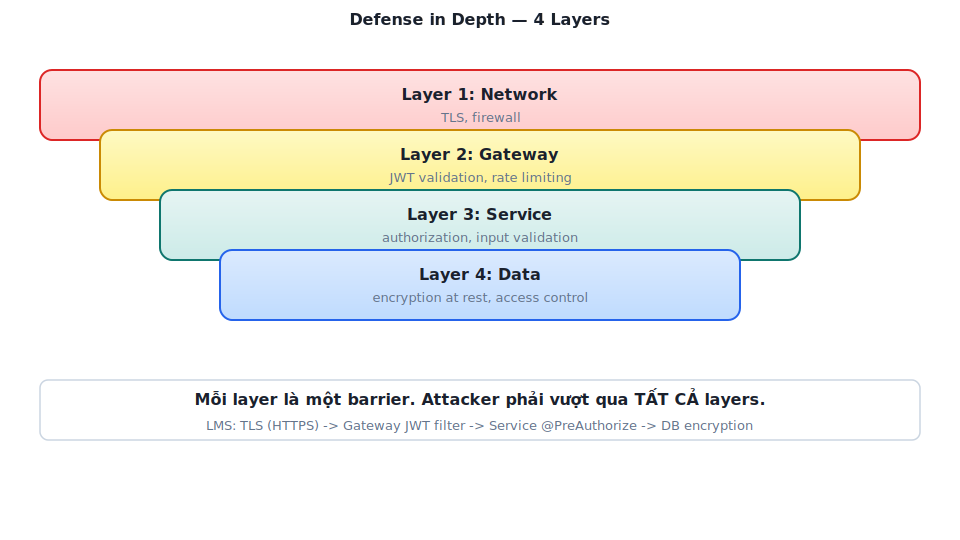
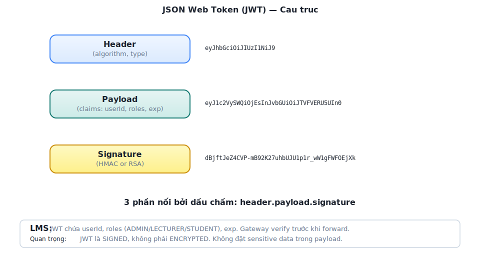
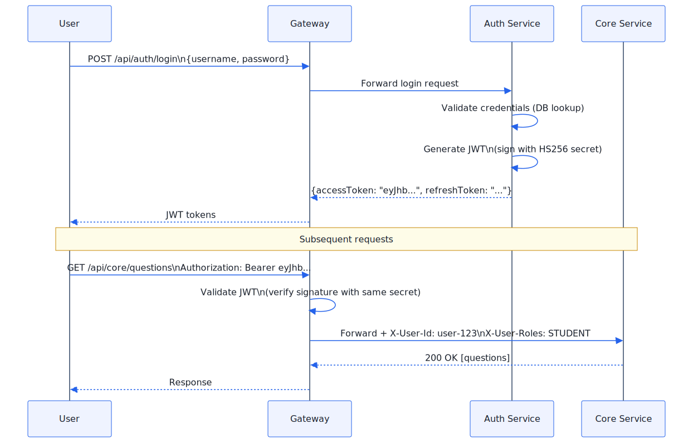
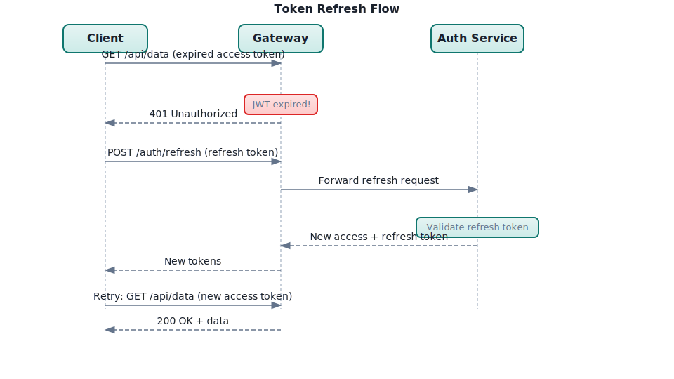
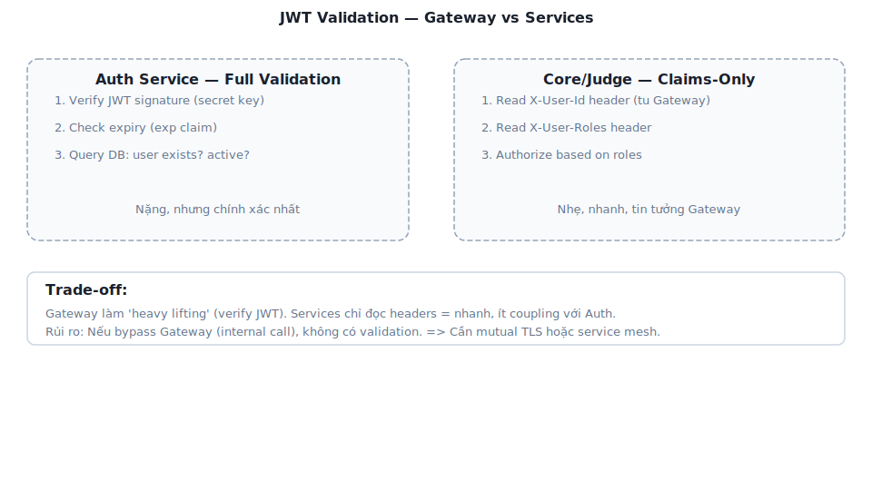
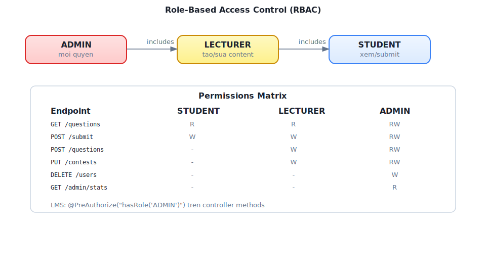
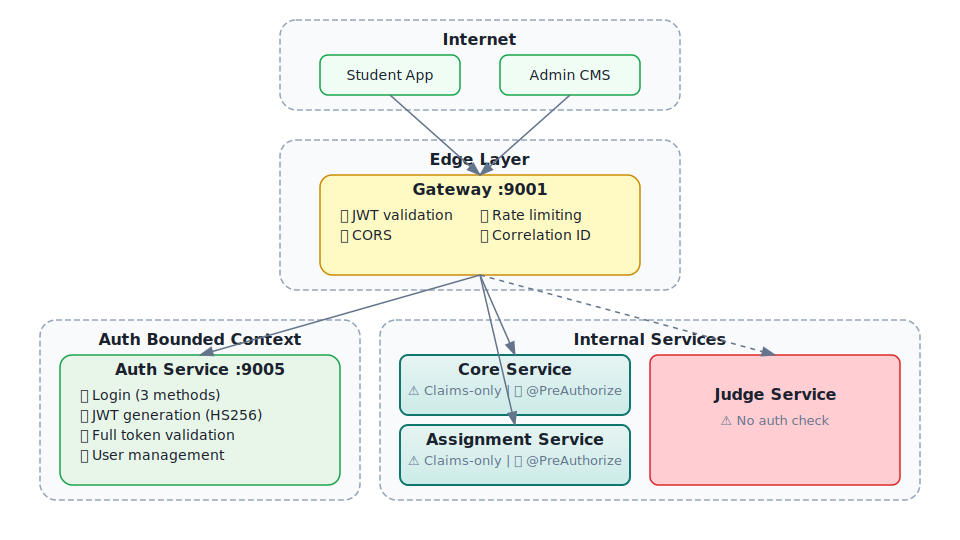
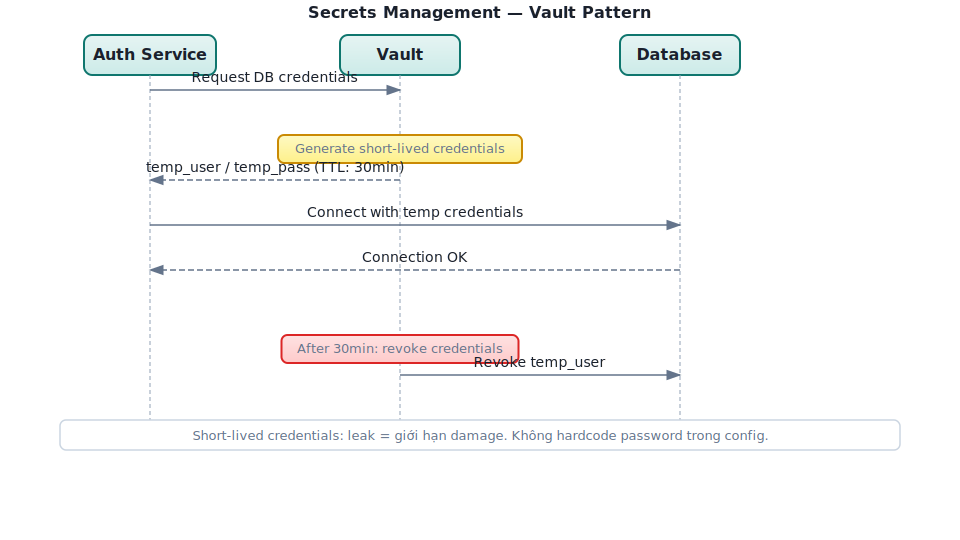

# Chương 9: Bảo mật Microservices

> *"Security is not an afterthought. In a distributed system, every service is a potential attack surface."*
> — Sam Newman, *Building Microservices* [4a]

---

## Bạn sẽ học được gì

- Hiểu các thách thức bảo mật đặc thù của kiến trúc microservices
- Nắm vững cấu trúc JWT (JSON Web Token): header, payload, signature
- Phân biệt hai chiến lược validation: DB-based (full validation) vs claims-only (stateless)
- Hiểu OAuth2 flow và tích hợp external identity provider (Google)
- Thiết kế RBAC (Role-Based Access Control) cho hệ thống đa vai trò
- Phân tích kiến trúc bảo mật của hệ thống LMS

---

## 9.1 Security Challenges trong Microservices

### Vấn đề: attack surface mở rộng

Trong monolith, bảo mật tập trung tại một điểm: một ứng dụng, một database, một authentication layer. Khi chuyển sang microservices, attack surface mở rộng theo số lượng services:



*Hình 9.1: Monolith (1 điểm bảo vệ) vs Microservices (N điểm bảo vệ)*

Newman trong [4a, Ch.9] liệt kê năm thách thức bảo mật đặc thù:

**Bảng 9.1:** Thách thức bảo mật trong microservices

| # | Thách thức | Monolith | Microservices |
|---|-----------|----------|---------------|
| 1 | **Authentication** | Một session store | Mỗi service cần verify identity — ai là user? |
| 2 | **Authorization** | Check in-process | Mỗi service cần check permissions — user có quyền gì? |
| 3 | **Service-to-service trust** | Không có (in-process) | Service A gọi B — B biết A có đáng tin? |
| 4 | **Data in transit** | Internal (in-process) | Network calls — cần encryption (TLS) |
| 5 | **Secret management** | Một config file | N services × M secrets = quản lý phức tạp |

### Nguyên tắc "Defense in Depth"

Bảo mật microservices dựa trên nguyên tắc **defense in depth** — không dựa vào một lớp bảo vệ duy nhất:



*Hình 9.2: Defense in Depth — bảo vệ nhiều lớp từ network đến data*

Trong thực tế, mức độ áp dụng tùy thuộc vào **trust boundary**. Nếu mọi service chạy trong private network (VPC) và chỉ gateway expose ra Internet, trust boundary nằm tại gateway — services bên trong có thể "trust" lẫn nhau ở mức độ nhất định.

> **📐 Nguyên tắc — Zero Trust vs Pragmatic Trust**
>
> "Zero Trust" (mọi request đều verify, mọi service đều nghi ngờ) là lý tưởng. Trong thực tế, team nhỏ thường áp dụng **pragmatic trust**: gateway verify identity, services tin tưởng gateway. Newman trong [4a, Ch.9] ghi nhận: mức trust phù hợp phụ thuộc vào risk profile — hệ thống tài chính cần zero trust, hệ thống nội bộ có thể pragmatic trust. LMS là hệ thống academic nội bộ → pragmatic trust là hợp lý.

### Advanced: mTLS, Secrets Management, OAuth2 Scopes

Khi hệ thống scale hoặc risk profile tăng (thêm payment, personal data), cần nâng cấp bảo mật:

**mTLS (Mutual TLS)** — Trong TLS thông thường, chỉ client verify server (browser verify HTTPS certificate). Trong mTLS, **cả hai bên verify nhau**: Service A gọi Service B → B verify certificate của A, A verify certificate của B. Ngăn service lạ gọi vào internal API.

**Bảng 9.2:** So sánh không có mTLS và có mTLS

| Aspect | Không mTLS | Có mTLS |
|--------|----------|---------|
| Internal calls | HTTP không mã hóa | TLS mã hóa + mutual authentication |
| Attacker vào network | Có thể gọi bất kỳ service | Bị từ chối vì thiếu certificate |
| Implementation | Đơn giản | Cần certificate management (cert-manager, Istio) |

Trong LMS, mTLS hiện chưa cần (hệ thống nội bộ, single host). Nhưng nếu LMS deploy trên cloud với nhiều nodes → mTLS ngăn lateral movement nếu một node bị compromise.

**Secrets Management** — Credentials (DB passwords, API keys, JWT secrets) không nên nằm trong code hoặc Docker images:

**Bảng 9.3:** Các cấp độ lưu trữ secrets

| Level | Cách lưu secrets | Rủi ro |
|-------|-----------------|--------|
| ❌ Hardcode | `password: "abc123"` trong code | Lộ qua git history |
| ⚠️ Environment variables | `.env` file, Docker env | Lộ qua `docker inspect`, process listing |
| ✅ Secrets manager | HashiCorp Vault, AWS Secrets Manager | Encrypted, audit log, rotation |

LMS hiện dùng environment variables (đủ cho scope academic) — nhưng JWT secret nên rotate định kỳ và không commit vào git.

**OAuth2 Scopes** — Hiện tại LMS RBAC dùng roles (STUDENT, LECTURER, ADMIN). OAuth2 scopes mở rộng: thay vì "user có role ADMIN", scope cho phép "client application X có quyền `read:submissions` nhưng không có `write:grades`". Phù hợp khi LMS expose API cho third-party (mobile app độc lập, integration với hệ thống khác).

---

## 9.2 JWT — Cấu trúc và Cơ chế

### Vấn đề: sessions không scale trong microservices

Trong monolith, authentication thường dùng **server-side session**: user login → server tạo session → lưu trong memory/Redis → trả session ID (cookie). Mỗi request kèm cookie → server lookup session → biết user.

Trong microservices, session store tạo **centralized dependency**: mọi service phải query cùng session store → bottleneck, single point of failure. Nếu mỗi service có session store riêng, user phải login lại khi chuyển service.

### JWT (JSON Web Token)

**JWT** giải quyết bằng cách mã hóa identity information *vào chính token* — stateless, không cần session store [4a, Ch.9]:

```
eyJhbGciOiJIUzI1NiIsInR5cCI6IkpXVCJ9.           ← Header
eyJ1c2VySWQiOiJ1c2VyLTEyMyIsInJvbGVzIjoiU1R      ← Payload
VREVOVF9BRE1JTiIsImV4cCI6MTcxMDAwMDAwMH0.
SflKxwRJSMeKKF2QT4fwpMeJf36POk6yJV_adQssw5c      ← Signature
```

Ba phần của JWT:



*Hình 9.3: Cấu trúc JWT — Header, Payload, Signature*

**Bảng 9.4:** Ba phần của JWT — nội dung và ví dụ

| Phần | Nội dung | Ví dụ LMS |
|------|---------|-----------|
| **Header** | Algorithm + type | `{"alg": "HS256", "typ": "JWT"}` |
| **Payload** | Claims (dữ liệu) | `{"userId": "user-123", "roles": "STUDENT", "exp": 1710000000}` |
| **Signature** | Verify integrity | `HMACSHA256(header + "." + payload, secretKey)` |

### HS256 vs RS256

**Bảng 9.5:** HS256 (symmetric) vs RS256 (asymmetric)

| | HS256 (Symmetric) | RS256 (Asymmetric) |
|---|---|---|
| **Key** | Shared secret key | Private key (sign) + Public key (verify) |
| **Ai sign?** | Auth Service (có secret) | Auth Service (có private key) |
| **Ai verify?** | Bất kỳ service nào có secret | Bất kỳ service nào có public key |
| **Security** | Secret bị lộ → sign + verify đều bị | Private key bị lộ → sign bị, verify không ảnh hưởng |
| **Key rotation** | Phải update tất cả services | Chỉ update Auth Service (private key) |
| **Use case** | Internal services, trust boundary rõ | Public APIs, nhiều third-party verifiers |

### JWT Flow trong LMS



*Hình 9.4: JWT Flow trong LMS — login, token generation, và subsequent requests*

> **🔍 Phân tích gap — LMS dùng HS256 với shared secret**
>
> Hệ thống LMS sử dụng HS256 (symmetric) — tất cả services chia sẻ cùng `jwt.secretKey`. Trong production, nếu bất kỳ service nào bị compromise, attacker có thể tạo JWT token giả mạo cho bất kỳ user nào. Với LMS (academic, internal), rủi ro chấp nhận được vì trust boundary ở gateway. **Migration path** (khi cần nâng security): (1) chuyển sang RS256 — Auth Service giữ private key, các service khác chỉ có public key, (2) dùng Spring Security OAuth2 Resource Server (built-in JWT verification), (3) key rotation qua config server.

### Token Refresh & Rotation — Vòng đời của JWT

JWT có thời hạn (`exp`). Khi access token hết hạn, user phải **re-authenticate** — kém trải nghiệm nếu session dài (giảng viên dùng suốt buổi giảng). **Refresh token** giải quyết: access token ngắn (15-60 phút), refresh token dài (7-30 ngày). Khi access token hết hạn, client dùng refresh token để nhận access token mới — không cần login lại.



*Hình 9.5b: Token Refresh & Rotation flow — access token mới + refresh token mới*

**Token Rotation** là chiến lược quan trọng: mỗi lần dùng refresh token, **cả refresh token cũng được thay mới** (rotate) và token cũ bị invalidate. Lợi ích: nếu refresh token bị đánh cắp và reuse, Auth Service phát hiện token đã dùng → **invalidate toàn bộ token family** → buộc user login lại [4a, Ch.9].

**Listing 9.1:** Token refresh endpoint với rotation

```java
// Auth Service — Token refresh với rotation
@PostMapping("/refresh")
public TokenResponse refreshToken(@RequestBody RefreshRequest request) {
    RefreshToken stored = refreshTokenRepository
        .findByToken(request.getRefreshToken())
        .orElseThrow(() -> new AuthException("Invalid refresh token"));

    // Kiểm tra đã bị dùng chưa (reuse detection)
    if (stored.isUsed()) {
        // Token reuse detected! → Invalidate toàn bộ family
        refreshTokenRepository.invalidateFamily(stored.getFamily());
        throw new AuthException("Token reuse detected — please login again");
    }

    // Kiểm tra hết hạn
    if (stored.isExpired()) {
        throw new AuthException("Refresh token expired");
    }

    // Mark token cũ là đã dùng
    stored.setUsed(true);
    refreshTokenRepository.save(stored);

    // Generate tokens mới (cùng family)
    User user = stored.getUser();
    String newAccessToken = jwtUtil.generateAccessToken(user);  // 30 phút
    String newRefreshToken = createRefreshToken(user, stored.getFamily()); // 7 ngày

    return new TokenResponse(newAccessToken, newRefreshToken);
}
```

**Bảng 9.5b:** Chiến lược token expiry

| Token | Thời hạn | Lưu ở đâu | Lý do |
|-------|---------|-----------|-------|
| **Access token** | 15-60 phút | Client memory/cookie | Ngắn → giảm window nếu bị leak |
| **Refresh token** | 7-30 ngày | HttpOnly cookie + DB | Dài → trải nghiệm mượt, DB cho revocation |
| **Token family** | Theo refresh token | DB (family ID) | Phát hiện reuse → revoke toàn bộ |

---

## 9.3 Dual Validation Strategy

### Vấn đề: validate ở đâu? Mỗi service hay chỉ gateway?

Hai cách tiếp cận trái ngược:

**Full validation mỗi service** — Mỗi service tự validate JWT, tự query database kiểm tra user còn active, token chưa bị revoke. Ưu: security cao (zero trust). Nhược: mỗi service cần JWT library + DB access + logic duplicate.

**Gateway-only validation** — Chỉ gateway validate, services tin tưởng headers từ gateway. Ưu: simple, không duplicate logic. Nhược: nếu bypass gateway (misconfigured network), services không có protection.

### LMS approach: Dual Validation

LMS implement giải pháp **hybrid** — validation khác nhau tùy service:



*Hình 9.5: Dual Validation — full validation (Auth) vs claims-only (internal services)*

**Bảng 9.6:** Ba loại validation trong LMS

| Validation Type | Service | Khi nào | Chi tiết |
|----------------|---------|--------|----------|
| **Full (DB-based)** | Auth Service | Login, token refresh, sensitive operations | Verify signature + check DB (user active, token valid) |
| **Claims-only** | Gateway | Mọi request | Verify JWT signature + expiry (stateless) |
| **Header-trust** | Core, Judge, Assignment | Mọi request (sau gateway) | Tin tưởng `X-User-Id` và `X-User-Roles` từ gateway |

**Auth Service (full validation)**: verify JWT signature + expiry, query DB (“user still exists and active?”), check token blacklist. Nặng nhưng đảm bảo chính xác — dùng cho login, token refresh, sensitive operations.

**Core/Judge Service (claims-only)**: nhận `X-User-Id` và `X-User-Roles` từ headers (gateway đã inject). Không validate JWT lại — chỉ check authorization: `if (!roles.contains("STUDENT")) throw ForbiddenException`. Nhanh, stateless, tin tưởng gateway (vì traffic internal).

Pattern này gọi là **claims-based identity propagation**: gateway validate token, services phía sau tin tưởng gateway và chỉ focus vào authorization.

> **📐 Nguyên tắc — Validate at the Edge, Authorize at the Service**
>
> Gateway chịu trách nhiệm *authentication* (ai đang gọi?). Service chịu trách nhiệm *authorization* (người này có quyền làm hành động này?). Tách authentication và authorization cho phép mỗi lớp tập trung vào một nhiệm vụ — gateway không cần biết business rules, service không cần biết JWT format.

---

## 9.4 OAuth2 — External Identity Provider

### Vấn đề: quản lý credentials phức tạp

Tự quản lý username/password đòi hỏi: hash passwords (bcrypt), xử lý forgot password, 2FA, brute force protection, compliance. Với team nhỏ, **delegate authentication** cho identity provider chuyên nghiệp (Google, Microsoft, GitHub) giảm đáng kể effort và rủi ro.

### OAuth2 Authorization Code Flow

LMS tích hợp **Google OAuth2** cho đăng nhập — sinh viên dùng tài khoản Google của trường. Flow: User → redirect Google consent → login → callback với authorization code → Auth Service exchange code for tokens (server-to-server) → fetch userinfo → find/create user → generate LMS JWT.

**Điểm quan trọng**: LMS *không dùng* Google token trực tiếp. Sau khi xác thực với Google, Auth Service tạo **JWT riêng của LMS** — services phía sau không biết user login bằng Google hay username/password. Đây là pattern **token exchange**: external token → internal token.

### Multiple Authentication Methods

LMS hỗ trợ ba phương thức đăng nhập:

**Bảng 9.7:** Ba phương thức đăng nhập trong LMS

| Method | Flow | Khi nào |
|--------|------|---------|
| **Username/Password** | Truyền thống, hash bcrypt | Default cho mọi user |
| **Google OAuth2** | Authorization Code Flow | Sinh viên dùng Google của trường |
| **PTIT QLDT** | Custom integration | Login bằng tài khoản quản lý đào tạo |

Tất cả đều converge vào cùng output: **LMS JWT token** (chứa userId, roles, expiry). Auth Service expose `generateTokens(user)` — nhận User entity từ bất kỳ login method nào, trả về `{accessToken, refreshToken}`. Downstream services không phân biệt.


---

## 9.5 RBAC — Role-Based Access Control

### Vấn đề: ai được làm gì?

Authentication trả lời "người dùng là ai?". Authorization trả lời "người dùng được làm gì?". Trong LMS, ba vai trò chính cần permissions khác nhau:

**Bảng 9.8:** RBAC — vai trò và permissions trong LMS

| Role | Permissions | Ví dụ |
|------|------------|-------|
| **STUDENT** | Submit bài, xem kết quả, xem bài tập, xem contest | Sinh viên |
| **LECTURER** | Tất cả STUDENT + tạo bài, tạo contest, xem thống kê | Giảng viên |
| **ADMIN** | Tất cả LECTURER + quản lý users, quản lý hệ thống | Quản trị viên |

### RBAC Implementation trong LMS

LMS dùng Spring Security `@PreAuthorize` annotation với roles lưu trong JWT:

**Listing 9.2:** Spring Security `@PreAuthorize` — RBAC declarative

```java
// Spring Security @PreAuthorize — declarative RBAC
@GetMapping("/questions")
public List<QuestionResponse> getQuestions() { ... }  // Mọi user authenticated

@PreAuthorize("hasAnyRole('LECTURER', 'ADMIN')")
@PostMapping("/questions")
public QuestionResponse create(@RequestBody CreateQuestionRequest r) { ... }

@PreAuthorize("hasRole('ADMIN')")
@DeleteMapping("/questions/{id}")
public void delete(@PathVariable UUID id) { ... }
```

### Role Hierarchy



*Hình 9.6: Role Hierarchy — ADMIN inherits LECTURER inherits STUDENT*

LMS lưu roles dạng **pipe-delimited** trong JWT: `"ADMIN|LECTURER|STUDENT"`. Khi gateway extract roles, nó truyền qua header `X-User-Roles` — Core Service parse và check permissions.

### API-driven Route Protection (Frontend)

LMS frontend sử dụng pattern khác biệt: **route permissions được fetch từ API** (`GET /api/auth/me/permissions`) thay vì hardcoded — response chứa danh sách routes và actions mà user được phép. Frontend dynamic render routes dựa trên permissions này. Ưu điểm: thay đổi permissions ở backend → frontend tự cập nhật, không cần deploy lại.

> **🔍 Phân tích gap — RBAC trong LMS**
>
> LMS implementation hiện tại có vài vấn đề: (1) Roles lưu dạng pipe-delimited string thay vì array — phải parse thủ công, dễ lỗi nếu role name chứa pipe. (2) `@PreAuthorize` annotations phân tán ở mỗi controller — khó audit "user role X có thể access những endpoint nào?". (3) Không có role hierarchy rõ ràng ở Spring Security level — ADMIN phải list cả LECTURER và STUDENT roles.
>
> **Migration path**: (1) chuyển roles sang JSON array trong JWT payload, (2) cấu hình `RoleHierarchy` trong Spring Security, (3) cân nhắc tập trung authorization policies (Spring Security method security hoặc OPA).

---

## 9.6 Case Study: Kiến trúc bảo mật trong hệ thống LMS

### Tổng quan



*Hình 9.7: Kiến trúc bảo mật tổng thể của LMS*

### Phân tích tổng hợp

**Bảng 9.9:** Phân tích bảo mật toàn diện hệ thống LMS

| Aspect | Hiện trạng | Risk Level | Best Practice |
|--------|-----------|------------|---------------|
| **JWT Algorithm** | HS256 (symmetric, shared secret) | ⚠️ Medium | RS256 cho production |
| **Token Storage** | Client-side (localStorage) | ⚠️ Medium | HttpOnly cookie (XSS protection) |
| **Secret Management** | Hardcoded trong application.yml | 🔴 High | Vault, AWS Secrets Manager |
| **CORS** | `allowedOrigins: "*"` | 🔴 High | Restrict to specific origins |
| **Service-to-service auth** | Không có | ⚠️ Medium | mTLS hoặc service token |
| **Rate Limiting** | Không có | ⚠️ Medium | Redis-based rate limiter |
| **Input Validation** | Partial | ⚠️ Medium | Bean Validation (@Valid) |
| **HTTPS** | Gateway level | ✅ Low | — |
| **Password Hashing** | BCrypt | ✅ Low | — |

### Đề xuất migration

**Phase 1 — Quick Wins** (effort thấp, impact cao):
- Restrict CORS origins
- Move secrets ra khỏi application.yml → environment variables (tối thiểu)
- Token vào HttpOnly cookie thay vì localStorage

**Phase 2 — Authentication Hardening** (effort trung bình):
- Chuyển HS256 → RS256
- Thống nhất JWT library version (đã đề cập ở Ch.8)
- Token refresh flow với rotation (mỗi lần refresh → invalidate token cũ)

**Phase 3 — Service Mesh Security** (effort cao, khi scale):
- Service-to-service authentication (mTLS hoặc internal JWT)
- Centralized secret management (HashiCorp Vault)
- API-level authorization policies (Open Policy Agent)

### Secret Management trong Production

Bảng 9.9 cho thấy "Secret Management" là risk level 🔴 High — `jwt.secretKey` hardcoded trong `application.yml` và commit vào Git. Đây là lỗ hổng phổ biến nhất trong microservices và cần được xử lý ở mọi hệ thống production.

**Ba cấp độ Secret Management:**

**Bảng 9.10:** Chiến lược Secret Management — từ cơ bản đến enterprise

| Cấp độ | Cách tiếp cận | Ưu điểm | Nhược điểm | Phù hợp |
|--------|--------------|---------|-----------|---------|
| **Level 1** | Environment Variables | Đơn giản, tách secret khỏi code | Secrets trong plaintext trên server, không audit trail | Dev/Staging |
| **Level 2** | Encrypted Config (Spring Cloud Config + Jasypt) | Secrets mã hóa trong repo, decrypt lúc runtime | Vẫn cần quản lý encryption key | Small production |
| **Level 3** | Secret Manager (HashiCorp Vault, AWS Secrets Manager, GCP Secret Manager) | Auto-rotation, audit log, access policies, dynamic secrets | Infrastructure cost, operational complexity | Production at scale |

**Level 1 — Environment Variables** (LMS nên áp dụng ngay):

Thay vì:
```yaml
# ❌ application.yml — KHÔNG BAO GIỜ commit secrets
jwt:
  secretKey: "mySecretKey123"
  expiration: 86400000
```

Sử dụng:
```yaml
# ✅ application.yml — reference environment variable
jwt:
  secretKey: ${JWT_SECRET_KEY}
  expiration: ${JWT_EXPIRATION:86400000}
```

```bash
# Docker Compose — inject từ .env file (không commit .env)
services:
  auth-service:
    environment:
      - JWT_SECRET_KEY=${JWT_SECRET_KEY}
      - DB_PASSWORD=${DB_PASSWORD}
```

**Level 3 — HashiCorp Vault** (khi hệ thống production hoàn chỉnh):

Vault cung cấp **dynamic secrets** — database credentials được tạo tự động, có thời hạn, và auto-rotate. Không ai biết password database thực sự — kể cả developer.



*Hình 9.8: Vault Dynamic Secrets — credentials tạm thời, tự động xoay vòng*

> **💡 Tip — .env file và .gitignore**
>
> Bước đầu tiên và quan trọng nhất: thêm `.env` vào `.gitignore`. Tạo `.env.example` (không chứa giá trị thật) để team members biết cần set biến nào. Đây là "zero-cost security improvement" mà mọi project nên làm ngay.

---

> **⚠️ Sai lầm thường gặp**
>
> 1. **Lưu JWT trong localStorage** — Bất kỳ JavaScript nào chạy trên page đều đọc được (XSS attack). Hậu quả: nếu có XSS vulnerability, attacker steal token → impersonate user. *Phòng tránh*: lưu JWT trong HttpOnly cookie — JavaScript không thể đọc, trình duyệt tự gửi.
> 2. **Hardcode secrets trong source code** — `jwt.secretKey=mySecretKey123` trong application.yml, commit vào Git. Hậu quả: ai có access repo đều có thể tạo JWT giả mạo. *Phòng tránh*: dùng environment variables (tối thiểu), hoặc secret manager (Vault, AWS Secrets Manager).
> 3. **Không set expiry cho JWT** — Token không bao giờ hết hạn. Hậu quả: token bị leak = access vĩnh viễn, không cách nào revoke. *Phòng tránh*: access token ngắn (15-60 phút), refresh token dài (7-30 ngày) với rotation.
> 4. **Validate JWT ở mỗi service bằng cách khác nhau** — Mỗi service dùng JWT library version khác, parse token khác nhau. Hậu quả: gateway accept nhưng service reject (hoặc ngược lại), debugging rất khó. *Phòng tránh*: thống nhất validation ở gateway, services trust headers (§9.3).
> 5. **Confused Deputy Problem** — Service A gọi Service B thay mặt user, nhưng B không biết A đang "đại diện" cho user hay hành động với quyền riêng của A. Newman trong [4a, Ch.9] gọi đây là *confused deputy attack*. Hậu quả: Service A có thể vô tình escalate privileges — user chỉ có quyền STUDENT nhưng Service A gọi B với full service credentials. *Phòng tránh*: luôn truyền user identity (JWT hoặc headers `X-User-Id`, `X-User-Roles`) trong service-to-service calls — B authorize dựa trên *user* chứ không phải *service gọi*.

---


> **🌐 Trực quan hóa tương tác (Interactive Demo)**
>
> Để hiểu rõ hơn về nội dung chương này, hãy mở file `code/interactive/oauth2-jwt-flow.html` trong mã nguồn đi kèm sách bằng trình duyệt web để trải nghiệm minh họa động về **Luồng xác thực OAuth2 & JWT**.

> Ngoài ra, bạn cũng có thể xem minh họa về **Circuit Breaker Pattern** tại file `code/interactive/circuit-breaker.html`.

## Tổng kết

Bảo mật microservices phức tạp hơn monolith vì attack surface lớn hơn — mỗi service, mỗi network call, mỗi database đều là điểm tiềm ẩn rủi ro. Defense in depth — bảo vệ nhiều lớp, không dựa vào một lớp duy nhất — là nguyên tắc nền tảng.

JWT giải quyết bài toán authentication trong distributed system: stateless, tự chứa identity information, không cần shared session store. HS256 (symmetric) đơn giản nhưng đòi hỏi shared secret — phù hợp cho internal services. RS256 (asymmetric) an toàn hơn cho production với nhiều verifiers.

Dual validation — full validation tại Auth Service, claims-only tại gateway, header-trust tại internal services — là cách tiếp cận thực tế: cân bằng giữa security và performance. OAuth2 cho phép delegate authentication cho identity provider chuyên nghiệp, giảm effort quản lý credentials.

RBAC là mô hình authorization phổ biến nhất — đủ tốt cho hầu hết hệ thống. LMS implement RBAC qua `@PreAuthorize` annotations, nhưng thiếu role hierarchy rõ ràng và authorization policy tập trung.

Phân tích LMS cho thấy kiến trúc bảo mật cơ bản đúng (JWT, gateway validation, RBAC) nhưng có nhiều quick wins cần xử lý: CORS restriction, secret management, token storage. Đây là technical debt bảo mật — không ảnh hưởng tính năng nhưng ảnh hưởng risk profile.

Ở Chương 10, chúng ta sẽ tổng hợp mọi kiến thức từ Chương 1-9 vào **bài toán thực tế nhất**: chuyển đổi từ monolith sang microservices — khi nào nên chuyển, Strangler Fig pattern, tách database, và migration roadmap cho LMS.

---

## Đọc thêm

**Sách tham khảo chính:**
1. [4a] Sam Newman, *Building Microservices* — Ch.9: Security
2. [2a] Chris Richardson, *Microservices Patterns*, 1st Ed. — Ch.11: Developing secure services, Access Token pattern
3. [7] Martin Kleppmann, *Designing Data-Intensive Applications* — Ch.4: Encoding and Evolution (data formats, schema evolution — nền tảng cho hiểu binary/JSON encoding trong tokens và API messages)

**Nguồn trực tuyến:**
- JWT.io — jwt.io (interactive JWT decoder)
- OWASP API Security Top 10 — owasp.org/www-project-api-security
- Spring Security OAuth2 Resource Server — docs.spring.io/spring-security
- RFC 7519 — JSON Web Token (JWT) specification
