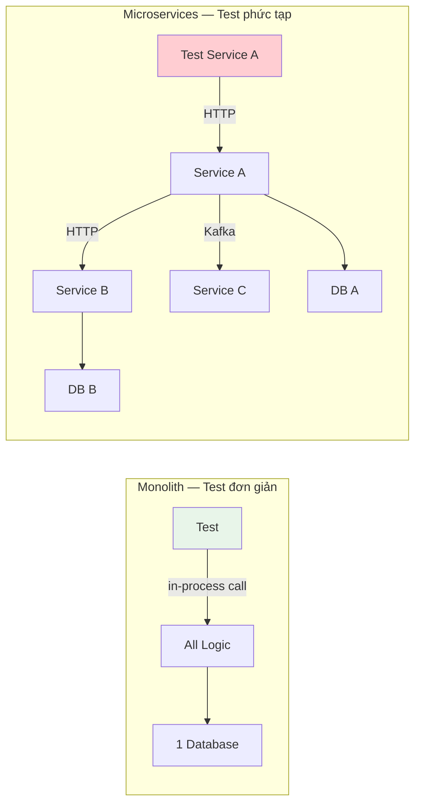
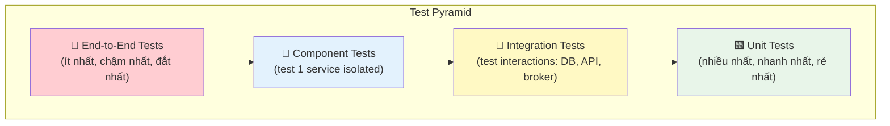
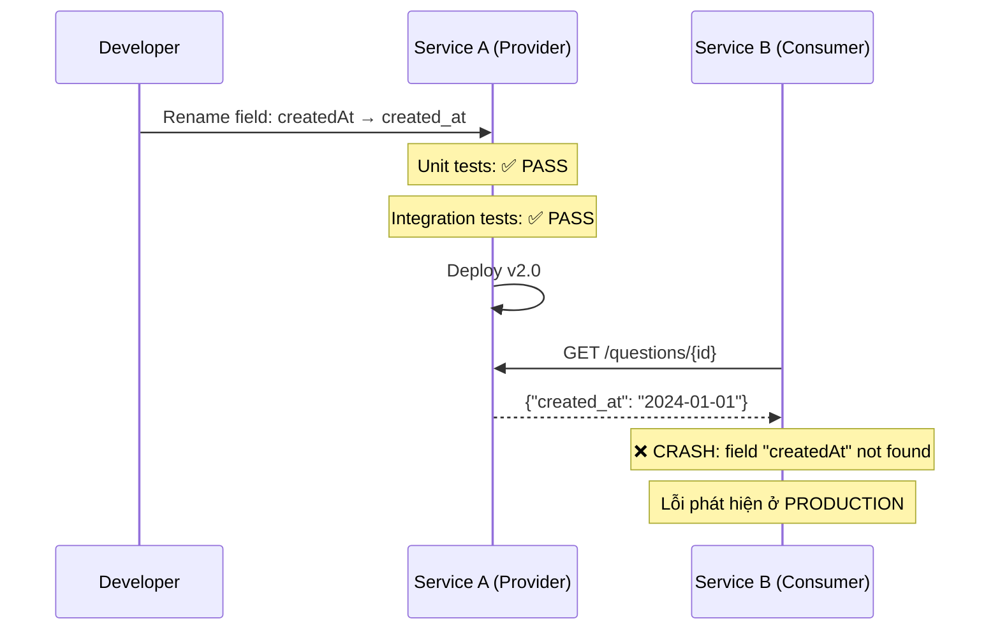
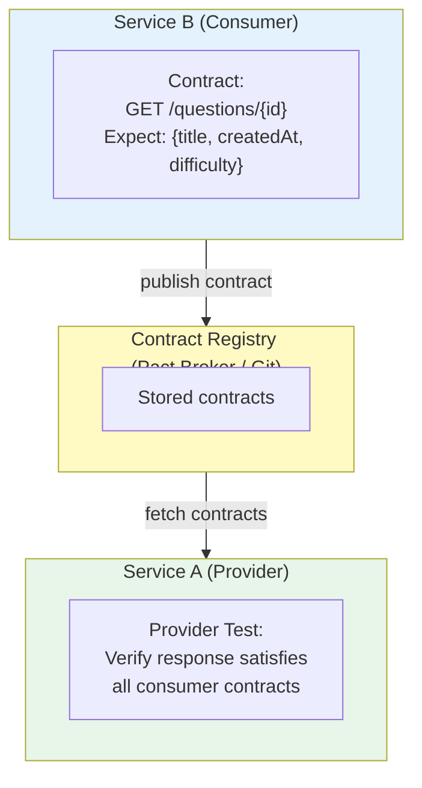
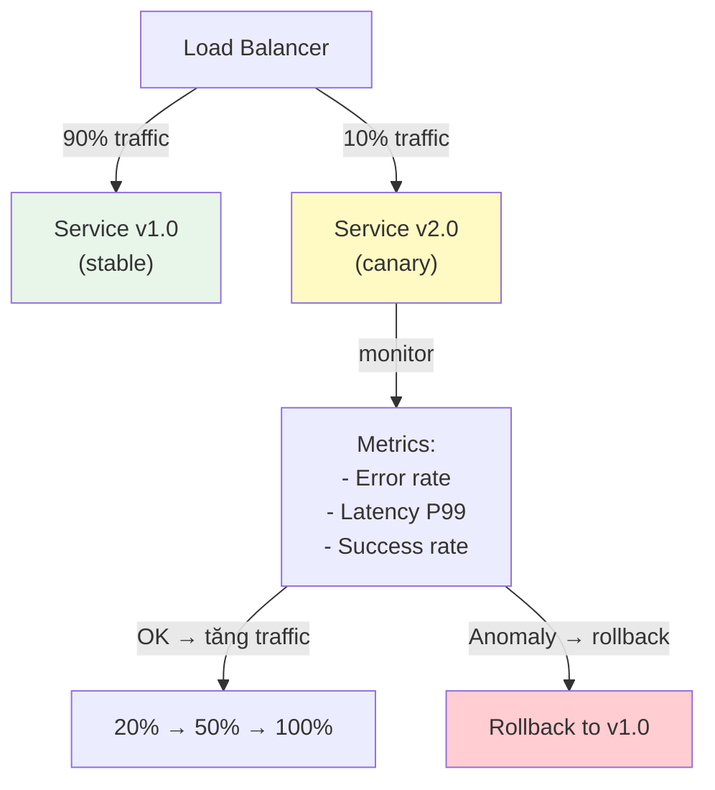
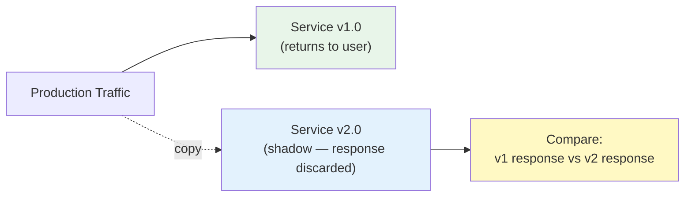
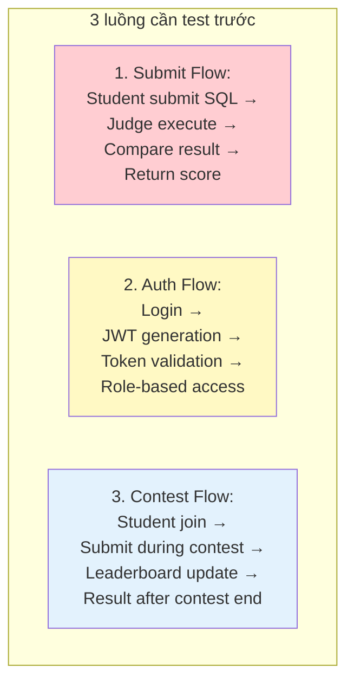
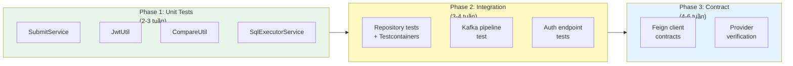

# Chương 10: Kiểm thử Microservices

> *"You haven't mastered a tool until you understand when it should not be used."*
> — Kelsey Hightower (trích dẫn bởi Hugo Rocha, [5])

---

## Bạn sẽ học được gì

- Hiểu tại sao kiểm thử microservices khó hơn monolith và các thách thức đặc trưng
- Nắm vững Test Pyramid và cách áp dụng cho kiến trúc phân tán
- Viết unit tests hiệu quả cho service layer với mocking/stubbing
- Sử dụng integration testing với Testcontainers để test với database/broker thật
- Hiểu Contract Testing (Consumer-Driven Contracts) để ngăn integration breakage
- Áp dụng các chiến lược Testing in Production: Canary, Feature Flags, Shadowing
- Phân tích test strategy của hệ thống LMS và đề xuất migration path

---

## 10.1 Thách thức Kiểm thử trong Microservices

### Vấn đề: từ "một ứng dụng" sang "N services giao tiếp qua network"

Trong monolith, kiểm thử tương đối đơn giản: một codebase, một database, mọi thứ chạy trong cùng process. Gọi hàm `orderService.createOrder()` → kết quả trả về ngay lập tức, không qua network, không có latency, không fail vì timeout.

Trong microservices, mỗi "gọi hàm" trở thành **network call** — HTTP request, Kafka message, hoặc gRPC call. Mỗi network call có thể fail, timeout, hoặc trả về dữ liệu không mong đợi. Kiểm thử không chỉ verify logic, mà phải verify **giao tiếp giữa các services**.



Richardson trong [2a, Ch.9] liệt kê bốn thách thức kiểm thử đặc trưng:

| # | Thách thức | Trong monolith | Trong microservices |
|---|-----------|----------------|---------------------|
| 1 | **Inter-service communication** | In-process (method call) | Network call — có thể fail, timeout |
| 2 | **Data consistency** | ACID transactions | Eventual consistency — state không nhất quán tạm thời |
| 3 | **Service dependencies** | Tất cả trong cùng process | Service A phụ thuộc B, C, D — test A cần B, C, D chạy? |
| 4 | **Deployment pipeline** | Build + test 1 artifact | Build + test N artifacts — thứ tự deploy ảnh hưởng kết quả |

### Test Pyramid trong Microservices

*Test Pyramid* (kim tự tháp kiểm thử) — khái niệm do Mike Cohn đề xuất — là framework phân loại test theo tốc độ, chi phí, và phạm vi:



| Level | Mô tả | Tốc độ | Chi phí | Scope |
|-------|--------|--------|---------|-------|
| **Unit** | Test một class/method isolated, mock dependencies | Rất nhanh (ms) | Rất thấp | Một function/class |
| **Integration** | Test tương tác với external systems (DB, broker, API) | Trung bình (s) | Trung bình | Service + infrastructure |
| **Component** | Test toàn bộ một service (deployed isolated, dependencies mocked/stubbed) | Chậm (s-min) | Cao | Toàn bộ 1 service |
| **End-to-End** | Test toàn bộ hệ thống (nhiều services deployed cùng nhau) | Rất chậm (min) | Rất cao | Toàn bộ hệ thống |

> **📐 Nguyên tắc — Test Pyramid**
>
> "Write tests at the lowest level possible. The higher up the pyramid you go, the fewer tests you should have."
>
> *— Mike Cohn (trích dẫn bởi Chris Richardson, [2a, Ch.9])*

Newman trong [4a, Ch.7] bổ sung: trong microservices, **integration tests quan trọng hơn** so với monolith — vì giao tiếp giữa services qua network là nguồn lỗi phổ biến nhất. Đồng thời, **end-to-end tests trở nên fragile** hơn — một service fail hoặc deploy version sai → toàn bộ e2e suite đỏ, rất khó debug.

---

## 10.2 Unit Testing Service Layer

### Vấn đề: test business logic mà không cần infrastructure

Unit test kiểm tra **logic business** trong isolation — không cần database, không cần Kafka, không cần services khác. Mục tiêu: khi test thất bại, developer biết ngay *chỗ nào sai* trong logic.

### Chiến lược Unit Testing cho Microservices

Trong mỗi service, unit tests tập trung vào:

| Layer | Test gì | Mock gì | Ví dụ LMS |
|-------|---------|---------|-----------|
| **Service layer** | Business logic, validation, transformation | Repository, Feign clients | `SubmitService.processSubmission()` |
| **Domain objects** | Entity behavior, value objects | Không cần mock | `SubmitHistory.calculateScore()` |
| **Mapper** | DTO ↔ Entity conversion | Không cần mock | `QuestionMapper.toResponse()` |

### Ví dụ: Unit Testing Service Layer trong LMS

Giả sử cần test `SubmitService` — logic xử lý bài nộp của sinh viên:

```java
// ❌ Cách sai: test PHỤ THUỘC database
@SpringBootTest  // ← Khởi tạo toàn bộ Spring context + database
class SubmitServiceTest {
    @Autowired
    private SubmitService submitService;
    
    @Test
    void shouldProcessSubmission() {
        // Test này cần PostgreSQL running
        // Test này chậm (khởi tạo Spring context ~5-10s)
        // Test này fail nếu DB không available
        submitService.processSubmission(request);
    }
}
```

```java
// ✅ Cách đúng: test ISOLATED với mocks
@ExtendWith(MockitoExtension.class)  // ← Chỉ dùng Mockito, không Spring context
class SubmitServiceTest {
    
    @Mock private SubmitRepository submitRepository;
    @Mock private SqlExecutorService sqlExecutorService;
    @Mock private SubmitProducer submitProducer;
    
    @InjectMocks private SubmitService submitService;
    
    @Test
    void shouldSaveSubmissionAndPublishEvent() {
        // Arrange
        SubmitRequest request = createTestRequest();
        when(sqlExecutorService.execute(any()))
            .thenReturn(List.of(new SqlResult("SELECT 1", true)));
        
        // Act
        SubmitResponse response = submitService.processSubmission(request);
        
        // Assert — verify logic, không verify infrastructure
        assertThat(response.getStatus()).isEqualTo(AnswerStatus.CORRECT);
        verify(submitRepository).save(any(SubmitHistory.class));
        verify(submitProducer).send(any(SubmitMessage.class));
    }
    
    @Test
    void shouldHandleSqlExecutionFailure() {
        // Arrange — simulate SQL sandbox failure
        when(sqlExecutorService.execute(any()))
            .thenThrow(new FeignException.ServiceUnavailable("Judge down"));
        
        // Act & Assert
        assertThatThrownBy(() -> submitService.processSubmission(request))
            .isInstanceOf(ServiceException.class)
            .hasFieldOrPropertyWithValue("errorCode", ErrorCode.JUDGE_UNAVAILABLE);
    }
}
```

Điểm quan trọng:
- **`@ExtendWith(MockitoExtension.class)`** thay vì `@SpringBootTest` — test chạy trong milliseconds, không cần Spring context
- **Mock tất cả dependencies** (repository, Feign client, Kafka producer) — test chỉ verify logic của `SubmitService`
- **Verify behavior** (`verify(submitProducer).send(...)`) thay vì verify state — đảm bảo service gọi đúng dependencies

> **📐 Nguyên tắc — Test Behavior, Not Implementation**
>
> "A good unit test tells you *what* the code does, not *how* it does it. If you refactor the implementation but the behavior stays the same, no test should break."
>
> *— Nguyên tắc testing phổ biến (Richardson [2a, Ch.9], Newman [4a, Ch.7])*

---

## 10.3 Integration Testing với Testcontainers

### Vấn đề: mock không bắt được lỗi infrastructure

Unit tests với mock kiểm tra logic business — nhưng **không bắt được lỗi tương tác** với database, message broker, hoặc external APIs. Ví dụ:
- Query SQL sai cú pháp → mock trả về kết quả đúng, production fail
- Kafka message serialization lỗi → mock không phát hiện, production crash
- Database schema thay đổi → mock vẫn pass, production `SQLSyntaxErrorException`

Integration tests giải quyết bằng cách test với **infrastructure thật** — nhưng nhẹ, ephemeral, chạy trong container.

### Testcontainers — Database trong Docker

**Testcontainers** là thư viện cho phép khởi tạo database, message broker, hoặc bất kỳ Docker container nào trong test. Mỗi test run → container mới → test chạy → container bị xóa. Đảm bảo: **test isolated, reproducible, không phụ thuộc môi trường dev**.

```java
// Integration test với Testcontainers — test Repository + DB thật
@SpringBootTest
@Testcontainers
class QuestionRepositoryIntegrationTest {
    
    @Container
    static PostgreSQLContainer<?> postgres = new PostgreSQLContainer<>("postgres:15")
        .withDatabaseName("lms_test")
        .withUsername("test")
        .withPassword("test");
    
    @DynamicPropertySource
    static void configureProperties(DynamicPropertyRegistry registry) {
        registry.add("spring.datasource.url", postgres::getJdbcUrl);
        registry.add("spring.datasource.username", postgres::getUsername);
        registry.add("spring.datasource.password", postgres::getPassword);
    }
    
    @Autowired
    private QuestionRepository questionRepository;
    
    @Test
    void shouldFindQuestionsByDifficulty() {
        // Arrange — dùng PostgreSQL thật trong Docker
        Question q1 = Question.builder()
            .title("SELECT basics").difficulty(1).build();
        Question q2 = Question.builder()
            .title("JOIN advanced").difficulty(3).build();
        questionRepository.saveAll(List.of(q1, q2));
        
        // Act — query thật trên PostgreSQL
        List<Question> easy = questionRepository.findByDifficulty(1);
        
        // Assert
        assertThat(easy).hasSize(1);
        assertThat(easy.get(0).getTitle()).isEqualTo("SELECT basics");
    }
}
```

### Integration Test với Kafka (Testcontainers)

```java
// Integration test — verify Kafka producer/consumer pipeline
@SpringBootTest
@Testcontainers
@EmbeddedKafka(partitions = 1, topics = {"submit-topic"})
class SubmitKafkaPipelineTest {
    
    @Autowired
    private SubmitProducer submitProducer;
    
    @Autowired
    private KafkaTemplate<String, SubmitMessage> kafkaTemplate;
    
    @Test
    void shouldSerializeAndDeserializeSubmitMessage() {
        // Arrange
        SubmitMessage message = SubmitMessage.builder()
            .submitId(UUID.randomUUID())
            .userId(UUID.randomUUID())
            .questionId(UUID.randomUUID())
            .build();
        
        // Act — gửi message qua Kafka thật (embedded)
        submitProducer.send(message);
        
        // Assert — verify message được serialize/deserialize đúng
        ConsumerRecord<String, SubmitMessage> received = 
            KafkaTestUtils.getSingleRecord(consumer, "submit-topic", 5000);
        
        assertThat(received.value().getSubmitId())
            .isEqualTo(message.getSubmitId());
    }
}
```

### So sánh chiến lược

| Chiến lược | Tốc độ | Độ tin cậy | Khi nào dùng |
|-----------|--------|-----------|-------------|
| **Mock** (Mockito) | Rất nhanh | Thấp (không test infrastructure) | Logic business, transformations |
| **In-memory DB** (H2) | Nhanh | Trung bình (khác production DB) | Simple JPA queries |
| **Testcontainers** | Chậm hơn | Cao (giống production) | Complex queries, DB-specific features |
| **Embedded broker** | Trung bình | Cao | Kafka serialization, consumer logic |

> **📐 Nguyên tắc — Don't Mock What You Don't Own**
>
> "Khi test tương tác với external system (database, broker, API), đừng mock chúng — hãy dùng real instance (Testcontainers). Mock che giấu lỗi tương tác — chính xác là loại lỗi nguy hiểm nhất trong microservices."
>
> *— Nguyên tắc testing (Richardson [2a, Ch.10], Rocha [5, Ch.10])*

---

## 10.4 Contract Testing — Ngăn Integration Breakage

### Vấn đề: Service A deploy version mới, Service B bị lỗi

Trong microservices, mỗi service deploy độc lập. Service A (provider) thay đổi API response — bỏ field `description`, đổi tên `createdAt` → `created_at`. Service B (consumer) gọi A và parse response → **runtime error**, không phát hiện cho đến khi cả hai deploy production.



Vấn đề: **unit tests và integration tests của Service A đều pass** — vì chúng không biết Service B đang expect field `createdAt`. Đây là **gap giữa provider tests và consumer expectations**.

### Consumer-Driven Contract Testing

**Contract Testing** giải quyết bằng cách: consumer viết **contract** (hợp đồng) mô tả "tôi expect response có structure như thế này" → provider chạy tests verify rằng response vẫn thỏa mãn contract.



### Hai framework phổ biến

| Framework | Cách tiếp cận | Ngôn ngữ | Đặc điểm |
|-----------|--------------|---------|-----------|
| **Pact** | Consumer-first: consumer viết contract, provider verify | Đa ngôn ngữ | Standard de facto, Pact Broker |
| **Spring Cloud Contract** | Provider-first: provider viết contract, generate consumer stubs | Java/Kotlin | Tích hợp sâu Spring Boot |

### Ví dụ: Consumer-Driven Contract với Pact

**Phía Consumer (Assignment Service — gọi Core Service):**

```java
// Assignment Service: "Tôi expect Core Service trả về question với title và createdAt"
@ExtendWith(PactConsumerTestExt.class)
class CoreServiceContractTest {
    
    @Pact(consumer = "assignment-service", provider = "core-service")
    V4Pact getQuestionPact(PactDslWithProvider builder) {
        return builder
            .given("question with id exists")
            .uponReceiving("request to get question")
                .path("/questions/123")
                .method("GET")
            .willRespondWith()
                .status(200)
                .body(new PactDslJsonBody()
                    .stringType("title", "SELECT basics")        // ← expect field 'title'
                    .stringType("createdAt", "2024-01-01")       // ← expect field 'createdAt'
                    .integerType("difficulty", 1))
            .toPact(V4Pact.class);
    }
    
    @Test
    @PactTestFor(pactMethod = "getQuestionPact")
    void shouldParseQuestionResponse(MockServer mockServer) {
        // Pact mock server trả response theo contract
        QuestionResponse response = coreServiceClient.getQuestion("123");
        
        assertThat(response.getTitle()).isEqualTo("SELECT basics");
        assertThat(response.getCreatedAt()).isNotNull();
    }
}
```

**Phía Provider (Core Service — verify rằng contract vẫn thỏa mãn):**

```java
// Core Service: "Verify rằng response của tôi thỏa mãn contracts từ assignment-service"
@SpringBootTest(webEnvironment = WebEnvironment.RANDOM_PORT)
@Provider("core-service")
@PactBroker(url = "http://pact-broker:9292")
class CoreServiceProviderTest {
    
    @TestTemplate
    @ExtendWith(PactVerificationInvocationContextProvider.class)
    void verifyPact(PactVerificationContext context) {
        context.verifyInteraction();
    }
    
    @State("question with id exists")
    void setupQuestion() {
        // Chuẩn bị test data
        questionRepository.save(Question.builder()
            .id("123").title("SELECT basics")
            .createdAt(LocalDate.of(2024, 1, 1))
            .difficulty(1).build());
    }
}
```

Bây giờ, nếu developer đổi `createdAt` → `created_at` trong Core Service:
1. Provider test chạy → **FAIL** (contract expect `createdAt`)
2. Developer biết **trước khi deploy** rằng thay đổi này sẽ break Assignment Service
3. Lựa chọn: (a) giữ cả hai fields (backward compatible), hoặc (b) coordinate với Assignment team

> **📐 Nguyên tắc — Consumer-Driven Contracts**
>
> "Each consumer defines what it expects from a provider. The provider must ensure that its service satisfies the expectations of all consumers."
>
> *— Chris Richardson, [2a, Ch.9]*

---

## 10.5 Testing in Production

### Vấn đề: test environment ≠ production

Dù test pyramid đầy đủ, production environment vẫn **khác biệt**: data volume lớn hơn, traffic patterns phức tạp, edge cases xảy ra với tần suất thấp nhưng hậu quả nghiêm trọng. Newman trong [4a, Ch.7] và Rocha trong [5, Ch.10] đều nhấn mạnh: **không thể test mọi thứ trước khi deploy** — cần chiến lược testing *trong* production.

### Chiến lược Testing in Production

#### 1. Canary Releases

Deploy version mới cho **một phần nhỏ traffic** (5-10%) — monitor metrics — nếu ổn, dần tăng traffic:



| Metric | Threshold ví dụ | Hành động |
|--------|----------------|-----------|
| Error rate | > 1% | Tự động rollback |
| Latency P99 | > 2x baseline | Alert + manual review |
| Success rate | < 99% | Tự động rollback |

#### 2. Feature Flags

Toggle tính năng on/off **không cần deploy** — cho phép test feature mới trên production với subset users:

```java
// Feature flag: bật tính năng mới cho subset users
@GetMapping("/questions/{id}/hints")
public ResponseEntity<?> getHints(@PathVariable UUID id,
                                   @RequestHeader("X-User-Id") String userId) {
    
    if (featureFlagService.isEnabled("ai-hints", userId)) {
        // Tính năng mới: AI-generated hints (chỉ active cho test users)
        return ResponseEntity.ok(aiHintService.generateHint(id));
    }
    
    return ResponseEntity.notFound().build();
}
```

Ưu điểm: deploy code lên production nhưng **feature tắt** → bật dần cho internal testers → 10% users → tất cả. Nếu có lỗi: tắt flag, không cần rollback deployment.

#### 3. Shadowing (Dark Launching)

Copy production traffic → gửi đến version mới **song song** — so sánh responses nhưng **không ảnh hưởng users**:



Shadowing lý tưởng cho: rework core logic (SQL executor mới), thay đổi algorithm (scoring mới), hoặc migrate database — verify kết quả giống nhau trước khi switch.

> **⚠️ Lưu ý — Side Effects trong Shadowing**
>
> Shadowing **không phù hợp** cho operations có side effects (gửi email, ghi database, tạo thanh toán). Shadow request ghi database → data bị duplicate. Chỉ shadow **read operations** hoặc đảm bảo shadow environment isolated hoàn toàn.

---

## 10.6 Case Study: Test Strategy trong hệ thống LMS

### Hiện trạng: gần như không có tests

Phân tích source code của hệ thống LMS cho thấy tình trạng kiểm thử:

| Service | Test files | Nội dung |
|---------|-----------|---------|
| `Core Service` | `ApplicationTests.java` | Chỉ 1 file — `contextLoads()` (empty test) |
| `Judge Service` | `JudgeApplicationTests.java` | Chỉ 1 file — `contextLoads()` (empty test) |
| `Auth Service` | Không có thư mục test | Không có test nào |
| `Assignment Service` | Không kiểm tra được | Không có test nào |
| `Gateway` | Không có | Không có test nào |

```java
// Toàn bộ test suite của Core Service:
@SpringBootTest
class LmsApplicationTests {
    @Test
    void contextLoads() {
        // Empty — chỉ verify Spring context khởi tạo thành công
    }
}
```

**Đây là zero test coverage** — không có unit tests (business logic), không có integration tests (database, Kafka), không có contract tests (Feign client interactions), không có e2e tests.

> **🔍 Phân tích gap — Zero Test Coverage trong LMS**
>
> Hệ thống LMS hoạt động production với **không có automated tests** ngoài Spring context load test. Theo Richardson [2a, Ch.9], đây là rủi ro lớn: mỗi thay đổi code phải test thủ công, regression bugs dễ xảy ra, refactoring rất nguy hiểm (không ai dám đổi code vì không biết có break gì không).
>
> Hậu quả thực tế: (1) developer phải test thủ công mọi tính năng sau mỗi deploy, (2) bugs phát hiện trên production thay vì trong CI/CD, (3) code quality giảm dần vì sợ thay đổi ("if it works, don't touch it").
>
> **Migration path** (incremental, không cần test toàn bộ ngay):
>
> **Phase 1 — Critical Path Unit Tests** (effort thấp, impact cao):
> 1. Unit tests cho `SubmitService` — luồng chấm bài (critical flow)
> 2. Unit tests cho `JwtUtil` — logic token generation/validation
> 3. Unit tests cho `CompareUtil` — logic so sánh kết quả SQL (SHA-256 hash)
>
> **Phase 2 — Integration Tests** (effort trung bình):
> 4. Integration test với Testcontainers cho `QuestionRepository` (PostgreSQL queries)
> 5. Integration test cho Kafka pipeline (submit → judge → result)
>
> **Phase 3 — Contract Tests** (effort cao, impact dài hạn):
> 6. Consumer contracts cho Feign clients (`MysqlClient`, `SqlServerClient`)
> 7. Provider verification cho Core Service API

### Phân tích: test gì trước?

Trong hệ thống LMS, ba luồng critical nhất:



| Luồng | Risk nếu bug | Loại test ưu tiên | Effort |
|-------|-------------|-------------------|--------|
| **Submit Flow** | Chấm bài sai → ảnh hưởng điểm sinh viên | Unit tests: `CompareUtil`, `SubmitService` | Thấp |
| **Auth Flow** | Bypass authentication → lỗ hổng bảo mật | Unit tests: `JwtUtil`, Integration tests: Auth endpoints | Thấp |
| **Contest Flow** | Leaderboard sai → contest không công bằng | Integration tests: concurrent submissions | Trung bình |

### Test Strategy đề xuất cho LMS



---

> **⚠️ Sai lầm thường gặp**
>
> 1. **Chỉ viết end-to-end tests** — Bỏ qua unit và integration tests, chỉ viết e2e tests "vì nó test mọi thứ". Hậu quả: test suite chạy rất chậm (phút → giờ), flaky (fail ngẫu nhiên vì network, timing), khó debug (lỗi ở service nào?). *Phòng tránh*: tuân theo test pyramid — nhiều unit tests, ít e2e tests.
> 2. **Mock mọi thứ trong integration tests** — Dùng H2 thay PostgreSQL, mock Kafka producer. Hậu quả: tests pass với H2 nhưng fail với PostgreSQL (SQL dialect khác, behavior khác), tests pass với mock producer nhưng fail khi Kafka serialization thay đổi. *Phòng tránh*: dùng Testcontainers cho integration tests — test với infrastructure giống production.
> 3. **Không có contract tests khi nhiều teams** — Mỗi team deploy độc lập, không ai biết API thay đổi ảnh hưởng team khác. Hậu quả: breaking changes phát hiện trên production, blame game giữa teams. *Phòng tránh*: consumer-driven contracts — consumer define expectations, provider verify trước khi deploy.
> 4. **Test coverage metrics thay vì test quality** — Chạy theo 80% code coverage, viết tests chỉ để tăng số. Hậu quả: tests chạy qua mọi dòng code nhưng không assert gì có ý nghĩa ("assert true == true"), khi code sai tests vẫn pass. *Phòng tránh*: focus vào **test behavior** (given-when-then), không phải test lines.
> 5. **Bỏ qua testing hoàn toàn vì "chạy được là đủ"** — Team nhỏ, deadline gấp, "test thủ công nhanh hơn viết test code". Hậu quả: mỗi lần sửa bug → tạo bug mới (regression), refactoring không ai dám làm, code chất lượng giảm dần. *Phòng tránh*: bắt đầu nhỏ — unit tests cho critical paths trước, dần mở rộng. Chi phí viết test thấp hơn chi phí debug production bugs.

---

## Tổng kết

Kiểm thử microservices phức tạp hơn monolith vì mỗi service giao tiếp qua network — nguồn lỗi mà in-process calls không có. Test Pyramid là framework nền tảng: nhiều unit tests (nhanh, rẻ), integration tests với Testcontainers (verify tương tác infrastructure thật), ít end-to-end tests (đắt, fragile).

Contract Testing — đặc biệt Consumer-Driven Contracts — giải quyết bài toán integration breakage: consumer viết contract, provider verify trước khi deploy. Đây là **pattern quan trọng nhất** cho teams deploy độc lập — thay thế cho end-to-end tests nặng nề mà vẫn đảm bảo services tương thích.

Testing in Production — Canary releases, Feature Flags, Shadowing — bổ sung cho pre-production testing. Không thể test mọi edge case trong staging; production traffic tiết lộ vấn đề mà test environment không thể mô phỏng.

Phân tích hệ thống LMS cho thấy technical debt kiểm thử nghiêm trọng: zero test coverage ngoài Spring context load. Migration path rõ ràng: bắt đầu từ unit tests cho critical paths (submit flow, authentication), rồi integration tests (Testcontainers + Kafka), cuối cùng contract tests cho Feign clients. Mỗi phase mang lại giá trị ngay lập tức — không cần đợi "test toàn bộ" mới bắt đầu.

Ở Chương 11, chúng ta sẽ chuyển sang **Observability** — logging, monitoring, tracing, và cách vận hành hệ thống microservices trong production.

---

## Đọc thêm

**Sách tham khảo chính:**
1. [2a] Chris Richardson, *Microservices Patterns*, 1st Ed. — Ch.9: Testing Microservices (Part 1), Ch.10: Testing Microservices (Part 2) — test pyramid, consumer-driven contracts, component tests
2. [4a] Sam Newman, *Building Microservices* — Ch.7: Testing — test pyramid, consumer-driven tests, testing after production (canary, mean time to repair)
3. [5] Hugo Rocha, *Practical Event-Driven MS Architecture* — Ch.10: Overcoming Challenges in Quality Assurance — testing EDA, shadowing, feature flags, canary releases

**Sách bổ trợ:**
4. [2b] Chris Richardson, *Microservices Patterns*, 2nd Ed. — Part 7: Testing (updated)
5. [3] Ronnie Mitra, *Microservices: Up and Running* — Ch.11: Managing Change — deployment patterns, progressive delivery

**Nguồn trực tuyến:**
- Testcontainers official docs — testcontainers.com
- Pact Foundation — docs.pact.io (consumer-driven contract testing)
- Spring Cloud Contract — docs.spring.io/spring-cloud-contract
- Martin Fowler, "TestPyramid" — martinfowler.com/bliki/TestPyramid.html
- Martin Fowler, "ContractTest" — martinfowler.com/bliki/ContractTest.html
