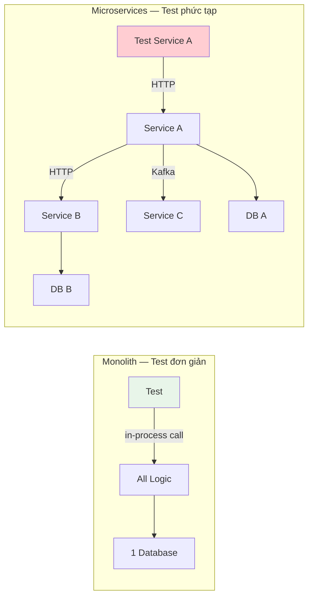
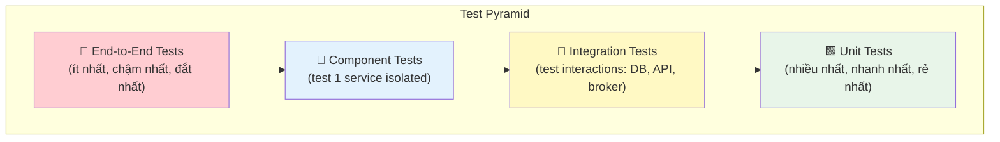
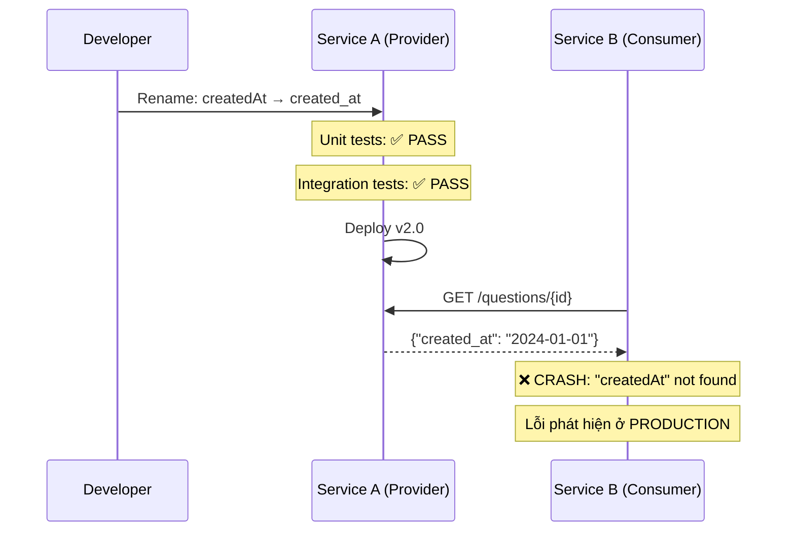
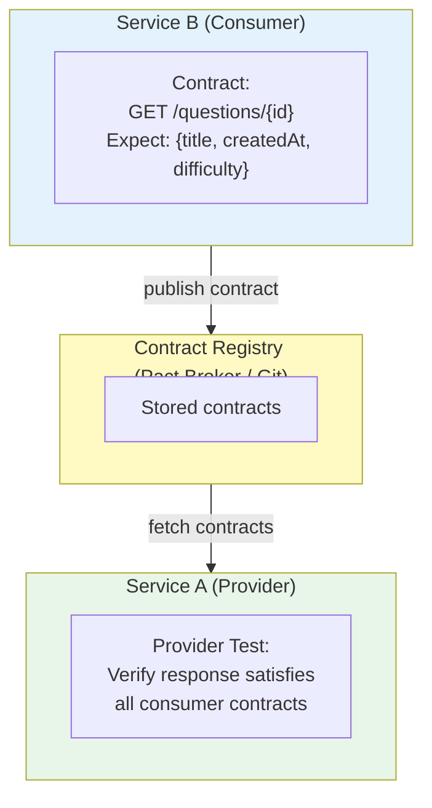
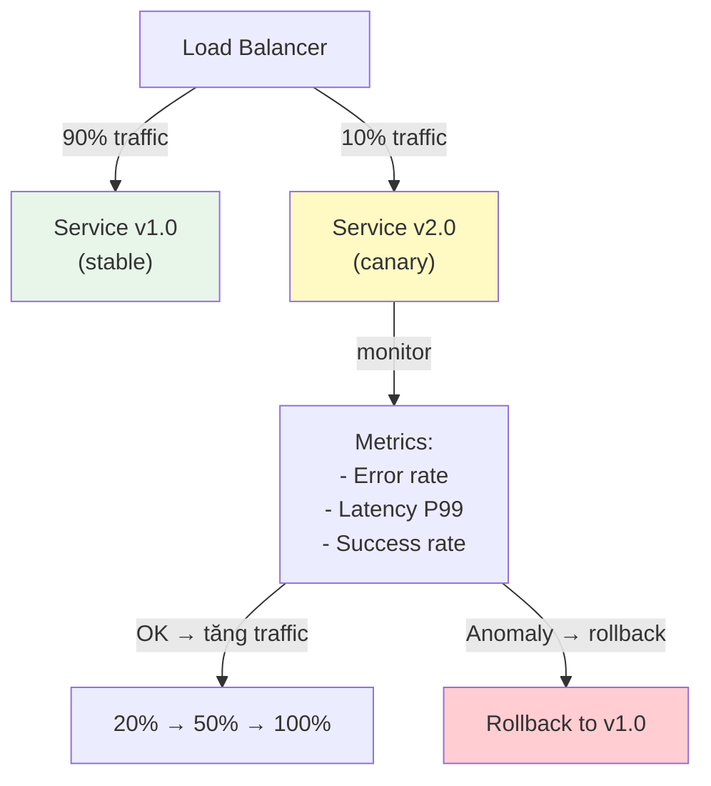
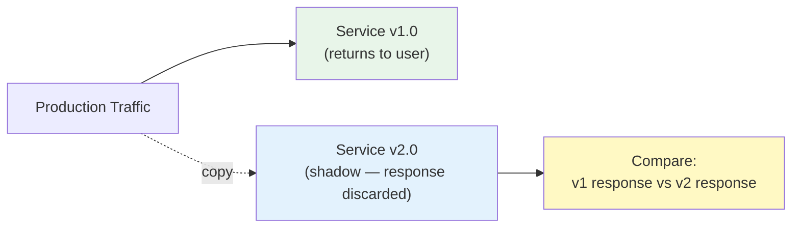
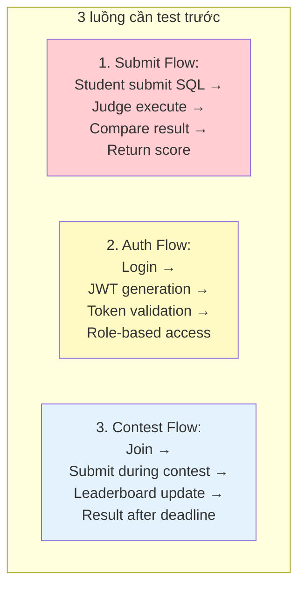
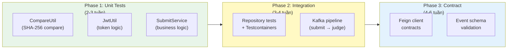

# Chương 10: Kiểm thử Microservices

> *"You haven't mastered a tool until you understand when it should not be used."*
> — Kelsey Hightower (trích dẫn bởi Hugo Rocha, [5])

---

## Bạn sẽ học được gì

- Hiểu tại sao kiểm thử microservices khó hơn monolith và các thách thức đặc trưng
- Nắm vững **Test Pyramid** và cách áp dụng cho kiến trúc phân tán
- Phân biệt khi nào dùng **mocks** và khi nào cần **test infrastructure thật** (Testcontainers)
- Hiểu **Contract Testing** (Consumer-Driven Contracts) — pattern quan trọng nhất cho independent deployment
- Áp dụng chiến lược **Testing in Production**: Canary, Feature Flags, Shadowing
- Hiểu đặc thù kiểm thử **event-driven flows** trong hệ thống dùng message broker
- Phân tích test strategy của hệ thống LMS và đề xuất migration path

---

## 10.1 Thách thức Kiểm thử trong Microservices

### Vấn đề: từ "một ứng dụng" sang "N services giao tiếp qua network"

Trong monolith, kiểm thử tương đối đơn giản: một codebase, một database, mọi thứ chạy trong cùng process. Gọi hàm `submitService.processSubmission()` → kết quả trả về ngay lập tức, không qua network, không có latency, không fail vì timeout.

Trong microservices, mỗi "gọi hàm" trở thành **network call** — HTTP request, Kafka message, hoặc gRPC call. Mỗi network call có thể fail, timeout, hoặc trả về dữ liệu không mong đợi. Kiểm thử không chỉ verify logic, mà phải verify **giao tiếp giữa các services**.



Richardson trong [2a, Ch.9] liệt kê bốn thách thức kiểm thử đặc trưng:

| # | Thách thức | Trong monolith | Trong microservices |
|---|-----------|----------------|---------------------|
| 1 | **Inter-service communication** | In-process (method call) | Network call — có thể fail, timeout |
| 2 | **Data consistency** | ACID transactions | Eventual consistency — state không nhất quán tạm thời |
| 3 | **Service dependencies** | Tất cả trong cùng process | Service A phụ thuộc B, C, D — test A cần B, C, D chạy? |
| 4 | **Deployment pipeline** | Build + test 1 artifact | Build + test N artifacts — thứ tự deploy ảnh hưởng kết quả |

### Test Pyramid trong Microservices

*Test Pyramid* (kim tự tháp kiểm thử) — khái niệm do Mike Cohn đề xuất — là framework phân loại test theo tốc độ, chi phí, và phạm vi:



| Level | Mô tả | Tốc độ | Chi phí | Scope |
|-------|--------|--------|---------|-------|
| **Unit** | Test một class/method isolated, mock dependencies | Rất nhanh (ms) | Rất thấp | Một function/class |
| **Integration** | Test tương tác với external systems (DB, broker, API) | Trung bình (s) | Trung bình | Service + infrastructure |
| **Component** | Test toàn bộ một service (deployed isolated, dependencies stubbed) | Chậm (s-min) | Cao | Toàn bộ 1 service |
| **End-to-End** | Test toàn bộ hệ thống (nhiều services deployed cùng nhau) | Rất chậm (min) | Rất cao | Toàn bộ hệ thống |

Newman trong [4a, Ch.7] bổ sung: trong microservices, **integration tests quan trọng hơn** so với monolith — vì giao tiếp giữa services qua network là nguồn lỗi phổ biến nhất. Đồng thời, **end-to-end tests trở nên fragile** hơn — một service fail hoặc deploy version sai → toàn bộ e2e suite đỏ, rất khó debug.

> **📐 Nguyên tắc — Test Pyramid**
>
> "Write tests at the lowest level possible. The higher up the pyramid you go, the fewer tests you should have."
>
> *— Mike Cohn (trích dẫn bởi Chris Richardson, [2a, Ch.9])*

---

## 10.2 Unit Testing — Verify Logic, Không Verify Infrastructure

### Vấn đề: test business logic mà không cần infrastructure

Unit test kiểm tra **logic business** trong isolation — không cần database, không cần Kafka, không cần services khác. Mục tiêu: khi test thất bại, developer biết ngay *chỗ nào sai* trong logic.

### Chiến lược Unit Testing cho Microservices

Trong mỗi service, unit tests tập trung vào:

| Layer | Test gì | Mock gì | Ví dụ LMS |
|-------|---------|---------|-----------| 
| **Service layer** | Business logic, validation, transformation | Repository, Feign clients, Kafka producers | `SubmitService.processSubmission()` |
| **Domain objects** | Entity behavior, value objects | Không cần mock | `SubmitHistory.calculateScore()` |
| **Mapper** | DTO ↔ Entity conversion | Không cần mock | `QuestionMapper.toResponse()` |

### Mock vs Stub — Khi nào dùng gì?

| | **Mock** | **Stub** |
|---|---|---|
| **Mục đích** | Verify behavior (service *gọi* dependency đúng?) | Provide data (dependency *trả về* gì?) |
| **Ví dụ** | `verify(producer).send(any())` — đã gửi Kafka message? | `when(repo.findById(id)).thenReturn(question)` |
| **Khi nào** | Side effects: gửi event, gửi email, ghi log | Queries: đọc data, tính toán |
| **Rủi ro** | Over-mocking: test gắn chặt vào implementation | Under-testing: không verify side effects |

Nguyên tắc quan trọng: test **behavior** (given-when-then), không test implementation. Nếu refactor implementation nhưng behavior giữ nguyên, không test nào được break.

```java
// Ví dụ: Unit test verify behavior, không verify implementation
@ExtendWith(MockitoExtension.class)
class SubmitServiceTest {
    @Mock private SubmitRepository submitRepository;
    @Mock private SubmitProducer submitProducer;
    @InjectMocks private SubmitService submitService;
    
    @Test
    void shouldSaveSubmissionAndPublishEvent() {
        // Given — stub input data
        when(sqlExecutor.execute(any())).thenReturn(correctResult());
        
        // When — exercise behavior
        SubmitResponse response = submitService.processSubmission(request);
        
        // Then — verify behavior, not implementation details
        assertThat(response.getStatus()).isEqualTo(CORRECT);
        verify(submitRepository).save(any());        // side effect: saved?
        verify(submitProducer).send(any());           // side effect: event sent?
    }
}
```

> **📐 Nguyên tắc — Test Behavior, Not Implementation**
>
> "A good unit test tells you *what* the code does, not *how* it does it. If you refactor the implementation but the behavior stays the same, no test should break."
>
> *— Nguyên tắc testing phổ biến (Richardson [2a, Ch.9], Newman [4a, Ch.7])*

---

## 10.3 Integration Testing — Verify Infrastructure thật

### Vấn đề: mock không bắt được lỗi infrastructure

Unit tests với mock kiểm tra logic business — nhưng **không bắt được lỗi tương tác** với database, message broker, hoặc external APIs:
- Query SQL sai cú pháp → mock trả về kết quả đúng, production fail
- Kafka message serialization lỗi → mock không phát hiện
- Database schema thay đổi → mock vẫn pass, production crash

### Testcontainers — Infrastructure thật trong Docker

**Testcontainers** là thư viện cho phép khởi tạo database, message broker, hoặc bất kỳ Docker container nào trong test. Mỗi test run → container mới → test chạy → container bị xóa. **Test isolated, reproducible, không phụ thuộc môi trường dev**.

### So sánh chiến lược test infrastructure

| Chiến lược | Tốc độ | Fidelity | Khi nào dùng |
|-----------|--------|----------|-------------|
| **Mock** (Mockito) | Rất nhanh | Thấp — không test infra | Logic business, transformations |
| **In-memory DB** (H2) | Nhanh | Trung bình — SQL dialect khác production | Simple JPA queries, lần đầu adopt testing |
| **Testcontainers** (PostgreSQL) | Chậm hơn | Cao — giống production | Complex queries, DB-specific features |
| **Embedded broker** (Kafka) | Trung bình | Cao | Serialization, consumer logic |

Vấn đề với H2 (in-memory database): H2 hỗ trợ "PostgreSQL compatibility mode" nhưng **không phải PostgreSQL thật**. Queries dùng PostgreSQL-specific syntax (`jsonb`, `ARRAY`, `ON CONFLICT`) pass trên H2 nhưng fail trên production — hoặc ngược lại. Testcontainers giải quyết hoàn toàn: chạy PostgreSQL thật trong Docker container.

> **📐 Nguyên tắc — Don't Mock What You Don't Own**
>
> "Khi test tương tác với external system (database, broker, API), đừng mock chúng — hãy dùng real instance. Mock che giấu lỗi tương tác — chính xác là loại lỗi nguy hiểm nhất trong microservices."
>
> *— Nguyên tắc testing (Richardson [2a, Ch.10], Rocha [5, Ch.10])*

---

## 10.4 Contract Testing — Ngăn Integration Breakage

### Vấn đề: Service A deploy version mới, Service B bị lỗi

Trong microservices, mỗi service deploy độc lập. Service A (provider) thay đổi API response — bỏ field `description`, đổi tên `createdAt` → `created_at`. Service B (consumer) parse response → **runtime error**, không phát hiện cho đến production.

Vấn đề: **unit tests và integration tests của Service A đều pass** — vì chúng không biết Service B expect gì. Đây là **gap giữa provider tests và consumer expectations**.



### Consumer-Driven Contract Testing

**Contract Testing** giải quyết: consumer viết **contract** (hợp đồng) mô tả "tôi expect response có structure như thế này" → provider chạy tests verify rằng response vẫn thỏa mãn contract.



### Hai framework phổ biến

| Framework | Cách tiếp cận | Ưu điểm | Nhược điểm |
|-----------|--------------|---------|------------|
| **Pact** | Consumer-first: consumer viết contract, provider verify | Standard de facto, đa ngôn ngữ, Pact Broker UI | Setup phức tạp cho team nhỏ |
| **Spring Cloud Contract** | Provider-first: provider viết contract, generate consumer stubs | Tích hợp sâu Spring Boot, đơn giản hơn | Chỉ Java/Kotlin ecosystem |

Workflow cơ bản (Pact):
1. **Consumer** viết test mô tả "tôi expect API trả về gì" → Pact framework generate contract file (JSON)
2. **Contract** được publish lên **Pact Broker** (hoặc commit vào Git)
3. **Provider** CI/CD pipeline fetch contracts → chạy tests verify response thỏa mãn tất cả contracts
4. Nếu provider thay đổi API breaking contract → **test fail trước khi deploy** → developer biết ngay

> **📐 Nguyên tắc — Consumer-Driven Contracts**
>
> "Each consumer defines what it expects from a provider. The provider must ensure that its service satisfies the expectations of all consumers."
>
> *— Chris Richardson, [2a, Ch.9]*

---

## 10.5 Testing Event-Driven Flows

### Vấn đề: async = non-deterministic = khó test

Trong hệ thống dùng message broker (Kafka, RabbitMQ), request không trả kết quả ngay — kết quả đến *sau*, qua event. Ví dụ trong LMS: student submit bài → event gửi qua Kafka → Judge Service xử lý → kết quả trả về qua Kafka. Test phải đợi event — nhưng đợi *bao lâu*? Event có thể đến sau 100ms hoặc sau 30 giây (khi broker overloaded).

Rocha trong [5, Ch.10] phân tích ba thách thức đặc trưng khi test event-driven systems:

| Thách thức | Mô tả | Ví dụ LMS |
|-----------|--------|-----------|
| **Non-deterministic ordering** | Events có thể đến không theo thứ tự | Submission result đến trước confirmation |
| **Temporal coupling** | Test phải *đợi* event — timeout bao nhiêu? | Judge mất 2-30 giây tùy complexity |
| **Side-effect verification** | Verify rằng event *đã được gửi* đúng format | SubmitProducer gửi message đúng schema? |

### Chiến lược test cho Event-Driven

| Chiến lược | Level | Mô tả | Tradeoff |
|-----------|-------|--------|----------|
| **Mock producer/consumer** | Unit | Mock KafkaTemplate, verify `send()` được gọi | Nhanh nhưng không verify serialization |
| **Embedded broker** | Integration | Dùng `@EmbeddedKafka` hoặc Testcontainers Kafka | Chậm hơn nhưng verify end-to-end pipeline |
| **Event schema validation** | Contract | Verify event schema (Avro/JSON Schema) tương thích giữa producer và consumer | Ngăn schema evolution breakage |
| **Polling-based assertions** | Integration | Dùng `Awaitility` đợi event đến, với timeout | Xử lý non-determinism, tránh flaky tests |

### Event Schema Compatibility

Rocha trong [5, Ch.10] nhấn mạnh: khi producer thay đổi event format (thêm/bỏ field), consumer có thể crash. Đây là vấn đề tương tự API contract — nhưng cho events:

| Evolution | Backward compatible? | Ví dụ |
|-----------|---------------------|-------|
| **Thêm field mới** | ✅ Thường OK | Thêm `executionTime` vào SubmitResult |
| **Bỏ field** | ❌ Breaking | Bỏ `userId` → consumer crash |
| **Đổi type** | ❌ Breaking | `score: int → score: double` |
| **Đổi tên field** | ❌ Breaking | `status → submissionStatus` |

Giải pháp: dùng **schema registry** (Confluent Schema Registry, AWS Glue) để quản lý event schema evolution — tương tự API versioning nhưng cho messages.

---

## 10.6 Testing in Production

### Vấn đề: test environment ≠ production

Dù test pyramid đầy đủ, production environment vẫn **khác biệt**: data volume lớn hơn, traffic patterns phức tạp, edge cases xảy ra với tần suất thấp nhưng hậu quả nghiêm trọng. Newman trong [4a, Ch.7] và Rocha trong [5, Ch.10] đều nhấn mạnh: **không thể test mọi thứ trước khi deploy** — cần chiến lược testing *trong* production.

### Ba chiến lược chính

#### 1. Canary Releases

Deploy version mới cho **một phần nhỏ traffic** (5-10%) — monitor metrics — nếu ổn, dần tăng traffic:



#### 2. Feature Flags

Toggle tính năng on/off **không cần deploy** — deploy code lên production nhưng feature tắt → bật dần cho subset users → rollout dần. Nếu có lỗi: tắt flag, không cần rollback deployment.

Ưu điểm lớn nhất: **decouple deployment từ feature release** — deploy bất cứ lúc nào (CI/CD), enable feature khi sẵn sàng (product decision).

#### 3. Shadowing (Dark Launching)

Copy production traffic → gửi đến version mới **song song** — so sánh responses nhưng **không ảnh hưởng users**:



Lý tưởng cho: rework core logic (SQL executor mới), migrate database, thay đổi algorithm — verify kết quả giống nhau trước khi switch.

> **⚠️ Lưu ý — Side Effects trong Shadowing**: Shadowing **không phù hợp** cho operations có side effects (gửi email, ghi DB, thanh toán). Chỉ shadow **read operations** hoặc đảm bảo shadow environment hoàn toàn isolated.

### So sánh ba chiến lược

| Strategy | Rủi ro | Phù hợp cho | Không phù hợp |
|----------|-------|------------|---------------|
| **Canary** | Thấp — ảnh hưởng ít user | Mọi thay đổi | Thay đổi database schema |
| **Feature Flags** | Rất thấp — tắt ngay | UI changes, new features | Core infrastructure changes |
| **Shadowing** | Zero — không ảnh hưởng user | Algorithm changes, migration | Write operations, side effects |

---

## 10.7 Case Study: Test Strategy cho hệ thống LMS

### Hiện trạng: gần như không có tests

Hệ thống LMS hiện có **zero automated test coverage** ngoài Spring context load test — mỗi service có duy nhất một file test `ApplicationTests.java` chứa test `contextLoads()` rỗng.

| Service | Test coverage | Rủi ro |
|---------|--------------|--------|
| Core Service | Empty `contextLoads()` | Submit flow untested — bug = chấm sai điểm |
| Judge Service | Empty `contextLoads()` | SQL execution untested — bug = security risk |
| Auth Service | Không có test | JWT logic untested — bug = auth bypass |
| Assignment Service | Không có test | Grade logic untested — bug = sai điểm |

### Phân tích theo business context

Với LMS — hệ thống dạy SQL cho sinh viên — **không phải tất cả flows đều cần test ngay**. Test strategy cần ưu tiên theo **business risk**:



| Luồng | Hậu quả nếu bug | Loại test ưu tiên | Effort |
|-------|-----------------|-------------------|--------|
| **Submit Flow** | Chấm bài sai → ảnh hưởng điểm sinh viên | Unit: CompareUtil, SubmitService; Integration: Kafka pipeline | Thấp |
| **Auth Flow** | Bypass authentication → lỗ hổng bảo mật | Unit: JwtUtil; Integration: Auth endpoints | Thấp |
| **Contest Flow** | Leaderboard sai → contest không công bằng | Integration: concurrent submissions | Trung bình |

### Test ROI — Bắt đầu từ đâu?

Không cần test toàn bộ ngay. Áp dụng nguyên tắc **test critical paths first** — mỗi phase mang lại giá trị ngay:



> **🔍 Phân tích gap — Zero Test Coverage trong LMS**
>
> Hệ thống LMS hoạt động production với **không có automated tests** ngoài Spring context load. Theo Richardson [2a, Ch.9], đây là rủi ro lớn: mỗi thay đổi code phải test thủ công, regression bugs dễ xảy ra, refactoring nguy hiểm ("if it works, don't touch it").
>
> Hậu quả thực tế: (1) developer phải test thủ công sau mỗi deploy, (2) bugs phát hiện trên production, (3) code quality giảm dần vì sợ thay đổi.
>
> **Migration path** (incremental — mỗi phase mang lại giá trị ngay):
>
> **Phase 1 — Critical Path Unit Tests** (effort thấp, ROI cao nhất):
> Unit tests cho CompareUtil (logic so sánh kết quả SQL — core business), JwtUtil (token generation/validation — security), và SubmitService (luồng chấm bài — user-facing).
>
> **Phase 2 — Integration Tests** (effort trung bình):
> Testcontainers cho Repository tests (PostgreSQL thật), embedded Kafka cho submission pipeline (serialize/deserialize messages), Auth endpoint tests.
>
> **Phase 3 — Contract Tests** (effort cao, giá trị dài hạn):
> Consumer contracts cho Feign clients (Core ↔ Judge, Core ↔ Assignment), event schema validation cho Kafka messages.

---

> **⚠️ Sai lầm thường gặp**
>
> 1. **Chỉ viết end-to-end tests** — Bỏ qua unit/integration tests, chỉ viết e2e "vì nó test mọi thứ". Hậu quả: test suite chạy rất chậm (phút → giờ), flaky (fail ngẫu nhiên), khó debug (lỗi ở service nào?). *Phòng tránh*: tuân theo test pyramid — nhiều unit tests, ít e2e tests.
> 2. **Mock mọi thứ trong integration tests** — Dùng H2 thay PostgreSQL, mock Kafka producer. Hậu quả: tests pass với H2 nhưng fail với PostgreSQL (SQL dialect khác), mock producer bỏ qua serialization bugs. *Phòng tránh*: Testcontainers cho integration tests — test với infrastructure giống production.
> 3. **Không có contract tests khi nhiều teams** — Mỗi team deploy độc lập, không ai biết API thay đổi ảnh hưởng team khác. Hậu quả: breaking changes phát hiện trên production. *Phòng tránh*: consumer-driven contracts — consumer define expectations, provider verify trước deploy.
> 4. **Test coverage metrics thay vì test quality** — Chạy theo 80% coverage, viết tests chỉ để tăng số. Hậu quả: tests chạy qua mọi dòng code nhưng không assert gì có ý nghĩa. *Phòng tránh*: focus vào **test behavior** (given-when-then), không phải test lines.
> 5. **Bỏ qua testing hoàn toàn** — "Team nhỏ, chạy được là đủ". Hậu quả: mỗi lần sửa bug → tạo bug mới (regression), refactoring không ai dám làm. *Phòng tránh*: bắt đầu nhỏ — unit tests cho critical paths trước, dần mở rộng. Chi phí viết test thấp hơn chi phí debug production bugs.

---

## Tổng kết

Kiểm thử microservices phức tạp hơn monolith vì mỗi service giao tiếp qua network — nguồn lỗi mà in-process calls không có. Test Pyramid là framework nền tảng: nhiều unit tests (nhanh, rẻ, verify logic), integration tests với Testcontainers (verify tương tác infrastructure thật), ít end-to-end tests (đắt, fragile, khó maintain).

Contract Testing — đặc biệt Consumer-Driven Contracts — giải quyết bài toán **integration breakage**: consumer viết contract, provider verify trước khi deploy. Đây là pattern quan trọng nhất cho teams deploy độc lập — thay thế cho end-to-end tests nặng nề mà vẫn đảm bảo services tương thích.

Event-driven systems thêm một chiều phức tạp: non-deterministic ordering, temporal coupling, và event schema evolution. Contract testing cho events (schema validation) song song với contract testing cho APIs — hai mặt của cùng một bài toán.

Testing in Production — Canary releases, Feature Flags, Shadowing — bổ sung cho pre-production testing. Production traffic tiết lộ vấn đề mà test environment không mô phỏng được. Ba chiến lược có mức rủi ro khác nhau — chọn theo tính chất thay đổi.

Phân tích hệ thống LMS cho thấy technical debt kiểm thử nghiêm trọng: zero automated test coverage. Với hệ thống giáo dục nơi chấm điểm sai ảnh hưởng trực tiếp sinh viên, migration path rõ ràng: unit tests cho critical paths (submit flow, authentication), rồi integration tests, cuối cùng contract tests. Mỗi phase mang lại giá trị ngay lập tức — **ROI cao nhất: test logic so sánh kết quả SQL** (CompareUtil) — sai ở đây = chấm sai điểm toàn bộ hệ thống.

Ở Chương 11, chúng ta sẽ chuyển sang **Observability** — logging, monitoring, tracing, và cách quan sát hệ thống microservices trong production.

---

## Đọc thêm

**Sách tham khảo chính:**
1. [2a] Chris Richardson, *Microservices Patterns*, 1st Ed. — Ch.9: Testing Microservices (Part 1), Ch.10: Testing Microservices (Part 2) — test pyramid, consumer-driven contracts, component tests
2. [4a] Sam Newman, *Building Microservices* — Ch.7: Testing — test pyramid, consumer-driven tests, testing after production (canary, mean time to repair)
3. [5] Hugo Rocha, *Practical Event-Driven MS Architecture* — Ch.10: Overcoming Challenges in Quality Assurance — testing EDA, shadowing, feature flags, canary releases, event schema evolution

**Sách bổ trợ:**
4. [2b] Chris Richardson, *Microservices Patterns*, 2nd Ed. — Part 7: Testing (updated)
5. [3] Ronnie Mitra, *Microservices: Up and Running* — Ch.11: Managing Change — deployment patterns, progressive delivery

**Nguồn trực tuyến:**
- Testcontainers official docs — testcontainers.com
- Pact Foundation — docs.pact.io (consumer-driven contract testing)
- Spring Cloud Contract — docs.spring.io/spring-cloud-contract
- Martin Fowler, "TestPyramid" — martinfowler.com/bliki/TestPyramid.html
- Martin Fowler, "ContractTest" — martinfowler.com/bliki/ContractTest.html
