# Chương 10: Chuyển đổi Thực tế — Từ Monolith đến Microservices

> *"If you can't build a monolith, what makes you think microservices are the answer?"*
> — Simon Brown (trích dẫn bởi Sam Newman, [4b])

---

## Bạn sẽ học được gì

- Hiểu khi nào nên và **khi nào KHÔNG nên** chuyển sang microservices
- Nắm vững **Strangler Fig Pattern** — chiến lược migration tăng dần phổ biến nhất
- Áp dụng **5 chiến lược tách database** từ góc nhìn migration thực tế
- Hiểu **Anti-Corruption Layer** và các migration patterns bảo vệ ranh giới hệ thống
- Thiết kế **Migration Roadmap** khả thi: phân chia phases, ưu tiên theo Impact × Effort
- Phân tích migration path cho KBLab — tổng hợp gap analyses xuyên suốt 12 chương

---

## 10.1 Khi nào (KHÔNG) nên chuyển sang Microservices

### Vấn đề: microservices không phải đích đến mặc định

Sau 9 chương phân tích patterns, communication, data management, gateway, và security, đọc giả có thể có ấn tượng rằng microservices là kiến trúc mọi hệ thống nên hướng tới. **Đây là sai lầm nguy hiểm nhất** — và cũng là sai lầm phổ biến nhất.

Martin Fowler — người đồng tác giả bài viết gốc "Microservices" (2014) — cảnh báo rõ ràng [W1]:

> *"Almost all the cases where I've heard of a system that was built as a microservice system from scratch, it has ended up in serious trouble... You shouldn't start a new project with microservices, even if you're sure your application will be big enough to make it worthwhile."*

Newman trong [4b, Ch.1] bổ sung: microservices là **một lựa chọn kiến trúc**, không phải bước tiến hóa bắt buộc. Monolith không phải "kiến trúc sai" — monolith là kiến trúc đúng cho phần lớn hệ thống ở giai đoạn đầu.

### Decision Matrix — Khi nào cân nhắc migration

**Bảng 10.1:** Decision Matrix — khi nào cân nhắc migration

| Tiêu chí | Monolith đủ tốt | Cân nhắc Microservices |
| :---------- | :----------------- | :---------------------- |
| **Team size** | ≤ 8 người | > 15 người, nhiều teams |
| **Deploy frequency** | Weekly/monthly | Cần deploy daily, per-team |
| **Scale requirements** | Scale toàn bộ đủ | Cần scale từng component riêng |
| **Technology diversity** | Một stack đủ | Cần polyglot (Java + Python + Go) |
| **Domain complexity** | Ranh giới chưa rõ | Bounded contexts đã xác định rõ (Ch.2) |
| **Organizational maturity** | Chưa có DevOps, CI/CD | Đã có CI/CD, containerization, monitoring |

Richardson trong [2a, Ch.13] gọi đây là **Microservice Premium** — chi phí phải trả khi chuyển sang microservices: distributed system complexity, network failures, eventual consistency, operational overhead. Premium chỉ đáng trả khi benefits (independent deployment, scaling, team autonomy) **vượt qua** costs.

### KBLab: Evolutionary Architecture, không phải Big Bang

KBLab không bắt đầu từ một bản thiết kế microservices hoàn hảo. Hệ thống đã đi qua nhiều thế hệ: các judge monolith riêng cho bài lập trình, Network Judge, SQL Judge mới, rồi dần hình thành các service cho auth, assignment, judge, notification và DevOps Lab. Vì vậy câu hỏi đúng không phải là "có nên microservices-first không?", mà là: *mỗi bước tiến hóa có đang giải quyết đúng vấn đề của thời điểm đó không?*

> **🔍 Phân tích gap — "Microservice first" trong KBLab**
>
> KBLab chọn hướng microservices vì hai lý do cụ thể: (1) mục đích **giáo dục** — bản thân hệ thống là learning material cho sinh viên, (2) domain cốt lõi đã đủ rõ sau nhiều năm vận hành judge systems: Identity, SQL Practice, Network Practice, Academic Management, Evaluation/Infrastructure.
>
> Tuy nhiên, trade-off hiện rõ: (1) shared database giữa Core và Assignment — coupling vẫn tồn tại dù services tách, (2) shared library chứa quá nhiều logic — "distributed monolith" risk, (3) polyglot Java+Go làm tăng chi phí build/test/deploy. Đây là ví dụ thực tế của Microservice Premium: **lợi ích giáo dục và nhu cầu cô lập judge/lab justify chi phí**, nhưng vẫn cần roadmap giảm coupling có kiểm soát.

Một bài học cụ thể nằm ở SQL Judge, không phải Network Practice. Network Practice được thiết kế độc lập để đánh giá giao tiếp qua mạng; nó minh họa tốt bounded context theo protocol. Với SQL Judge, bài toán là ranh giới giữa một `judge` coordinator và nhiều `judge-*` workers theo DBMS (`judge-mysql`, `judge-sqlserver`, ...). Migration đúng hướng là làm rõ ownership routing, chuẩn hóa contract job/result, thêm idempotency theo `judgeRunId`, rồi mới scale ngang từng worker theo workload DBMS.

> **📐 Nguyên tắc — "Monolith First"**
>
> "Start with a monolith. Move to microservices only when the monolith becomes a problem — and you know which problems you're solving. The worst microservices systems are those built by teams who started with microservices *before* understanding their domain boundaries."
>
> *— Tổng hợp từ Martin Fowler [W1] và Sam Newman [4b, Ch.1]*

### Bài học thực tế — Khi Migration đi sai hướng (Anti-patterns)

Dù quyết định chuyển đổi là đúng đắn, *cách thức* chuyển đổi vẫn có thể dìm chết dự án. Richardson trong [2b, Ch.2] phân tích bốn anti-patterns phổ biến nhất khi chuyển từ monolith sang microservices — chúng ta minh họa qua các sai lầm *tiềm năng* nếu chia tách sai trong KBLab:

**Bảng 10.1b:** Anti-patterns khi chuyển đổi Microservices (minh họa với KBLab)

| Anti-pattern | Ví dụ sai lầm tiềm năng trong KBLab | Hậu quả |
| :--- | :--- | :--- |
| **Data Services** *(CRUD wrappers)* | Tách `SqlExecutorService` thành `QuestionDataService` riêng — Core phải gọi HTTP mỗi lần cần data câu hỏi | Tăng latency mạng, mất lợi ích transaction nội bộ |
| **Fine-grained Services** *(Chia quá nhỏ)* | Chia Auth thành 3 service: `UserProfile`, `UserCredential`, `UserSession` | Mỗi lần login phải orchestrate 3 services, khó debug |
| **Microservices-first** | Tách KBLab theo technical layer thay vì domain — mỗi thay đổi chấm điểm ảnh hưởng nhiều services cùng lúc | Phát sinh "Distributed Monolith" (xem thêm §10.6) |
| **End-to-end QA Gate** | Deploy độc lập nhưng QA phải chờ gộp tất cả để test | Triệt tiêu *Independent Deployability* |

Chúng ta sẽ phân tích sâu hơn về các sai lầm migration bổ sung (Big Bang Rewrite, Lift-and-Shift, Over-engineering) tại §10.6.

---

## 10.2 Strangler Fig Pattern — Migration Tăng dần

### Vấn đề: "Big Bang" vs Tăng dần migration

Hai cách migrate từ monolith sang microservices:

**Bảng 10.2:** Big Bang vs Tăng dần migration

| Chiến lược | Mô tả | Rủi ro |
| :----------- | :-------- | :-------- |
| **Big Bang** | Viết lại toàn bộ hệ thống mới, switch cùng lúc | 🔴 Rất cao — thường fail |
| **Tăng dần** (Strangler Fig) | Tách dần từng phần, chạy song song | 🟢 Thấp — rollback từng phần |

Newman trong [4b, Ch.3] và Richardson trong [2a, Ch.13] đều khẳng định: **Big Bang rewrites gần như luôn thất bại** — "the second system effect" (Fred Brooks). Khi viết lại từ zero, team mất tất cả domain knowledge embedded trong code cũ, deadline liên tục trễ, và khách hàng phải chờ đợi *tất cả* tính năng trước khi nhận *bất kỳ* giá trị nào.

### Strangler Fig Pattern

**Strangler Fig** — pattern do Martin Fowler đặt tên (2004), lấy cảm hứng từ cây đa bóp nghẹt (strangler fig) bao quanh cây chủ, dần thay thế cho đến khi cây chủ biến mất [W2].

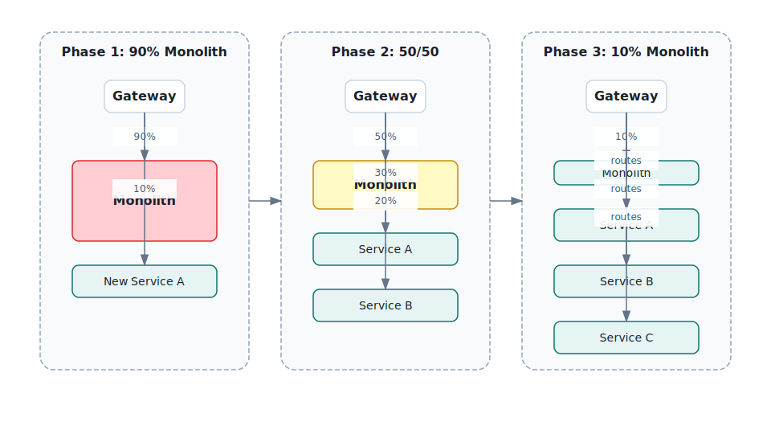

*Hình 10.1: Strangler Fig Pattern — dần thay thế monolith qua 3 giai đoạn*

### API Gateway — "Cây đa" trong microservices

API Gateway (đã học ở Ch.8) đóng vai trò tự nhiên làm **seam** cho Strangler Fig:

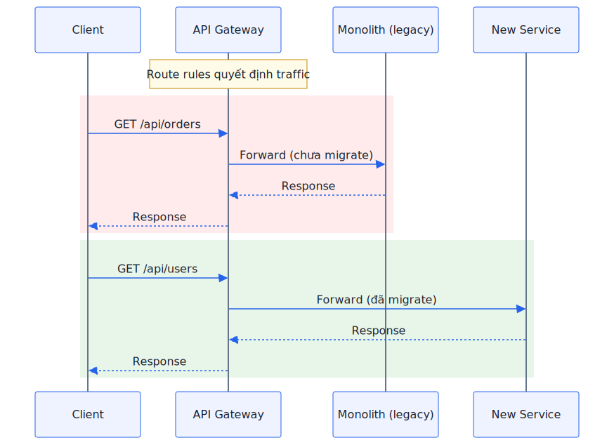

*Hình 10.2: API Gateway làm seam cho Strangler Fig — client không biết route nào đến monolith, route nào đến service mới*

**Bảng 10.3:** Ba implementation strategies cho Strangler Fig

| Strategy | Mô tả | Khi nào dùng |
| :---------- | :-------- | :------------- |
| **Route-based** | Gateway route paths khác nhau đến monolith/services | API-driven systems (REST, GraphQL) |
| **Event-based** | New service listen events từ monolith, dần thay thế logic | Event-driven systems (Kafka, RabbitMQ) |
| **Asset-based** | Tách static assets, UI components trước | Frontend-heavy applications |

Với KBLab — nơi đã có API Gateway (Spring Cloud Gateway, Ch.8) — **route-based Strangler Fig** là lựa chọn tự nhiên nhất cho LMS chính. Với DevOps Lab, routing lại dựa trên hostname/wildcard DNS ở mức khái quát. Hai kiểu gateway này cùng tồn tại, cho thấy migration không nhất thiết dùng một pattern duy nhất cho mọi bounded context.

> **📐 Nguyên tắc — Tăng dần Migration**
>
> "Never do a big bang rewrite. Strangle the monolith incrementally — each step delivers value, each step is reversible, and the system is always running."
>
> *— Sam Newman, Monolith to Microservices [4b, Ch.3]*

---

## 10.3 Tách Database — Thách thức Lớn nhất

### Vấn đề: database coupling nguy hiểm hơn code coupling

Tách code thành services không quá khó — tách API, deploy riêng. Nhưng khi hai services **chia sẻ cùng database**, chúng vẫn coupled ở tầng sâu nhất:


*Hình 10.3: Shared Database (coupled) vs Database-per-Service (decoupled)*

Newman trong [4b, Ch.4] gọi shared database là **"the hardest part of decomposition"** — và LMS là ví dụ trực tiếp: Core Service và Assignment Service chia sẻ cùng database, schema changes ảnh hưởng cả hai, và không thể deploy database migration độc lập.

### 5 chiến lược tách database

Từ Ch.7 (Database-per-Service), chúng ta đã biết nguyên tắc. Giờ nhìn từ góc migration — **thứ tự thực hiện**:

**Bảng 10.4:** 5 chiến lược tách database — từ góc migration

| # | Strategy | Mô tả | Risk | Effort | Khi nào |
| :---: | :---------- | :-------- | :------ | :-------- | :--------- |
| 1 | **Schema separation** | Tách schema trong cùng DB instance | 🟢 Thấp | Thấp | Bước đầu tiên — luôn |
| 2 | **View abstraction** | Database views che giấu schema changes | 🟢 Thấp | Thấp | Khi service B cần data service A |
| 3 | **API-based access** | Service B gọi API service A thay vì query trực tiếp | 🟡 Trung bình | Trung bình | Khi đã tách schema |
| 4 | **Data duplication** | Copy data qua events (eventual consistency) | 🟡 Trung bình | Cao | Khi query cross-service phức tạp |
| 5 | **Separate instances** | Database instance riêng cho mỗi service | 🔴 Cao | Cao | Bước cuối — khi cần scale DB riêng |

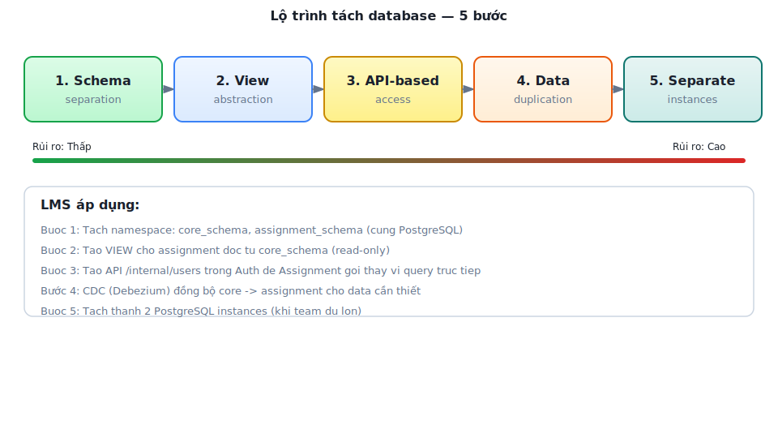

*Hình 10.4: Thứ tự thực hiện 5 chiến lược tách database*

> **📐 Nguyên tắc — Tăng dần Database Decomposition**
>
> "Don't try to split the database and the code at the same time. Split the code first, then the database. Trying to do both simultaneously dramatically increases risk and complexity."
>
> *— Sam Newman, Monolith to Microservices [4b, Ch.4]*

### Dual-Write Pitfall và Outbox Pattern

Khi tách database, một anti-pattern phổ biến là **dual write**: service vừa ghi database vừa publish event — nếu một trong hai thất bại, data không nhất quán.

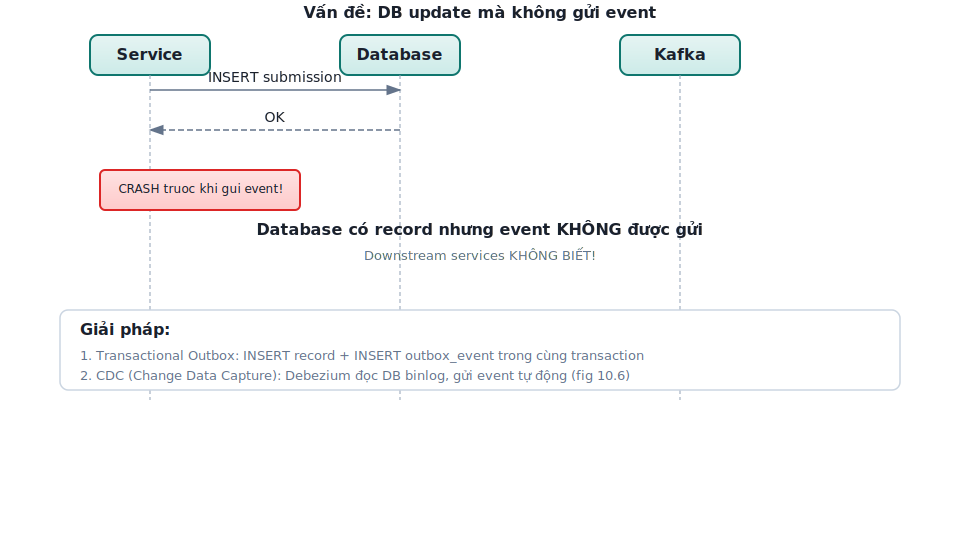

*Hình 10.5: Dual-Write Pitfall — DB thành công nhưng event thất bại*

**Outbox Pattern** giải quyết — ghi event vào database *cùng transaction* với business data, rồi một background process đọc outbox table và publish lên message broker:

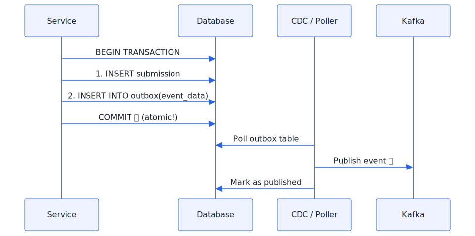

*Hình 10.6: Outbox Pattern — event ghi cùng transaction với business data*

**Bảng 10.5:** Hai cách implement Outbox Pattern

| Approach | Mô tả | Ưu điểm | Nhược điểm |
| :---------- | :-------- | :--------- | :----------- |
| **Polling publisher** | Background thread poll outbox table | Đơn giản, không cần thêm infra | Delay, DB load |
| **CDC (Change Data Capture)** | Debezium đọc DB transaction log | Real-time, không polling overhead | Thêm infra (Debezium + Kafka Connect) |

> **🔍 Phân tích gap — KBLab chưa có Outbox Pattern**
>
> KBLab hiện dùng **dual write**: Core Service lưu submission vào DB rồi gọi `submitProducer.send()` đến Kafka. Nếu Kafka unavailable tại thời điểm đó, submission đã lưu nhưng Judge Service không nhận bài — sinh viên thấy "đã nộp" nhưng không nhận kết quả chấm.
>
> **Migration path**: (1) Ngắn hạn — retry logic cho Kafka producer (đã có nhưng cần verify), (2) Trung hạn — Outbox table + polling publisher, (3) Dài hạn — Debezium CDC. Với traffic thấp của KBLab hiện tại, polling publisher (trung hạn) đủ tốt — Debezium chỉ cần khi scale lên production lớn.

---

## 10.4 Anti-Corruption Layer và Migration Patterns

### Anti-Corruption Layer (ACL) — Bảo vệ ranh giới

Khi tách service mới ra khỏi monolith, service mới cần giao tiếp với code legacy — nhưng **không nên để model cũ "nhiễm" vào code mới**. Eric Evans trong [6] định nghĩa **Anti-Corruption Layer** (ACL): một lớp dịch ngôn ngữ giữa hai bounded contexts có models khác nhau.


*Hình 10.7: Anti-Corruption Layer — lớp dịch giữa service mới và legacy*

Ví dụ KBLab: Judge Service nhận submissions từ Core Service qua Kafka. Core gửi format `{problem_id, source, testcases}` (legacy naming). Judge có thể: (1) ❌ dùng trực tiếp legacy field names trong code — coupling với legacy decisions, hoặc (2) ✅ tạo adapter dịch sang internal model `JudgeRequest{questionId, sqlStatement, expectedResults}` — clean boundary.

### Branch by Abstraction

Newman trong [4b, Ch.3] đề xuất **Branch by Abstraction** cho migration an toàn:

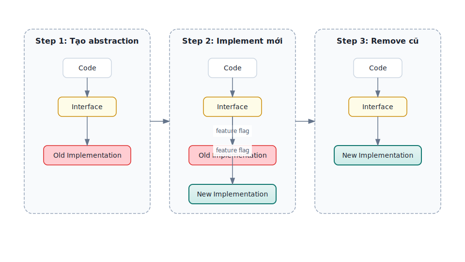

*Hình 10.8: Branch by Abstraction — migration an toàn qua feature flag*

1. **Tạo abstraction** (interface) trước old implementation
2. **Implement mới** đằng sau cùng interface, toggle bằng feature flag
3. **Switch traffic** dần sang implementation mới, verify
4. **Remove** old implementation khi confident

### Parallel Run — Verify trước khi switch

**Parallel Run** — strategy cho phép **chạy đồng thời** old and new implementation, so sánh output:

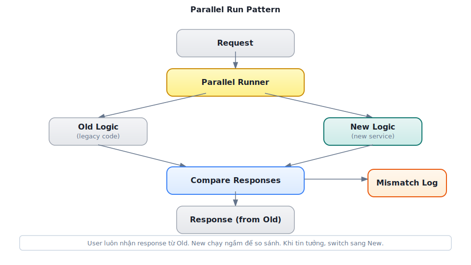

*Hình 10.9: Parallel Run — chạy song song old và new logic, so sánh output*

- Old logic **trả response** cho user (production-safe)
- New logic chạy **song song** — response bị discard
- So sánh hai responses — log mismatches
- Khi mismatch rate ≈ 0% → switch sang new logic

> **⚠️ Lưu ý — Parallel Run chỉ phù hợp cho read operations**
>
> Write operations (INSERT, UPDATE) sẽ tạo side effects kép. Cho write operations, dùng **Canary Release** (Ch.12).

Áp dụng cho KBLab: nếu cần viết lại `CompareUtil` (logic so sánh kết quả SQL — critical nhất trong hệ thống), Parallel Run cho phép chạy old CompareUtil và new CompareUtil song song trên mọi submission, so sánh kết quả, đảm bảo new logic chấm điểm giống hệt trước khi switch.

> **📐 Nguyên tắc — Make Migration Reversible**
>
> "Every migration step should be reversible. If you can't roll back a change easily, you're taking on too much risk at once. Feature flags, parallel runs, and tăng dần routing all serve the same purpose: *making it safe to fail*."
>
> *— Sam Newman, Monolith to Microservices [4b, Ch.3]*

---

## 10.5 Migration Roadmap cho KBLab — Tổng hợp xuyên suốt

### Tổng hợp Gap Analyses

Xuyên suốt 9 chương đầu, chúng ta đã phân tích gap giữa KBLab hiện tại và best practices. Bảng dưới tổng hợp toàn bộ — **đây là "inventory" cho migration roadmap**:

**Bảng 10.6:** Tổng hợp Gap Analyses xuyên suốt Ch.1–12

| Chương | Gap | Mức độ | Ref |
| :-------- | :----- | :-------- | :----- |
| Ch.2 | 5 contexts rõ hơn nhưng shared library vẫn coupling | ⚠️ Medium | §2.6 |
| Ch.3 | API naming/versioning chưa nhất quán; SQL Judge worker contract cần chuẩn hóa | ⚠️ Medium | §3.5 |
| Ch.4 | SQL Judge coordinator/worker và external integration cần ACL/resilience rõ hơn | ⚠️ Medium | §4.5 |
| Ch.5 | Kafka pipeline cần DLQ/idempotency; SQL Judge dispatch và DevOps Lab queue cần chọn broker theo workload | ⚠️ Medium | §5.6 |
| Ch.6 | Implicit saga (không có orchestrator) | 🟡 Low | §6.4 |
| Ch.7 | **Shared database** (Core ↔ Assignment) | 🔴 High | §7.6 |
| Ch.8 | Spring Cloud Gateway + Go router cần thống nhất edge policies | 🔴 High | §8.5 |
| Ch.9 | HS256 shared secret, token storage, secrets, SSO cross-platform | 🔴 High | §9.6 |
| Ch.11 | Observability có Actuator/Prometheus một phần, chưa end-to-end tracing/log aggregation | 🔴 High | §11.7 |
| Ch.12 | LMS chính Docker Compose; DevOps Lab k3s/Sysbox; CI/CD và rollback chưa đồng đều | 🔴 High | §12.7 |

### Migration Roadmap — 4 Phases

Nguyên tắc ưu tiên: **Quick Wins trước, High-Risk thay đổi sau**. Mỗi giai đoạn mang lại giá trị ngay lập tức — không cần đợi hoàn thành toàn bộ.

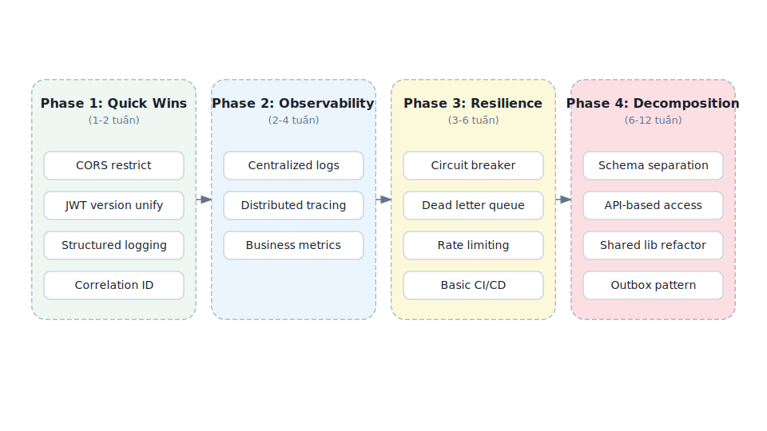

*Hình 10.10: Migration Roadmap 4 phases — Quick Wins → Observability → Resilience → Decomposition*

#### Giai đoạn 1 — Quick Wins (Effort thấp, Impact cao)

**Bảng 10.7:** Giai đoạn 1 — Quick Wins

| # | Action | Gap | Effort | Impact |
| :---: | :-------- | :----- | :-------- | :-------- |
| 1 | Restrict CORS origins | Ch.8 | 30 phút | Bịt lỗ hổng bảo mật |
| 2 | Unify JJWT version trong parent POM | Ch.8 | 1 giờ | Ngăn version mismatch bugs |
| 3 | Chuyển sang JSON logging (Logback encoder) | Ch.11 | 2 giờ | Searchable logs |
| 4 | Thêm Correlation ID GlobalFilter | Ch.8, Ch.11 | 4 giờ | Debug cross-service |
| 5 | Move secrets ra environment variables | Ch.9 | 2 giờ | Không leak qua Git |

**Triết lý Giai đoạn 1**: Không thay đổi architecture, không thay đổi code logic — chỉ **cấu hình và hardening**. Team 1 developer có thể hoàn thành trong 1-2 sprint.

#### Giai đoạn 2 — Observability Foundation

**Bảng 10.8:** Giai đoạn 2 — Observability Foundation

| # | Action | Gap | Effort | Impact |
| :---: | :-------- | :----- | :-------- | :-------- |
| 1 | Deploy Loki + Grafana | Ch.11 | 1-2 ngày | Search logs một nơi |
| 2 | Thêm Micrometer Tracing | Ch.11 | 1 ngày | Biết bottleneck ở đâu |
| 3 | Custom metrics (submission rate, judge duration) | Ch.11 | 2 ngày | Proactive monitoring |

**Triết lý Giai đoạn 2**: Trước khi thay đổi architecture (**Giai đoạn 3-4**), cần **nhìn thấy** hệ thống đang hoạt động thế nào. "You can't improve what you can't measure."

#### Giai đoạn 3 — Resilience & CI/CD

**Bảng 10.9:** Giai đoạn 3 — Resilience & CI/CD

| # | Action | Gap | Effort | Impact |
| :---: | :-------- | :----- | :-------- | :-------- |
| 1 | Resilience4j Circuit Breaker cho Feign clients | Ch.4 | 2-3 ngày | Ngăn cascading failures |
| 2 | Kafka Dead Letter Queue + retry | Ch.5 | 2 ngày | Không mất messages |
| 3 | Rate limiting tại Gateway (Redis) | Ch.8 | 1-2 ngày | Bảo vệ khỏi abuse |
| 4 | Basic CI/CD pipeline (GitHub Actions) | Ch.12 | 3-5 ngày | Automated build + deploy |

**Triết lý Giai đoạn 3**: Hệ thống phải **resilient trước khi decompose**. Tách database trong khi không có circuit breaker = cascade failures khi một DB down.

#### Giai đoạn 4 — Database Decomposition (Thận trọng nhất)

**Bảng 10.10:** Giai đoạn 4 — Database Decomposition

| # | Action | Gap | Effort | Impact |
| :---: | :-------- | :----- | :-------- | :-------- |
| 1 | Schema separation (Core vs Assignment tables) | Ch.7 | 1-2 tuần | Logical boundary |
| 2 | API-based access (Assignment gọi Core API) | Ch.7 | 2-3 tuần | Remove direct DB access |
| 3 | Refactor shared library (chỉ giữ DTOs, exceptions) | Ch.2 | 2-3 tuần | Reduce coupling |
| 4 | Outbox pattern cho submission pipeline | Ch.5, Ch.6 | 1-2 tuần | Reliable messaging |

**Triết lý Giai đoạn 4**: Đây là thay đổi **riskiest** — phải có observability (Giai đoạn 2) và resilience (Giai đoạn 3) trước. Mỗi bước: implement → monitor → stabilize → bước tiếp.

### Decision Matrix — Ưu tiên bằng Impact × Effort

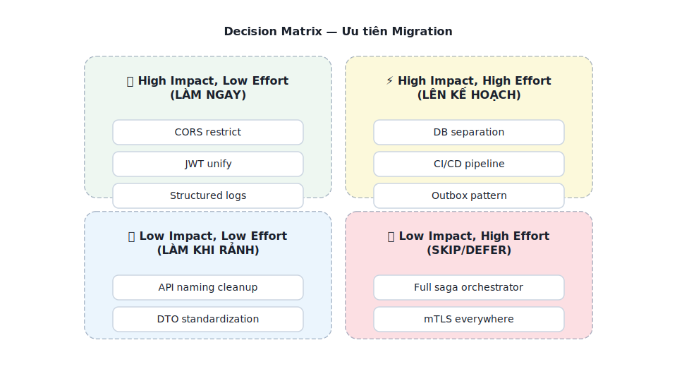

*Hình 10.11: Decision Matrix — ưu tiên theo Impact × Effort*

> **💡 Tip — Migration là marathon, không phải sprint**
>
> Đừng cố fix mọi gap cùng lúc. Mỗi sprint chọn 1-2 items từ quadrant "High Impact, Low Effort" trước. Khi đã hết quick wins, mới chuyển sang "High Impact, High Effort" — và **luôn có observability** trước khi thay đổi lớn.

---

## 10.6 Sai lầm thường gặp khi Migration

> **⚠️ Sai lầm thường gặp**
>
> Ngoài 4 anti-patterns ở **Bảng 10.1b** (§10.1), những sai lầm sau cũng phổ biến trong quá trình migration:
>
> 1. **Distributed Monolith** — Tách services nhưng giữ shared database, deploy phải đồng bộ. Newman trong [4b, Ch.1] gọi đây là "the worst of both worlds". *Phòng tránh*: database-per-service là tiêu chí quyết định.
> 2. **Big Bang Rewrite** — Viết lại toàn bộ từ zero, ngày "switch" không bao giờ đến. *Phòng tránh*: Strangler Fig (§10.2) — mỗi sprint tách một phần, system luôn deployable.
> 3. **Bỏ qua Conway's Law** — Tách services nhưng team structure vẫn như cũ. *Phòng tránh*: tổ chức team theo bounded context (Ch.2) — mỗi team sở hữu 1-2 services.
> 4. **"Lift and Shift" không redesign** — Copy code nguyên xi vào containers, coi như "đã microservices". *Phòng tránh*: Anti-Corruption Layer (§10.4) ngăn legacy model lan sang.
> 5. **Over-engineering infrastructure** — Deploy K8s + Istio cho 3 services với 100 req/min. *Phòng tránh*: bắt đầu đơn giản (Docker Compose, Ch.12), scale khi traffic thực sự đòi hỏi.

---

> **🌐 Trực quan hóa tương tác (Interactive Demo)**
>
> Để hiểu rõ hơn về nội dung chương này, hãy mở file `code/interactive/strangler-fig-migration.html` trong mã nguồn đi kèm sách bằng trình duyệt web để trải nghiệm minh họa động về **Chiến lược Strangler Fig Pattern**.

## Tổng kết

Migration từ monolith sang microservices không phải quyết định kỹ thuật thuần túy — đây là sự kết hợp giữa **team organization** (Conway's Law, Ch.2), **domain understanding** (Bounded Contexts, Ch.2), **communication patterns** (Ch.3-6), **data strategy** (Ch.7), **infrastructure readiness** (Ch.8-9), và **operational maturity** (Ch.11-12).

Bài học quan trọng nhất: **"Monolith First"** — bắt đầu đơn giản, migrate khi có lý do cụ thể, migrate tăng dần (Strangler Fig), và mỗi bước phải reversible. Big Bang rewrites gần như luôn thất bại; Strangler Fig gần như luôn thành công — vì nó cho phép fail nhỏ, learn nhanh, và deliver giá trị liên tục.

Tách database là thách thức lớn nhất — code coupling sửa được bằng refactoring, nhưng data coupling đòi hỏi chiến lược migration cẩn thận: schema separation → view abstraction → API-based access → data duplication → separate instances. Outbox Pattern giải quyết bài toán reliable messaging trong quá trình migration — tránh dual-write pitfall.

Anti-Corruption Layer, Branch by Abstraction, và Parallel Run là toolkit cho migration an toàn — mỗi pattern phục vụ mục đích khác nhau nhưng chia sẻ nguyên tắc chung: **make migration reversible, make each step small, make the system always deployable**.

Migration Roadmap cho KBLab — tổng hợp gap analyses từ Ch.1-9 — cho thấy: Quick Wins (CORS, JWT, structured logging) có thể hoàn thành trong 1-2 tuần, mang lại giá trị ngay. Database decomposition — thay đổi lớn nhất — cần observability và resilience foundation trước khi bắt đầu. DevOps Lab cho thấy cùng một hệ thống có thể cần chiến lược khác nhau theo bounded context: Docker Compose đủ tốt cho LMS chính, trong khi lab isolation cần k3s/Sysbox. Mỗi decision là trade-off — không có "đúng tuyệt đối", chỉ có "phù hợp với context tại thời điểm đó".

Ở Chương 11, chúng ta sẽ xem cách **quan sát và giám sát** hệ thống sau migration — logging, metrics, tracing — ba trụ cột giúp phát hiện và xử lý vấn đề trước khi user bị ảnh hưởng.

---

## Đọc thêm

**Sách tham khảo chính:**

1. [4b] Sam Newman, *Monolith to Microservices* — Toàn bộ sách: decomposition patterns, database splitting, migration strategies
2. [2a] Chris Richardson, *Microservices Patterns*, 1st Ed. — Ch.13: Refactoring to Microservices — Strangler Fig, Anti-Corruption Layer
3. [4a] Sam Newman, *Building Microservices* — Ch.3: How to Model Services (decomposition), Ch.5: Splitting the Monolith

**Sách bổ trợ:**

4. [6] Eric Evans, *Domain-Driven Design* — Ch.14: Anti-Corruption Layer, Context Mapping
5. [3] Ronnie Mitra, *Microservices: Up and Running* — Ch.3: Architecture Design, migration planning
6. [2b] Chris Richardson, *Microservices Patterns*, 2nd Ed. — Ch.2: Migration Anti-patterns; Ch.13: Refactoring to Microservices; Ch.21: Strangler Fig (updated)

**Nguồn trực tuyến:**

- [W1] Martin Fowler, "MonolithFirst" — martinfowler.com/bliki/MonolithFirst.html
- [W2] Martin Fowler, "StranglerFigApplication" — martinfowler.com/bliki/StranglerFigApplication.html
- Sam Newman, "Breaking Apart the Monolith" — samnewman.io
- Debezium (CDC) — debezium.io
- Martin Fowler, "BranchByAbstraction" — martinfowler.com/bliki/BranchByAbstraction.html
