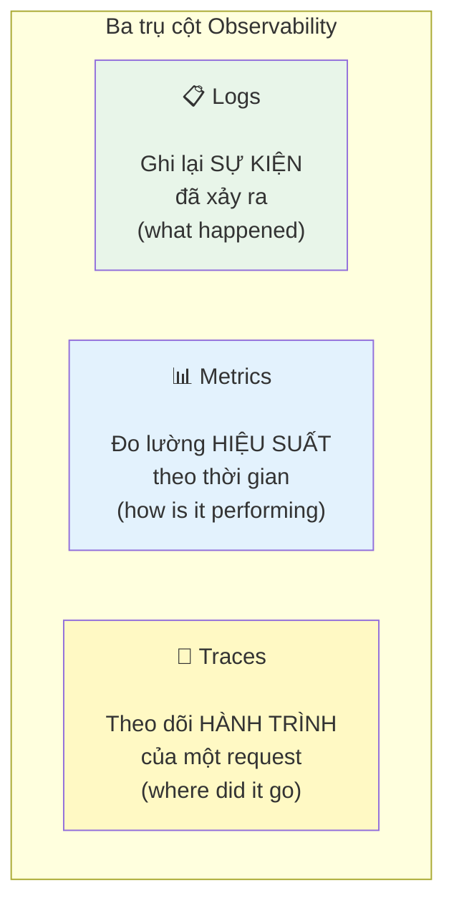
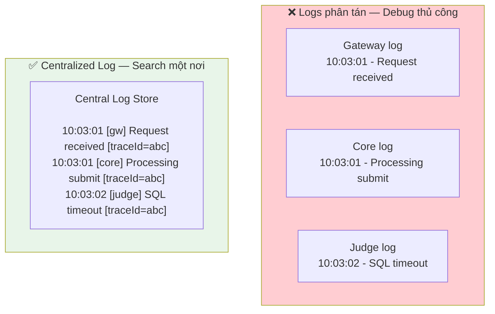
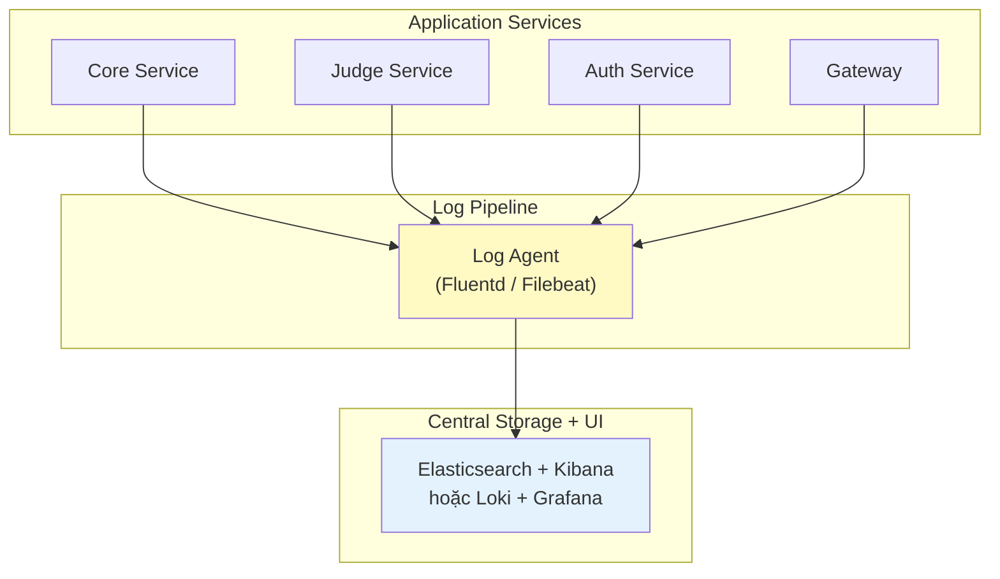
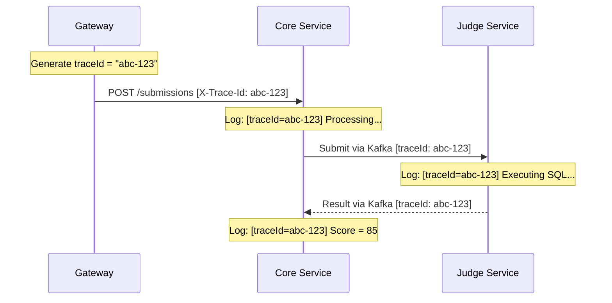
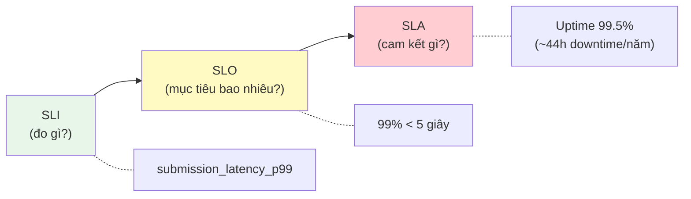
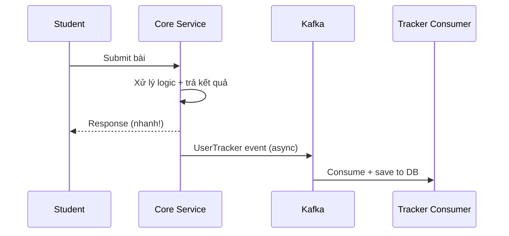
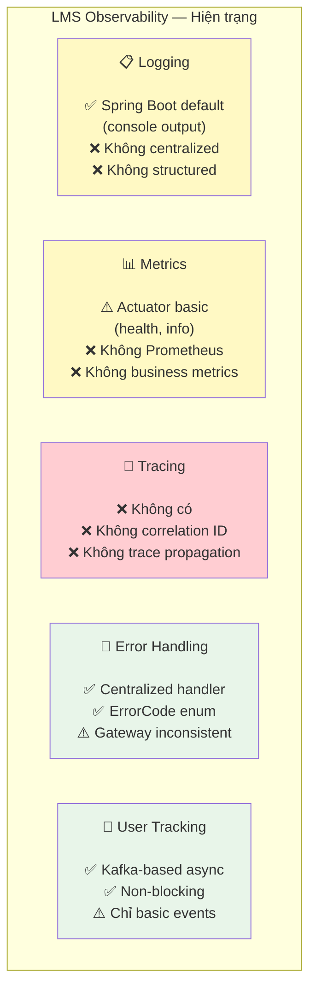

# Chương 11: Observability

> *"Observability is not just monitoring — it's the ability to ask new questions about your system's behavior without deploying new code."*
> — Charity Majors (tổng hợp từ observability community)

---

## Bạn sẽ học được gì

- Hiểu tại sao observability là **điều kiện tiên quyết** để vận hành microservices — không chỉ là "nice-to-have"
- Phân biệt **observability vs monitoring** và khi nào cần gì
- Nắm vững ba trụ cột: **Logs**, **Metrics**, **Traces** và cách chúng bổ trợ nhau
- Thiết kế chiến lược **centralized logging** với structured logs và correlation IDs
- Hiểu **distributed tracing** và các khái niệm trace, span, context propagation
- Nắm framework đo lường: **SLI/SLO/SLA** và chiến lược alerting
- Xây dựng **error handling strategy** nhất quán xuyên services
- Phân tích observability gaps trong hệ thống LMS và đề xuất migration path

---

## 11.1 Ba trụ cột của Observability

### Vấn đề: "hệ thống lỗi nhưng không biết lỗi ở đâu"

Trong monolith, khi có bug: mở log file duy nhất, tìm exception, xem stack trace — xong. Toàn bộ request chạy trong cùng process, cùng log file, cùng database.

Trong microservices, một request từ user có thể đi qua **5-7 services**, mỗi service có log riêng, database riêng, deploy cycle riêng. Khi request fail:
- Service nào gây lỗi? Gateway? Core? Judge? Auth?
- Lỗi xảy ra ở bước nào trong chuỗi gọi?
- Latency 5 giây — do network, do database query, hay do Kafka consumer lag?

*Hình 11.1: Request flow qua 5+ services — lỗi xảy ra ở đâu?*

Newman trong [4a, Ch.8] gọi đây là thách thức lớn nhất khi vận hành microservices: **sự phức tạp không nằm ở code, mà nằm ở tương tác giữa các services**. Trong monolith, lỗi thường có stack trace rõ ràng — một file, một method. Trong microservices, lỗi có thể xuất hiện ở service B vì service A gửi data sai, hoặc vì Kafka message bị delay — không stack trace nào bắt được.

### Ba trụ cột

Richardson trong [2a, Ch.11] và Newman trong [4a, Ch.8] đều mô tả observability qua **ba trụ cột** (three pillars):

*Hình 11.2: Ba trụ cột của Observability — Logs, Metrics, Traces*


**Bảng 11.1:** Vai trò của ba trụ cột Observability

| Trụ cột | Trả lời câu hỏi | Ví dụ trong LMS | Công cụ phổ biến |
|---------|-----------------|-----------------|-----------------|
| **Logs** | "Chuyện gì đã xảy ra?" | `ERROR: SQL execution timeout for submission 123` | ELK Stack, Loki, Fluentd |
| **Metrics** | "Hệ thống đang hoạt động thế nào?" | `judge_execution_time_p99 = 4.2s` | Prometheus, Grafana, Micrometer |
| **Traces** | "Request đi qua những đâu?" | `User → Gateway → Core → Judge → MySQL (total: 3.1s)` | Jaeger, Zipkin, OpenTelemetry |

Ba trụ cột **bổ trợ lẫn nhau**: metrics cho biết *có vấn đề* (response time tăng), traces cho biết *vấn đề ở đâu* (Judge Service mất 90% thời gian), logs cho biết *tại sao* (SQL query timeout do missing index). Thiếu một trụ cột nào thì hai trụ còn lại mất đáng kể giá trị.

### Observability vs Monitoring

**Bảng 11.2:** Observability vs Monitoring

| | **Monitoring** | **Observability** |
|---|---|---|
| **Mục đích** | Phát hiện vấn đề đã biết | Khám phá vấn đề chưa biết |
| **Cách tiếp cận** | Đặt alerts cho metrics cụ thể | Explore data để hiểu hành vi hệ thống |
| **Ví dụ** | "CPU > 80% → alert" | "Tại sao latency tăng 3x ở 2PM mỗi thứ 3?" |
| **Dữ liệu** | Pre-defined dashboards | Logs + Metrics + Traces (kết hợp ad-hoc) |
| **Khi nào đủ** | Hệ thống đơn giản, failure modes biết trước | Hệ thống phân tán, failure modes không dự đoán được |

Monitoring trả lời: *"Có vấn đề không?"* Observability trả lời: *"Tại sao có vấn đề này, và vấn đề này khác gì so với lần trước?"* Với monolith, monitoring thường đủ. Với microservices — nơi failure modes phức tạp và không dự đoán được — observability là yêu cầu bắt buộc.

> **📐 Nguyên tắc — Observability ≠ Monitoring**
>
> "Monitoring tells you *that* something is wrong. Observability lets you ask *why*. Monitoring is a subset of observability — necessary but not sufficient."
>
> *— Tổng hợp từ Charity Majors và cộng đồng observability*

### Observability Maturity Model

Không phải hệ thống nào cũng cần full observability stack ngay từ đầu. Maturity model giúp xác định *đang ở đâu* và *cần đến đâu*:

**Bảng 11.3:** Observability Maturity Model

| Level | Mô tả | Đặc điểm | Phù hợp với |
|-------|--------|----------|------------|
| **1 — Reactive** | Debug khi user báo lỗi | Console logs, không alert, manual investigation | Side project, prototype |
| **2 — Basic monitoring** | Dashboards cơ bản, alerts thô | Health checks, CPU/memory metrics, log tập trung | Team nhỏ, hệ thống ít services |
| **3 — Proactive** | Phát hiện vấn đề trước user | Structured logs, correlation IDs, custom metrics, alerting | Team trung bình, nhiều services |
| **4 — Observability** | Hỏi câu hỏi mới không cần code mới | Distributed tracing, SLI/SLO, high-cardinality data | Team lớn, hệ thống phức tạp |
| **5 — Predictive** | Dự đoán vấn đề trước khi xảy ra | ML-based anomaly detection, capacity planning | Enterprise, mission-critical |

Với LMS — hệ thống giáo dục quy mô trung bình — mục tiêu hợp lý là **Level 3** (Proactive), với khả năng mở rộng lên Level 4 khi cần.

---

## 11.2 Logging — Từ Console đến Centralized Aggregation

### Vấn đề: logs phân tán, không có context

Khi hệ thống có 7+ services chạy đồng thời, mỗi service ghi log vào container riêng. Để debug một request fail, developer phải SSH vào từng container, đọc logs, cố gắng ghép thời gian — rất khó với concurrent requests và clock skew giữa containers.

*Hình 11.3: Logs phân tán (manual debug) vs Logs tập trung — Search một nơi*


### Structured Logging — Từ text sang JSON

Bước đầu tiên: chuyển từ **text logs** sang **structured logs** (JSON). Text logs dễ đọc cho người nhưng *rất khó phân tích tự động*:

**Listing 11.1:** Ví dụ Structured Log (JSON)
```
// ❌ Text log — khó parse, khó filter, khó aggregate
2024-01-15 10:03:02 ERROR [core-service] - SQL execution failed for submission 8a3f
    user 12ab, Timeout after 30s

// ✅ Structured log (JSON) — dễ query, filter, aggregate
{"timestamp":"2024-01-15T10:03:02Z","level":"ERROR","service":"core-service",
 "message":"SQL execution failed","submissionId":"8a3f","userId":"12ab",
 "duration_ms":30000,"error":"QueryTimeoutException","traceId":"abc123"}
```

Với structured logs, có thể query: *"Tất cả errors trong 24h qua có `error = QueryTimeoutException`"* hoặc *"Average `duration_ms` của submissions theo giờ"* — không thể với text logs.

### Centralized Log Aggregation

Sau khi có structured logs, bước tiếp theo là **centralized log aggregation** — gom logs từ tất cả services về một nơi. Newman trong [4a, Ch.8] nhấn mạnh: *centralized logging là yêu cầu bắt buộc* cho microservices, không phải optional.

*Hình 11.4: Pipeline gom logs tập trung — từ service đến storage*


Hai stack phổ biến nhất:

**Bảng 11.4:** So sánh hai stack ELK và PLG

| Stack | Components | Ưu điểm | Nhược điểm | Phù hợp |
|-------|-----------|---------|------------|---------|
| **ELK** | Elasticsearch + Logstash + Kibana | Mature, full-text search mạnh | Resource-heavy (~4GB RAM minimum) | Team lớn, nhiều logs |
| **PLG** | Promtail + Loki + Grafana | Lightweight, tích hợp metrics | Query kém linh hoạt hơn ELK | Team nhỏ-trung, LMS |

### Correlation IDs — Kỹ thuật quan trọng nhất

Newman trong [4a, Ch.8] mô tả **Correlation ID** (hay Trace ID) là kỹ thuật quan trọng nhất cho debugging microservices: một identifier duy nhất gắn vào request từ entry point (Gateway), truyền qua tất cả services qua HTTP headers và Kafka message headers.

*Hình 11.5: Truyền Correlation ID xuyên suốt request, kể cả qua Kafka*


Cơ chế hoạt động:
1. **Gateway** generate UUID cho mỗi request incoming, gắn vào HTTP header `X-Correlation-Id`
2. **Downstream services** đọc header, ghi vào **MDC** (Mapped Diagnostic Context) — logging framework tự động gắn kèm vào mọi log entries
3. **Kafka messages** truyền correlation ID qua message headers — nối async flow
4. **Khi debug**: search `traceId = abc-123` trong centralized log → thấy toàn bộ hành trình

> **📐 Nguyên tắc — Every Request Gets a Trace ID**
>
> "Ensure that every request entering your system gets a unique identifier, and that this identifier is passed along to all downstream services. Without this, debugging distributed systems is virtually impossible."
>
> *— Sam Newman, Building Microservices [4a, Ch.8]*

---

## 11.3 Distributed Tracing — Theo dõi Request xuyên Services

### Vấn đề: request chậm — chậm ở đâu?

Correlation IDs giúp nối logs lại — nhưng không cho biết **mỗi bước mất bao lâu**. Khi student submit bài và response mất 8 giây (bình thường 2 giây), developer biết request đi qua Gateway → Core → Judge → MySQL, nhưng không biết 6 giây thừa nằm ở bước nào mà không đọc timestamps thủ công.

### Distributed Tracing — Tự động đo timing

**Distributed tracing** ghi lại hành trình đầy đủ của một request qua tất cả services, bao gồm thời gian mỗi bước (**span**):

*Hình 11.6: Gantt chart của một Trace — hiển thị timing cho từng Span*

```mermaid
gantt
    title Trace: Submit SQL Request (traceId: abc-123)
    dateFormat X
    axisFormat %L ms
    
    section Gateway
    JWT validation + routing     :0, 50
    
    section Core Service  
    Parse request + validate     :50, 80
    Save submission to DB        :80, 120
    Send Kafka message           :120, 150
    
    section Judge Service
    Receive Kafka message        :150, 180
    Execute SQL on sandbox       :180, 750
    Compare results (SHA-256)    :750, 770
    
    section Core Service
    Receive result + update score :770, 810
```


Từ trace này, rõ ràng: **Execute SQL on sandbox** mất 570ms — chiếm 70% tổng thời gian. Đây là bottleneck cần optimize. Không có tracing, developer phải đoán hoặc đọc logs timestamp thủ công.

### Concepts: Trace, Span, Context Propagation

**Bảng 11.5:** Các khái niệm cơ bản trong Distributed Tracing

| Concept | Mô tả | Ví dụ |
|---------|--------|-------|
| **Trace** | Toàn bộ hành trình của một request | Submit bài từ browser → score trả về |
| **Span** | Một bước trong trace (một unit of work) | "Core Service: save submission" (40ms) |
| **Parent-child** | Span có thể chứa child spans | "Judge Service" span chứa "Execute SQL" và "Compare" |
| **Context propagation** | Truyền trace context qua service boundaries | HTTP header `traceparent`, Kafka message header |

### Sampling Strategies

Trong production, trace **100% requests** tốn rất nhiều storage và processing. Cần sampling strategy:

**Bảng 11.6:** Sampling strategies cho Tracing

| Strategy | Mô tả | Khi nào dùng |
|----------|--------|-------------|
| **Head-based** | Quyết định sample tại entry point (Gateway) | Đơn giản, dễ implement |
| **Tail-based** | Quyết định sau khi trace hoàn thành (giữ traces lỗi, bỏ traces thành công) | Capture 100% errors, giảm storage |
| **Rate-based** | Sample N% requests | Production high-traffic (1-10%) |
| **Adaptive** | Tự động điều chỉnh sample rate theo traffic volume | Enterprise, dynamic workloads |

Với LMS: contest mode (100+ concurrent users) nên dùng rate-based 10-20%; ngoài contest dùng 100%.

### Tracing trong Spring Boot 3.x

Spring Boot 3.x tích hợp sẵn **Micrometer Tracing** — abstraction layer cho distributed tracing, hỗ trợ nhiều backend (Zipkin, Jaeger, OpenTelemetry). Chỉ cần thêm dependency và cấu hình endpoint — Spring Boot **tự động** truyền trace context qua HTTP headers (`traceparent`) và Kafka headers. Không cần viết code tracing thủ công cho phần lớn use cases.

> **📐 Nguyên tắc — Tracing Complements Logging**
>
> "Tracing cho biết request *đi đâu* và *mất bao lâu*. Logging cho biết *tại sao*. Dùng trace để identify bottleneck, dùng logs để understand root cause. Không cái nào thay thế cái nào."
>
> *— Tổng hợp từ Richardson [2a, Ch.11] và Newman [4a, Ch.8]*

---

## 11.4 Metrics, SLI/SLO, và Alerting Strategy

### Metrics — Đo lường hành vi theo thời gian

Logs ghi lại *sự kiện đã xảy ra*. Metrics đo lường *xu hướng theo thời gian* — quan trọng cho **early detection**: phát hiện vấn đề trước khi user báo lỗi.

Richardson trong [2a, Ch.11] mô tả bốn loại metrics cần thu thập:

**Bảng 11.7:** Bốn loại metrics cần thu thập

| Pattern | Mô tả | Ví dụ LMS |
|---------|--------|-----------|
| **Health Check API** | Endpoint `/health` cho orchestrator biết service sống/chết | Eureka dùng health check để route traffic |
| **Application metrics** | Business-level metrics | Submission rate, judge duration, error rate |
| **Infrastructure metrics** | System-level metrics | CPU, memory, DB connections, Kafka consumer lag |
| **Audit logging** | Ghi lại hành vi user cho compliance | User login, role changes, data access |

### Hai framework đo lường: RED và USE

**Bảng 11.8:** Framework RED và USE

| Framework | Dùng cho | Metrics | Ví dụ LMS |
|-----------|---------|---------|-----------|
| **RED** | **Services** (request-facing) | **R**ate, **E**rrors, **D**uration | Submission rate: 50 req/min, Error rate: 2%, P99 latency: 3.2s |
| **USE** | **Resources** (infrastructure) | **U**tilization, **S**aturation, **E**rrors | CPU: 45%, DB connection pool: 8/10 active, Disk I/O errors: 0 |

Kết hợp RED (cho services) + USE (cho resources) cho bức tranh đầy đủ. Metrics phát hiện "submission latency tăng" (RED), investigation cho thấy "DB connection pool saturated" (USE) → root cause: connection leak.

### SLI/SLO/SLA — Từ metrics đến cam kết chất lượng

Metrics chỉ hữu ích khi biết **ngưỡng nào là chấp nhận được**. Framework SLI/SLO/SLA cung cấp ngôn ngữ chung:

**Bảng 11.9:** Sự khác biệt giữa SLI, SLO và SLA

| Khái niệm | Mô tả | Ví dụ LMS |
|-----------|--------|-----------|
| **SLI** (Service Level Indicator) | *Metric cụ thể* đo chất lượng dịch vụ | Latency P99 của submission flow |
| **SLO** (Service Level Objective) | *Mục tiêu nội bộ* cho SLI | "99% submissions trả kết quả trong < 5 giây" |
| **SLA** (Service Level Agreement) | *Cam kết với khách hàng* (có hậu quả nếu vi phạm) | "Hệ thống available 99.5% thời gian trong semester" |

*Hình 11.7: Mối quan hệ giữa SLI, SLO và SLA*


Với LMS — hệ thống giáo dục nội bộ — SLO phù hợp:

**Bảng 11.10:** SLO đề xuất cho hệ thống LMS

| SLI | SLO | Lý giải |
|-----|-----|---------|
| Submission latency P99 | < 5 giây | Student chờ lâu hơn → frustration, bỏ cuộc |
| Availability trong contest | 99.9% (~8.7h downtime/năm) | Contest có thời gian giới hạn — downtime ảnh hưởng trực tiếp điểm |
| Grading accuracy | 100% | Chấm sai = ảnh hưởng điểm học thuật — không chấp nhận sai |
| API error rate | < 1% | Lỗi thường xuyên → mất niềm tin vào hệ thống |

### Alerting Strategy

Metrics + SLO tạo nền tảng cho alerting. Nhưng alert sai cách gây **alert fatigue** — team ignore mọi alerts vì quá nhiều false positives.

**Bảng 11.11:** Chiến lược Alerting theo mức độ nghiêm trọng

| Level | Khi nào | Kênh | Hành động | Ví dụ |
|-------|--------|------|-----------|-------|
| **Critical** | SLO bị vi phạm, impact user ngay | PagerDuty, phone call | On-call engineer xử lý ngay | Judge Service down, submission fails |
| **Warning** | Gần vi phạm SLO, cần attention | Slack, email | Review trong working hours | Latency P99 đạt 80% threshold |
| **Info** | Anomaly nhưng không impact user | Dashboard only | Review khi rảnh | Kafka consumer lag tăng nhẹ |

> **📐 Nguyên tắc — Alert on SLOs, Not Symptoms**
>
> "Alert khi SLO có nguy cơ bị vi phạm, không phải khi một metric thay đổi. CPU 90% nhưng latency bình thường? Không cần alert. CPU 50% nhưng latency vượt SLO? Alert ngay."
>
> *— Nguyên tắc SRE, dựa trên Google SRE book*

---

## 11.5 Error Handling Strategy — Nhất quán xuyên Services

### Vấn đề: mỗi service trả error format khác nhau

Khi hệ thống có nhiều services do nhiều developer phát triển, error responses dễ bị *inconsistent*. Service A trả error trong field `description`, Service B trả trong `message`, Gateway trả format hoàn toàn khác. Client (frontend) phải xử lý nhiều format — code rối, UX tệ.

### Nguyên tắc thiết kế Error Handling

Richardson trong [2a, Ch.11] và Newman trong [4a, Ch.8] đề xuất các nguyên tắc cho error handling trong microservices:

**1. Centralized exception handler** — Mỗi service có một handler tập trung (trong Spring Boot: `@ControllerAdvice`) xử lý tất cả exceptions → chuyển thành format chuẩn. Đặt trong shared library để mọi service dùng chung.

**2. Error code taxonomy** — Phân loại errors theo namespace để client và monitoring system hiểu nhanh:

**Bảng 11.12:** Taxonomy hệ thống mã lỗi (Error Code)

| Range | Category | Ví dụ |
|-------|---------|-------|
| 1xxx | Authentication & Authorization | 1001: Unauthorized, 1002: Token expired |
| 2xxx | Resource not found | 2001: Question not found, 2002: Contest not found |
| 3xxx | Business logic violation | 3001: Contest chưa bắt đầu, 3002: Hết lượt nộp |
| 4xxx | Infrastructure / dependency | 4001: Judge service unavailable, 4002: Kafka send failed |
| 9xxx | Internal errors | 9999: Unexpected error |

**3. Unified response format** — Tất cả error responses dùng cùng cấu trúc:

**Listing 11.2:** Unified Error Response payload
```json
// ✅ Format nhất quán — client chỉ cần parse một structure
{
  "errorCode": 4001,
  "description": "Judge service unavailable",
  "timestamp": "2024-01-15T10:03:02Z",
  "traceId": "abc-123"
}
```

**4. Never leak internals** — Stack traces, SQL queries, internal paths không bao giờ xuất hiện trong error response. Log chi tiết ở server side (với traceId để correlation), trả thông báo generic cho client.

### Error Handling và Observability — Mối liên hệ

Error codes tập trung không chỉ phục vụ client — chúng là **nguồn dữ liệu cho metrics và alerting**:
- Count errors by code → phát hiện patterns: `JUDGE_UNAVAILABLE` tăng đột biến → alert
- Group errors by category → dashboard: authentication issues vs business logic vs infrastructure
- Error rate per service → SLI cho reliability

> **🔍 Phân tích gap — Error format inconsistency trong LMS**
>
> Hệ thống LMS sử dụng `@ControllerAdvice` với `ErrorCode` enum trong shared library — đúng pattern. Tuy nhiên, **Gateway** (Spring Cloud Gateway dùng WebFlux) xử lý JWT errors *bên ngoài* `@ControllerAdvice` (WebMVC pattern). Kết quả: Gateway trả error dạng `{ "message": "..." }` trong khi các services trả `{ "description": "..." }` — field name khác nhau. Frontend phải handle cả hai formats.
>
> **Migration path**: (1) Tạo `GatewayExceptionHandler` riêng cho WebFlux, chuẩn hóa response format, (2) Đảm bảo tất cả error responses dùng cùng field names, (3) Thêm `traceId` vào error response để client có thể report cho support team.

---

## 11.6 Health Checks và Service Discovery

### Health Checks — Nền tảng cho tự động hóa

Richardson trong [2a, Ch.11] mô tả **Health Check API** là observability pattern cơ bản nhất: mỗi service expose endpoint `/health` để orchestration tools biết service có hoạt động không.

Health checks phân loại theo mục đích:

**Bảng 11.13:** Ba loại Health Checks

| Loại | Câu hỏi trả lời | Ý nghĩa cho orchestrator | Ví dụ LMS |
|------|-----------------|--------------------------|-----------|
| **Liveness** | "Process còn chạy?" | Restart container nếu dead | JVM alive, không deadlock |
| **Readiness** | "Sẵn sàng nhận traffic?" | Ngừng route traffic nếu not ready | Database connected, Kafka connected |
| **Startup** | "Đã khởi tạo xong?" | Chờ startup xong mới check liveness | Schema migration done, cache warmed |

Trong LMS, **Eureka** (Service Discovery) sử dụng health checks để quyết định routing: nếu Core Service instance báo `DOWN`, Eureka ngừng route traffic đến instance đó — Gateway tự động chuyển sang instance khác. Đây là nền tảng cho **self-healing**: hệ thống tự phục hồi mà không cần can thiệp thủ công.

### User Activity Tracking — Observability ở mức Business

Ba trụ cột (logs, metrics, traces) giúp quan sát **hệ thống kỹ thuật**. Nhưng với LMS — một ứng dụng giáo dục — cần thêm: quan sát **hành vi học tập** (learning analytics). Sinh viên đang học gì? Bài nào khó nhất? Khi nào sinh viên hoạt động nhiều nhất?

LMS đã triển khai **User Activity Tracking** qua Kafka pipeline: khi sinh viên xem câu hỏi, nộp bài, hoặc tham gia contest, Core Service publish tracking events lên Kafka topic. Consumer ghi vào database — hoàn toàn **async, non-blocking**, không ảnh hưởng response time.

*Hình 11.8: User Activity Tracking pipeline qua Kafka*


**Bảng 11.14:** Ứng dụng của User Activity Tracking

| Data | Câu hỏi trả lời được | Ứng dụng |
|------|----------------------|---------|
| View patterns | "Câu hỏi nào được xem nhiều nhất?" | Đề xuất bài tập phù hợp |
| Submit patterns | "Sinh viên nào nộp bài nhiều lần?" | Phát hiện sinh viên cần hỗ trợ |
| Time patterns | "Peak hours là khi nào?" | Scale infrastructure phù hợp |
| Contest behavior | "Bao nhiêu % sinh viên hoàn thành contest?" | Đánh giá hiệu quả giảng dạy |

Đây là điểm giao giữa technical observability và **domain-specific analytics** — một giá trị riêng mà observability mang lại cho LMS, vượt xa việc chỉ phục vụ ops team.

---

### Chaos Engineering — Kiểm tra Resilience chủ động

Observability cho phép **phát hiện** sự cố. Nhưng làm sao biết hệ thống sẽ phản ứng thế nào *trước khi* sự cố thật xảy ra? **Chaos Engineering** — phương pháp được Netflix phổ biến qua Chaos Monkey (2011) — trả lời câu hỏi này bằng cách **chủ động inject failures** vào production/staging và quan sát phản ứng.

Nguyên tắc (theo *Principles of Chaos Engineering* — principlesofchaos.org):

1. **Xác định "steady state"** — hệ thống hoạt động bình thường trông như thế nào? (metrics: latency < 200ms, error rate < 0.1%, throughput > 100 req/s)
2. **Đặt giả thuyết** — "Nếu Judge Service chết, submissions vẫn được queue và xử lý khi Judge restart"
3. **Inject failure** — Kill Judge Service container
4. **Observe** — Steady state có bị phá vỡ không? System recover trong bao lâu?
5. **Fix weaknesses** — Nếu steady state bị phá vỡ → fix system, không phải fix test

**Bảng 11.15:** Phân loại Failure Injection trong Chaos Engineering

| Loại failure injection | Ví dụ | Tool |
|-----------------------|-------|------|
| **Process failure** | Kill container/service | Chaos Monkey, `docker stop` |
| **Network failure** | Delay, packet loss, partition | Toxiproxy, Gremlin |
| **Resource exhaustion** | CPU 100%, disk full, memory leak | stress-ng, Gremlin |
| **Dependency failure** | Database down, Kafka unavailable | Litmus, manual |

Áp dụng cho LMS — ba chaos experiments hữu ích:

**Bảng 11.16:** Chaos experiments cho hệ thống LMS

| Experiment | Giả thuyết | Kết quả mong đợi |
|-----------|-----------|-----------------|
| Kill Judge Service | Submissions queue trong Kafka, xử lý khi restart | Kafka retention giữ messages, Judge catch up |
| Network delay 500ms giữa Gateway↔Core | Users experience slower response nhưng không lỗi | Circuit breaker/timeout ngăn cascade |
| PostgreSQL restart | Core Service reconnect tự động | Connection pool (HikariCP) handle reconnection |

> **💡 Tip — Bắt đầu Chaos Engineering từ staging**
>
> Không cần Chaos Monkey hoặc tools phức tạp. Bắt đầu đơn giản: `docker stop judge-service` trên staging → quan sát logs → xem system recover không. Đây đã là chaos engineering. Khi team quen, nâng lên: automated chaos experiments chạy trong CI/CD pipeline.

### Industry Case Study: Netflix Simian Army

Netflix là pioneer của Chaos Engineering. Năm 2010, sau khi migrate từ datacenter sang AWS, Netflix tạo **Chaos Monkey** — tool tự động kill random EC2 instances trong production. Mục đích: nếu system survive random failures hàng ngày, nó sẽ survive failures thật.

Chaos Monkey phát triển thành **Simian Army** — tập hợp tools chuyên biệt:

**Bảng 11.17:** Netflix Simian Army

| Tool | Chức năng | Bài học |
|------|----------|---------|
| **Chaos Monkey** | Kill random instances | Services phải stateless, auto-restart |
| **Chaos Kong** | Simulate entire region failure | Multi-region failover phải hoạt động |
| **Latency Monkey** | Inject network delay | Timeout + circuit breaker phải configured đúng |
| **Conformity Monkey** | Kiểm tra instance tuân thủ best practices | Automation replaces manual auditing |

**Kết quả**: Netflix đạt **99.99% availability** (52 phút downtime/năm) — phục vụ 200+ triệu subscribers. Casey Rosenthal (Netflix Director of Engineering) sau đó founder Verica và co-author *Chaos Engineering: System Resiliency in Practice* (O'Reilly, 2020).

**Bài học cho hệ thống nhỏ**: LMS không cần Simian Army. Nhưng nguyên tắc cốt lõi áp dụng: *nếu bạn sợ kill một service, đó là dấu hiệu hệ thống thiếu resilience*. Bắt đầu manual (`docker stop`), tiến tới automated (CI/CD chaos stage).

*Nguồn: Netflix Technology Blog, "The Netflix Simian Army," 2011 (netflixtechblog.com). Casey Rosenthal et al., Chaos Engineering: System Resiliency in Practice, O'Reilly, 2020.*

---

## 11.7 Case Study: Observability trong hệ thống LMS

### Hiện trạng — Đánh giá theo Maturity Model



*Hình 11.9: Đánh giá hiện trạng Observability của LMS*

**Đánh giá tổng thể: Level 1 (Reactive)** — hệ thống chạy production nhưng debug bằng `docker logs` thủ công. Khi submission chậm hoặc fail, developer phải mở logs từng container, ghép timestamps, và hy vọng tìm được root cause.

**Bảng 11.18:** Mức độ trưởng thành observability phân theo component

| Component | Hiện trạng | Maturity Level |
|-----------|-----------|----------------|
| **Logging** | Console output, không aggregation, không structured | 🔴 Level 1 |
| **Metrics** | Actuator health/info — Eureka dùng cho routing | 🟡 Level 2 |
| **Tracing** | Không có — manual debugging | 🔴 Level 1 |
| **Error handling** | `@ControllerAdvice` + `ErrorCode` tốt, Gateway inconsistent | 🟢 Level 3 |
| **User tracking** | Kafka-based async — tốt | 🟢 Level 3 |

### Phân tích theo business context

Hệ thống LMS phục vụ **sinh viên học SQL** — có hai mode hoạt động chính với yêu cầu observability rất khác nhau:

**Bảng 11.19:** Hai chế độ hoạt động chính của LMS

| Mode | Đặc điểm | SLO cần thiết | Observability cần |
|------|----------|--------------|-------------------|
| **Practice mode** | Sinh viên tự luyện tập, traffic thấp, không deadline | Latency < 10s OK, downtime chấp nhận được | Basic monitoring đủ |
| **Contest mode** | 100+ sinh viên submit đồng thời, có deadline, leaderboard real-time | Latency < 5s, availability 99.9% | Metrics + alerts bắt buộc |

Trong contest mode, **không có observability = bay mù**:
- Judge Service overloaded → submissions queue up → leaderboard outdated → sinh viên phàn nàn
- Không có custom metrics → không biết judge duration tăng cho đến khi student report
- Không có tracing → không biết bottleneck ở Judge hay ở Kafka consumer

> **🔍 Phân tích gap — Zero tracing, zero centralized logging**
>
> Hệ thống LMS vận hành production **không có distributed tracing** và **không có centralized logging**. Theo Richardson [2a, Ch.11] và Newman [4a, Ch.8], đây là rủi ro nghiêm trọng: mỗi incident debugging phải manual, MTTR (Mean Time To Resolve) cao, root cause analysis gần như không thể cho cross-service issues.
>
> **Migration path** (incremental — mỗi phase đều mang lại giá trị ngay, target: Level 3):
>
> **Phase 1 — Structured Logging + Correlation ID** (effort thấp, impact cao):
> - Chuyển sang JSON logging (Logback JSON encoder — chỉ thay config, không thay code)
> - Thêm Correlation ID filter vào Gateway, propagate qua HTTP/Kafka headers
> - Giá trị ngay: debug cross-service bằng cách search một traceId
>
> **Phase 2 — Centralized Log Aggregation** (effort trung bình):
> - Deploy Loki + Grafana (nhẹ hơn ELK, phù hợp team nhỏ)
> - Cấu hình Docker logging driver → push logs về Loki
> - Giá trị ngay: search logs một nơi thay vì SSH vào từng container
>
> **Phase 3 — Distributed Tracing** (effort trung bình):
> - Thêm Micrometer Tracing + OpenTelemetry vào mỗi service (Spring Boot 3.x hỗ trợ sẵn)
> - Deploy Jaeger hoặc Zipkin làm trace backend
> - Giá trị ngay: biết chính xác bottleneck khi submission chậm — Judge? Kafka? DB?
>
> **Phase 4 — Business Metrics + Alerting** (effort trung bình):
> - Thêm Prometheus + Grafana cho metrics collection/visualization
> - Tạo SLOs cho contest mode: submission latency P99, judge availability
> - Set up alerts: Judge unavailable → critical, latency spike → warning

---

> **⚠️ Sai lầm thường gặp**
>
> 1. **Logging quá nhiều hoặc quá ít** — Log mọi request body (sensitive data leaked, storage explodes) hoặc chỉ log errors (mất context khi debug). Hậu quả: hoặc tốn hàng GB logs/ngày mà không dùng được, hoặc thiếu thông tin khi cần. *Phòng tránh*: log ở mức INFO cho business events (submit, login), DEBUG cho technical details. NEVER log passwords, tokens, hoặc PII.
> 2. **Không có correlation ID** — Mỗi service log độc lập, không thể nối events xuyên services. Hậu quả: ghép logs bằng timestamp — sai khi concurrent requests. *Phòng tránh*: generate correlation ID tại entry point (Gateway), propagate qua headers, ghi vào MDC. Effort gần như zero, giá trị rất lớn.
> 3. **Alert fatigue — quá nhiều alerts** — Set alert cho mọi metric → hàng chục alerts/ngày → team ignore tất cả. Hậu quả: alert thật bị bỏ qua. *Phòng tránh*: chỉ alert cho SLO violations — những vấn đề thật sự ảnh hưởng user. Chia thành: critical (pager), warning (Slack), info (dashboard only).
> 4. **Dùng tracing thay cho logging** — Tracing cho biết request *đi đâu* và *mất bao lâu*, nhưng KHÔNG cho biết *tại sao fail*. Hậu quả: biết Judge mất 5 giây nhưng không biết do query nào, missing index nào. *Phòng tránh*: tracing bổ trợ logging — trace = overview, log = details.
> 5. **Bỏ qua observability vì "team nhỏ"** — Team 2-3 người, "docker logs đủ rồi". Hậu quả: khi scale lên hoặc có incident lúc 2AM, đọc logs thủ công từ 7 containers là nightmare. *Phòng tránh*: bắt đầu nhỏ — structured logging + correlation ID là bước đầu tiên, gần như zero effort.

---

## Tổng kết

Observability là **điều kiện tiên quyết** để vận hành microservices — không phải tính năng bổ sung. Trong monolith, một log file và một debugger đủ để tìm bug. Trong microservices, request đi qua nhiều services, failure modes không dự đoán được — cần công cụ cho phép *hỏi câu hỏi mới* về hành vi hệ thống mà không cần deploy code mới.

Ba trụ cột — Logs, Metrics, Traces — bổ trợ lẫn nhau: metrics phát hiện vấn đề (latency spike), traces xác định vị trí (Judge Service), logs giải thích nguyên nhân (SQL timeout). Observability Maturity Model giúp team xác định *mức độ cần thiết* — không phải hệ thống nào cũng cần Level 5. Với LMS, Level 3 (Proactive) là mục tiêu hợp lý.

Structured logging và Correlation ID là nền tảng — effort thấp nhất, impact cao nhất. SLI/SLO/SLA cung cấp framework để chuyển từ "monitoring metrics" sang "measuring service quality" — đặc biệt quan trọng cho contest mode của LMS khi downtime ảnh hưởng trực tiếp đến trải nghiệm học tập.

Error handling nhất quán — centralized exception handler + error code taxonomy — phục vụ cả client (UX tốt hơn) và ops team (metrics theo error code category). User tracking qua Kafka pipeline mở rộng observability từ *hệ thống* sang *hành vi học tập* — giá trị riêng mà domain giáo dục khai thác từ observability.

Phân tích LMS cho thấy observability đang ở Level 1 (Reactive) — gap nghiêm trọng thứ hai sau shared database (Ch.7). Migration path rõ ràng: structured logs → correlation IDs → centralized aggregation → tracing → metrics + SLOs. Mỗi phase mang lại giá trị ngay, không cần đợi "hoàn thiện toàn bộ" mới bắt đầu.

Ở Chương 12, chúng ta sẽ chuyển sang **Triển khai và DevOps** — containerization, Docker Compose, CI/CD pipelines, và cách deploy hệ thống microservices hoàn chỉnh.

---

## Đọc thêm

**Sách tham khảo chính:**
1. [2a] Chris Richardson, *Microservices Patterns*, 1st Ed. — Ch.11: Developing Production-Ready Services — Health check API, Log aggregation, Distributed tracing, Application metrics
2. [4a] Sam Newman, *Building Microservices* — Ch.8: Monitoring — Logs, Metric tracking, Synthetic monitoring, Correlation IDs

**Sách bổ trợ:**
3. [5] Hugo Rocha, *Practical Event-Driven MS Architecture* — Distributed Tracing, Domain Segregation
4. [3] Ronnie Mitra, *Microservices: Up and Running* — Ch.9: Monitoring infrastructure
5. [4b] Sam Newman, *Monolith to Microservices* — Reporting, Monitoring and Troubleshooting during migration

**Nguồn trực tuyến:**
- OpenTelemetry official docs — opentelemetry.io
- Micrometer docs — micrometer.io (Spring Boot observability)
- Grafana Loki — grafana.com/oss/loki (lightweight log aggregation)
- Jaeger — jaegertracing.io (distributed tracing)
- Brendan Gregg, "USE Method" — brendangregg.com/usemethod.html
- Tom Wilkie, "RED Method" — grafana.com/blog/2018/08/02/the-red-method
- Google SRE Book, "Service Level Objectives" — sre.google/sre-book/service-level-objectives
