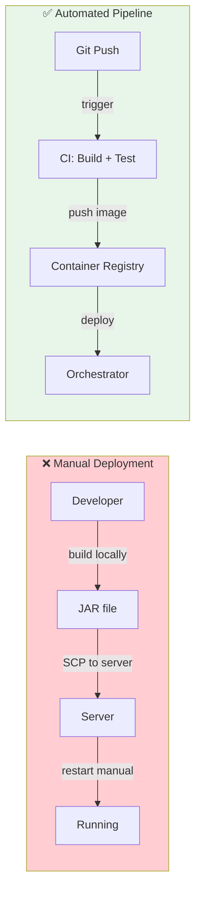
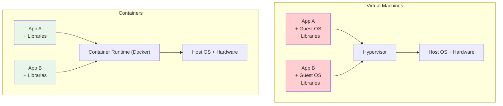
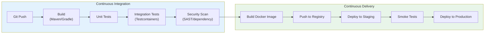
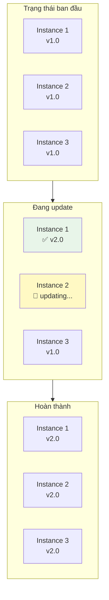
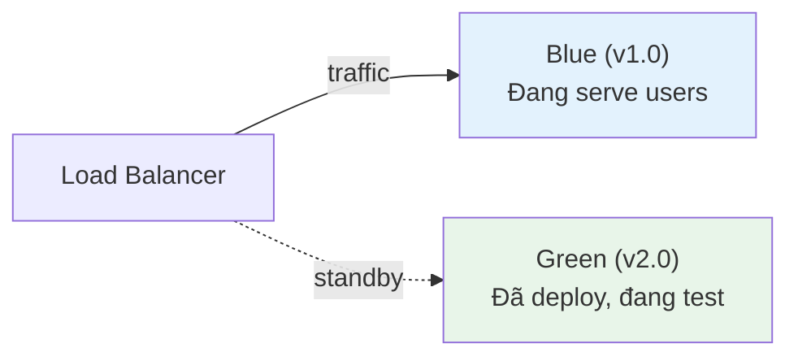
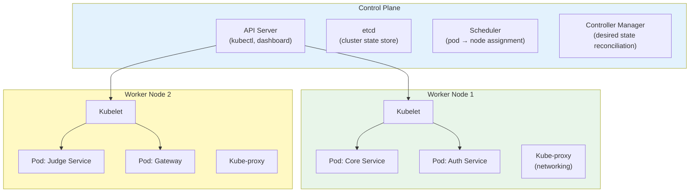
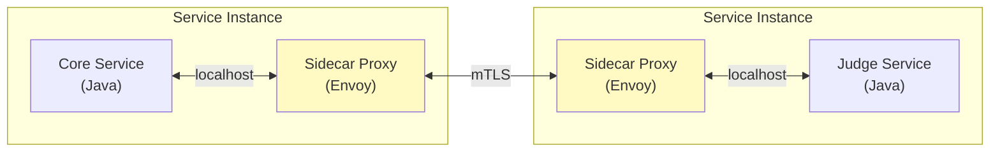
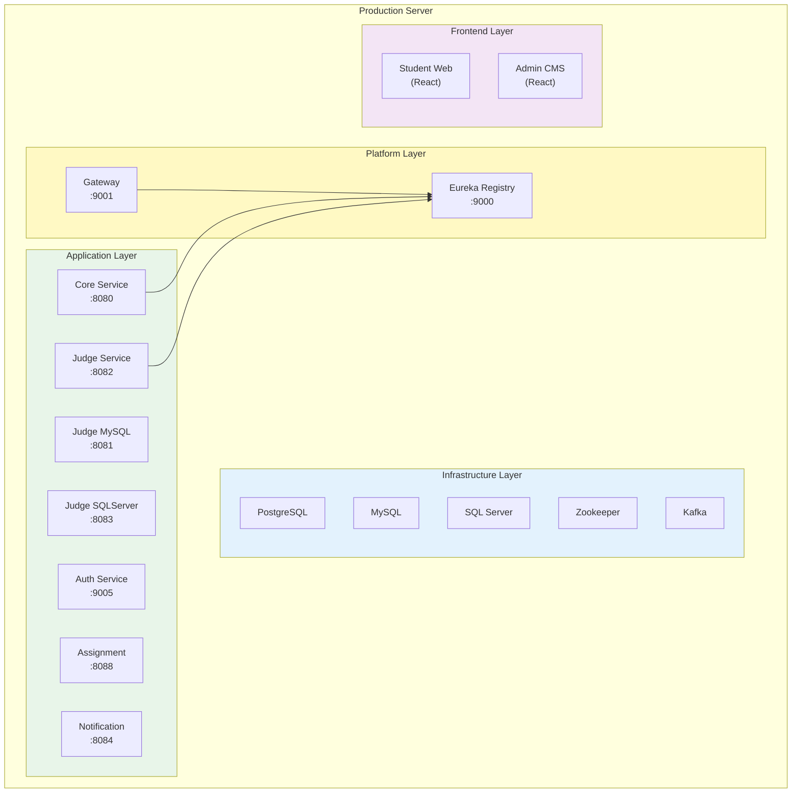

# Chương 12: Triển khai và DevOps

> *"If deploying is painful, deploy more frequently. Automation turns a dreaded chore into a non-event."*
> — Martin Fowler, *Continuous Delivery* (nguyên tắc DevOps)

---

## Bạn sẽ học được gì

- Hiểu vì sao triển khai microservices phức tạp hơn monolith và cần **tự động hóa**
- Nắm vững **containerization** với Docker — từ Dockerfile đến image registry
- Sử dụng **Docker Compose** để orchestrate multi-service deployment trên một máy
- Thiết kế **CI/CD pipeline** cho microservices — build, test, deploy tự động
- So sánh các **deployment strategies**: Rolling, Blue/Green, Canary
- Hiểu **Infrastructure as Code** (IaC) và vai trò trong quản lý hạ tầng
- Phân tích deployment architecture của hệ thống LMS và đề xuất cải thiện

---

## 12.1 Thách thức Triển khai Microservices

### Vấn đề: từ "deploy một file WAR" đến "deploy N services đồng bộ"

Trong monolith, triển khai nghĩa là: build một artifact (JAR/WAR), copy lên server, restart. Một file, một lần, xong.

Trong microservices, "deploy" có nghĩa khác hoàn toàn:

| Monolith | Microservices |
|----------|--------------|
| 1 artifact → 1 server | N artifacts → N servers/containers |
| 1 database migration | N database migrations (mỗi service) |
| Restart 1 process | Restart N processes — **thứ tự quan trọng** |
| Rollback: quay về version cũ | Rollback: quay N services về versions tương thích |
| Test trước deploy: 1 environment | Test trước deploy: cần N services chạy cùng |

Newman trong [4a, Ch.6] nhấn mạnh: khả năng **independent deployment** là lợi ích quan trọng nhất của microservices — nhưng cũng là thách thức lớn nhất. Nếu không tự động hóa, deploy 7+ services thủ công trở thành "dreaded Friday afternoon deployment".

### Từ Manual đến Automation — DevOps Mindset

Mitra trong [3, Ch.6] mô tả ba nguyên tắc DevOps nền tảng cho microservices deployment:

| Nguyên tắc | Mô tả | Ý nghĩa |
|-----------|--------|---------|
| **Immutable Infrastructure** | Không patch server đang chạy — tạo mới, deploy mới, xóa cũ | Reproducible, no configuration drift |
| **Infrastructure as Code** | Mọi hạ tầng (server, network, database) định nghĩa trong code | Version control, review, rollback |
| **Continuous Delivery** | Code luôn ở trạng thái sẵn sàng deploy — chỉ cần ấn nút | Giảm risk per deployment, feedback nhanh |



> **📐 Nguyên tắc — If It Hurts, Do It More Often**
>
> "If deploying is painful, deploy more frequently. The pain is information — it tells you what to automate."
>
> *— Martin Fowler, Continuous Delivery (trích dẫn bởi Mitra [3, Ch.6])*

---

## 12.2 Containerization với Docker

### Vấn đề: "Works on my machine"

Khi deploy microservices, mỗi service cần environment riêng: JDK version, dependencies, configuration. Truyền thống: cấu hình server thủ công → khác biệt giữa dev/staging/production → bugs chỉ xuất hiện trên production.

### Container — Lightweight Isolation

**Container** (Docker) đóng gói ứng dụng + dependencies + runtime thành một **image** — chạy giống nhau trên mọi môi trường. Khác với Virtual Machine: container chia sẻ kernel với host OS → nhẹ hơn, khởi động trong giây thay vì phút.



| So sánh | VM | Container |
|---------|-----|-----------|
| **Khởi động** | Phút | Giây |
| **Kích thước** | Hàng GB (Guest OS) | Hàng MB-GB (chỉ app + libs) |
| **Isolation** | Mạnh (hardware-level) | Trung bình (OS-level — share kernel) |
| **Density** | 5-10 VMs/host | 50-100+ containers/host |
| **Phù hợp** | Multi-tenant, security-critical | Microservices, CI/CD, dev environments |

Richardson trong [2a, Ch.12] mô tả 5 deployment patterns, trong đó **Service as Container** là phổ biến nhất cho microservices — cân bằng giữa isolation, tốc độ, và resource efficiency.

### Deployment Patterns — Từ Language-Specific đến Serverless

Richardson trong [2a, Ch.12] phân loại:

| Pattern | Mô tả | Ưu điểm | Nhược điểm |
|---------|--------|---------|------------|
| **Language-specific** | Deploy WAR/JAR trực tiếp lên server | Đơn giản | Không isolation, dependency conflicts |
| **Service per VM** | Mỗi service = 1 VM (AMI/OVA) | Isolation mạnh | Tốn resource, chậm provision |
| **Service per Container** | Mỗi service = 1 Docker container | Lightweight, fast, portable | Cần orchestration cho production |
| **Serverless** | Deploy functions, cloud quản lý infrastructure | Zero ops, auto-scale | Vendor lock-in, cold start, stateless only |
| **Kubernetes** | Container orchestration: scheduling, scaling, self-healing | Production-grade, declarative | Phức tạp, learning curve cao |

### Dockerfile — Định nghĩa Container Image

Dockerfile mô tả cách build container image cho một service. Mẫu phổ biến cho Spring Boot microservice:

```dockerfile
# Multi-stage build — tách build environment khỏi runtime
FROM eclipse-temurin:21-jdk AS build
WORKDIR /app
COPY pom.xml mvnw ./
COPY .mvn .mvn
RUN ./mvnw dependency:resolve          # Cache dependencies layer
COPY src src
RUN ./mvnw package -DskipTests        # Build JAR

FROM eclipse-temurin:21-jre            # Runtime image nhỏ hơn JDK
WORKDIR /app
COPY --from=build /app/target/*.jar app.jar
EXPOSE 8080
ENTRYPOINT ["java", "-jar", "app.jar"]
```

Hai kỹ thuật quan trọng:
- **Multi-stage build**: stage 1 (JDK) build JAR, stage 2 (JRE) chỉ chứa runtime → image nhỏ hơn 40-60%
- **Layer caching**: `COPY pom.xml` trước `COPY src` → dependencies chỉ re-download khi pom.xml thay đổi, không phải mỗi lần code thay đổi

> **📐 Nguyên tắc — One Service, One Container**
>
> "Mỗi microservice chạy trong container riêng. Không nhồi nhiều services vào một container — mất isolation, khó scale, khó debug."
>
> *— Nguyên tắc containerization (Richardson [2a, Ch.12], Newman [4a, Ch.6])*

---

## 12.3 Docker Compose — Orchestration trên Một Máy

### Vấn đề: chạy 7 services + databases + Kafka bằng tay?

Hệ thống LMS có 7+ services, mỗi service cần database, Kafka cần Zookeeper, Gateway cần Eureka... Khởi động thủ công:

```bash
# ❌ Manual: 10+ lệnh docker run, đúng thứ tự, đúng network, đúng env vars
docker run -d postgres:15 ...
docker run -d zookeeper:3.8 ...
docker run -d kafka:3.5 ...
docker run -d eureka-server ...
docker run -d gateway --eureka-url=... ...
docker run -d core-service --db-url=... --kafka=... ...
# ... còn 5 services nữa
```

### Docker Compose — Declarative Multi-Service

Docker Compose định nghĩa **toàn bộ stack** trong một file YAML — services, networks, volumes, dependencies. Một lệnh `docker compose up` khởi động toàn bộ hệ thống.

Cấu trúc Docker Compose cho LMS (đơn giản hóa):

```yaml
# docker-compose.yml — toàn bộ hệ thống LMS
services:
  # --- Infrastructure ---
  postgres:
    image: postgres:15
    environment:
      POSTGRES_DB: lms_db
      POSTGRES_PASSWORD: ${DB_PASSWORD}
    volumes:
      - pgdata:/var/lib/postgresql/data

  zookeeper:
    image: confluentinc/cp-zookeeper:7.5.0
    
  kafka:
    image: confluentinc/cp-kafka:7.5.0
    depends_on: [zookeeper]

  # --- Platform Services ---
  registry:
    image: registry.gitlab.com/lms-system/registry
    ports: ["9000:9000"]

  gateway:
    image: registry.gitlab.com/lms-system/gateway
    ports: ["9001:9001"]
    depends_on: [registry]

  # --- Application Services ---
  core-service:
    image: registry.gitlab.com/lms-system/core
    depends_on: [postgres, kafka, registry]
    environment:
      SPRING_DATASOURCE_URL: jdbc:postgresql://postgres:5432/lms_db

  judge-service:
    image: registry.gitlab.com/lms-system/judge
    depends_on: [kafka, registry]

volumes:
  pgdata:
```

### Docker Compose — Điểm mạnh và giới hạn

| Điểm mạnh | Giới hạn |
|-----------|---------|
| **Declarative**: toàn bộ stack trong 1 file | **Single host**: chỉ chạy trên 1 máy |
| **Reproducible**: `docker compose up` = same result | **Không có self-healing**: container crash → không auto-restart |
| **Dependencies**: `depends_on` đảm bảo thứ tự khởi động | **Không có load balancing**: cần reverse proxy thêm |
| **Isolated networking**: services giao tiếp qua service name | **Không production-grade**: thiếu health checks, rolling updates |

Docker Compose **phù hợp cho**: development environment, staging, CI/CD test environments, và **hệ thống nhỏ-trung production** (như LMS). Khi cần scale ra nhiều hosts, auto-healing, rolling updates → cần **Kubernetes** hoặc container orchestration platform.

---

## 12.4 CI/CD Pipeline cho Microservices

### Vấn đề: N services × M stages = phức tạp

Trong monolith: 1 pipeline — build → test → deploy. Trong microservices: mỗi service có pipeline riêng, và cần đảm bảo:
- Service A deploy version mới → **không break** Service B (contract testing — Ch.10)
- Database migration chạy **trước** service deploy
- Rollback service → database migration cũng phải rollback

### CI/CD Architecture cho Microservices



### Mono-repo vs Poly-repo — Ảnh hưởng đến CI/CD

| | **Mono-repo** | **Poly-repo** |
|---|---|---|
| **Cấu trúc** | Tất cả services trong 1 repository | Mỗi service 1 repository |
| **CI/CD** | 1 pipeline, cần detect changed services | N pipelines, independent triggers |
| **Shared code** | Dễ — cùng repo, import trực tiếp | Cần publish shared library (Maven Central/internal) |
| **Atomic changes** | 1 commit thay đổi nhiều services | Cần coordinate commits across repos |
| **Ví dụ** | Google, Meta (monorepo tools: Bazel, Buck) | Netflix, Amazon (mỗi team own repo) |

Mitra trong [3, Ch.6] khuyến nghị: đối với team nhỏ-trung, **mono-repo đơn giản hơn** — tránh overhead quản lý N repos + N pipelines. Khi team lớn (>20 devs), poly-repo cho phép team autonomy tốt hơn.

### Pipeline Best Practices

| Practice | Mô tả | Lý do |
|----------|--------|-------|
| **Build once, deploy everywhere** | Build image 1 lần → deploy staging → promote lên production | Cùng artifact, giảm risk "staging works, production doesn't" |
| **Externalized config** | Config (DB URL, API keys) inject qua environment variables | Cùng image chạy dev/staging/production — chỉ khác config |
| **Parallel pipelines** | Mỗi service build/test/deploy độc lập | Deploy Service A không block Service B |
| **Database migration as separate step** | Chạy Flyway/Liquibase trước deploy service | Tách schema change khỏi code change — rollback dễ hơn |
| **Contract test gate** | Chỉ deploy khi contract tests pass | Ngăn breaking changes vào production |

> **📐 Nguyên tắc — Build Once, Deploy Everywhere**
>
> "Build artifact một lần duy nhất. Promote cùng artifact qua các environments (dev → staging → production). Nếu build khác nhau cho mỗi environment, bạn đang test artifact khác với production."
>
> *— Nguyên tắc CI/CD (Newman [4a, Ch.6], Mitra [3, Ch.10])*

---

## 12.5 Deployment Strategies

### Vấn đề: deploy version mới mà không downtime

Khi deploy version mới của một service, làm sao đảm bảo users không bị ảnh hưởng? Nếu version mới có bug, làm sao rollback nhanh?

### Ba strategy chính

#### 1. Rolling Update

Thay thế **từng instance một** — dần dần chuyển từ version cũ sang version mới. Không cần gấp đôi infrastructure.



#### 2. Blue/Green Deployment

Chạy **hai bản hoàn chỉnh** song song — "Blue" (current) và "Green" (new). Router chuyển traffic một lần. Rollback = chuyển router ngược lại.



#### 3. Canary Release

Deploy version mới cho **một phần nhỏ traffic** (đã giới thiệu ở Ch.10) — monitor metrics — tăng dần nếu ổn.

### So sánh

| Strategy | Downtime | Rollback | Resource cost | Phù hợp |
|----------|----------|----------|---------------|---------|
| **Rolling** | Zero (nếu ≥2 instances) | Chậm (phải roll ngược) | Thấp (N+1 instances) | Default cho Kubernetes |
| **Blue/Green** | Zero | Nhanh (switch router) | Cao (2× infrastructure) | Database migrations, major changes |
| **Canary** | Zero | Nhanh (route 100% về old) | Thấp-trung bình (N+1) | Risky changes, A/B testing |

Newman trong [4a, Ch.6] khuyến nghị: chọn strategy dựa trên **mức độ rủi ro** của thay đổi. Bug fix nhỏ → rolling update. Thay đổi lớn ảnh hưởng nhiều services → blue/green. Tính năng mới chưa chắc chắn → canary.

---

## 12.6 Infrastructure as Code (IaC)

### Vấn đề: "Ai cấu hình server? Config ở đâu?"

Khi hệ thống microservices chạy trên nhiều servers/containers, cấu hình thủ công dẫn đến:
- **Configuration drift**: server A cấu hình khác server B (ai đó patch A nhưng quên B)
- **Không reproducible**: không ai nhớ chính xác server được setup thế nào
- **Không rollback được**: thay đổi cấu hình sai → không biết quay về trạng thái trước

### IaC — Hạ tầng như Code

**Infrastructure as Code** (IaC) nghĩa là mọi hạ tầng — servers, networks, databases, message brokers — được **định nghĩa trong code** (thường là declarative YAML/HCL), version controlled, và deploy tự động.

Mitra trong [3, Ch.6-7] mô tả IaC là nền tảng cho microservices deployment:

| Thành phần | Công cụ phổ biến | Ví dụ LMS |
|-----------|-----------------|-----------|
| **Infrastructure provisioning** | Terraform, Pulumi, CloudFormation | Tạo VMs, networks, managed databases |
| **Container orchestration** | Kubernetes manifests, Helm charts | Deploy services, scaling rules |
| **Configuration management** | Ansible, Chef, Puppet | Cấu hình OS, install packages |
| **Service deployment** | Docker Compose, Kubernetes, ArgoCD | Deploy microservices stack |

### Docker Compose as IaC

Docker Compose — dù đơn giản — đã là một dạng IaC: hạ tầng (databases, brokers) và services đều định nghĩa trong file YAML, version controlled, reproducible.

| Level | Tool | Use case |
|-------|------|----------|
| **Level 1** | Docker Compose | Single host, development, small production |
| **Level 2** | Kubernetes + Helm | Multi-host, auto-scaling, self-healing |
| **Level 3** | Terraform + Kubernetes + ArgoCD | Full GitOps — infrastructure + services as code |

Với LMS — hệ thống giáo dục quy mô trung bình — **Level 1 (Docker Compose)** hiện đang phù hợp. Khi scale (nhiều sinh viên, nhiều trường), chuyển lên Level 2 (Kubernetes).

> **📐 Nguyên tắc — Infrastructure as Code**
>
> "If you can't reproduce your infrastructure from scratch using code, you don't truly own your infrastructure — you're just renting it from whoever set it up last."
>
> *— Mitra [3, Ch.6], nguyên tắc IaC*

---

### Kubernetes — Container Orchestration cho Production

Docker Compose phù hợp cho development và hệ thống nhỏ (single host). Khi cần **multi-host deployment, auto-scaling, self-healing**, Kubernetes (K8s) trở thành nền tảng tiêu chuẩn. Newman trong [4a, Ch.8] nhận xét: "Kubernetes has become the de facto platform for running microservices at scale."

#### Kiến trúc Kubernetes



**Control Plane** quản lý cluster: API Server nhận requests (từ `kubectl` hoặc dashboard), etcd lưu toàn bộ cluster state, Scheduler quyết định pod chạy trên node nào, Controller Manager đảm bảo actual state = desired state.

**Worker Nodes** chạy workloads: Kubelet trên mỗi node nhận lệnh từ Control Plane → khởi động/dừng pods.

#### 6 Concepts cốt lõi

| Concept | Mô tả | Tương đương Docker Compose |
|---------|--------|---------------------------|
| **Pod** | Đơn vị nhỏ nhất — 1+ containers cùng network/storage | Một `service` entry |
| **Deployment** | Quản lý N replicas của pod, rolling updates | Không có (manual) |
| **Service** | Stable network endpoint cho pods (load balancing) | Port mapping + links |
| **Ingress** | HTTP routing từ external → services (domain-based) | Nginx reverse proxy (manual) |
| **ConfigMap / Secret** | Externalized configuration | `.env` file |
| **HPA** (Horizontal Pod Autoscaler) | Tự động scale pods dựa trên CPU/memory/custom metrics | Không có |

#### Docker Compose vs Kubernetes — So sánh chi tiết

| Capability | Docker Compose | Kubernetes |
|-----------|---------------|-----------|
| **Multi-host** | ❌ Single host only | ✅ Cluster nhiều nodes |
| **Auto-scaling** | ❌ Manual `--scale` | ✅ HPA dựa trên metrics |
| **Self-healing** | ⚠️ `restart: always` (basic) | ✅ Liveness/readiness probes, auto-replace |
| **Rolling updates** | ❌ Downtime khi restart | ✅ Zero-downtime rolling update |
| **Service discovery** | ✅ DNS by service name | ✅ DNS + load balancing |
| **Secret management** | ⚠️ `.env` files (plaintext) | ✅ Secrets (base64, có thể encrypt) |
| **Resource limits** | ⚠️ Basic (deploy.resources) | ✅ Requests + limits per container |
| **Setup complexity** | Thấp (1 YAML file) | Cao (nhiều YAML, cluster setup) |
| **Learning curve** | 1-2 ngày | 2-4 tuần |
| **Team size cần thiết** | 1-3 người | 3-5+ người (hoặc managed K8s) |

#### LMS Migration Scenario: Compose → Kubernetes

Nếu LMS cần scale (nhiều trường, nhiều sinh viên đồng thời):

```
Phase 1 (Hiện tại): Docker Compose single host
├── Đủ cho 1 trường, <500 sinh viên đồng thời
├── Deploy: docker-compose up -d
└── Cost: 1 VPS ~$20/month

Phase 2 (Scale): Managed Kubernetes (GKE/EKS/AKS)  
├── 3+ trường, 2000+ sinh viên đồng thời
├── Judge Service: HPA scale 1→10 pods khi contest
├── Core Service: 2-3 replicas cho high availability
├── PostgreSQL: managed service (Cloud SQL/RDS)
└── Cost: ~$200-500/month (managed K8s)
```

> **📐 Nguyên tắc — Kubernetes khi nào?**
>
> Không chuyển lên K8s vì "Netflix dùng". Chuyển khi có **ít nhất 2 tiêu chí**: (1) cần multi-host deployment (single host không đủ resource), (2) cần auto-scaling (load biến động: contest → bình thường), (3) cần zero-downtime deployment (SLA yêu cầu), (4) team ≥3 người có thể invest thời gian học K8s. Managed Kubernetes (GKE, EKS, AKS) giảm đáng kể complexity — không cần tự setup/maintain control plane.

---

### Serverless Deployment — Khi nào phù hợp?

Richardson trong [2a, Ch.12] liệt kê **Serverless** (AWS Lambda, Google Cloud Functions, Azure Functions) là một deployment pattern cho microservices. Thay vì quản lý containers, bạn deploy *functions* — cloud provider quản lý infrastructure, auto-scale, và billing per invocation.

| Aspect | Container (Docker/K8s) | Serverless |
|--------|----------------------|-----------|
| **Quản lý server** | Tự quản lý (hoặc managed K8s) | Cloud provider quản lý hoàn toàn |
| **Scaling** | Configure auto-scaling rules | Auto-scale tự động (0 → N) |
| **Cost model** | Pay per server/hour (running or not) | Pay per invocation (không dùng = không trả) |
| **Cold start** | Không (container luôn chạy) | Có (100ms-3s khởi động lần đầu) |
| **Stateful** | Có thể (volumes, sessions) | Stateless only |
| **Runtime limit** | Không giới hạn | Thường 15 phút max per invocation |
| **Vendor lock-in** | Thấp (Docker portable) | Cao (API riêng mỗi cloud) |

**Khi nào serverless phù hợp cho microservices?**
- **Event-driven, bursty workloads**: xử lý file upload, image resize, notification — không cần server chạy 24/7
- **Glue functions**: kết nối services, transform data, trigger workflows
- **Prototype/MVP**: deploy nhanh, không cần setup infrastructure

**Khi nào KHÔNG phù hợp?**
- **Low-latency critical paths**: cold start 100ms-3s không chấp nhận được cho synchronous API (LMS submit flow)
- **Long-running processes**: Judge Service chạy SQL queries có thể mất >15 phút → serverless timeout
- **Stateful services**: cần database connections, caching → serverless phải reconnect mỗi invocation

Trong LMS, **Notification Service** là candidate tốt nhất cho serverless: event-driven (nhận event từ Kafka → gửi email/push), bursty (contest → nhiều notifications, bình thường → ít), stateless. Các services khác (Core, Judge, Gateway) phù hợp với containers hơn.

### Sidecar Pattern và Service Mesh

Khi hệ thống microservices lớn (20+ services), mỗi service cần implement cùng cross-cutting concerns: mTLS, logging, tracing, circuit breaker, rate limiting. **Sidecar pattern** giải quyết bằng cách đặt một **proxy process bên cạnh mỗi service instance** — proxy xử lý infrastructure concerns, service chỉ focus business logic.



**Service Mesh** (Istio, Linkerd) = sidecar proxies trên mọi service + control plane quản lý tập trung. Tự động cung cấp: mTLS giữa services, distributed tracing, traffic management (canary routing), circuit breaking — **mà không cần thay đổi code**.

| Aspect | Không Service Mesh | Có Service Mesh |
|--------|-------------------|----------------|
| mTLS | Tự implement trong code | Sidecar tự động |
| Tracing | Add library (OpenTelemetry) | Sidecar tự inject headers |
| Circuit breaker | Resilience4j trong code | Sidecar config (Envoy) |
| Canary routing | Manual load balancer config | Declarative traffic rules |
| Overhead | Không | ~10-20ms latency per hop |

Với LMS (7 services, single host), service mesh hiện **over-engineering**. Service mesh phù hợp khi: ≥20 services, multi-host deployment, polyglot stack (services viết bằng nhiều ngôn ngữ — sidecar language-agnostic), hoặc yêu cầu security cao (mTLS mandatory).

---

## 12.7 Case Study: Deployment Architecture của hệ thống LMS

### Hiện trạng

Hệ thống LMS triển khai production trên **Docker Compose** — đây là kiến trúc deployment phổ biến cho hệ thống microservices quy mô nhỏ-trung:



### Phân tích theo deployment maturity

| Aspect | Hiện trạng | Maturity | Nhận xét |
|--------|-----------|----------|---------|
| **Containerization** | Docker images cho tất cả services | 🟢 Tốt | Multi-stage builds, container registry (GitLab) |
| **Orchestration** | Docker Compose trên single host | 🟡 OK cho quy mô hiện tại | Phù hợp team nhỏ, không overkill |
| **CI/CD** | Manual build + push | 🔴 Gap lớn | Mỗi deploy phải build thủ công, rủi ro cao |
| **Deployment strategy** | All-at-once (stop → deploy → start) | 🔴 Có downtime | Sinh viên bị gián đoạn khi deploy |
| **IaC** | Docker Compose files version controlled | 🟡 Basic IaC | Có reproducibility nhưng thiếu automation |
| **Config management** | application.yml trong container | 🟡 Partially externalized | Một số config hardcode, chưa fully externalized |

### Phân tích business context

LMS phục vụ sinh viên → **deployment windows** quan trọng:

| Thời điểm | Rủi ro deploy | Strategy phù hợp |
|-----------|--------------|-------------------|
| Trước/sau contest | Cao — contest có deadline | Blue/Green — rollback ngay nếu lỗi |
| Giữa tuần (off-peak) | Trung bình | Rolling update |
| Summer break | Thấp | All-at-once OK |
| Emergency hotfix | Rất cao | Canary — test với ít users trước |

> **🔍 Phân tích gap — Manual deployment, no CI/CD pipeline**
>
> Hệ thống LMS containerized (Docker) nhưng **deploy thủ công**: developer build image locally → push to registry → SSH into server → docker compose up. Không có automated testing trước deploy, không có rolling updates, không có rollback mechanism.
>
> Khi có bug trên production: (1) developer phát hiện từ user report, (2) fix code → build → push → deploy thủ công, (3) nếu fix sai → lặp lại. MTTR (Mean Time To Resolve) cao, rủi ro deploy nhầm version.
>
> **Migration path** (incremental):
>
> **Phase 1 — Basic CI/CD** (effort thấp, impact cao):
> - Tạo GitLab CI pipeline: push code → auto build → auto run tests → auto build Docker image → auto push to registry
> - Giá trị ngay: không bao giờ deploy untested code, image version tracking tự động
>
> **Phase 2 — Automated Deployment** (effort trung bình):
> - Pipeline auto deploy to staging → smoke tests → manual approval → deploy production
> - Thêm `docker compose` health checks: `healthcheck` directive cho mỗi service
> - Giá trị ngay: one-click deploy, không cần SSH, audit trail
>
> **Phase 3 — Zero-Downtime Deployment** (effort trung bình-cao):
> - Chuyển sang rolling updates (chạy ≥2 instances mỗi critical service)
> - Hoặc blue/green cho contest periods: deploy version mới song song, switch khi sẵn sàng
> - Giá trị ngay: deploy bất kỳ lúc nào, không ảnh hưởng sinh viên
>
> **Phase 4 — Kubernetes** (khi cần scale, effort cao):
> - Chuyển từ Docker Compose sang Kubernetes khi cần: multi-host, auto-scaling, self-healing
> - Hiện tại Docker Compose vẫn phù hợp — **đừng over-engineer**

---

> **⚠️ Sai lầm thường gặp**
>
> 1. **Deploy Friday chiều** — Team deploy tính năng mới cuối tuần, bug phát hiện khi không ai online. Hậu quả: downtime kéo dài đến thứ hai. *Phòng tránh*: deploy sáng thứ hai-tư, khi team sẵn sàng xử lý vấn đề. Với LMS: tránh deploy trước/trong contest.
> 2. **Dùng Kubernetes cho hệ thống 3 services** — "Netflix dùng Kubernetes, chúng ta cũng nên". Hậu quả: complexity overhead lớn (cluster management, RBAC, networking) cho team 2-3 người. *Phòng tránh*: Docker Compose đủ cho ≤10 services trên single host. Chuyển Kubernetes khi *cần* multi-host hoặc auto-scaling — không phải vì "industry trend".
> 3. **Build image khác nhau cho mỗi environment** — Build riêng cho dev, staging, production — cùng code nhưng khác artifact. Hậu quả: "works on staging" nhưng fail production vì image khác. *Phòng tránh*: build once, deploy everywhere — externalize config qua environment variables.
> 4. **Không có rollback plan** — Deploy version mới, có bug, không biết rollback thế nào. Hậu quả: panic, manual fix trên production, thêm bug mới. *Phòng tránh*: mọi deployment phải có rollback procedure documented — biết chính xác "nếu có lỗi, chạy lệnh gì để quay lại".
> 5. **Shared database giữa services** — Chương 7 đã phân tích. Nhưng khi deploy: nếu Service A và B chia sẻ database, database migration của A có thể break B. *Phòng tránh*: mỗi service own database schema riêng — migration independent.

---

## Tổng kết

Triển khai microservices phức tạp hơn monolith vì N services cần build, test, deploy, và rollback độc lập nhưng tương thích với nhau. **Containerization** (Docker) giải quyết "works on my machine" — đóng gói service + dependencies thành image portable. **Docker Compose** cho phép orchestrate nhiều services trên single host — phù hợp cho team nhỏ-trung và development/staging environments.

**CI/CD pipeline** là xương sống: code push → auto build → auto test → auto deploy. Không có CI/CD, microservices deployment trở thành "manual ceremony" — chậm, rủi ro, không reproducible. Three deployment strategies — Rolling, Blue/Green, Canary — lựa chọn theo mức rủi ro: bug fix nhỏ → rolling, thay đổi lớn → blue/green, tính năng mới → canary.

**Infrastructure as Code** đảm bảo hạ tầng reproducible và version controlled — Docker Compose files đã là basic IaC. Khi scale, Terraform + Kubernetes + ArgoCD tạo thành full GitOps pipeline — nhưng đừng over-engineer: Docker Compose vừa đủ cho hệ thống ≤10 services.

Phân tích LMS cho thấy containerization tốt (Docker images, registry) nhưng deployment manual — gap lớn nhất. Migration path rõ ràng: basic CI/CD pipeline → automated deployment → zero-downtime strategies. Kubernetes là bước cuối cùng — chỉ khi thực sự cần multi-host scaling.

Qua 12 chương, chúng ta đã đi từ nền tảng SOA/Microservices (Ch.1-2), qua communication patterns (Ch.3-6), data management (Ch.7), infrastructure (Ch.8-9), quality assurance (Ch.10-11), đến deployment (Ch.12). Hành trình từ monolith đến microservices không phải "big bang migration" — mà là **chuỗi quyết định nhỏ, mỗi quyết định mang lại giá trị ngay lập tức**, với hiểu biết rằng mỗi pattern đều có trade-off.

---

## Đọc thêm

**Sách tham khảo chính:**
1. [2a] Chris Richardson, *Microservices Patterns*, 1st Ed. — Ch.12: Deploying Microservices — deployment patterns (language-specific, VM, container, Kubernetes, serverless)
2. [4a] Sam Newman, *Building Microservices* — Ch.6: Deployment — CI, build pipelines, CD, Docker, service-to-host mapping
3. [3] Ronnie Mitra, *Microservices: Up and Running* — Ch.6-7: Infrastructure Pipeline & Infrastructure — IaC, Terraform, Kubernetes; Ch.10: Releasing — Docker, Helm, ArgoCD; Ch.11: Managing Change — deployment patterns

**Sách bổ trợ:**
4. [2b] Chris Richardson, *Microservices Patterns*, 2nd Ed. — Ch.18-19: Deploying Microservices & on Kubernetes (updated)
5. [4b] Sam Newman, *Monolith to Microservices* — Ch.3: Splitting the Monolith — deployment considerations during migration

**Nguồn trực tuyến:**
- Docker official docs — docs.docker.com
- Docker Compose documentation — docs.docker.com/compose
- Kubernetes official docs — kubernetes.io/docs
- Martin Fowler, "Continuous Delivery" — martinfowler.com/bliki/ContinuousDelivery.html
- Martin Fowler, "BlueGreenDeployment" — martinfowler.com/bliki/BlueGreenDeployment.html
- Terraform by HashiCorp — terraform.io
- ArgoCD — argo-cd.readthedocs.io (GitOps for Kubernetes)
