# Phân tích Storyline và Đánh giá Logic Sách

> *Tài liệu đánh giá nội bộ — phân tích tính hợp lý, khoa học, và mạch truyện của sách SOA & Microservices.*
> *Ngày: 2026-03-20*

---

## I. Storyline toàn sách — Narrative Arc

### Thesis (Luận đề trung tâm)

> Kiến trúc microservices không phải đích đến mà là **hành trình tiến hóa có chủ đích**, nơi mỗi quyết định mang theo trade-off, và thành công phụ thuộc vào việc hiểu sâu cả lý thuyết lẫn ngữ cảnh cụ thể.

### Cấu trúc ba hồi (Three-Act Structure)

```mermaid
graph LR
    subgraph Act1["Hồi 1: Nền tảng<br/>(Ch.1-2)"]
        C1["Ch.1: WHY<br/>Tại sao MS?"]
        C2["Ch.2: WHERE<br/>Tách ở đâu?"]
    end
    
    subgraph Act2["Hồi 2: Xây dựng<br/>(Ch.3-9)"]
        C3["Ch.3: API Design"]
        C4["Ch.4: Sync"]
        C5["Ch.5: Async"]
        C6["Ch.6: Transactions"]
        C7["Ch.7: Data"]
        C8["Ch.8: Gateway"]
        C9["Ch.9: Security"]
    end
    
    subgraph Act3["Hồi 3: Vận hành<br/>(Ch.10-12)"]
        C10["Ch.10: Testing"]
        C11["Ch.11: Observability"]
        C12["Ch.12: Deployment"]
    end
    
    C1 --> C2 --> C3 --> C4 --> C5 --> C6
    C6 --> C7 --> C8 --> C9 --> C10 --> C11 --> C12
    
    style Act1 fill:#E3F2FD
    style Act2 fill:#E8F5E9
    style Act3 fill:#FFF9C4
```

| Hồi | Câu hỏi trung tâm | Chương | Kết luận |
|-----|-------------------|--------|---------|
| **1. Nền tảng** | "Tại sao chuyển? Tách ở đâu?" | 1-2 | MS là phản ứng trước giới hạn thực tế; tách theo bounded context, không theo entity |
| **2. Xây dựng** | "Xây dựng thế nào? Trade-offs nào?" | 3-9 | Mỗi pattern giải quyết 1 vấn đề nhưng tạo ra thách thức mới; không có silver bullet |
| **3. Vận hành** | "Vận hành, kiểm tra, triển khai ra sao?" | 10-12 | Automation là cốt lõi; build quality in thay vì inspect quality out |

---

## II. Storyline từng chương

### Chương 1: Kiến trúc SOA và Microservices — Bức tranh Toàn cảnh

**Storyline**: Monolith → SOA → Microservices là chuỗi tiến hóa có logic, không phải revolution. Mỗi bước giải quyết giới hạn bước trước nhưng tạo thách thức mới. MS không phải "tốt hơn" mà "phù hợp hơn" cho ngữ cảnh cần scale + autonomy.

**Tuyến logic**: Monolith limitations → SOA response → SOA limitations → MS response → MS complexity tax → Decision: when NOT to use MS → Case study LMS introduction.

**Chuyển tiếp sang Ch.2**: "Đã biết TẠI SAO, giờ cần biết TÁC Ở ĐÂU → DDD."

---

### Chương 2: Domain-Driven Design và Service Boundaries

**Storyline**: Ranh giới service không phải quyết định kỹ thuật mà là quyết định domain. Conway's Law ràng buộc kiến trúc theo tổ chức. DDD (Bounded Context, Aggregate, Context Map) cung cấp phương pháp xác định ranh giới.

**Tuyến logic**: Conway's Law → Team Topologies → Spotify Squad Model → DDD foundations → Bounded Context = natural service boundary → Context Map patterns → Event Storming → LMS 4 bounded contexts.

**Chuyển tiếp sang Ch.3**: "Đã tách ranh giới, giờ CÁC SERVICE GIAO TIẾP thế nào? → API Design."

---

### Chương 3: Thiết kế API cho Microservices

**Storyline**: API là contract giữa services — thiết kế sai = coupling ẩn. REST Richardson Maturity Model, versioning, schema evolution, OpenAPI, DTO pattern là toolkit cần thiết.

**Tuyến logic**: REST maturity levels → HATEOAS analysis → API design principles → Versioning strategies → Schema evolution → OpenAPI/Swagger → DTO pattern → Error format standardization → LMS gap analysis.

**Chuyển tiếp sang Ch.4**: "API đã thiết kế, giờ SERVICE GỌI NHAU thế nào, xử lý lỗi ra sao → Sync Communication."

---

### Chương 4: Giao tiếp Đồng bộ — Sync Communication

**Storyline**: Sync đơn giản nhưng nguy hiểm trong distributed system. OpenFeign đơn giản hóa calling. Service Discovery giải quyết "tìm ở đâu?". Resilience patterns (Circuit Breaker, Retry, Timeout, Bulkhead) là bắt buộc, không optional.

**Tuyến logic**: Sync trade-offs (temporal coupling, cascading failure) → REST vs gRPC → gRPC architecture depth → Resilience metrics (MTTR, availability nines, error budgets) → OpenFeign → Service Discovery (Eureka) → 4 resilience patterns → LMS SqlExecutorService case study.

**Chuyển tiếp sang Ch.5**: "Sync có giới hạn, giờ GIẢI PHÁP cho temporal coupling → Async Communication."

---

### Chương 5: Giao tiếp Bất đồng bộ — Event-Driven Architecture

**Storyline**: Async giải quyết 3 giới hạn cốt lõi của sync. Kafka (durable log) vs RabbitMQ (smart routing) cho use cases khác nhau. Delivery guarantees + idempotency + event schema design là nền tảng.

**Tuyến logic**: Why async? (3 limitations of sync) → Kafka vs RabbitMQ → Kafka architecture (partitions, consumer groups) → RabbitMQ exchanges → Delivery guarantees → Idempotent consumers → Event schema design → LMS Kafka pipeline analysis.

**Chuyển tiếp sang Ch.6**: "Async giải quyết coupling nhưng DATA có đam bảo CONSISTENCY không → Saga Pattern."

---

### Chương 6: Giao dịch Phân tán — Saga Pattern

**Storyline**: Distributed transactions (2PC) không phù hợp MS. Saga = chuỗi local transactions + compensation. Choreography vs Orchestration. Thiếu isolation = thách thức lớn nhất → countermeasures.

**Tuyến logic**: Problem (data spans services) → Why 2PC fails → Saga definition → 3 transaction types → Choreography → Orchestration → When which? → Compensating transactions → Isolation anomalies (ACD not ACID) → 5 countermeasures → Eventual consistency → LMS implicit saga analysis.

**Chuyển tiếp sang Ch.7**: "Saga quản lý transactions, nhưng CẤU TRÚC DATA thế nào → Data Management."

---

### Chương 7: Quản lý Dữ liệu — Database-per-Service, CQRS, Event Sourcing

**Storyline**: Database-per-service là điều kiện tiên quyết cho independent deployability. CAP theorem đặt giới hạn lý thuyết. 5 chiến lược tách DB. CQRS/Event Sourcing cho query patterns phức tạp. Data duplication = trade-off có chủ đích.

**Tuyến logic**: Problem (shared DB) → CAP theorem deep-dive → Database-per-service principle → Uber DOMA case study → Caching strategies → 5 DB splitting strategies → Data duplication as trade-off → CQRS → Event Sourcing → LMS shared DB gap → Migration path.

**Chuyển tiếp sang Ch.8**: "Data đã tách, giờ CLIENT TẠI CỬA VÀO thế nào → API Gateway."

---

### Chương 8: API Gateway — Cánh cổng Duy nhất

**Storyline**: Gateway = single entry point cho cross-cutting concerns. Spring Cloud Gateway reactive. BFF cho multiple client types. Cross-cutting: routing, auth, rate limiting, correlation ID.

**Tuyến logic**: Why gateway? (7 problems without gateway) → Gateway vs BFF pattern → When BFF needed? → Spring Cloud Gateway → Route config with Eureka → Cross-cutting concerns (CORS, rate limiting, correlation ID, JWT forwarding) → LMS gateway analysis.

**Chuyển tiếp sang Ch.9**: "Gateway handle routing, nhưng AI ĐƯỢC VÀO, AI KHÔNG → Security."

---

### Chương 9: Bảo mật — Authentication & Authorization

**Storyline**: Security trong MS phức tạp hơn monolith (attack surface rộng hơn). JWT là stateless token standard. Dual validation (Gateway + Service). OAuth2 cho external IdP. RBAC cho fine-grained access.

**Tuyến logic**: Security challenges (7 attack vectors) → Zero Trust vs Pragmatic Trust → mTLS, Secrets Management, OAuth2 scopes → JWT structure & mechanism → Dual validation strategy → OAuth2 → RBAC → LMS security architecture analysis.

**Chuyển tiếp sang Ch.10**: "Hệ thống đã xây, giờ LÀM SAO BIẾT NÓ ĐÚNG → Testing."

---

### Chương 10: Kiểm thử Microservices

**Storyline**: Test pyramid cho microservices. Unit → Component → Integration → Contract → E2E. Contract Testing là pattern quan trọng nhất cho independent deployment. Testing in Production (Canary, Feature Flags).

**Tuyến logic**: Testing challenges in MS → Test pyramid → Unit testing → Component testing (new) → Integration with Testcontainers → Contract Testing (CDC) → Event testing → Testing in Production → LMS zero-test debt analysis.

**Chuyển tiếp sang Ch.11**: "Đã test trước deploy, giờ LÀM SAO QUAN SÁT KHI CHẠY → Observability."

---

### Chương 11: Observability — Quan sát Hệ thống Microservices

**Storyline**: Observability = quan sát hệ thống từ bên ngoài. 3 trụ cột: Logs, Traces, Metrics. SLI/SLO/SLA cho measurable reliability. Error handling consistency. Chaos Engineering cho proactive resilience testing.

**Tuyến logic**: 3 pillars → Centralized logging (ELK) → Distributed tracing (OpenTelemetry) → Metrics & SLI/SLO → Error handling strategy → Health checks → Chaos Engineering + Netflix case study → LMS observability maturity assessment.

**Chuyển tiếp sang Ch.12**: "Biết quan sát rồi, giờ TRIỂN KHAI thế nào → Deployment."

---

### Chương 12: Triển khai và DevOps

**Storyline**: Deployment MS = N services × M stages. Docker containerization. Docker Compose orchestration. CI/CD pipeline. 3 deployment strategies (Rolling, Blue/Green, Canary). IaC. Serverless + Service Mesh for advanced use cases.

**Tuyến logic**: Deployment challenges → DevOps mindset (3 principles) → Docker containerization → Dockerfile best practices → Docker Compose → CI/CD pipeline → Mono-repo vs Poly-repo → 3 deployment strategies → IaC → Serverless → Sidecar/Service Mesh → LMS deployment gap analysis.

---

## III. Đánh giá phê bình

### A. Điểm mạnh — Logic và tính khoa học

| Tiêu chí | Đánh giá | Nhận xét |
|----------|---------|---------|
| **Mạch truyện liên tục** | ✅ Xuất sắc | Mỗi chương kết thúc bằng bridge sentence dẫn sang chương sau. Chuỗi WHY→WHERE→HOW logic rõ ràng |
| **Three-act structure** | ✅ Tốt | Foundation → Build → Operate là cấu trúc chuẩn cho sách kỹ thuật |
| **Case study xuyên suốt** | ✅ Xuất sắc | LMS xuất hiện ở mọi chương: theory → apply to LMS → gap analysis → migration path. Tạo cohesion |
| **Trade-off mindset** | ✅ Xuất sắc | Không advocate MS một chiều. Mỗi pattern có "khi nào dùng" và "khi nào KHÔNG dùng" |
| **Theory-to-practice ratio** | ✅ Tốt | Có cả academic references (Kleppmann, Evans) lẫn industry (Netflix, Uber, Spotify) |
| **Cross-chapter references** | ✅ Tốt | Ch.6↔Ch.7 (Saga ↔ Data), Ch.4↔Ch.11 (Error budget), Ch.8↔Ch.9 (Gateway ↔ Security) |
| **Anti-pattern awareness** | ✅ Xuất sắc | Mỗi chương có ⚠️ Sai lầm thường gặp — pedagogically valuable |

### B. Điểm yếu và vùng cải thiện

| Tiêu chí | Đánh giá | Chi tiết | Mức nghiêm trọng |
|----------|---------|---------|-----------------|
| **Ch.6↔Ch.7 ordering** | ⚠️ Tranh luận được | Saga Pattern (Ch.6) trước Data Management (Ch.7). Có thể lập luận: data management nên trước vì database-per-service *tạo ra nhu cầu* cho Saga. Tuy nhiên, thứ tự hiện tại cũng logic: "async events (Ch.5) → transactions trên events (Ch.6) → data structures (Ch.7)" | Thấp — cả hai ordering đều defensible |
| **Ch.3 relative depth** | ⚠️ Cần cân nhắc | Ch.3 (414 lines) ngắn nhất — có thể cần thêm content authentication cho API (API keys, OAuth2 intro preview), hoặc GraphQL brief comparison. Tuy nhiên, sách đã conscious decision giữ Ch.3 focused on REST | Thấp — scope hiện tại phù hợp |
| **Event Sourcing depth** | ⚠️ Nông | Ch.7 introduce Event Sourcing nhưng chưa đủ sâu — Kleppmann dành 40+ trang cho stream processing, Rocha dành chapter riêng. Tuy nhiên, sách có tham khảo đến nguồn chi tiết hơn ở "Đọc thêm" | Trung bình — reader cần reference books |
| **Kubernetes coverage** | ⚠️ Nong | Ch.12 giới thiệu K8s ở mức khái niệm (1 dòng trong bảng) — không có hands-on. Tuy nhiên, sách conscious decision: Docker Compose đủ cho target audience, K8s là "Phase 4" | Thấp — phù hợp scope sách |
| **Industry Case Studies còn mỏng** | ⚠️ Cần bổ sung | Spotify (Ch.2), Uber (Ch.7), Netflix (Ch.11) đã thêm nhưng mỗi case chỉ ~15 dòng. Reference books dành 5-10 trang cho mỗi case study. Tuy nhiên, sách tập trung vào LMS case study xuyên suốt | Trung bình — có thể mở rộng ở lượt sau |

### C. Tính khoa học — Phương pháp luận

| Aspect | Đạt? | Nhận xét |
|--------|------|---------|
| **Dẫn chứng nguồn** | ✅ | Mọi claim đều có [reference, chapter]. Sử dụng 10+ cuốn sách tham khảo |
| **Phân biệt fact vs opinion** | ✅ | Sử dụng callout boxes: 📐 Nguyên tắc (established), 🔍 Gap analysis (opinion), 💡 Tip (suggestion) |
| **Reproducibility** | ✅ | Case study LMS là hệ thống thật, reader có thể verify gap analyses |
| **Counterarguments** | ✅ | Thường xuyên present "khi nào KHÔNG dùng pattern này" — anti-advocacy bias |
| **Cập nhật** | ⚠️ | Sử dụng cả Ed.1 và Ed.2 của Richardson, nhưng một số tools có thể outdated (Spring Cloud components evolve nhanh) |

### D. So sánh với Reference Books

| Tiêu chí | Sách này | Richardson [2a] | Newman [4a] | Kleppmann [7] |
|----------|---------|----------------|-------------|---------------|
| **Scope** | Full lifecycle (design→deploy) | Patterns-focused | Architecture principles | Data systems theory |
| **Depth** | Trung bình-Tốt | Rất sâu (500+ trang) | Rất sâu (600+ trang) | Cực sâu (research-level) |
| **Case study** | Xuyên suốt 1 hệ thống (LMS) | Ví dụ phân tán | Ví dụ phân tán | Không |
| **Pedagogy** | ✅ Xuất sắc (mạch truyện, bridge sentences, callout boxes) | Tốt | Tốt | Trung bình (academic) |
| **Practical applicability** | Cao (migration paths, gap analysis) | Cao (code examples) | Trung bình (principles) | Thấp (theory) |
| **Language** | Vietnamese + English terms | English | English | English |

---

## IV. Kết luận

### Đánh giá tổng thể: **7.5/10**

Sách có **mạch truyện logic, nhất quán, và pedagogically excellent** — vượt trội hơn nhiều sách kỹ thuật về mặt cấu trúc narrative. Case study LMS xuyên suốt tạo cohesion hiếm thấy (hầu hết sách kỹ thuật dùng ví dụ rời rạc).

**Điểm mạnh nổi bật**: trade-off mindset, anti-pattern awareness, bridge sentences giữa chapters, gap analysis → migration path pattern.

**Vùng cải thiện chính**: (1) tăng depth ở Event Sourcing, Kubernetes, GraphQL trong lượt revise sau; (2) mở rộng Industry Case Studies; (3) bổ sung hands-on exercises hoặc workshop template.

### Tính khoa học: **Đạt**

Sách tuân thủ: dẫn chứng nguồn, phân biệt fact/opinion, present counterarguments, sử dụng multiple reference sources (10+ sách). Methodology rõ ràng: problem → theory → pattern → LMS application → gap analysis → migration path.

> **📐 Đánh giá cuối — Sách đáp ứng mục tiêu: "Giải thích microservices cho developer/student Việt Nam, từ lý thuyết đến thực hành, qua lăng kính một hệ thống thật."**
