# Phân tích Storyline và Đánh giá Logic Sách

> *Tài liệu đánh giá nội bộ — phân tích tính hợp lý, khoa học, và mạch truyện của sách SOA & Microservices.*
> *Khởi tạo: 2026-03-20 | Cập nhật: 2026-03-21 (Lượt 3)*

---

## I. Storyline toàn sách — Narrative Arc

### Thesis (Luận đề trung tâm)

> Kiến trúc microservices không phải đích đến mà là **hành trình tiến hóa có chủ đích**, nơi mỗi quyết định mang theo trade-off, và thành công phụ thuộc vào việc hiểu sâu cả lý thuyết lẫn ngữ cảnh cụ thể.

### Cấu trúc ba hồi (Three-Act Structure)

```mermaid
graph LR
    subgraph Act1["Hồi 1: Nền tảng<br/>(Ch.1-2)"]
        C1["Ch.1: WHY<br/>Tại sao MS?"]
        C2["Ch.2: WHERE<br/>Tách ở đâu?"]
    end
    
    subgraph Act2["Hồi 2: Xây dựng<br/>(Ch.3-9)"]
        C3["Ch.3: API Design"]
        C4["Ch.4: Sync"]
        C5["Ch.5: Async"]
        C6["Ch.6: Transactions"]
        C7["Ch.7: Data"]
        C8["Ch.8: Gateway"]
        C9["Ch.9: Security"]
    end
    
    subgraph Act3["Hồi 3: Vận hành<br/>(Ch.10-12)"]
        C10["Ch.10: Testing"]
        C11["Ch.11: Observability"]
        C12["Ch.12: Deployment"]
    end
    
    C1 --> C2 --> C3 --> C4 --> C5 --> C6
    C6 --> C7 --> C8 --> C9 --> C10 --> C11 --> C12
    
    style Act1 fill:#E3F2FD
    style Act2 fill:#E8F5E9
    style Act3 fill:#FFF9C4
```

| Hồi | Câu hỏi trung tâm | Chương | Kết luận |
|-----|-------------------|--------|---------|
| **1. Nền tảng** | "Tại sao chuyển? Tách ở đâu?" | 1-2 | MS là phản ứng trước giới hạn thực tế; tách theo bounded context, không theo entity |
| **2. Xây dựng** | "Xây dựng thế nào? Trade-offs nào?" | 3-9 | Mỗi pattern giải quyết 1 vấn đề nhưng tạo ra thách thức mới; không có silver bullet |
| **3. Vận hành** | "Vận hành, kiểm tra, triển khai ra sao?" | 10-12 | Automation là cốt lõi; build quality in thay vì inspect quality out |

---

## II. Storyline từng chương

### Chương 1: Kiến trúc SOA và Microservices — Bức tranh Toàn cảnh

**Storyline**: Monolith → SOA → Microservices là chuỗi tiến hóa có logic, không phải revolution. Mỗi bước giải quyết giới hạn bước trước nhưng tạo thách thức mới. MS không phải "tốt hơn" mà "phù hợp hơn" cho ngữ cảnh cần scale + autonomy.

**Tuyến logic**: Monolith limitations → SOA response → SOA limitations → MS response → MS complexity tax → Decision: when NOT to use MS → Case study LMS introduction.

**Chuyển tiếp sang Ch.2**: "Đã biết TẠI SAO, giờ cần biết TÁCH Ở ĐÂU → DDD."

---

### Chương 2: Domain-Driven Design và Service Boundaries

**Storyline**: Ranh giới service không phải quyết định kỹ thuật mà là quyết định domain. Conway's Law ràng buộc kiến trúc theo tổ chức. DDD (Bounded Context, Aggregate, Context Map) cung cấp phương pháp xác định ranh giới.

**Tuyến logic**: Conway's Law → Team Topologies → **Spotify Squad Model** (industry case study) → DDD foundations → Bounded Context = natural service boundary → Context Map patterns → Event Storming → LMS 4 bounded contexts.

**Chuyển tiếp sang Ch.3**: "Đã tách ranh giới, giờ CÁC SERVICE GIAO TIẾP thế nào? → API Design."

---

### Chương 3: Thiết kế API cho Microservices

**Storyline**: API là contract giữa services — thiết kế sai = coupling ẩn. REST Richardson Maturity Model, versioning, schema evolution, OpenAPI, DTO pattern là toolkit cần thiết. **GraphQL** mở rộng lựa chọn khi REST không đủ linh hoạt cho diverse clients.

**Tuyến logic**: REST maturity levels → HATEOAS analysis → API design principles → Versioning strategies → Schema evolution → OpenAPI/Swagger → DTO pattern → Error format standardization → **GraphQL vs REST** (over/under-fetching, N+1, schema-first, when-to-use) → LMS gap analysis.

**Chuyển tiếp sang Ch.4**: "API đã thiết kế, giờ SERVICE GỌI NHAU thế nào, xử lý lỗi ra sao → Sync Communication."

---

### Chương 4: Giao tiếp Đồng bộ — Sync Communication

**Storyline**: Sync đơn giản nhưng nguy hiểm trong distributed system. OpenFeign đơn giản hóa calling. Service Discovery giải quyết "tìm ở đâu?". Resilience patterns (Circuit Breaker, Retry, Timeout, Bulkhead) là bắt buộc, không optional.

**Tuyến logic**: Sync trade-offs (temporal coupling, cascading failure) → REST vs gRPC → gRPC architecture depth → Resilience metrics (MTTR, availability nines, error budgets) → OpenFeign → Service Discovery (Eureka) → 4 resilience patterns → LMS SqlExecutorService case study.

**Chuyển tiếp sang Ch.5**: "Sync có giới hạn, giờ GIẢI PHÁP cho temporal coupling → Async Communication."

---

### Chương 5: Giao tiếp Bất đồng bộ — Event-Driven Architecture

**Storyline**: Async giải quyết 3 giới hạn cốt lõi của sync. Kafka (durable log) vs RabbitMQ (smart routing) cho use cases khác nhau. Delivery guarantees + idempotency + event schema design là nền tảng.

**Tuyến logic**: Why async? (3 limitations of sync) → Kafka vs RabbitMQ → Kafka architecture (partitions, consumer groups) → RabbitMQ exchanges → Delivery guarantees → Idempotent consumers → Event schema design → LMS Kafka pipeline analysis.

**Chuyển tiếp sang Ch.6**: "Async giải quyết coupling nhưng DATA có CONSISTENCY không → Saga Pattern."

---

### Chương 6: Giao dịch Phân tán — Saga Pattern

**Storyline**: Distributed transactions (2PC) không phù hợp MS. Saga = chuỗi local transactions + compensation. Choreography vs Orchestration. Thiếu isolation = thách thức lớn nhất → countermeasures.

**Tuyến logic**: Problem (data spans services) → Why 2PC fails → Saga definition → 3 transaction types → Choreography → Orchestration → When which? → Compensating transactions → Isolation anomalies (ACD not ACID) → 5 countermeasures → Eventual consistency → LMS implicit saga analysis.

**Chuyển tiếp sang Ch.7**: "Saga quản lý transactions, nhưng CẤU TRÚC DATA thế nào → Data Management."

---

### Chương 7: Quản lý Dữ liệu — Database-per-Service, CQRS, Event Sourcing

**Storyline**: Database-per-service là điều kiện tiên quyết cho independent deployability. CAP theorem đặt giới hạn lý thuyết. 5 chiến lược tách DB. CQRS/Event Sourcing cho query patterns phức tạp — Event Sourcing with **snapshot pattern**, **projection rebuilds**, **event store comparison**, **schema evolution**. Data duplication = trade-off có chủ đích.

**Tuyến logic**: Problem (shared DB) → CAP theorem deep-dive → Database-per-service principle → **Uber DOMA** (industry case study) → Caching strategies → 5 DB splitting strategies → Data duplication as trade-off → CQRS → **Event Sourcing** (pattern, **snapshot**, **projection rebuilds**, **event store comparison**, **schema evolution/upcasters**, events-are-facts) → LMS shared DB gap → Migration path.

**Chuyển tiếp sang Ch.8**: "Data đã tách, giờ CLIENT TẠI CỬA VÀO thế nào → API Gateway."

---

### Chương 8–9: API Gateway & Security

**Ch.8 Storyline**: Gateway = single entry point cho cross-cutting concerns. BFF cho multiple client types.
**Ch.9 Storyline**: Security trong MS phức tạp hơn monolith. JWT + Dual validation + mTLS + Secrets Management + OAuth2 scopes.

---

### Chương 10–11: Testing & Observability

**Ch.10 Storyline**: Test pyramid + Component Testing + Contract Testing + Testing in Production.
**Ch.11 Storyline**: 3 trụ cột (Logs, Traces, Metrics) + SLI/SLO + Chaos Engineering + **Netflix Simian Army** (industry case study).

---

### Chương 12: Triển khai và DevOps

**Storyline**: Docker → Docker Compose → **Kubernetes** (architecture, 6 concepts, Docker Compose vs K8s, LMS migration) → CI/CD → 3 deployment strategies → IaC → Serverless → Sidecar/Service Mesh.

**Tuyến logic**: Deployment challenges → DevOps mindset → Docker → Docker Compose → **Kubernetes deep-dive** (architecture diagram, 6 core concepts, Docker Compose vs K8s comparison, LMS migration scenario, when-to-adopt criteria) → CI/CD pipeline → 3 deployment strategies → IaC → Serverless → Sidecar/Service Mesh → LMS deployment gap analysis.

---

## III. Đánh giá phê bình

### A. Điểm mạnh

| Tiêu chí | Đánh giá | Nhận xét |
|----------|---------|---------|
| **Mạch truyện liên tục** | ✅ Xuất sắc | Mỗi chương kết thúc bằng bridge sentence. WHY→WHERE→HOW logic rõ ràng |
| **Three-act structure** | ✅ Tốt | Foundation → Build → Operate chuẩn cho sách kỹ thuật |
| **Case study xuyên suốt** | ✅ Xuất sắc | LMS ở mọi chương: theory → apply → gap analysis → migration path |
| **Trade-off mindset** | ✅ Xuất sắc | Mỗi pattern có "khi nào dùng" và "khi nào KHÔNG dùng" |
| **Anti-pattern awareness** | ✅ Xuất sắc | 42 anti-patterns catalogue (Appendix D) |

### B. Điểm yếu và trạng thái

| Tiêu chí | Trạng thái | Chi tiết |
|----------|-----------|---------|
| Ch.6↔Ch.7 ordering | Chấp nhận | Cả hai ordering defensible |
| Ch.3 depth | ✅ Resolved (Lượt 3) | +GraphQL section (+82 dòng) |
| Event Sourcing depth | ✅ Resolved (Lượt 3) | +snapshot, projections, event store (+75 dòng) |
| Kubernetes coverage | ✅ Resolved (Lượt 3) | +architecture, concepts, comparison (+89 dòng) |
| Industry Case Studies | ✅ Resolved (Lượt 2) | Spotify, Uber, Netflix |
| Anti-pattern catalog | ✅ Resolved (Lượt 2) | 42 patterns, 6 categories |
| Hands-on exercises | ⚠️ Backlog | Workshop templates chưa có |

### C. So sánh với Reference Books

| Tiêu chí | Sách này | Richardson [2a] | Newman [4a] | Kleppmann [7] |
|----------|---------|----------------|-------------|---------------|
| **Scope** | Full lifecycle | Patterns | Architecture | Data theory |
| **Depth** | Tốt (sau 3 lượt) | Rất sâu | Rất sâu | Cực sâu |
| **Case study** | Xuyên suốt (LMS) | Phân tán | Phân tán | Không |
| **Pedagogy** | ✅ Xuất sắc | Tốt | Tốt | Trung bình |

---

## IV. Kết luận

### Đánh giá: **8.0/10** *(tăng từ 7.5 sau 3 lượt revise)*

**Điểm mạnh**: trade-off mindset, anti-pattern awareness, bridge sentences, gap analysis → migration path.
**Còn lại**: hands-on exercises, tool updates khi Spring Cloud evolve.

> **📐 Sách đáp ứng mục tiêu: "Giải thích microservices cho developer/student Việt Nam, từ lý thuyết đến thực hành, qua lăng kính một hệ thống thật."**

---

## V. Improvement Log — Lịch sử Cải tiến

### Lượt 1: Audit & Rebalance *(2026-03-20, sáng)*

**Bối cảnh**: Audit toàn diện so sánh 5 reference books. Phát hiện code density cao ở Ch.4,7,8,9 và thiếu structural components.

**Thay đổi**:
- Rebalance: Ch.4 (18→11), Ch.7 (16→10), Ch.8 (15→9), Ch.9 (14→9) code blocks
- Sửa Ch.11 title violation
- Tạo mới: Preface, Introduction, Appendix A/B/C

**Metrics**: ~5,709 → ~5,800 lines

---

### Lượt 2: Depth Improvement Pass *(2026-03-20, chiều)*

**Bối cảnh**: Audit cho thấy depth thấp hơn reference books. IDEAS.md liệt kê 12 items.

**Thay đổi** (12/12 items):

| Chapter | Nội dung | Lines |
|---------|---------|-------|
| Ch.3 | Pagination, RFC 7807, idempotency, HATEOAS | +63 |
| Ch.4 | gRPC architecture, resilience metrics | +31 |
| Ch.6 | Saga isolation anomalies, ACD, countermeasures | +38 |
| Ch.7 | CAP theorem, caching strategies | +79 |
| Ch.8 | BFF depth | +12 |
| Ch.9 | mTLS, Secrets, OAuth2 scopes | +26 |
| Ch.10 | Component Testing | +39 |
| Ch.11 | Chaos Engineering | +33 |
| Ch.12 | Serverless, Sidecar/Service Mesh | +59 |
| General | Anti-pattern catalog (42), 3 Industry Case Studies | +396 |

**Metrics**: ~5,800 → ~6,400 lines. Score: 7.5/10.

---

### Lượt 3: Targeted Depth *(2026-03-21)*

**Bối cảnh**: Storyline analysis xác định 3 vùng depth yếu nhất. Tác giả đồng ý cải thiện.

| Topic | Chapter | Nội dung | Lines |
|-------|---------|---------|-------|
| **Event Sourcing** | Ch.7 §7.5 | Snapshot pattern, Projection rebuilds, Event store comparison (4 tools), Schema evolution (upcasters), Events-are-facts | +75 |
| **Kubernetes** | Ch.12 | Architecture diagram, 6 concepts (vs Docker Compose), Comparison table (10 criteria), LMS migration scenario, When-to-adopt | +89 |
| **GraphQL** | Ch.3 | REST vs GraphQL (7 criteria), N+1 Problem (DataLoader), Schema-first (LMS schema), When-to-choose (6 scenarios), LMS applicability | +82 |

**Metrics**: ~6,400 → **6,402 lines**. Score: 7.5 → **8.0/10**.

**Quyết định thiết kế**:
- GraphQL đặt cuối Ch.3 ("khi REST không đủ") — tránh ấn tượng GraphQL nên là default
- Kubernetes đặt trước Serverless — progression tự nhiên từ Docker Compose
- Event Sourcing: snapshot + projection giải quyết 2 nhược điểm lớn nhất (performance, storage)
